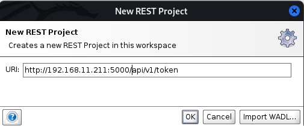
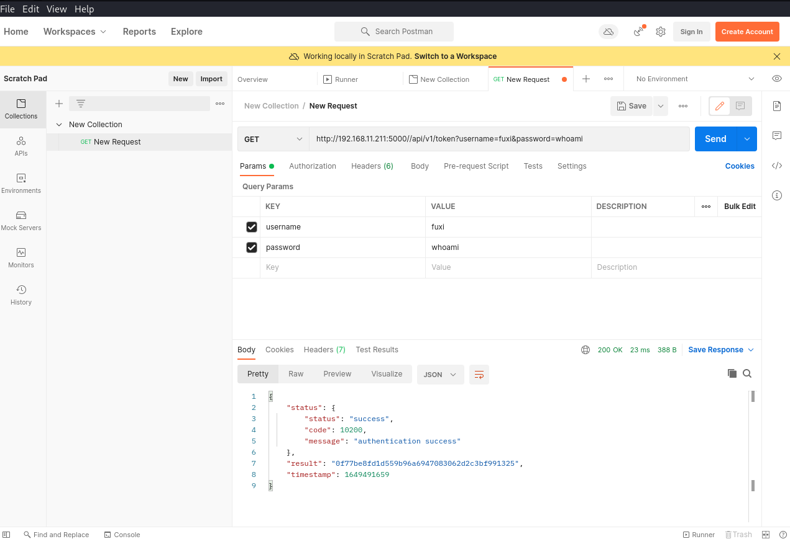

# 201-A27-API接口测试

# 一、API 接口介绍

## 1.1 RPC（远程过程调用）

远程过程调用（英语：Remote Procedure Call，缩写为 RPC）是一个计算机通信协议。该协议允许运行于一台计算机的程序调用另一台计算机的子程序，而程序员无需额外地为这个交互作用编程。如果涉及的软件采用面向对象编程，那么远程过程调用亦可称作远程调用或远程方法调用，例：Java RMI。

RPC 一般直接使用 TCP 协议进行通信，通常不涉及到 HTTP。HTTP 下面有2种技术：

- XML-RPC（https://zh.wikipedia.org/wiki/XML-RPC）
- JSON-RPC（https://zh.wikipedia.org/wiki/JSON-RPC）

Web service 和 RESTful API 都可算作远程过程调用的子集。

## 1.2 Web Service

Web Service 是一种服务导向架构的技术，通过标准的Web协议提供服务，目的是保证不同平台的应用服务可以互操作。

根据 W3C 的定义，Web 服务（Web service）应当是一个软件系统，用以支持网络间不同机器的互动操作。网络服务通常是许多应用程序接口（API）所组成的，它们透过网络，例如国际互联网（Internet）的远程服务器端，执行客户所提交服务的请求。

尽管W3C的定义涵盖诸多相异且无法介分的系统，不过通常我们指有关于主从式架构（Client-server）之间根据 SOAP 协议进行传递 XML 格式消息。无论定义还是实现，Web 服务过程中会由服务器提供一个机器可读的描述（通常基于WSDL）以辨识服务器所提供的 Web 服务。另外，虽然 WSDL 不是 SOAP 服务端点的必要条件，但目前基于Java 的主流 Web 服务开发框架往往需要 WSDL 实现客户端的源代码生成。一些工业标准化组织，比如 WS-I，就在 Web 服务定义中强制包含 SOAP 和 WSDL。

Web Service 是一种比较“重”和“老”的 Web 接口技术，目前大部分应用于金融机构的历史应用和比较老的应用中。

## 1.3 SOAP

SOAP、WSDL(WebServicesDescriptionLanguage)、UDDI(UniversalDescriptionDiscovery andIntegration)之一， soap用来描述传递信息的格式， WSDL 用来描述如何访问具体的接口， uddi用来管理，分发，查询webService 。具体实现可以搜索 Web Services简单实例 ; SOAP 可以和现存的许多因特网协议和格式结合使用，包括超文本传输协议（HTTP），简单邮件传输协议（SMTP），多用途网际邮件扩充协议（MIME）。它还支持从消息系统到远程过程调用（RPC）等大量的应用程序。SOAP使用基于XML的数据结构和超文本传输协议(HTTP)的组合定义了一个标准的方法来使用Internet上各种不同操作环境中的分布式对象。

soap协议又分为soap 1.1 和 soap 1.2 两个版本
这两个协议间的区别在于soap 1.1里存在soapAction请求头，而soap 1.2没有，soap 1.2里用了action来代替，两者的wsdl文件也不同，体现在命名空间和定义service差别里。

# 二、SOAP注入

## 1. SOAP 注入查找

通常而言通过搜索特定后缀去找webservice地址，比如通过在fofa、shodan等搜索 asmx

asmx是webservice服务程序的后缀名，asp.net 使用 asmx 来进行对webservice的支持，通过fofa上搜索找目标

或者可以使用google语法搜索，inurl:asmx?wsdl，inurl:.php?wsdl inurl:.ashx?wsdl通过去查找webservice的服务描述的xml文档来找寻可能的注入点

## 2. wsdl分析

wsdl内的信息过于繁杂，可以借助辅助工具来对wsdl进行分析，常用的有soapui，WS-Attacker或者用burp的wsdler模块，都可以分析wsdl来得到结果

## 3. 靶机搭建

靶机下载地址：https://www.vulnhub.com/entry/csharp-vulnsoap,135

```
wget http://volatileminds.net/CsharpVulnSoap.ova
也可以使用以上命令直接下载
```

下载后使用VMware或者virtualbox打开，网络最好选择桥接网络

```
docker pull jeffzh3ng/fuxi
docker run -itd --name fuxi_docker -p 5000:50020 jeffzh3ng/fuxi:latest
```

访问http://ip:5000 ,即可访问fuxi

fuxi api接口文档说明：https://github.com/jeffzh3ng/fuxi/blob/v2.1/docs/fuxi_api_doc_chinese.md

## 4. 漏洞分析

首先访问靶机

首先访问靶机


一般存在注入的地方发生在数据查询处

查看4个功能点功能:AddUser 为添加用户，list 为列举用户，getuser 为获取用户，delete 为删除用户

这里存在漏洞处为获取用户信息处

点击GetUser->Message Layout查看它的消息布局


发现username处为string 此处传入为字符串，可能存在注入

通过查看它的wsdl去分析


查看此处的GetUser元素，此处元素为内部创建的子元素，这里子元素名称为username，类型为string

往下看，查找它的operation,也就是它的操作活动


找到GetUserHttpGetIn 这个可以看作是 Get User Http Get In 为获取用户的输入

以此为突破口进行测试

这个靶场的数据库为PostgreSQL 数据库，那么要用 PostgreSQL注入来做

点击 Test Form输入payload进行测试

输入 aaa‘ or 1=1–


再输入aaa’ or 1=2–


可以说明此处存在注入，可以进一步使用联合查询来获取用户名密码，或者抓包使用sqlmap进行测试。

按照示例把get请求转换为post


保存到文件并给参数标注*

```
POST /Vulnerable.asmx/GetUser HTTP/1.1
Host: 192.168.10.70
Upgrade-Insecure-Requests: 1
User-Agent: Mozilla/5.0 (Windows NT 10.0; Win64; x64) AppleWebKit/537.36 (KHTML, like Gecko) Chrome/99.0.4844.51 Safari/537.36
Accept: text/html,application/xhtml+xml,application/xml;q=0.9,image/avif,image/webp,image/apng,*/*;q=0.8,application/signed-exchange;v=b3;q=0.9
Referer: http://192.168.10.70/Vulnerable.asmx?page=op&tab=test&op=GetUser&bnd=VulnerableServiceSoap&ext=testform&username=admin%E2%80%99+union+select+aaa%2Caaa--
Accept-Encoding: gzip, deflate
Accept-Language: zh-CN,zh;q=0.9
Cookie: ASP.NET_SessionId=473D11DF9D40456C68995931
Connection: close
Content-Type: application/x-www-form-urlencoded
Content-Length: 89

page=op&tab=test&op=GetUser&bnd=VulnerableServiceSoap&ext=testform&username=aaa*
```

使用sqlmap进行测试

```
sqlmap -r 222 --dbs --is-dba --dbms=PostgreSQL
```


# 三、api接口测试工具

市面上常见的API请求构建工具形式有独立的桌面程序、命令行程序、浏览器扩展、Web服务等几种，比较著名的API请求构建工具有Postman、Swagger Inspecter、Soap UI、Apigee等等。国内有一些公司也通过Web服务的方式提供API测试功能，例如网易数帆的GoAPI，还有像curl这样免费的不需要图形界面也可以直接进行HTTP API测试的工具。

## 1. soapui使用

soapui官网：https://www.soapui.org/

soapUI是一个开源测试工具，通过soap/http来检查、调用、实现Web Service的功能/负载/[符合性测试](https://baike.baidu.com/item/符合性测试/7908107)。该工具既可作为一个单独的测试软件使用，也可利用插件集成到Eclipse，maven2.X，Netbeans 和intellij中使用。把一个或多个测试套件（TestSuite）组织成项目，每个测试套件包含一个或多个测试用例（TestCase），每个测试用例包含一个或多个测试步骤，包括发送请求、接受响应、分析结果、改变测试执行流程等。


下载文件后加执行权限，执行后可打开安装向导


安装完成后点击finish即可打开soapui


点击file，选择new SOAP project,填入地址


然后就可以对wsdl地址进行解析


修改传入数值点击运行也可以进行测试，为api测试常用工具之一


点击file，选择new REST project,填入fixi地址``http://ip//api/v1/token``



单击ok后添加api所对应的参数``username``和``password``,然后点击绿色三角即可对fuxi api进行测试


## 2. burp的wsdler插件

抓取访问wsdl的数据包，然后右键，选择Extensions->wsdler->parse wsdl


得到分析结果，这里可以结合sqlmap使用，把抓到的包保存为txt文件，然后sqlmap去测试


## 3. hoppscotch

之前有很多API请求构建工具都是商业软件，或者免费版仅仅提供很有限的功能。其中曾经最流行的Postman在收费之后就很被开发者社区诟病。有位印度裔小哥Liyas Thomas对此极为不爽，就发布了一个新的工具叫：Postwoman，显而易见，Postwoman是专怼Postman的。

2020年8月，Liyas小哥可能觉得一直怼Postman也挺low的，2020年8月决定改名叫hoppscotch了。

### 3.1hoppscotch安装

```
yum -y install docker
docker run --rm --name hoppscotch -p 3000:3000 hoppscotch/hoppscotch:latest
```

会开始自动pull镜像并开始启动，过程非常慢


访问http://ip:3000 ,打开hoppscotch


添加fixi的``/api/v1/token``接口，添加相应的参数和值便可得到结果


## 4. postman

Postman是一个接口测试工具,在做接口测试的时候,Postman相当于一个客户端,它可以模拟用户发起的各类HTTP请求,将请求数据发送至服务端,获取对应的响应结果, 从而验证响应中的结果数据是否和预期值相匹配;并确保开发人员能够及时处理接口中的bug,进而保证产品上线之后的稳定性和安全性。 它主要是用来模拟各种HTTP请求的(如:get/post/delete/put..等等),Postman与浏览器的区别在于有的浏览器不能输出Json格式,而Postman更直观接口返回的结果。

### 4.1 postman安装

下载： https://www.postman.com/downloads/

```shell
tar -xzvf postman-9.15.2-linux-x64.tar.gz
cd Postman
./Postman
```


单击Create Collection->add a request创建一个测试任务


添加fixi的``http://ip//api/v1/token``接口，添加相应的参数和值点击send便可得到结果



## 5.工具总结

> SoapUI 相对Postman 多了一个Soap 协议测试。
>
> SoapUI 的功能复杂，界面使用多窗口方式实现，交互复杂，学习成本高，对于使用人员有较高要求。
>
> SoapUI的API测试，自动测试需要更强的编程技能。
>
> Postman 脱胎于Chorme 的插件，只支持Http 协议的测试。
>
> Postman 的界面采用Tab形式，类似chrome 的操作方式，界面简单，功能设计简洁，工程的组织只有Collection 和folder ,层级，概念简洁，易学，易用，对于项目组的学习成本低。
>
> Postman 的API 测试，自动测试对于编程的要求相对低一些
>
> 如果只是进行Http,https 接口测试建议使用Postman 作为API测试工具，最主要的理由是，简洁易用，学习成本低。
>
> hoppscotch功能跟postman功能相似，优点是开源免费、轻量级、页面美观，基于浏览器，不需安装，使用方便。
