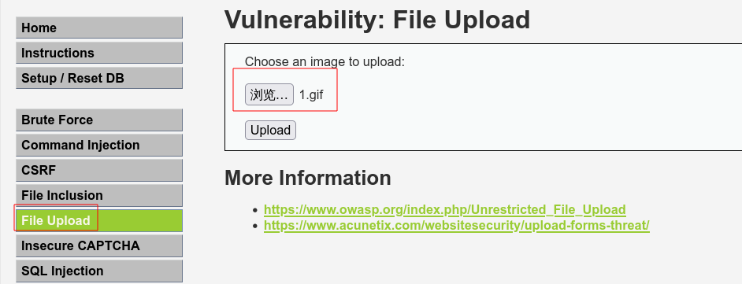
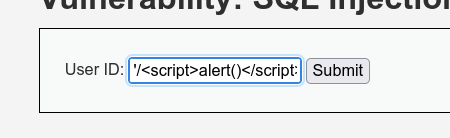
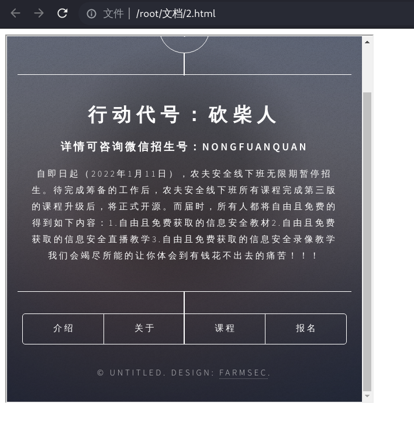
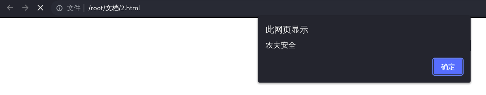

# 201-A7-XSS（中）

在本节课，我们将更深入的阐释XSS的原理，并进一步掌握该漏洞的挖掘技巧。

## 1.详述XSS漏洞的三种分类

在上一节中我们已经直观的感受到了Xss漏洞的三种形态，下面我们将进一步阐释和分析这三种漏洞是如何作用的。

### 1.1 反射型XSS漏洞

反射型XSS漏洞的成因是，该页面会使用一个包含文本的参数，并在将这个文本返回给用户。问题在于，该文本是由用户输入提交的，如被恶意编写，在服务器将这个文本返还给用户浏览器的过程中，浏览器将文本视为html或javascript代码执行，那么这个漏洞就产生了。

因此，反射型XSS漏洞一般是由黑客提前恶意构造的URL链接，通过钓鱼的形式危害用户。

以XSS漏洞利用中，最经典的钓鱼盗取cookie为例，具体的过程如下图所示：


那么到此可能会产生一个问题，如果攻击者能诱使其他用户访问他构造的URL，从而攻击用户浏览器盗取cookie。那么他为什么还有费大力气在一个正常的网站挖掘XSS漏洞，然后再加以利用。如果他在自己的网站上编写脚本并引诱用户点击不是更加便利么？

这里就要介绍一下同源策略的概念。

同源策略是浏览器实施的一种关键机制，主要用于防止不同来源内容相互干扰。

其保障了，在用户浏览器打开多个站点（源）时，一个站点（源）可以其自身（同源）从收到内容，并可以读取和修改，但不能从其他其他站点收到内容。

当没有同源策略时，如果某个不知情的用户浏览到恶意网站，该网站上运行的脚本代码将在能够访问这名用户与该网站交互信息的同时，访问到该用户浏览器上打开的其他网站上的任何数据和功能。这样恶意网站几乎可以为所欲为，比如上文的盗用cookie行为，就可以使攻击者冒用用户身份进行操作。

因此，设计同源策略就是为了避免不同域在用户浏览器中彼此干扰，浏览器对不同来源（域）收到的内容进行隔离。这也回答了为什么攻击者要利用网站的XSS漏洞来构造钓鱼连接，攻击者的目的不是单纯的执行脚本，而是盗取用户在存在XSS漏洞的网站上的cookie。

### 1.2 存储型XSS漏洞

存储型XSS，其机制是攻击者将恶意数据提交给网站，并被保存在了网站后端数据库中，然后在网页上不加过滤的显示给其他用户，并被用户浏览器当做HTML或JavaScript代码执行。

存储型的XSS漏洞要比反射型更加危险，因其为攻击者省去了钓鱼的过程，并能使访问漏洞页面的每一位用户遭到攻击。


### 1.3 DOM型XSS

要理解DOM型XSS，首先要理解DOM。

HTML DOM为文档对象模型，当网页被加载时，浏览器会创建页面的文档对象模型（Document Object Model 缩写为DOM）。

HTML DOM 模型被结构化为对象树：

其结构为下图所示：


通过这个对象模型，JavaScript 获得创建动态 HTML 的所有力量：

```bash
JavaScript 能改变页面中的所有 HTML 元素
JavaScript 能改变页面中的所有 HTML 属性
JavaScript 能改变页面中的所有 CSS 样式
JavaScript 能删除已有的 HTML 元素和属性
JavaScript 能添加新的 HTML 元素和属性
JavaScript 能对页面中所有已有的 HTML 事件作出反应
JavaScript 能在页面中创建新的 HTML 事件
```

我们可以把DOM理解为一个一个访问HTML的标准的编程接口。DOM是一个前端的接口，并没有和后端做任何的交互。


DOM 编程界面：


HTML DOM 能够通过 JavaScript 进行访问（也可以通过其他编程语言）。

在 DOM 中，所有 HTML 元素都被定义为对象。

编程界面是每个对象的属性和方法。

属性是您能够获取或设置的值（就比如改变 HTML 元素的内容）。

方法是您能够完成的动作（比如添加或删除 HTML 元素）。


我们用下面的例子来大致表现dom的效果：


在此html代码中，标签`<p>`中的元素内容为`早上好！`

下面的例子将使用DOM改变 id="demo" 的 `<p>` 元素的内容：


 DOM **方法**是指能够（在 HTML 元素上）执行的动作。DOM **属性**是指能够设置或改变的 HTML 元素的值。

DOM访问 HTML 元素最常用的方法是使用元素的 id。

在上面的例子中，getElementById 方法使用 id="demo" 来查找元素。

获取元素内容最简单的方法是使用 innerHTML 属性。

innerHTML 属性可用于获取或替换 HTML 元素的内容。

innerHTML 属性可用于获取或改变任何 HTML 元素，包括 `<html>` 和 `<body>`。 


想象一下以下代码中的某些部分是可以让攻击者恶意拼接的，那么这就是一个DOM型XSS漏洞篡改网页内容的案例。

```
<script>
document.getElementById("demo").innerHTML = "Hello World!";
</script>
```

值得注意的是，整个过程都是在前端完成的，没有后端的参与。也就是说，后端过滤对DOM型XSS并没有作用。

DOM型XSS的利用流程大体如下图所示：


下面通过以下表格来体现以上三者的不同：


| 漏洞类型  | 是否需要钓鱼利用 | 是否经过后端服务器 | 是否存储于数据库 |
| --------- | ---------------- | ------------------ | ---------------- |
| 反射型XSS | 是               | 是                 | 否               |
| 存储型XSS | 否               | 是                 | 是               |
| DOM型XSS  | 是               | 否                 | 否               |


## 2.XSS漏洞的启示

通过上节课的XSS漏洞演示，我们可以用肉眼观察到一个直观的规律，XSS漏洞产生的位置往往在用户提交的文本被反馈在浏览器上的地方。

如下图：


产生的原因在于，服务器信任了用户输入，而用户输入的文本在经过一定构造后会被当做代码执行。

这其实是注入类漏洞的本质，你也可以将XSS漏洞，即跨站脚本攻击理解为HTML或JavaScript代码注入。


在日后挖掘漏洞的过程中，也应该保持这种敏锐性，即如果你输入什么，浏览器就显示什么，那么此地存在漏洞的可能。

让我们来看DVWA的另外两处奇特的XSS漏洞。

例1：

打开文件上传板块，在low难度下，让我们先上传一个文件名为1的gif文件。



上传成功后会发现，文件名会原原本本的反映在浏览器上。那么如果此处我们恶意构造JavaScript代码，也许就会被浏览器执行。


然后我们将1.gif的文件名改为XSS攻击语句``


上传此文件。


可以看到攻击成功，``被当做代码执行。


到目前为止，这可能只是一个self-XSS，但在某些网站，图片上传后连带图片的文件名是可能被许多用户浏览到的，那么就有可能造成危害。

例2：

第二处有趣的反射型XSS来源于上节课SQL注入的环境中。low难度。

我们会发现，sql报错时会原原本本的返回用户输入。


同理，我们也可以在此构造XSS攻击语句然后加单引号，看看浏览器会不会在报错页面将其当做代码执行。


可以看到这一样会成功。


我们也可以来实验，如下语句:`'<script>alert()</script>`


会发现`/`之前的部分被吃掉了。

那么我们只需在整个语句前加一个`/`。`'/<script>alert()</script>`




这次反射型XSS构造成功了，提交的参数都体现在了url上，可以构造钓鱼连接。

## 3.HTML简要介绍

超文本标记语言（英语：HyperText Markup Language，简称：HTML）是一种用于创建网页的标准标记语言。

您可以使用 HTML 来建立自己的 WEB 站点，HTML 运行在浏览器上，由浏览器来解析。

我们先举一个例子：


通过直观的观察可以发现，这种语言是一种利用各类标签的语言。如`<body>、<h1>、<p>`等，网页内容写在标签中，然后闭合标签要利用`/`，如`</h1>`

在此案例中:

```html

    <!DOCTYPE html> 声明为 HTML5 文档
    <html> 元素是 HTML 页面的根元素
    <head> 元素包含了文档的元（meta）数据，如 <meta charset="utf-8"> 定义网页编码格式为 utf-8。
    <title> 元素描述了文档的标题
    <body> 元素包含了可见的页面内容
    <h1> 元素定义一个大标题
    <p> 元素定义一个段落
```

```html

    "HTML 标签" 和 "HTML 元素" 通常都是描述同样的意思.
		HTML 标签是由尖括号包围的关键词，比如 <html>
    HTML 标签通常是成对出现的，比如 <b> 和 </b>
    标签对中的第一个标签是开始标签，第二个标签是结束标签
    开始和结束标签也被称为开放标签和闭合标签

```

常见的标签有：

HTML 标题

HTML 标题（Heading）是通过`<h1> - <h6>` 标签来定义的。

```html
<h1>这是一个标题</h1>
<h2>这是一个标题</h2>
<h3>这是一个标题</h3>
```

HTML 段落

HTML 段落是通过标签 `<p>` 来定义的。

```html
<p>这是一个段落。</p>
<p>这是另外一个段落。</p>
```

HTML 链接

HTML 链接是通过标签 `<a>` 来定义的。href属性用来描述链接的地址

```html
<a href="https://www.baidu.com">这是百度链接</a>
```

HTML 图像

HTML 图像是通过标签 ` `来定义的。其中src 指 "source"。源属性的值是图像的 URL 地址。

```html

```


这些标签语言的结构大致如下：

| 开始标签                 | 元素内容     | 结束标签 |
| ------------------------ | ------------ | -------- |
| `<p>`                    | 这是一个段落 | `</p>`   |
| `<a href="default.htm">` | 这是一个链接 | `</a>`   |
| `<br>`                   | 换行         |          |

某些 HTML 元素具有空内容

没有内容的 HTML 元素被称为空元素。空元素是在开始标签中关闭的。

`<br>` 就是没有关闭标签的空元素，其作用是换行。

有些标签是没有结束标签的，如上文中的``它会在内容写完之后在末尾加`/`如``

下面我们来介绍`<from>`和`<input>`，表单元素是允许用户在表单中输入内容，比如如下图：


在XSS中还有一个常用的`<iframe>` 标签，它会创建包含另外一个文档的内联框架（即行内框架）。如下：





当然在实际中网页不长这样，如下图的页面一般是靠`<iframe>` 标签实现的。


那么此前我们一直在用到的`<script>`标签，其含义为用于加载脚本文件，如： JavaScript。

`<script>` 标签用于定义客户端脚本，比如 JavaScript。

`<script>` 元素既可包含脚本语句，也可通过 `src` 属性指向外部脚本文件。

JavaScript 最常用于图片操作、表单验证以及内容动态更新。


此外，当我们使用F12查看时，也会看到一些CSS语句。CSS是渲染网页的，就目前阶段，可理解为就是关于网页内容格式的。

可以简单了解一下，以下为CSS语句的大体样貌，style后面的参数决定了字体、颜色、字号等：

```html
<h1 style="font-family:verdana;">一个标题</h1>
<p style="font-family:arial;color:red;font-size:20px;">一个段落。</p>

<!--font-family（字体），color（颜色），和font-size（字体大小 -->
```

## 4.JavaScript 简要介绍

JavaScript 是互联网上最流行的脚本语言，这门语言可用于 HTML 和 web，更可广泛用于服务器、PC、笔记本电脑、平板电脑和智能手机等设备。

JavaScript 是一种轻量级的编程语言。

JavaScript 是可插入 HTML 页面的编程代码。

JavaScript 插入 HTML 页面后，可由所有的现代浏览器执行。


关于JavaScript语法，我们目前仅需要了解与XSS漏洞关联性强的部分。


### 4.1 `<script>` 标签


如需在 HTML 页面中插入 JavaScript，请使用 `<script>` 标签。

`<script>` 和 `</script>` 会告诉 JavaScript 在何处开始和结束。

`<script>` 和 `</script>` 之间的代码行包含了 JavaScript:

例1：alert用于弹框。

```javascript
<script>
alert("农夫安全");
</script>
```


### 4.2 外部 JavaScript 文件调用

也可以把脚本保存到外部文件中。外部文件通常包含被多个网页使用的代码。

外部 JavaScript 文件的文件扩展名是 .js。

如需使用外部文件，请在 `<script>` 标签的 "src" 属性中设置该 .js 文件：

我们在此前测试用的html文件所在目录下创建一个test目录，在其下创建一个1.js文件：


内容为：


接下来我们在代码中引用它，语法格式为`<script src="xxx.js"></script>`注意相对目录位置。


浏览器打开效果如下：


### 4.3 事件

HTML 事件可以是浏览器或用户做的某些事情。我们此前用的XSS语句``就利用了事件。onerror代表在加载文档或图像时发生错误时执行后面的alert（弹框），而src指定的路径并不存在，则加载图片必会出错，后面的也就依次执行了。除了onerror以外，类似的事件还有很多。这些会在以后的XSS漏洞挖掘中发挥妙用。

#### 4.3.1 鼠标事件

| 属性        | 描述                                 |
| ----------- | ------------------------------------ |
| onclick     | 当用户点击某个对象时调用的事件句柄。 |
| ondblclick  | 当用户双击某个对象时调用的事件句柄。 |
| onmousemove | 鼠标被移动。                         |
| onmouseover | 鼠标移到某元素之上。                 |
| onmouseout  | 鼠标从某元素移开。                   |
| onmousedown | 鼠标按钮被按下。                     |
| onmouseup   | 鼠标按键被松开。                     |


#### 4.3.2 键盘事件

| 属性       | 描述                       |
| ---------- | -------------------------- |
| onkeydown  | 某个键盘按键被按下。       |
| onkeyup    | 某个键盘按键被松开。       |
| onkeypress | 某个键盘按键被按下并松开。 |


#### 4.3.3 框架/对象（Frame/Object）事件

| 属性       | 描述                         |
| ---------- | ---------------------------- |
| onabort    | 图像的加载被中断             |
| onload     | 一张页面或一幅图像完成加载   |
| onerror    | 在加载文档或图像时发生错误。 |
| onpageshow | 事件在用户访问页面时触发     |
| onscroll   | 当文档被滚动时发生的事件     |
| onresize   | 窗口或框架被重新调整大小。   |
| onfocus    | 元素获取焦点时触发           |

#### 4.3.4 剪贴板事件

| 属性    | 描述                           |
| ------- | ------------------------------ |
| oncopy  | 该事件在用户拷贝元素内容时触发 |
| oncut   | 该事件在用户剪切元素内容时触发 |
| onpaste | 该事件在用户粘贴元素内容时触发 |

 ### 4.4 JavaScript伪协议

协议用来在计算机之间传输数据包，比如http协议，ftp协议；伪协议是一种非标准化的协议，让使用者可以通过链接来调用js函数。

在JavaScript中，伪协议是为关联应用程序而使用的，JavaScript伪协议实际上是把`javascript:`后面的代码当JavaScript来执行，并将结果值返回给当前页面。

我们以如下代码为例略做了解：

```javascript
<script>javasecript:alert(1)</script>
<a href='javascript:alert(1)'>1</a>
```


 加载页面后即发现弹窗。



点击链接后触发第二个弹窗。


## 5.思考总结

本节课我们针对XSS漏洞的三种类型，以及HTML和JavaScript等概念进行了更多介绍，对这些基本概念的理解越深刻就越会有助于你挖掘、利用和防御XSS漏洞。请思考以下问题：

1.利用本节课知识，你自己能构造出目前还没有讲过的XSS攻击语句吗？

2.如果将XSS（跨站脚本攻击）理解为一种html或JavaScript注入的话，是否可以像SQL注入一样在原有语句上拼接，构造新语句，达到特定的目的？

3.如果由你来设计防御XSS漏洞的方法，你有怎样的思路？

4.有网站有一搜索功能，每次用户输入要检索的字符（设用户输入为X）并提交，都会返回“X的搜索结果为：”的字样，你会考虑测试哪些漏洞？