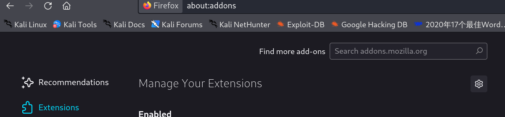
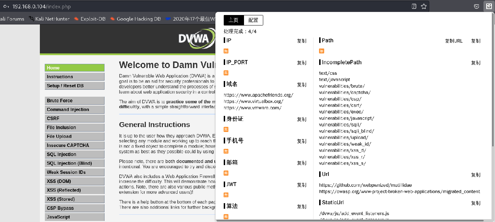
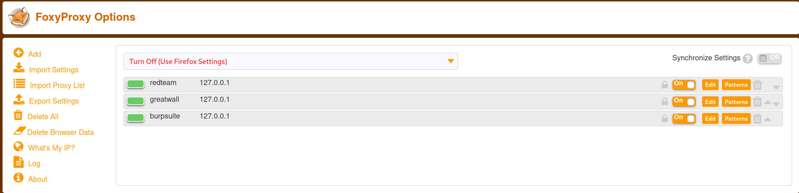
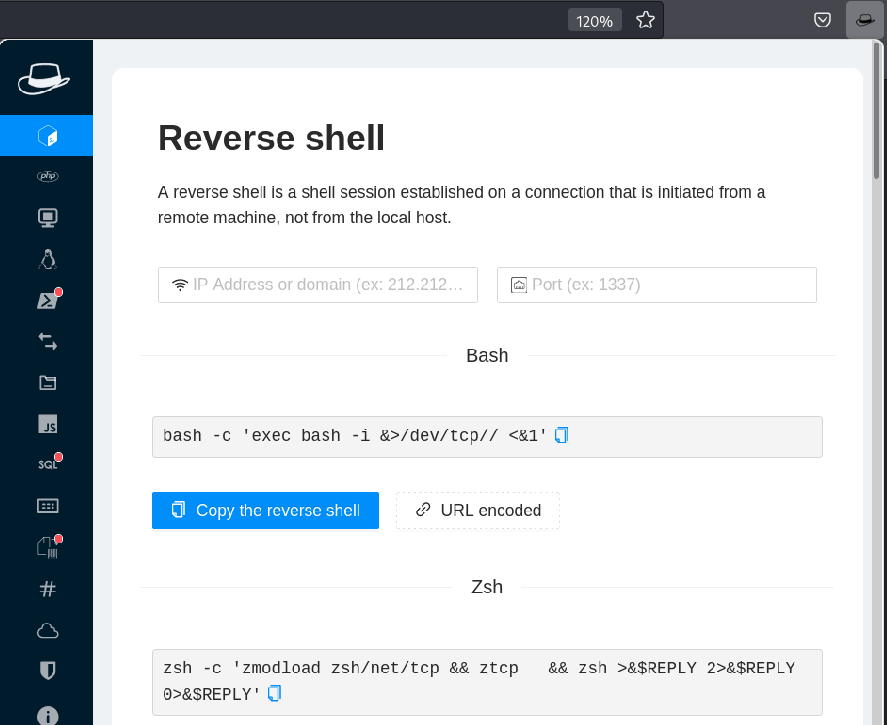
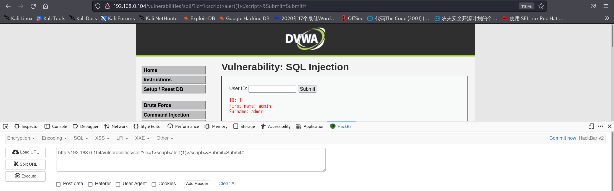
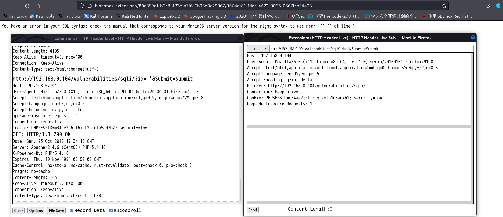
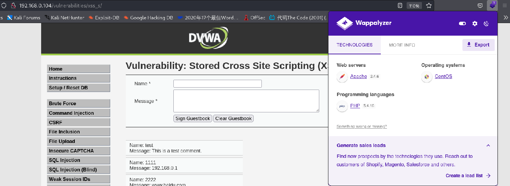

# 浏览器插件

## 一 Firefox插件安装

在Firefox中，选项的菜单中，点击<u>Add-ons and themes</u>,随后搜索即可针对性的安装想要的插件。




如果遇到不能安装的情况，或许可以用下面的方式解决：

```
新开一个火狐浏览器输入“about:config
xpinstall.signatures.required将它的true改为false
```

所以安装插件的难度几乎为0，那可以尝试安装以下清单中的插件。

```
FindSomething
FoxyProxy
HackTools
HackBar V2
HTTP Header Live
Mitaka
User-Agent Switcher and Manager
Wappalyzer
```


## 二 各插件的介绍及使用

### 2.1 FindSomething

该工具用于快速在网页的html源码或js代码中提取一些有趣的信息，包括可能请求的资源、接口的url，可能请求的ip和域名，泄漏的证件号、手机号、邮箱等信息。




### 2.2 FoxyProxy

易于使用，适用于任何人的高级代理管理工具。




### 2.3 HackTools

The all in one Red team extension for web pentester。




### 2.4 HackBar V2

A HackBar for new firefox  (Firefox Quantum). This addon is written in webextension and  alternatives to the XUL version of original Hackbar.

```
F12-->HackBar
```




### 2.5 HTTP Header Live

Show the HTTP header fields. You can edit and resubmit.




### 2.6 Mitaka

A browser extension for searching IP, domain, URL, hash, etc. via the context menu.


### 2.7 User-Agent Switcher and Manager

Spoof websites trying to gather information about your web navigation to deliver distinct content you may not want


### 2.8 Wappalyzer

Wappalyzer is a browser extension that uncovers the technologies used on websites. It detects content management systems, eCommerce platforms,  web servers, JavaScript frameworks, analytics tools and many more.



