#  其他工具

## 1 dradis

Dradis 是一个可扩展的，跨平台的，开放源代码的安全项目框架，用于协作和报告，可为您节省每个项目的时间。 由安全方面的最佳头脑为有远见的InfoSec专业人士打造,受到了世界各地成千上万的信息安全专业人士的信赖。 
Dradis用于在参与者进行渗透测试之间实现信息或数据的共享。Dradis也是一个独立的网络工具，它提供了一个集中的数据库，以跟踪已经完成的工作以及未来的工作。Dradis目前默认安装在kali中。

官网：https://dradisframework.com/ce/

dradis优势:

```
     多平台     
     注释的标记支持：文本样式，代码块，图像，链接等。
     与现有系统和工具集成：
     Brakeman、Burp Suite、MediaWiki、Metasploit、Nessus、NeXpose、Nikto、Nmap、OpenVAS、OSVDB、Qualys、Retina、SAINT、SureCheck、VulnDB、w3af、wXf、Zed Attack Proxy等

全部支持：https://dradisframework.com/integrations/
```


dradis工具启动: 

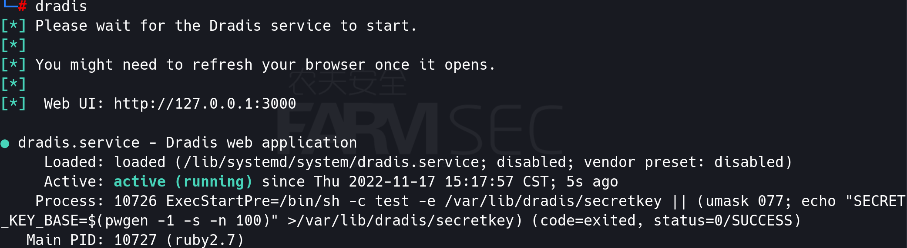

服务启动成功会自动在浏览器中打开,URL：http://127.0.0.1:3000

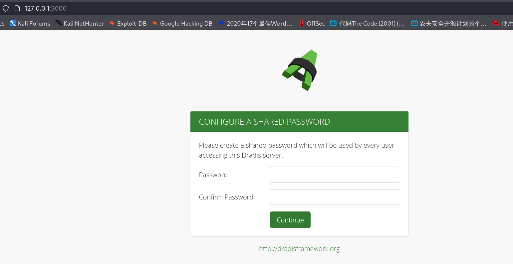

第一次启动时需要设置密码。设置密码后使用root:密码登录即可。

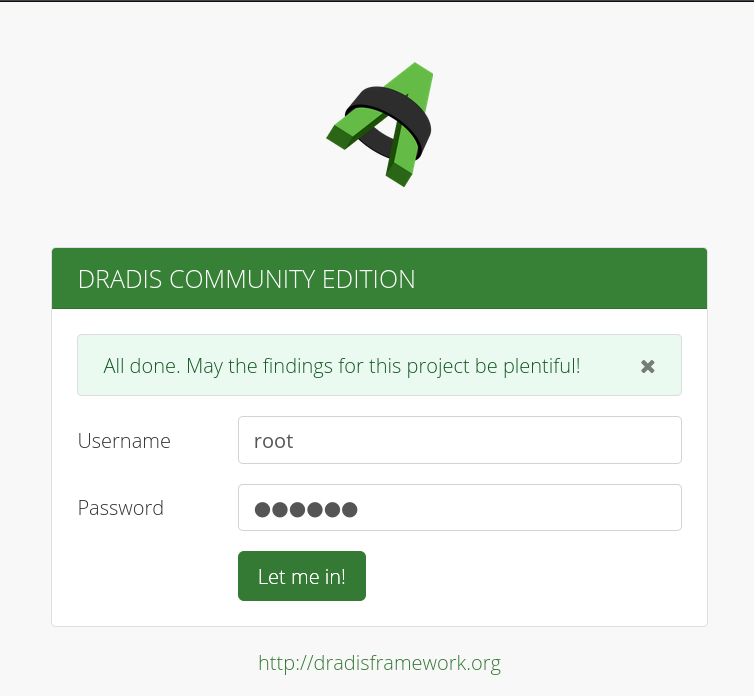

成功登录后的界面：

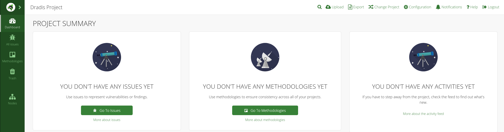


dradis使用：

新建节点fsec

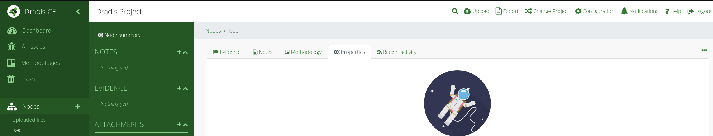

将工具所生成的文件导入，以nessus及burp为例

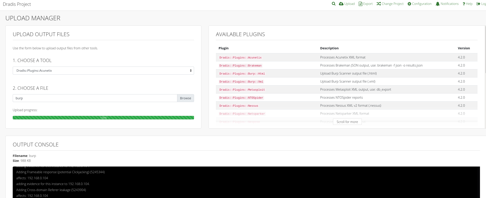

上传成功后，在plugin.output中能够看到新的内容。

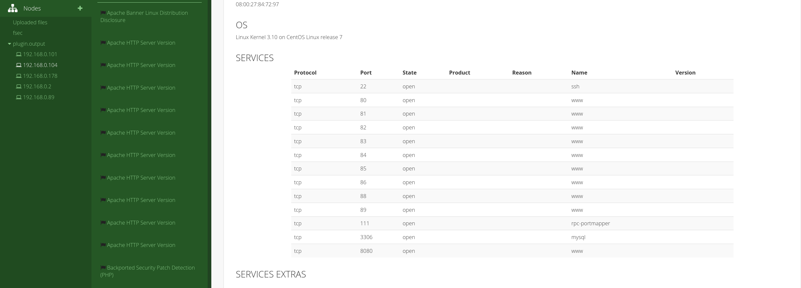

将内容可迁移至fsec中后，即可查看相关主机的相关的漏洞信息。

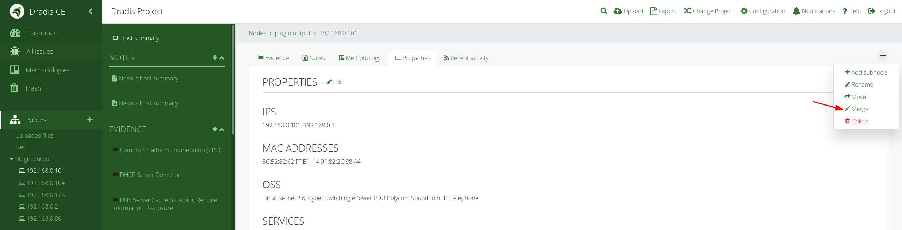


## 2 Python-Faraday

Faraday的主要目标在于复用社区中的现有可用工具，并以多用户方式充分发挥其既有优势。
Faraday提供三种插件类型，分别为控制台、报告与API：Acunetix Arachni Burp Core Impact Maltego Metasploit Nessus Netsparker Nexpose NexposeFull Nikto Nmap Openvas Qualysguard Retina W3af X1 ZapFaraday

Python-Faraday的启动：

```
# python-faraday
```

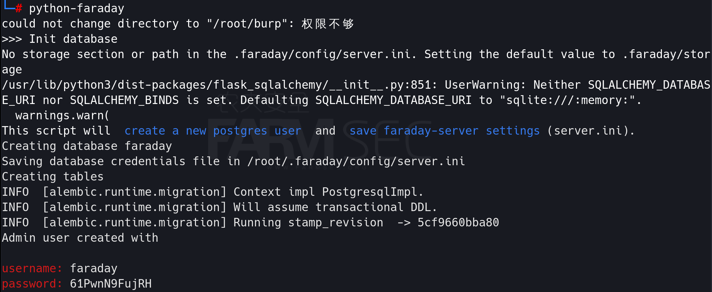

初始化完成后，会自动打开登录页面。

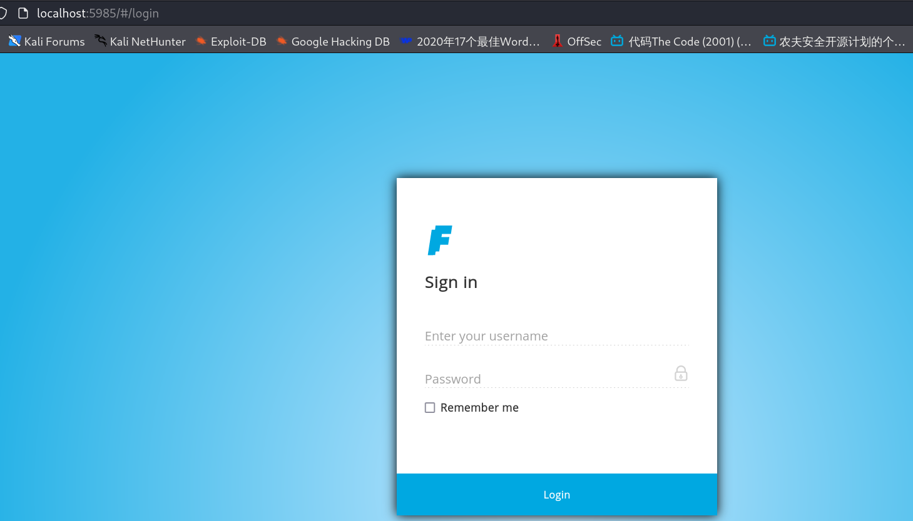

如果忘记密码可以使用命令：

```
faraday-manage change-password
```


python-faraday的使用：

进入主界面新建工作区域
DASHBOARD-New

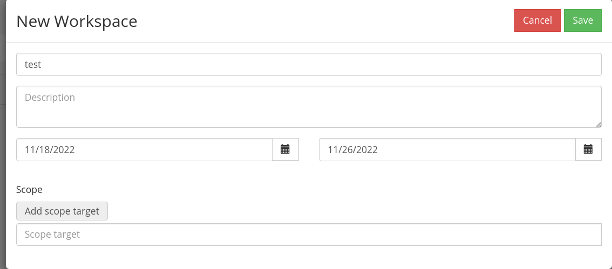

进入工作区

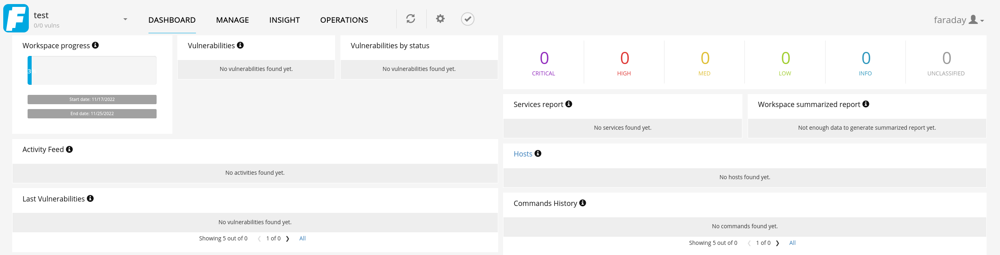

点击MANAGE-Vulns上传报告

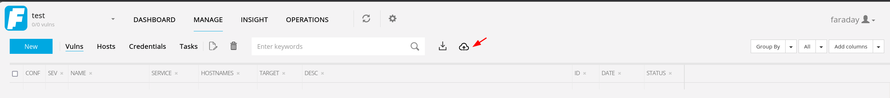

上传nessus文件后，即可看到报告。

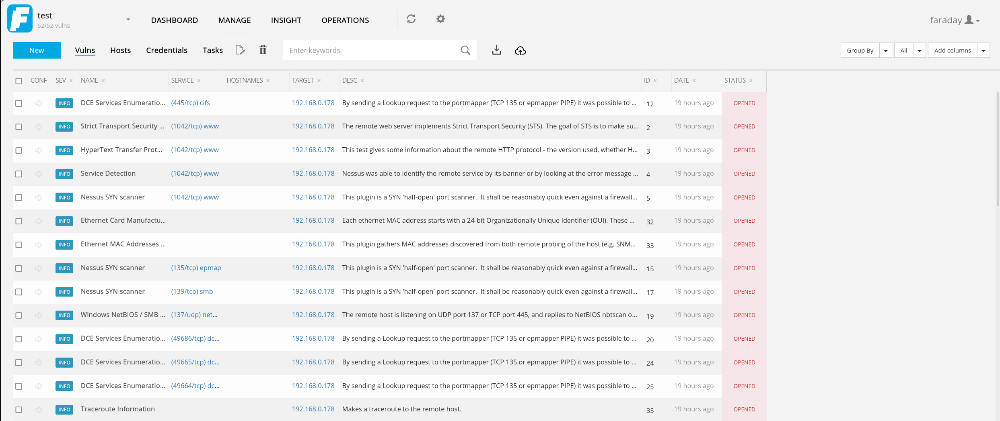


## 3 zim

Zim是用于维护Wiki页面集合的图形文本编辑器。每个页面都可以包含指向其他页面的链接，简单的格式和图像。页面存储在文件夹结构中，例如在大纲视图中，并且可以具有附件。创建新页面就像链接到不存在的页面一样容易。所有数据均以Wiki格式存储在纯文本文件中。各种插件提供了其他功能，例如任务列表管理器，方程式编辑器，任务栏图标以及对版本控制的支持。
Zim可用于：
保留笔记档案
保留每日或每周日记
在会议或讲座中做笔记
整理任务清单
草拟博客条目和电子邮件
进行头脑风暴
Zim处理几种类型的标记，例如标题，项目符号列表，当然还有粗体，斜体和突出显示。该标记将另存为Wiki文本，因此您可以轻松地使用其他编辑器对其进行编辑。由于具有自动保存功能，因此您可以在编辑页面时切换页面并跟踪链接而无需担心。

开启kali终端，输入zim即可启动工具
首先输入笔记明名称以及存放路径，然后点击ok即可进入笔记主界面

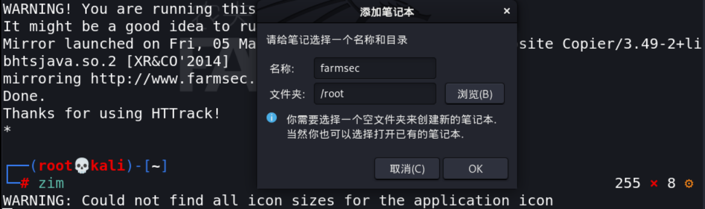

将笔记作为web服务启动，可以使用浏览器查看笔记，保证远程也可以查看笔记内容
操作：工具-启动web服务器
可以将“Require authenication” 对勾选中，使用用户名，密码认证方式查看

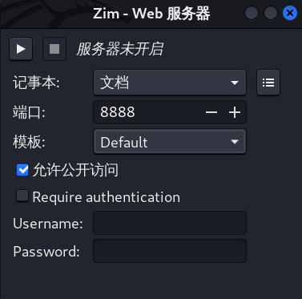

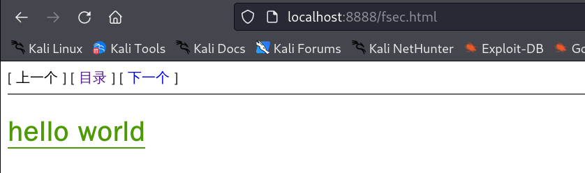


## 4 searchsploit

searchsploit”是一个用于Exploit-DB的命令行搜索工具，可以帮助我们查找渗透模块。
Exploit-DB是一个漏洞库，Kali Linux中保存了一个该漏洞库的拷贝，利用上面提到的命令就可以查找需要的渗透模块，它将搜索所有的漏洞和shellcode而且该漏洞库是保存在本地的，在没有网络的情况下也可以使用。
基本搜索方法就是searchsploit+可能包含漏洞的软件/系统等等，对应回显存在的漏洞和用于渗透的脚本。

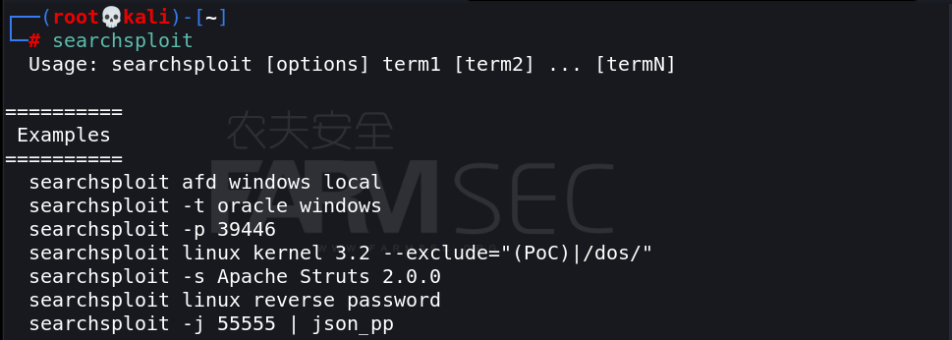

1.搜索特定关键字漏洞信息，同时匹配标题和路径中的内容

```
searchsploit Adobe windows Privilege Escalation
```

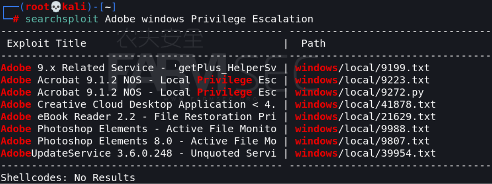

2.标题搜索只匹配标题,不会对路径中的关键词进行匹配

```
 searchsploit -t Adobe  Privilege Escalation 
```

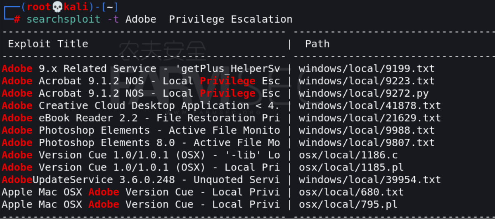

3.该python文件所在网站的URL和本地储存的路径，9272是该漏洞的ID号

```
searchsploit -p 9272.py
```

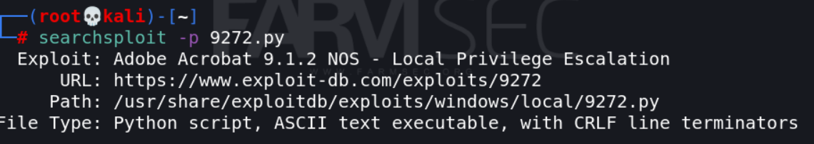

4.心脏滴血实验

```
 searchsploit heartbleed
```

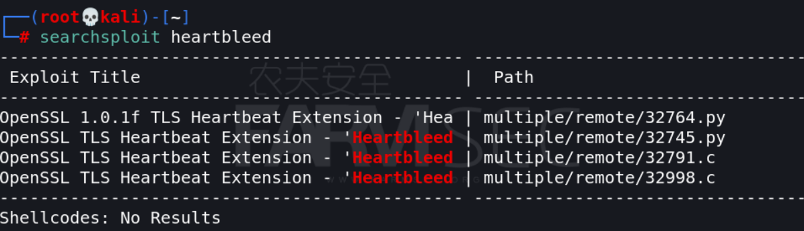

5 查看检测脚本详细路径

```
searchsploit -p 32745.py
```

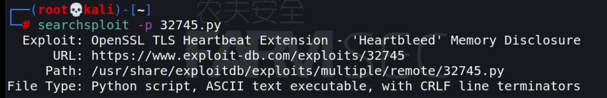

6 使用脚本探测是否存在漏洞，此过程可能需要多次尝试

```
python /usr/share/exploitdb/exploits/multiple/remote/32745.py 192.168.0.236 -p 443 
```

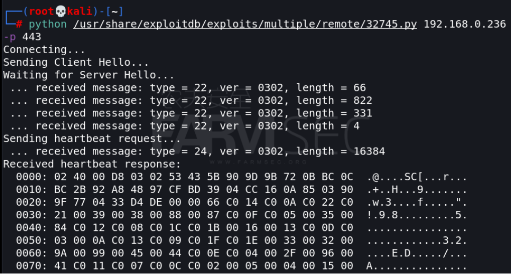
