# 公开情报搜集

## 一 信息搜集的重要性

有一天，你遇到了一个姑娘

```
曾经以为人生就这样了，平静的心拒绝再有浪潮
斩了千次的情丝却断不了，百转千折它将我围绕
```

这个时候，若是过去直愣愣的一句：阿姨，这个砖头是你掉了嘛？

很明显，这并不是成功率最高的解决方式。

而好的方案可以有很多，但是不可避免的要想法子了解到兴趣爱好、价值观等等的信息。

切换到渗透测试当中的场景，若是直愣愣的点开www.fsec.io,得到好的产出的可能性也不会很大。

所以从某些角度来讲，整个pentest的过程中，最为重要的内容恰恰是起点的信息搜集。

而对于攻击来讲，感兴趣的信息可以概括为如下的类别：

```
域名及子域名
IP地址及端口信息
有哪些值得渗透的资产范围（网站、服务、小程序、APP等）
有关于人的突破口(邮箱、手机号、企业规则等)
...
```

随后进行制定渗透测试的计划进行全面的测试。

```
知己知彼，百战不殆；不知彼而知己，一胜一负；不知彼，不知己，每战必殆。                   
```

这些信息的来源，可以通过多途径的方式进行汇总整合，而本次课程所讨论的为其中的一种：公开情报搜集。


## 二 公开情报搜集的工具

### 2.1 搜索引擎语句

```
"xxx"  将要搜索的关键字用引号括起来 (表示完全匹配，即关键词不能分开，顺序也不能变)
如： ”农夫安全”
```

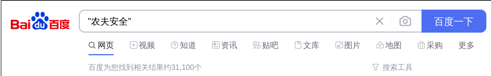


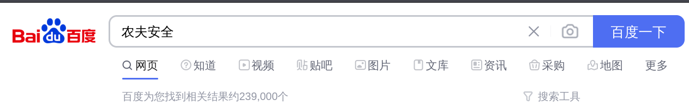


```
+      “xxx” +baidu.com  搜索xxx与baidu.com 相关的内容
如： ”农夫安全” +开源
```

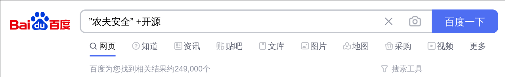

```
-     “xxx” -baidu.com 搜索结果里面除去baidu.com 相关的内容
”农夫安全” -开源
```

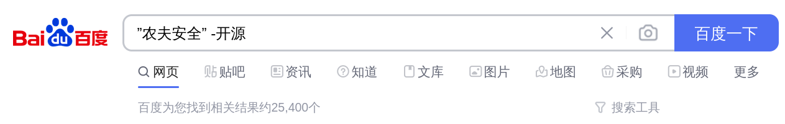

```
site   指定域名
如：site:"farmsec.com"
```

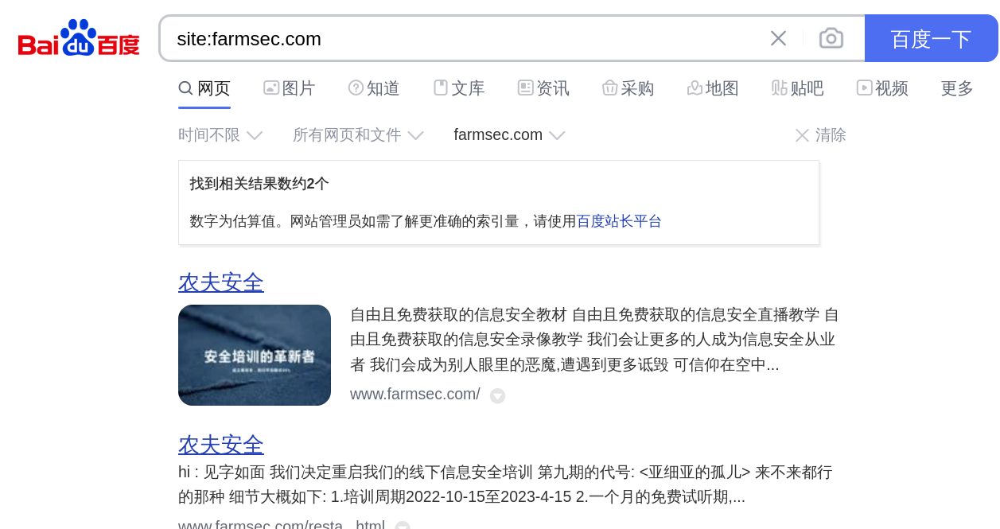

```
inurl  用于搜索包含的url关键词的网页
如：inurl:login.php
```


```
intitle 搜索网页标题中的关键字
如：intitle:"农夫安全"
```


```
intext： 搜索网页正文中的关键字
intext:登陆/注册/用户名/密码
intext:"农夫安全"
```


```
filetype：按指定文件类型即文件后缀名搜索
如：filetype .doc
```

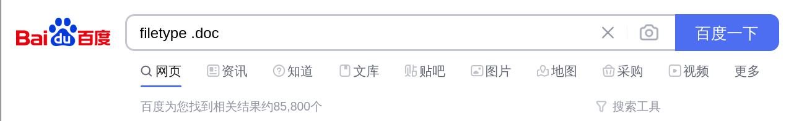


实际上，关于搜索引擎的语法可以进行组合使用，例如：

```
intitle:"index of" inurl:superadmin
```


### 2.2 天眼查

https://www.tianyancha.com/

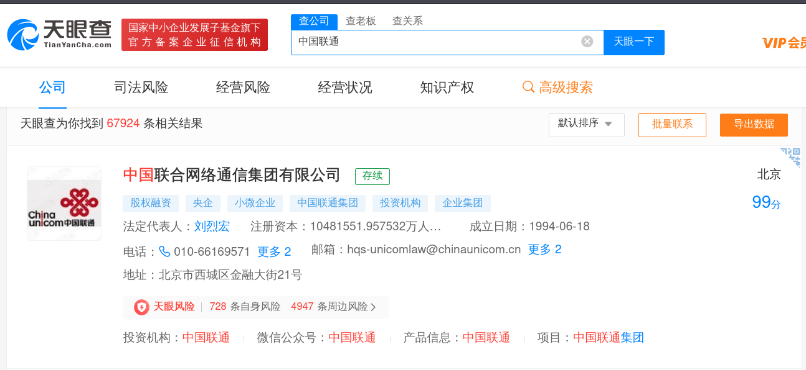

通过导出的筛选与导出，可以成功导出企业相关的信息。其中的网址、邮箱、电话、人名都是可能有用的信息。


### 2.3 github

GitHub于2008年4月10日正式上线，除了Git代码仓库托管及基本的Web管理界面以外，还提供了订阅、讨论组、文本渲染、在线文件编辑器、协作图谱（报表）、代码片段分享（Gist）等功能。目前，其注册用户已经超过350万，托管版本数量也是非常之多，其中不乏知名开源项目.

2018年6月4日，微软宣布，通过75亿美元的股票交易收购代码托管平台GitHub。


通过上传的代码中，或许可以找到一些敏感的信息，如源码、用户名、密码等信息。

ps:请小心为诱饵。


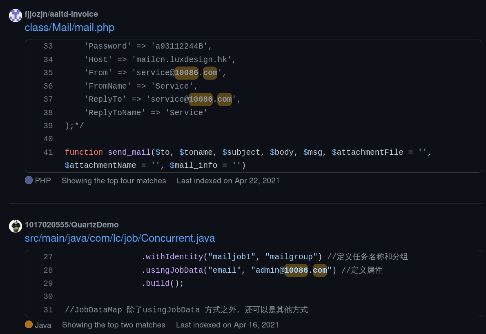

### 

### 2.4 网盘搜索

http://wp.soshoulu.com/

ps:请小心为诱饵。

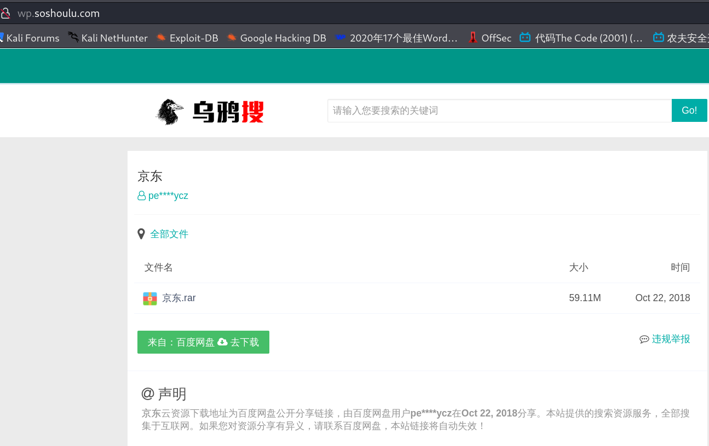


### 2.5 shadon 

https://www.shodan.io/

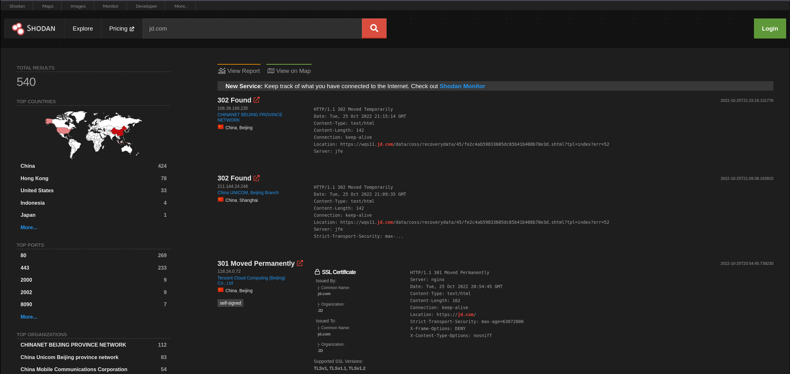


### 2.6 fofa

https://fofa.info/

```
 title="beijing"   从标题中搜索“北京” 
 domain="qq.com"  搜索根域名带有qq.com的网站
 icon_hash="-247388890"  搜索使用此 icon 的资产 
 ip="220.181.111.1/24"  查询IP为“220.181.111.1”的C网段资产 
```

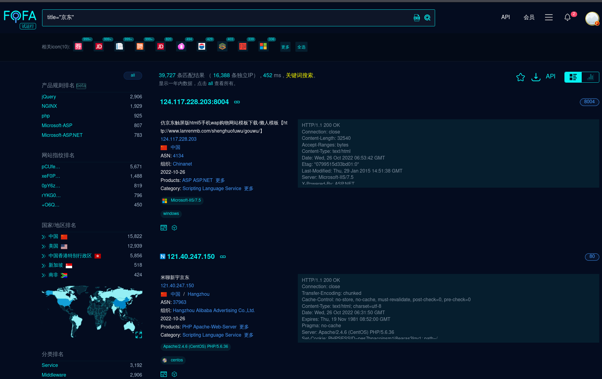

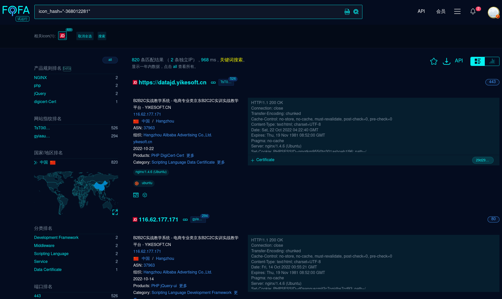

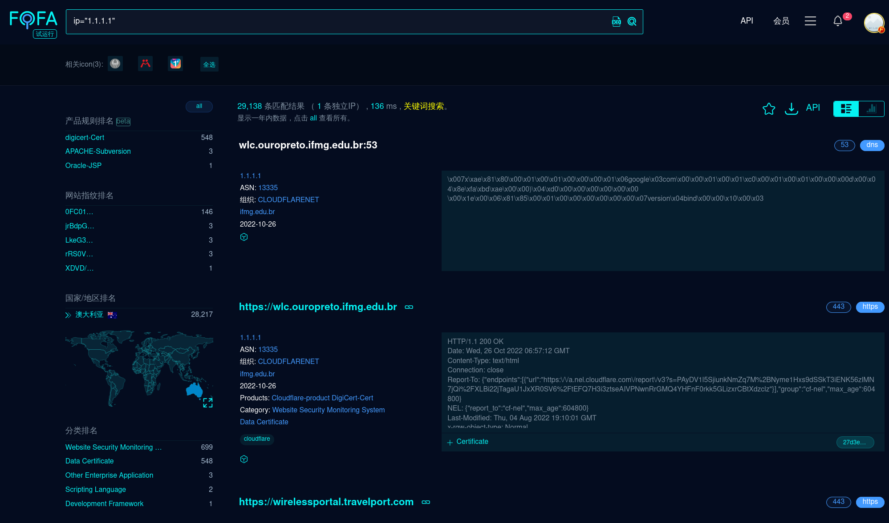

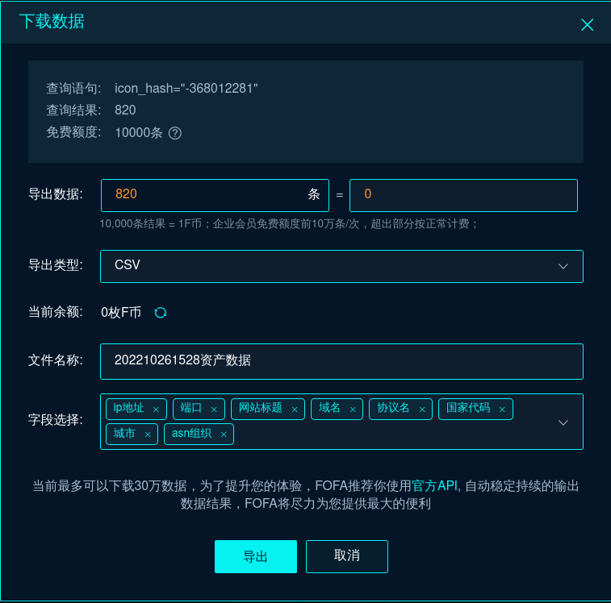


### 2.7 https证书

通过证书的信息，同样可以推测资产的大致情况。

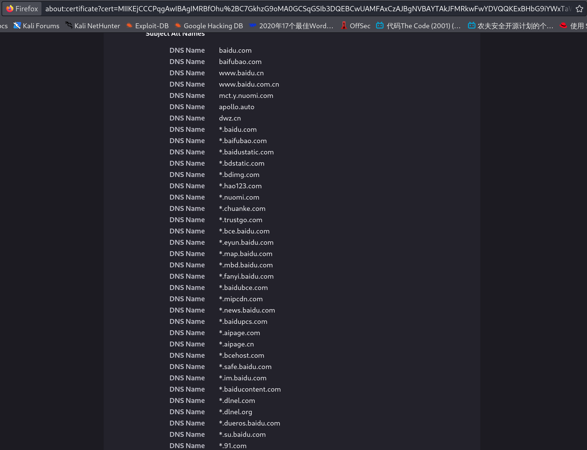


### 2.8 信息推测

信息之间存在着关联性，为此可以通过已知推测未知的内容：

```
一家公司的的法人叫张三，其邮箱为zhangsan@xxx.com
一家公司拥有两个网站，分别为www.xxx.com -->1.1.1.2    book.xxx.com -->1.1.1.5
```

大胆假设，小心求证！


