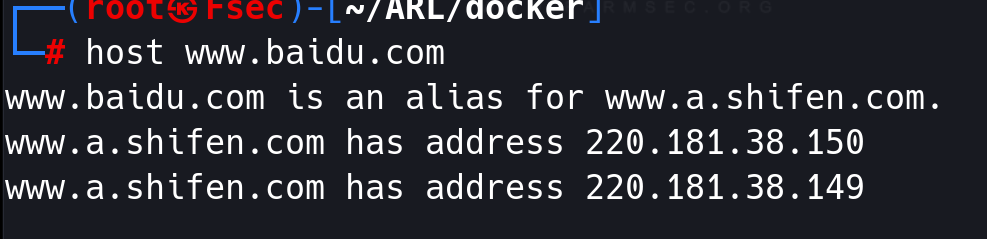

# 子域名搜集工具

## 一 tools

### 1.1 fierce

A DNS reconnaissance tool for locating non-contiguous IP space.
一种DNS侦察工具，用于定位不连续的IP空间。

```
--domain
--search
--dns-servers
--subdomain-file
--dns-servers
```

### 1.2 dnsenum

dnsenum的目的是尽可能收集一个域的信息，它能够通过谷歌或者字典文件猜测可能存在的域名，以及对一个网段进行反向查询。它可以查询网站的主机地址信息、域名服务器、mx record（交换记录），在域名服务器上执行axfr请求，通过谷歌脚本得到扩展域名信息（google hacking），提取自域名并查询，计算C类地址并执行whois查询，执行反向查询，把地址段写入文件。

```
-f, --file <file>	Read subdomains from this file to perform brute force. (Takes priority over default dns.txt)
```


### 1.3 dnswalk

判断域名所对应的服务器是否存在DNS Zone Transfers漏洞。
如果存在，则可以获取该域名的各种信息。 


### 1.4 amass

https://github.com/OWASP/Amass

apt install amass

```
amas intel-发现枚举目标
amass enum-执行枚举和网络映射
amas viz-可视化枚举结果
mass track-跟踪枚举之间的差异
amass db-操作amass图形数据库
amass-dns-以高性能解析dns名称
```

```
amass enum -d farmsec.net
amass enum -passive -d fsec.io -src
```


### 1.5 subdomainbrute

https://github.com/lijiejie/subDomainsBrute
高并发的DNS暴力枚举工具。支持Python3.5+和Python2.7，使用Python3.5+ 效率更高。

```
pip3 install dnspython==2.2.1 async_timeout
python3 subDomainsBrute.py -h
python3 subDomainsBrute.py farmsec.net -o f.txt
```


### 1.6 sublist3r

https://github.com/aboul3la/Sublist3r

Sublist3r是一个python版工具，其设计原理是基于通过使用搜索引擎，从而对站点子域名进行列举。

```
pip3 install -r requirements.txt
python3 sublist3r.py -d farmsec.com
python3 sublist3r.py -d farmsec.com -e bing
```


### 1.7 OneForAll

OneForAll是一款功能强大的子域收集工具.
https://github.com/shmilylty/OneForAll

```
pip3 install -r requirements.txt
python3 oneforall.py --target example.com run
python3 oneforall.py --targets ./domains.txt run
```


### 1.8 ESD

https://github.com/FeeiCN/ESD

- [x] 收集DNSPod接口泄露的子域名
- [x] 收集页面响应内容中出现的子域名
- [x] 收集跳转过程中的子域名
- [x] 收集HTTPS证书透明度子域名
- [x] 收集DNS域传送子域名

```
pip3 install esd
esd -d farmsec.net
```


### 1.9 灯塔 

旨在快速侦察与目标关联的互联网资产，构建基础资产信息库。 协助甲方安全团队或者渗透测试人员有效侦察和检索资产，发现存在的薄弱点和攻击面。

https://github.com/TophantTechnology/ARL

```
git clone https://github.com/TophantTechnology/ARL
cd ARL/docker/
docker volume create arl_db
docker-compose pull
docker-compose up -d 
```

默认端口5003 (https), 默认用户名密码admin/arlpass


## 二 结果分析

### 2.1 host 

host命令是常用的分析域名查询工具，可以用来测试域名系统工作是否正常。

```
host [domain]
```



```
cat 1.txt |xargs -n1 host
```


### 2.2 ipcalc

ipcalc命令是一个简单的ip地址计算器，可以完成简单的IP地址计算任务。

````
 ipcalc [参数] [IP地址]
````


```
Address:   地址
Netmask:   掩码
Network:   网段
HostMin:   ip最小值
HostMax:   ip最大值
Broadcast: 广播地址
```


