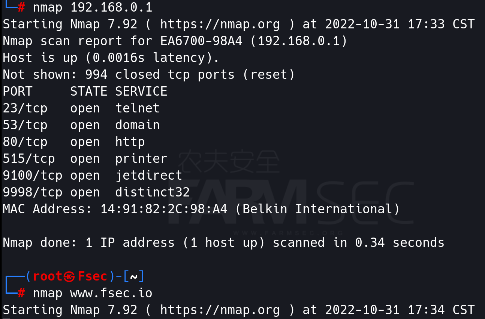
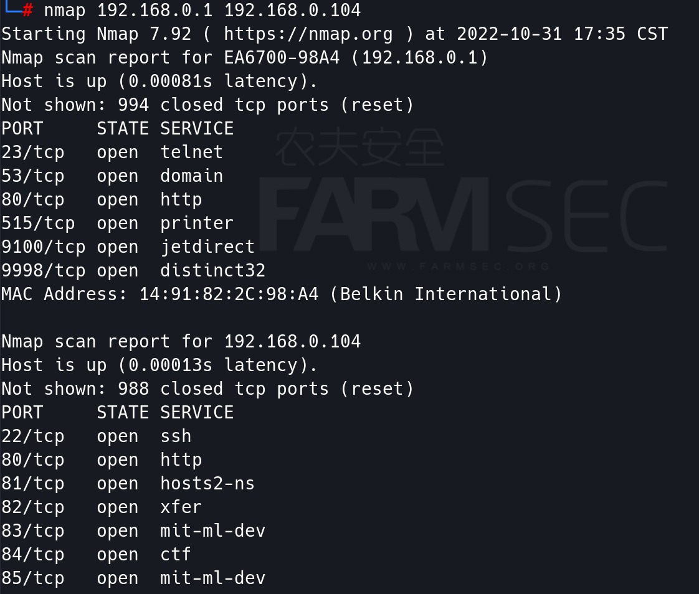
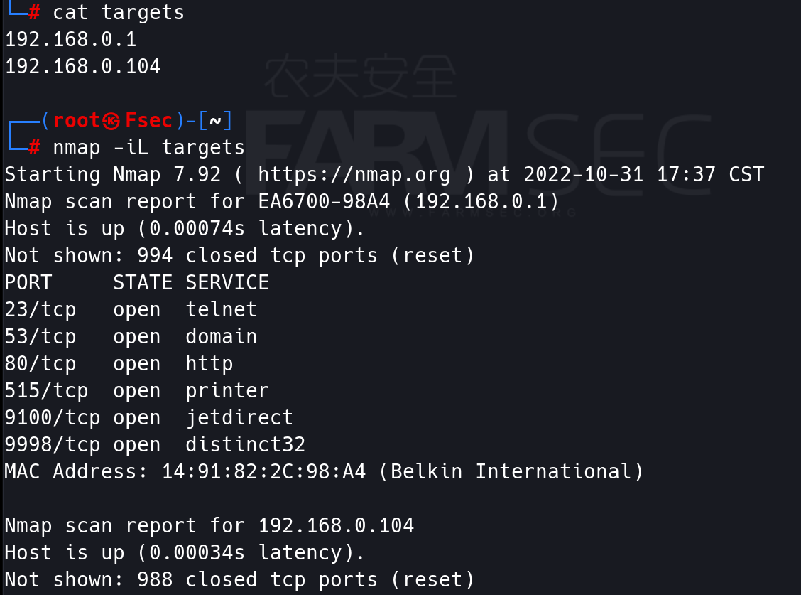
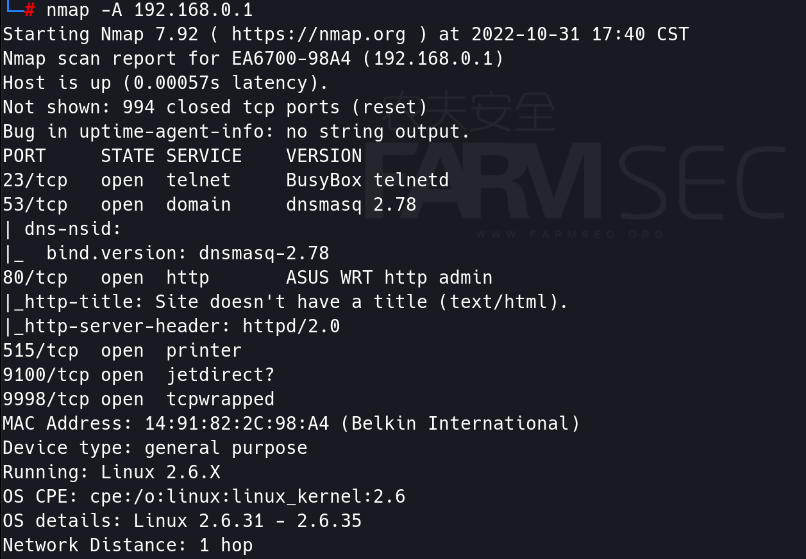
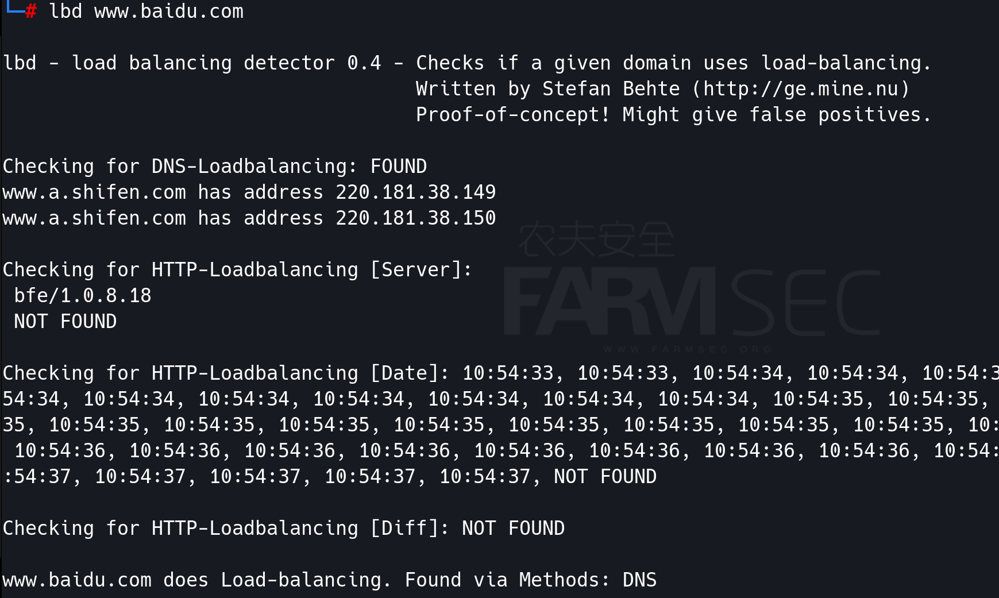

# 更为细致的信息搜集

## 一  端口及服务的探测

### 1.1 NMAP

Nmap是一个网络连接端扫描软件，用来扫描网上电脑开放的网络连接端。确定哪服务运行在那些连接端，并且推断哪个操作系统计算机运行（这是亦称 fingerprinting）。

#### **指定扫描目标：**

当用户有明确的扫描目标时,可以直接使用 Nmap 工具实施扫描。根据扫描目标的多少,可以分为
扫描单个目标、多个目标及目标列表三种情况。本节将依次讲解这三种情况的扫描方式。

扫描单个目标
通过指定单个目标,使用 Nmap 工具可以实现一个基本的扫描。指定的目标可以是一个 IP 地址,也可以是主机名(Nmap 会自动解析其主机名)。

其中,语法格式如下所示:
nmap [目标]       其中,参数[目标]可以是一个 IP 地址,也可以是一个主机名。

```
nmap 192.168.0.1
nmap www.fsec.io
```




扫描多个目标
Nmap 可以用来同时扫描多个主机。当用户需要扫描多个目标时,可以在命令行中同时指定多个目标,每个目标之间使用空格分割。其中,语法格式如下所示:
nmap [目标1 目标2 ...]

```
nmap 192.168.0.1 192.168.0.104
```




扫描一个目标列表
当用户有大量主机需要扫描时,可以将这些主机的 IP 地址(或主机名)写入到一个文本文件中。
然后,使用 Nmap 工具进行扫描。这样避免在命令行中手工输入目标。其中,语法格式如下所示:
nmap -iL [IP 地址列表文件]
以上语法中的-iL 选项,就是用来从 IP 地址列表文件中提取所有地址的。其中,IP 地址列表文件中包含了一列被扫描的主机 IP 地址。

并且,在 IP 地址列表文件中的每个条目必须使用空格、Tab 键或换行符分割。
创建 list.txt 文本文件,并将扫描的主机 IP 地址写入到该文本文件中。
使用nmap -iL 扫描

```
nmap -iL targets
```



IP 地址范围扫描
nmap [IP 地址范围]

```
nmap 192.168.0.0/24
nmap 192.168.0.100-200
```


#### 实施全面扫描

在使用 Nmap 工具实施扫描时,使用不同的选项,则扫描结果不同。用户可以使用不同的选项,单独扫描目标主机上的端口、应用程序版本或操作系统类型等。
但是,大部分人又不太喜欢记这些选项。
这时候,用户只需要记一个选项-A 即可。该选项可以对目标主机实施全面扫描,扫描结果中包括各种类
型的信息。其中,实施全面扫描的语法格式如下所示:
nmap -A [目标]

```
nmap -A 192.168.0.1
```




#### 更多参数

```
-sP  探测此网段的存活主机 可以连同 | grep up一起使用 这样看起来更清爽一些
-p 80  检测特定端口
-sT 检测TCP端口
-sU 检测UDP端口
-sV 探测端口的服务和版本
-O 探测操作系统的类型和版本
-Pn 直接进行深度测试，不检测主机存活
```

nmap的脚本默认目录为：/usr/share/nmap/scripts/
可以进入进行观看，调用脚本的方法为：

```
nmap --script=<script>  <target>
```

更多关于脚本的使用，可以参考官方文档：https://nmap.org/nsedoc/scripts/


### 1.2 MASSCAN

Masscan号称是最快的互联网端口扫描器，最快可以在六分钟内扫遍互联网。
masscan的扫描结果类似于nmap(一个很著名的端口扫描器)，在内部，它更像scanrand, unicornscan, and ZMap，采用了异步传输的方式。它和这些扫描器最主要的区别是，它比这些扫描器更快。而且，masscan更加灵活，它允许自定义任意的地址范和端口范围。


使用方法类似于nmap，扫描指定网段范围的指定端口
 masscan -p80,8080-8100 60.196.0.0/24

```
└─# masscan -h
usage:
masscan -p80,8000-8100 10.0.0.0/8 --rate=10000
 scan some web ports on 10.x.x.x at 10kpps
masscan --nmap
 list those options that are compatible with nmap
masscan -p80 10.0.0.0/8 --banners -oB <filename>
 save results of scan in binary format to <filename>
masscan --open --banners --readscan <filename> -oX <savefile>
 read binary scan results in <filename> and save them as xml in <savefile>

```


### 1.3 魔武双休合体技

如果下面的命令你能理解的了，就看吧

看不懂，去看视频课的解释。

```
masscan -p 1-65535 192.168.0.0/24 --rate=2000 >>ports.txt
cat ports.txt |awk '{print($6":"$4)}'|sed 's#/tcp##g' >>portclean.txt
nmap -sV -p 35386 192.168.0.1
```


## 二 HTTP服务的信息梳理

### 2.1 whatweb

```
--input-file=FILE, -i		Read targets from a file. 
--url-prefix				Add a prefix to target URLs.
--url-suffix				Add a suffix to target URLs.
--colour,--color=WHEN		`never', `always', or `auto'.
--no-errors				Suppress error messages.
```


### 2.2 AlliN

```
└─# python3 AlliN.py -h
Usage: "usage:AlliN.py [options] arg1,arg2"
python AlliN.py --host 10.1.1.1 -p 80 -t 100 -o asd.txt --proxy http://127.0.0.1:8888
python AlliN.py --host 10.1.1.1-10.2.2.2 -p 80 -t 100 -o asd.txt
python AlliN.py --host 10.1.1.1-10.2.2.2 -p 80,443,8080 -t 100 -o asd.txt
python AlliN.py --host 10.1.1.1-10.2.2.2 -p 80,443,8000-9000 -t 100 -o asd.txt
python AlliN.py -f url.list -p 80,443,8000-9000 -t 100 -o asd.txt
python AlliN.py -u "/login/index.jsp" -p 80,443,8000-9000 -t 100
python AlliN.py -f xxx.list -t 100 # xxx.list 192.168.1.1:80
python AlliN.py --host 10.1.1.1/24 /16 /8 -p 80 -t 100 --tp # CIDR
python AlliN.py --host 10.1.1.1/24 -p 80 -m pscan # port scan
python AlliN.py --host 10.1.1.1/24 -m 17scan # MS17-010 scan
python AlliN.py --host 10.1.1.1/24 -m gtscan # SMBGhost scan
python AlliN.py -m uncd -e f5 -s 185903296.21520.0000
python AlliN.py -q domain='example.com' -m fscan # fofa scan
python AlliN.py -q domain='example.com' -m fscan --fs 200 # fofa scan with size
python AlliN.py -m icmpt (establish a server conncat in your vps)
python AlliN.py -m icmpt --sip vps --cip 127.0.0.1 --cport 80 (forward you connect to your vps network)
python AlliN.py --host ww[fuzz].xxx.com -m ddscan (subdomain fuzz)
python AlliN.py --host ww[fuzz].xxx.com -m ddscan --dd (head scan)
python AlliN.py --host 192.168.1.1/24 -p 443 --nocert
python AlliN.py --host 192.168.1.1/24 -p 443 --hiddensize 0,7
python AlliN.py --host 192.168.1.1/24 -p 443 -m bakscan (bak file fuzz)
python AlliN.py --host 192.168.1.1/24 -p 443 -m bakscan --dd (head scan)
python AlliN.py --host 192.168.1.1/24 --nobar
python AlliN.py -q "domain='xx.com'" --host xxx.com -m sfscan

```


### 2.3 ehole

```
└─# ./Ehole3.0-linux -h

     ______    __         ______                 
    / ____/___/ /___ ____/_  __/__  ____ _____ ___ 
   / __/ / __  / __ `/ _ \/ / / _ \/ __ `/ __ `__ \
  / /___/ /_/ / /_/ /  __/ / /  __/ /_/ / / / / / /
 /_____/\__,_/\__, /\___/_/  \___/\__,_/_/ /_/ /_/ 
			 /____/ https://forum.ywhack.com  By:shihuang

Ehole version: 3.0
Usage: Ehole [-f|-l] [parameter]

Options:
  -f string
    	Fofa searches for assets , supports IP and IP segments。(192.168.1.1 | 192.168.1.0/24)
  -fall string
    	fofa batch search IP
  -fofa string
    	Fofa searches for assets ,All fofa search syntax is supported.
    	Ps：“"”must be preceded by"\".(ip=\"192.168.1.0/24\" | domain=\"test.com\")
  -ftime string
    	fofa timeout (default "10")
  -h	this help
  -json string
    	out json
  -l string
    	Probe based on local file
  -log string
    	Log file name (default "server.log")
  -t string
    	thread (default "100")
  -u string
    	Target URL

```


### 2.4 nuclei

Fast and customizable vulnerability scanner based on simple YAML based DSL.    

项目地址：https://github.com/projectdiscovery/nuclei

```
   -u, -target string[]  target URLs/hosts to scan
   -l, -list string      path to file containing a list of target URLs/hosts to scan (one per line)
```


## 三 网站目录及文件

### 3.1 dirb

dirb是一个基于字典的web目录扫描工具，会用递归的方式来获取更多的目录，它还支持代理和http认证限制访问的网站

```
 dirb http://url/directory/ (Simple Test)
 dirb http://url/ -X .html (Test files with '.html' extension)
 dirb http://url/ /usr/share/dirb/wordlists/vulns/apache.txt (Test with apache.txt wordlist)
 dirb https://secure_url/ (Simple Test with SSL)
```


### 3.2 dirsearch

Web path scanner

项目地址：https://github.com/maurosoria/dirsearch
使用方法：

```
git clone https://github.com/maurosoria/dirsearch.git
cd dirsearch
pip3 install -r requirements.txt
python3 dirsearch.py -u <URL> -e <EXTENSIONS>
    -u URL, --url=URL   Target URL(s), can use multiple flags
    -l PATH, --url-file=PATH
    -e EXTENSIONS, --extensions=EXTENSIONS
       Extension list separated by commas (e.g. php,asp)
```


### 3.3 JSFinder 

JSFinder是一款用作快速在网站的js文件中提取URL，子域名的工具。
项目地址：https://github.com/Threezh1/JSFinder

```
简单爬取：python3 JSFinder.py -u http://www.mi.com
深度爬取：python3 JSFinder.py -u http://www.mi.com -d
指定URL：python3 JSFinder.py -f text.txt
指定JS：   python3 JSFinder.py -f text.txt -j
-c 指定cookie来爬取页面 例：python JSFinder.py -u http://www.mi.com -c "session=xxx"
```


## 四 其他项目

### 4.1wafw00f

 WAFW00F是一个Web应用防火墙（WAF）指纹识别的工具。
1、首先通过发送一个正常http请求，然后观察其返回有没有一些特征字符
2、如果不成功，它将发送大量(潜在的恶意) HTTP 请求，并使用简单的逻辑推断出它是哪个WAF
3、如果这也不成功，它将分析以前返回的响应，并使用另一个简单的算法来猜测 WAF 或安全解决方案是否正在积极响应我们的攻击 

```
 wafw00f https://www.baidu.com
  -i INPUT, --input-file=INPUT
```


### 4.2 cutycapt

```
cutycapt --url=https://www.baidu.com --out=www.baidu.com.png
```


### 4.3 lbd 

load balancing detector

```
lbd www.baidu.com
```




## 五 更为省力的方案

这世上有些规律是需要遵守的，例如下面的定律：

```
任何的工作刚开始都会充满了新鲜感，但时间久了，终归会变成一榔头下就解决了。
```

请结合前面两个信息搜集的章节，完成整个关于渗透测试的思路的设计及理论的过程思考。


