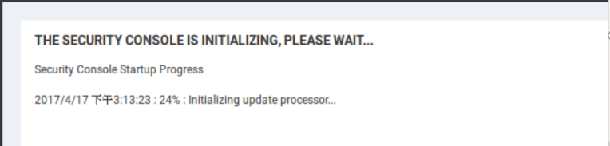

# 网络扫描器

前面的阶段完成后，我们可以通过nmap、masscan这类的工具探测到目标资产的端口与服务的情况。

如果对于简单的判定，我们甚至于可以变身为肉身扫描器，直接进行简单的测试。

而另外的方式，可以通过网络扫描器的进行漏洞的探测。

需要提前告知的是，下面的四款扫描器的其中三个国外的软件会让你你感受到"中国威胁论"，所以如果使用我们打包好的虚拟机进行测试。

## 一 openvas

### 1.1 简介

OpenVAS（Open Vulnerability Assessment System）是开放式漏洞评估系统，其核心部分是一个服务器。该服务器包括一套网络漏洞测试程序，可以检测远程系统和应用程序中的安全问题。OpenVAS不同与传统的漏洞扫描软件。所有的OpenVAS软件都是免费的，而且还采用了Nessus（一款强大的网络扫描工具）较早版本的一些开放插件。

软件的官网：https://www.openvas.org/


### 1.2 安装

```
cat /etc/apt/sources.list
    deb http://http.kali.org/kali kali-rolling main non-free contrib
wget -q -O - https://archive.kali.org/archive-key.asc | apt-key add
apt-get update
apt-get install gvm
```

使用命令“gvm-setup”配置openvas服务


设置用户名密码 配置结束时，会自动创建admin用户同时生产密码，如果记不住密码，可使用命令自定义设置密码。执行命令

```
gvmd --user=admin --new-password=admin
```

完成后，使用命令“gvm-start”启动openvas服务。


配置openvas可远程访问，修改

```
vi  /lib/systemd/system/greenbone-security-assistant.service
systemctl daemon-reload
gvm-stop
gvm-start

vi /etc/default/greenbone-security-assistant###
GSA_ADDRESS=0.0.0.0
GSA_PORT=9392
MANAGER_ADDRESS=0.0.0.0
MANAGER_PORT=9390
```


### 1.3 使用

访问https://ip:9392即可登录openvas

```
定制扫描任务（各种创建）
进行计划任务
```


### 1.4 查看报告

略

## 二 nessuss

### 2.1 简介

Nessus号称是世界上最流行的漏洞扫描程序，全世界有超过75000个组织在使用它。该工具提供完整的电脑漏洞扫描服务，并随时更新其漏洞数据库。Nessus不同于传统的漏洞扫描软件，Nessus可同时在本机或远端上遥控，进行系统的漏洞分析扫描。对应渗透测试人员来说，Nessus是必不可少的工具之一。


### 2.2 安装

在安装Nessus工具之前，首先要获取该工具的安装包。而且，Nessus工具安装后，必须要激活才可使用。
1）Nessus的官方下载地址是：
http://www.tenable.com/products/nessus/select-your-operating-system
可以根据需要下载家庭版（免费）或专业版（收费）

在浏览器中输入以下地址：
http://www.nessus.org/products/nessus/nessus-plugins/obtain-an-activation-code
成功访问以上链接后，选择register new

在该界面填写一些信息，为了获取激活码。在该界面First Name和Last Name文本框中，用户可以任意填写。但是，Email下的文本框必须填写一个合法的邮件地址，用来获取邮件。当以上信息设置完成后，单击Register按钮。接下来，将会在注册的邮箱中收到一份关于Nessus的邮件。进入邮箱打开收到的邮件，将会看到一串数字，类似XXXX-XXXX-XXXX-XXXX，即激活码。


打开软件包所在目录，使用命令“dpkg”安装软件包。

```
dpkg -i Nessus-XXX.deb
systemctl start nessusd
```

浏览器地址栏中输入https://IP:8834，访问Nessus服务
该界面显示了Nessus工具的欢迎信息。此时，单击Continue按钮


填入激活码后即可


创建nessus的账户密码


等待更新完成即可


### 2.3 使用

建立扫描任务


### 2.4 查看报告

略


## 三 nexpose

### 3.1 简介

Nexpose 是一款极佳的漏洞扫描工具，跟一般的扫描工具不同，Nexpose自身的功能非常强大。可以更新其漏洞数据库，以保证最新的漏洞被扫描到可以给出哪那些漏洞可以被Metasploit Exploit，哪些漏洞在Exploit-db里面有exploit的方案。可以生成非常详细的，非常强大的Report，涵盖了很多统计功能和漏洞的详细信息,可以给出漏洞的解决方案。


### 3.2 安装

在终端切换到下载好的nexpose的.bin执行文件所在的路径，给该文件可执行权限，然后执行该文件。

```
chmod +x NeXposeSetup-Linux64.bin 添加权限
./NeXposeSetup-Linux64.bin  执行该文件
```

后续按照向导继续即可。

安装完成后，打开浏览器输入https://IP:3780 ,会自动进行初始化更新(时间会很久)




完成后输入用户名密码登录


### 3.3 使用

创建扫描任务


### 3.4 查看报告

略


## 四 goby

### 4.1 简介

新一代网络安全技术，通过为目标建立完整的资产数据库，实现快速的安全应急。

项目官网：https://gobysec.net/


### 4.2 使用

下载Linux版本软件解压后，使用如下命令

```
./goby --no-sandbox
```

其他的一看就会了：）


### 4.3 查看报告

略


## 五 总结

1 工具的选择

2 杀手派大星的故事


