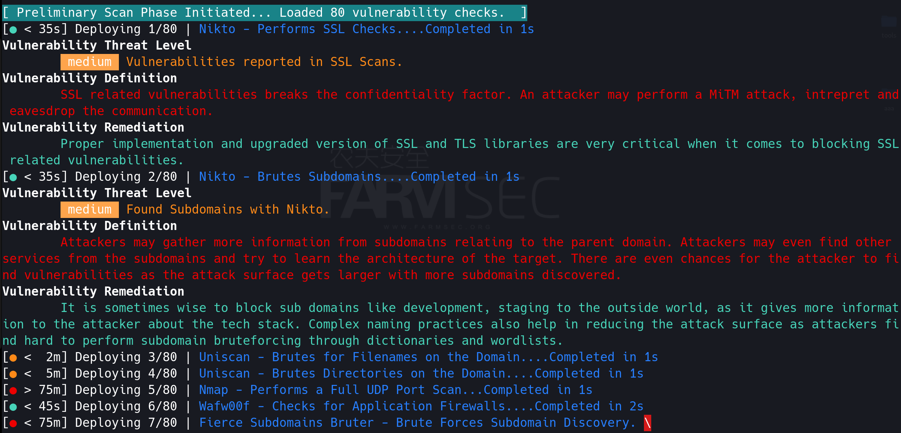

# web扫描器的补充

## 1 nikto

Nikto是一款开放源代码的、功能强大的WEB扫描评估软件，能对web服务器多种安全项目进行测试的扫描软件，能在230多种服务器上扫描出 2600多种有潜在危险的文件、CGI及其他问题，它可以扫描指定主机的WEB类型、主机名、特定目录、COOKIE、特定CGI漏洞、返回主机允许的 http模式等等。Nikto是网管安全人员必备的WEB审计工具之一。

nikto的参数：

```
-c（config）：使用指定的config文件来替代安装在本地的config.txt文件。
-C（Cgidirs）：扫描包含指定内容的CGI目录。所包含的内容在-C后面指定。如-C  /cgi/。
-D（Display）：打开或关闭默认输出。输出选项：
       1     显示重定向
       2     显示获取的cookies信息
       3     显示所有200/OK的回应
       4     显示请求认证的URLs
       D     Debug输出
       V     冗余输出
-dbcheck：检查数据库和其它重要文件的句法错误。
-e（evasion）：使用LibWhisker中对IDS的躲避技术，可使用以下几种类型：
       1     随机URL编码 （非UTF-8方式）
       2     自选择路径（/./）
       3     过早结束的URL
       4     优先考虑长随机字符串
       5     参数欺骗
       6     使用TAB作为命令的分隔符
       7     使用变化的URL
       8     使用Windows路径分隔符“\”
-f（findonly）：只寻找HTTP或HTTPS端口，不进行完全扫描。
-F（Format）：指定检测报告输出文件的格式，默认是txt文件格式（可以是htm、csv、txt或xml格式）
-h（host）：指定目标主机，可以是IP或域名。
-H（Help）：显示帮助信息。
-i（id）：用于主机鉴定，其格式为：userid:password
-m（mutate）：猜解更多的文件名：
       1     检测根目录下的所有文件
       2     猜测密码文件名
       3     通过Apache（/~user 请求类型）枚举用户名
       4     通过cgiwrap（/cgi-bin/cgiwrap/~user 请求类型）枚举用户名
-n（nolookup）：不执行主机名查找。
-o（output）：输出到指定文件
-p（port）：指定使用的端口，默认为80。
-P（Pause）：各项操作之间的延时时间。
-r（root）：对所有请求优先考虑root的值，格式为：/目录名
-s（ssl）：强制在端口上使用ssl模式
-S（Single）：实行对单个目标的请求模式。
-t（timeout）：超时时间，默认为2秒。
-T（Tuning）：控制Nikto使用不同的方式对目标进行扫描
       0     检查文件上传页面
       1     检查Web日志
       2     检查错误配置或默认文件
       3     检查信息泄漏问题
       4     检查XSS/Script/HTML问题
       5     远程文件检索,从根目录检查是否存在可访问的文件
       6     检查拒绝服务问题
       7     远程文件检索,从任意文件检索是否存在可访问文件
       8     代码执行－远程shell,检查是否存在系统命令执行漏洞
       9     检查SQL注入漏洞
       a     检查认证绕过问题
       b     识别安装的软件版本
       c     检查源代码泄露问题
       x     反向链接选项
```

常用useage：

```
nikto -h http://book.fsec.io
nikto -h book.fsec.io -ssl 
nikto -h book.fsec.io -p 443 
nmap -p 80 192.168.0.0/24 -oG -|nikto -h -
nikto -host webs
```


## 2 zaproxy

OWASP出品的Zed Attack Proxy (ZAP)是一款集成各种工具的渗透测试框架,可以发现在WEB应用程序中的漏洞。

Kali中已集成此工具，选择“03-Web程序”中的“ZAP”即可。或者命令行中输入zaproxy同样可以快捷启动。


zaproxy的代理设置：工具-->选项-->本地代理（默认与burpsuite一致，均为localhost:8080）

随后将浏览器的代理指向此地址即可。


导入HTTPS证书：工具-->选项-->Dynamic SSL Certificates -->保存

随后将文件导入至浏览器证书即可。


配置完成后，打开的浏览器页面两侧会有一些新增的内容，额外zaproxy的站点中，会出现内容。


使用爬虫的功能：站点-->网址-->攻击-->爬虫，或者使用web上的蜘蛛。


同时在spider的分支里可以看到结果(实际上另外一种获取流量的方式则是手工点击)。


使用主动扫描的功能：站点-->网址-->攻击-->主动扫描，可以点击"心电图"似的图标查看进度，值得注意的是zaproxy是按照漏洞类型进行的扫描。


所发现的问题，可在警报中查看。


## 3 wpscan

WPScan是一个扫描 WordPress 漏洞的黑盒子扫描器，它可以为所有 Web 开发人员扫描 WordPress 漏洞并在他们开发前找到并解决问题。我们还使用了 Nikto ，它是一款非常棒的Web 服务器评估工具，我们认为这个工具应该成为所有针对 WordPress网站进行的渗透测试的一部分。
WPScan是Kali Linux默认自带的一款漏洞扫描工具，它采用Ruby编写，能够扫描WordPress网站中的多种安全漏洞，其中包括WordPress本身的漏洞、插件漏洞和主题漏洞。最新版本WPScan的数据库中包含超过18000种插件漏洞和2600种主题漏洞，并且支持最新版本的WordPress。值得注意的是，它不仅能够扫描类似robots.txt这样的敏感文件，而且还能够检测当前已启用的插件和其他功能。
该扫描器可以实现获取站点用户名，获取安装的所有插件、主题，以及存在漏洞的插件、主题，并提供漏洞信息。同时还可以实现对未加防护的Wordpress站点暴力破解用户名密码。

常用useage：

```
apt-get reinstall wpscan
wpscan --update
wpscan --url http://www.farmec.cn
wpscan --url http://www.farmsec.cn --enumerate u
wpscan --url http://www.farmsec.cn/ --enumerate vt

--enumerate 其他选项
    u 枚举用户名，默认从1-10
    u[10-20] 枚举用户名，配置从10-20
    p 枚举插件
    vp 只枚举有漏洞的插件
    ap 枚举所有插件，时间较长
    tt 列举缩略图相关的文件
    t 枚举主题信息
    vt 只枚举存在漏洞的主题
    at 枚举所有主题，时间较长
    可以指定多个扫描选项，例："-e tt,p"
    如果没有指定选项，默认选项为："vt,tt,u,vp"   
```


## 4 weblogicscan

概括来说：一个专门检测weblogic漏洞的工具

项目地址：https://github.com/dr0op/WeblogicScan

常用useage：

```
pip3 install -r requirements.txt
docker pull vulhub/weblogic                       #建立测试环境
docker run -tid vulhub/weblogic -p 7001:7001      #启动测试环境  
python3 WeblogicScan.py 192.168.0.101 7001
```


工具的使用相对简单，在实际中，可以通过改装的方式让工作更有效率。

```
masscan 192.168.0.0/24 -p 7001 >>port7001
cat port7001 |awk '{print($6,$4)}'|sed 's#/tcp##g' |sed 's#^#python3 WeblogicScan.py ##g' >>a.sh
sh a.sh
```


## 5 arachni

Arachni是一个功能齐全、模块化、高性能的Ruby框架，旨在帮助渗透测试人员和管理员评估现代web应用程序的安全性。

项目地址：https://github.com/Arachni/arachni

arachni默认不能使用root用户启动工具，为此需要切换权限.

```
chown -R tq:tq arachni-1.6.1.3-0.6.1.1-linux-x86_64/
su tq
cd bin/
./arachni_web
```


默认的口令情况如下：

```
Default account details:

    Administrator:
        E-mail address: admin@admin.admin
        Password:       administrator

    User:
        E-mail address: user@user.user
        Password:       regular_user

For a quick scan: via the command-line interface:
    bin/arachni http://test.com
```

建立扫描任务可通过web页面的Scans-->new建立。


而命令行同样可以完成检测

```
./arachni --http-cookie-string  "PHPSESSID=n8fi5da0s8iu0m504nr2dlhqr4; security=low" "http://192.168.0.104/vulnerabilities/sqli/?id=1&Submit=Submit#" --checks-list sql_injection*
```

arachni官方同样提供更新版的工具SCNR，网址https://ecsypno.com/，有兴趣的可以自己测试看看。


## 6 tsunami-security-scanner

Tsunami是一个通用的网络安全扫描器，具有可扩展的插件系统，用于检测高严重性的高置信度漏洞。

 https://github.com/google/tsunami-security-scanner

```
./quick_start.sh   #安装脚本，确保能访问github

```


```
Build successful, execute the following command to scan 127.0.0.1:

cd /root/tsunami && \
java -cp "tsunami-main-0.0.15-SNAPSHOT-cli.jar:/root/tsunami/plugins/*" \
  -Dtsunami-config.location=/root/tsunami/tsunami.yaml \
  com.google.tsunami.main.cli.TsunamiCli \
  --ip-v4-target=127.0.0.1 \
  --scan-results-local-output-format=JSON \
  --scan-results-local-output-filename=/tmp/tsunami-output.json

```

搭建软件官方推荐的漏洞环境

```
docker run --name unauthenticated-jupyter-notebook -p 8888:8888 -d jupyter/base-notebook start-notebook.sh --NotebookApp.token=''
```

随后按照命令指引进行扫描

```
java -cp "tsunami-main-0.0.15-SNAPSHOT-cli.jar:/root/tsunami/plugins/*" \
  -Dtsunami-config.location=/root/tsunami/tsunami.yaml \
  com.google.tsunami.main.cli.TsunamiCli \
  --ip-v4-target=192.168.0.101 \
  --scan-results-local-output-format=JSON \
  --scan-results-local-output-filename=/tmp/tsunami-output.json
```

```
cat /tmp/tsunami-output.json |nl|grep severity
```


## 7 rengine

reNgine is a web application reconnaissance suite with a focus on a  highly configurable streamlined recon process. reNgine is backed by a  database, with data correlation and organization, the custom query  “like” language for recon data filtering, reNgine aims to address the  shortcomings of traditional recon workflow.

项目地址：https://github.com/yogeshojha/rengine

```
测试此工具建议在独立的虚拟机中制作，避免影响到kali真实环境
./install.sh   ##安装
```


## 8 dirhunt

Dirhunt是一个网络爬虫优化搜索和分析目录。如果服务器启用了“index of”模式，这个工具可以找到有趣的东西。如果没有启用目录列表，Dirhunt也很有用。它可以检测带有错误404错误的目录，以及创建了空索引文件来隐藏内容的目录等等。

项目地址：https://github.com/Nekmo/dirhunt

```
python setup.py install
dirhunt http://www.fsec.io
```


## 9 rapidscan

https://github.com/skavngr/rapidscan

```
The Multi-Tool Web Vulnerability Scanner
Vulnerability Checks
    heavy_check_mark DNS/HTTP Load Balancers & Web Application Firewalls.
    heavy_check_mark Checks for Joomla, WordPress and Drupal
    heavy_check_mark SSL related Vulnerabilities (HEARTBLEED, FREAK, POODLE, CCS Injection, LOGJAM, OCSP Stapling).
    heavy_check_mark Commonly Opened Ports.
    heavy_check_mark DNS Zone Transfers using multiple tools (Fierce, DNSWalk, DNSRecon, DNSEnum).
    heavy_check_mark Sub-Domains Brute Forcing (DNSMap, amass, nikto)
    heavy_check_mark Open Directory/File Brute Forcing.
    heavy_check_mark Shallow XSS, SQLi and BSQLi Banners.
    heavy_check_mark Slow-Loris DoS Attack, LFI (Local File Inclusion), RFI (Remote File Inclusion) & RCE (Remote Code Execution).
    & more coming up...

```


```
python2.7 rapidscan.py farmsec.com
```




## 10 Naabu

Naabu is a port scanning tool written in Go that allows you to enumerate valid ports for hosts in a fast and reliable manner. It is a really  simple tool that does fast SYN/CONNECT scans on the host/list of hosts  and lists all ports that return a reply.

项目地址：https://github.com/projectdiscovery/naabu

```
Usage:
  ./naabu [flags]

Flags:
INPUT:
   -host string[]              hosts to scan ports for (comma-separated)
   -list, -l string            list of hosts to scan ports (file)
   -exclude-hosts, -eh string  hosts to exclude from the scan (comma-separated)
   -exclude-file, -ef string   list of hosts to exclude from scan (file)
PORT:
   -port, -p string            ports to scan (80,443, 100-200)
   -top-ports, -tp string      top ports to scan (default 100)
   -exclude-ports, -ep string  ports to exclude from scan (comma-separated)
   -ports-file, -pf string     list of ports to scan (file)
   -port-threshold, -pts int   port threshold to skip port scan for the host
   -exclude-cdn, -ec           skip full port scans for CDN's (only checks for 80,443)
   -display-cdn, -cdn          display cdn in use
RATE-LIMIT:
   -c int     general internal worker threads (default 25)
   -rate int  packets to send per second (default 1000)
OUTPUT:
   -o, -output string  file to write output to (optional)
   -json               write output in JSON lines format
   -csv                write output in csv format
CONFIGURATION:
   -scan-all-ips, -sa                  scan all the IP's associated with DNS record
   -ip-version, -iv string[]           ip version to scan of hostname (4,6) - (default 4)
   -scan-type, -s string               type of port scan (SYN/CONNECT) (default "s")
   -source-ip string                   source ip and port (x.x.x.x:yyy)
   -interface-list, -il                list available interfaces and public ip
   -interface, -i string               network Interface to use for port scan
   -nmap                               invoke nmap scan on targets (nmap must be installed) - Deprecated
   -nmap-cli string                    nmap command to run on found results (example: -nmap-cli 'nmap -sV')
   -r string                           list of custom resolver dns resolution (comma separated or from file)
   -proxy string                       socks5 proxy (ip[:port] / fqdn[:port]
   -proxy-auth string                  socks5 proxy authentication (username:password)
   -resume                             resume scan using resume.cfg
   -stream                             stream mode (disables resume, nmap, verify, retries, shuffling, etc)
   -passive                            display passive open ports using shodan internetdb api
   -irt, -input-read-timeout duration  timeout on input read (default 3m0s)
   -no-stdin                           Disable Stdin processing
HOST-DISCOVERY:
   -sn, -host-discovery           Perform Only Host Discovery
   -Pn, -skip-host-discovery      Skip Host discovery
   -ps, -probe-tcp-syn string[]   TCP SYN Ping (host discovery needs to be enabled)
   -pa, -probe-tcp-ack string[]   TCP ACK Ping (host discovery needs to be enabled)
   -pe, -probe-icmp-echo          ICMP echo request Ping (host discovery needs to be enabled)
   -pp, -probe-icmp-timestamp     ICMP timestamp request Ping (host discovery needs to be enabled)
   -pm, -probe-icmp-address-mask  ICMP address mask request Ping (host discovery needs to be enabled)
   -arp, -arp-ping                ARP ping (host discovery needs to be enabled)
   -nd, -nd-ping                  IPv6 Neighbor Discovery (host discovery needs to be enabled)
OPTIMIZATION:
   -retries int       number of retries for the port scan (default 3)
   -timeout int       millisecond to wait before timing out (default 1000)
   -warm-up-time int  time in seconds between scan phases (default 2)
   -ping              ping probes for verification of host
   -verify            validate the ports again with TCP verification
DEBUG:
   -health-check, -hc        run diagnostic check up
   -debug                    display debugging information
   -verbose, -v              display verbose output
   -no-color, -nc            disable colors in CLI output
   -silent                   display only results in output
   -version                  display version of naabu
   -stats                    display stats of the running scan
   -si, -stats-interval int  number of seconds to wait between showing a statistics update (default 5)
```

常用useage:

```
./naabu -p 22 --host 192.168.0.0/24
./naabu -p 22 -l targets
./naabu -pf ports -l targets    
./naabu -pf ports -l targets -exclude-cdn
```


