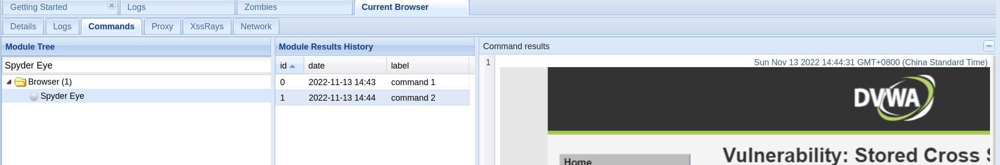

# 漏洞利用工具

## 1 beef-xss

Beef 是一款专注于 web 框架攻击平台，它的全称是 The Browser Exploitation Framework。
Beef提供一个 web 界面供操作，只要访问了嵌入 hook.js 页面，亦或者加载了 hook.js 文件的浏览器，就会不断的以 GET 的方式将其自身的相关消息到 BeEF 的 server 端。

### 1.1 beef-xss的安装

```
apt-get install beef-xss
```

### 1.2 beef-xss的口令重置

```
cat /usr/share/beef-xss/config.yaml |grep -E "user|pass"
```


```
Online Browsers :此功能下显示上线的目标机
Offine Browsers:此功能下显示下线的目标机
Getting Started:此功能下介绍了beef的基本使用以及进阶知识文档链接。
Logs:此功能记录了目标机页面访问记录，如上线IP，上线时间，是否观看受控页面，是否在受控页面进行身份认证等。
Zombies:此功能显示了所有目标机（包含上线和下线）的基本信息，如：IP、网关、端口、操作系统以及系统版本、浏览器、第一次上线和最后一次下线。
Current Brower:此功能针对单个目标机，需要点击目标机使用。
主要内容包含：
    1)Details:当前目标机详细信息和目标机访问受控页面的浏览器详细信息
    2)logs：当前目前机的浏览以及使用受控页面的历史纪录
    3)Commands：对当前受控机进行攻击的
    4)Proxy：把被受控的浏览器作为一个代理。
    5)XssRays：是beef中自带的一个xss扫描器
    6)Network：显示当前目标机的网络拓扑、服务端口等信息
```


### 1.3 beef-xss的模块

Current Browser下的Commands是Beef核心功能之一，其主要作用是成功在目标浏览器中插入Beef生成的xss payload后，进行后渗透。
Commands功能中包含：请求伪造，信息收集，钓鱼页面，鼠标监听，截屏，受控浏览器播放指定声音等等模块。

```
优点：功能强大，易操作，结合蜜罐使用溯源反制可以起到奇效。
缺点：攻击目标机需要目标机浏览受控页面，无法持续稳定进行攻击
```

Commands功能下的模块分为四种状态：

```
模块前呈绿色圆圈表示：此模块可以利用并且不会被目标察觉。
模块前呈橘黄色圆圈表示：此模块可以利用，但是会被目标察觉
模块前呈灰白色圆圈表示：不确定此模块能否利用
模块前呈红色圆圈表示：此模块对目标没有作用
```

1.3.1 Get Cookie：可以获目标的Cookie


1.3.2 Redirect Browser:使目标重定向到指定的url


1.3.3 Replace Content(Deface) :此模块可以替换受控页面内容


1.3.4 Play Sound:此模块可以使受控页面播放声音

把音频文件上传至/usr/share/beef-xss/extensions/demos/html 目录下并在如下图中sound File path栏中sound.wav更换为上的音频文件名，建议音频文件都是“.wav”格式，执行后，打开受控页面会出现上传的音频（注：会有较长延迟）。


1.3.5 Fingerprint Brower:此模块可以识别浏览器指纹


1.3.6 Get Geolocation(Third-Party):此模块可以获取目标的地理位置，公网IP等，如图：需要选择第三方API，建议使用第三个https://ipapi.co/json


1.3.7 GET Wireless Keys:此模块可以获取到目标机无线网卡所成功链接的无线网密码。


1.3.8 No Sleep:此模块可以防止目标屏幕休眠。


1.3.9 IRC NAT Pinning:此模块可以尝试在目标机上打开防火墙关闭的端口（可能会失败）。


1.3.10 Detect Burp:此模块可以检测到目标浏览器是否在使用Burp，并且把代理地址返回到Beef中（Burp必须在打开状态下）


1.3.11 Spyder Eye:此模块可以截取目标访问受控页面的图片




1.3.12 Clippy:此模块可以创建一个浏览器助手提升用户点击，执行恶意程序


1.3.13 Fake Flash Update：提示用户安装Adobe Flash Player的更新，用户点击后会下载指定文件


1.3.14 Clickjacking:此模块可以判断鼠标在什么位置并点击了什么功能。


## 2 jsql

jSQL Injection是一个轻量级SQL注入安全工具，用于从远程服务器中查找数据库信息。它是免费的，开源的和跨平台的（Windows，Linux，Mac OS X）。

一看就会的，不多写了：）


## 3 dbeaver

DBeaver 是一个免费开源的通用数据库工具。

```
# dbeaver
```


## 4 sqlmap

出来混，必须熟练使用的sql注入工具。

```
└─# sqlmap -hh
        ___
       __H__
 ___ ___[.]_____ ___ ___  {1.6#stable}
|_ -| . [,]     | .'| . |
|___|_  ["]_|_|_|__,|  _|
      |_|V...       |_|   https://sqlmap.org

Usage: python3 sqlmap [options]

Options:
  -h, --help            Show basic help message and exit
  -hh                   Show advanced help message and exit
  --version             Show program's version number and exit
  -v VERBOSE            Verbosity level: 0-6 (default 1)

  Target:
    At least one of these options has to be provided to define the
    target(s)

    -u URL, --url=URL   Target URL (e.g. "http://www.site.com/vuln.php?id=1")
    -d DIRECT           Connection string for direct database connection
    -l LOGFILE          Parse target(s) from Burp or WebScarab proxy log file
    -m BULKFILE         Scan multiple targets given in a textual file
    -r REQUESTFILE      Load HTTP request from a file
    -g GOOGLEDORK       Process Google dork results as target URLs
    -c CONFIGFILE       Load options from a configuration INI file

  Request:
    These options can be used to specify how to connect to the target URL

    -A AGENT, --user..  HTTP User-Agent header value
    -H HEADER, --hea..  Extra header (e.g. "X-Forwarded-For: 127.0.0.1")
    --method=METHOD     Force usage of given HTTP method (e.g. PUT)
    --data=DATA         Data string to be sent through POST (e.g. "id=1")
    --param-del=PARA..  Character used for splitting parameter values (e.g. &)
    --cookie=COOKIE     HTTP Cookie header value (e.g. "PHPSESSID=a8d127e..")
    --cookie-del=COO..  Character used for splitting cookie values (e.g. ;)
    --live-cookies=L..  Live cookies file used for loading up-to-date values
    --load-cookies=L..  File containing cookies in Netscape/wget format
    --drop-set-cookie   Ignore Set-Cookie header from response
    --mobile            Imitate smartphone through HTTP User-Agent header
    --random-agent      Use randomly selected HTTP User-Agent header value
    --host=HOST         HTTP Host header value
    --referer=REFERER   HTTP Referer header value
    --headers=HEADERS   Extra headers (e.g. "Accept-Language: fr\nETag: 123")
    --auth-type=AUTH..  HTTP authentication type (Basic, Digest, Bearer, ...)
    --auth-cred=AUTH..  HTTP authentication credentials (name:password)
    --auth-file=AUTH..  HTTP authentication PEM cert/private key file
    --ignore-code=IG..  Ignore (problematic) HTTP error code (e.g. 401)
    --ignore-proxy      Ignore system default proxy settings
    --ignore-redirects  Ignore redirection attempts
    --ignore-timeouts   Ignore connection timeouts
    --proxy=PROXY       Use a proxy to connect to the target URL
    --proxy-cred=PRO..  Proxy authentication credentials (name:password)
    --proxy-file=PRO..  Load proxy list from a file
    --proxy-freq=PRO..  Requests between change of proxy from a given list
    --tor               Use Tor anonymity network
    --tor-port=TORPORT  Set Tor proxy port other than default
    --tor-type=TORTYPE  Set Tor proxy type (HTTP, SOCKS4 or SOCKS5 (default))
    --check-tor         Check to see if Tor is used properly
    --delay=DELAY       Delay in seconds between each HTTP request
    --timeout=TIMEOUT   Seconds to wait before timeout connection (default 30)
    --retries=RETRIES   Retries when the connection timeouts (default 3)
    --retry-on=RETRYON  Retry request on regexp matching content (e.g. "drop")
    --randomize=RPARAM  Randomly change value for given parameter(s)
    --safe-url=SAFEURL  URL address to visit frequently during testing
    --safe-post=SAFE..  POST data to send to a safe URL
    --safe-req=SAFER..  Load safe HTTP request from a file
    --safe-freq=SAFE..  Regular requests between visits to a safe URL
    --skip-urlencode    Skip URL encoding of payload data
    --csrf-token=CSR..  Parameter used to hold anti-CSRF token
    --csrf-url=CSRFURL  URL address to visit for extraction of anti-CSRF token
    --csrf-method=CS..  HTTP method to use during anti-CSRF token page visit
    --csrf-retries=C..  Retries for anti-CSRF token retrieval (default 0)
    --force-ssl         Force usage of SSL/HTTPS
    --chunked           Use HTTP chunked transfer encoded (POST) requests
    --hpp               Use HTTP parameter pollution method
    --eval=EVALCODE     Evaluate provided Python code before the request (e.g.
                        "import hashlib;id2=hashlib.md5(id).hexdigest()")

  Optimization:
    These options can be used to optimize the performance of sqlmap

    -o                  Turn on all optimization switches
    --predict-output    Predict common queries output
    --keep-alive        Use persistent HTTP(s) connections
    --null-connection   Retrieve page length without actual HTTP response body
    --threads=THREADS   Max number of concurrent HTTP(s) requests (default 1)

  Injection:
    These options can be used to specify which parameters to test for,
    provide custom injection payloads and optional tampering scripts

    -p TESTPARAMETER    Testable parameter(s)
    --skip=SKIP         Skip testing for given parameter(s)
    --skip-static       Skip testing parameters that not appear to be dynamic
    --param-exclude=..  Regexp to exclude parameters from testing (e.g. "ses")
    --param-filter=P..  Select testable parameter(s) by place (e.g. "POST")
    --dbms=DBMS         Force back-end DBMS to provided value
    --dbms-cred=DBMS..  DBMS authentication credentials (user:password)
    --os=OS             Force back-end DBMS operating system to provided value
    --invalid-bignum    Use big numbers for invalidating values
    --invalid-logical   Use logical operations for invalidating values
    --invalid-string    Use random strings for invalidating values
    --no-cast           Turn off payload casting mechanism
    --no-escape         Turn off string escaping mechanism
    --prefix=PREFIX     Injection payload prefix string
    --suffix=SUFFIX     Injection payload suffix string
    --tamper=TAMPER     Use given script(s) for tampering injection data

  Detection:
    These options can be used to customize the detection phase

    --level=LEVEL       Level of tests to perform (1-5, default 1)
    --risk=RISK         Risk of tests to perform (1-3, default 1)
    --string=STRING     String to match when query is evaluated to True
    --not-string=NOT..  String to match when query is evaluated to False
    --regexp=REGEXP     Regexp to match when query is evaluated to True
    --code=CODE         HTTP code to match when query is evaluated to True
    --smart             Perform thorough tests only if positive heuristic(s)
    --text-only         Compare pages based only on the textual content
    --titles            Compare pages based only on their titles

  Techniques:
    These options can be used to tweak testing of specific SQL injection
    techniques

    --technique=TECH..  SQL injection techniques to use (default "BEUSTQ")
    --time-sec=TIMESEC  Seconds to delay the DBMS response (default 5)
    --union-cols=UCOLS  Range of columns to test for UNION query SQL injection
    --union-char=UCHAR  Character to use for bruteforcing number of columns
    --union-from=UFROM  Table to use in FROM part of UNION query SQL injection
    --dns-domain=DNS..  Domain name used for DNS exfiltration attack
    --second-url=SEC..  Resulting page URL searched for second-order response
    --second-req=SEC..  Load second-order HTTP request from file

  Fingerprint:
    -f, --fingerprint   Perform an extensive DBMS version fingerprint

  Enumeration:
    These options can be used to enumerate the back-end database
    management system information, structure and data contained in the
    tables

    -a, --all           Retrieve everything
    -b, --banner        Retrieve DBMS banner
    --current-user      Retrieve DBMS current user
    --current-db        Retrieve DBMS current database
    --hostname          Retrieve DBMS server hostname
    --is-dba            Detect if the DBMS current user is DBA
    --users             Enumerate DBMS users
    --passwords         Enumerate DBMS users password hashes
    --privileges        Enumerate DBMS users privileges
    --roles             Enumerate DBMS users roles
    --dbs               Enumerate DBMS databases
    --tables            Enumerate DBMS database tables
    --columns           Enumerate DBMS database table columns
    --schema            Enumerate DBMS schema
    --count             Retrieve number of entries for table(s)
    --dump              Dump DBMS database table entries
    --dump-all          Dump all DBMS databases tables entries
    --search            Search column(s), table(s) and/or database name(s)
    --comments          Check for DBMS comments during enumeration
    --statements        Retrieve SQL statements being run on DBMS
    -D DB               DBMS database to enumerate
    -T TBL              DBMS database table(s) to enumerate
    -C COL              DBMS database table column(s) to enumerate
    -X EXCLUDE          DBMS database identifier(s) to not enumerate
    -U USER             DBMS user to enumerate
    --exclude-sysdbs    Exclude DBMS system databases when enumerating tables
    --pivot-column=P..  Pivot column name
    --where=DUMPWHERE   Use WHERE condition while table dumping
    --start=LIMITSTART  First dump table entry to retrieve
    --stop=LIMITSTOP    Last dump table entry to retrieve
    --first=FIRSTCHAR   First query output word character to retrieve
    --last=LASTCHAR     Last query output word character to retrieve
    --sql-query=SQLQ..  SQL statement to be executed
    --sql-shell         Prompt for an interactive SQL shell
    --sql-file=SQLFILE  Execute SQL statements from given file(s)

  Brute force:
    These options can be used to run brute force checks

    --common-tables     Check existence of common tables
    --common-columns    Check existence of common columns
    --common-files      Check existence of common files

  User-defined function injection:
    These options can be used to create custom user-defined functions

    --udf-inject        Inject custom user-defined functions
    --shared-lib=SHLIB  Local path of the shared library

  File system access:
    These options can be used to access the back-end database management
    system underlying file system

    --file-read=FILE..  Read a file from the back-end DBMS file system
    --file-write=FIL..  Write a local file on the back-end DBMS file system
    --file-dest=FILE..  Back-end DBMS absolute filepath to write to

  Operating system access:
    These options can be used to access the back-end database management
    system underlying operating system

    --os-cmd=OSCMD      Execute an operating system command
    --os-shell          Prompt for an interactive operating system shell
    --os-pwn            Prompt for an OOB shell, Meterpreter or VNC
    --os-smbrelay       One click prompt for an OOB shell, Meterpreter or VNC
    --os-bof            Stored procedure buffer overflow exploitation
    --priv-esc          Database process user privilege escalation
    --msf-path=MSFPATH  Local path where Metasploit Framework is installed
    --tmp-path=TMPPATH  Remote absolute path of temporary files directory

  Windows registry access:
    These options can be used to access the back-end database management
    system Windows registry

    --reg-read          Read a Windows registry key value
    --reg-add           Write a Windows registry key value data
    --reg-del           Delete a Windows registry key value
    --reg-key=REGKEY    Windows registry key
    --reg-value=REGVAL  Windows registry key value
    --reg-data=REGDATA  Windows registry key value data
    --reg-type=REGTYPE  Windows registry key value type

  General:
    These options can be used to set some general working parameters

    -s SESSIONFILE      Load session from a stored (.sqlite) file
    -t TRAFFICFILE      Log all HTTP traffic into a textual file
    --answers=ANSWERS   Set predefined answers (e.g. "quit=N,follow=N")
    --base64=BASE64P..  Parameter(s) containing Base64 encoded data
    --base64-safe       Use URL and filename safe Base64 alphabet (RFC 4648)
    --batch             Never ask for user input, use the default behavior
    --binary-fields=..  Result fields having binary values (e.g. "digest")
    --check-internet    Check Internet connection before assessing the target
    --cleanup           Clean up the DBMS from sqlmap specific UDF and tables
    --crawl=CRAWLDEPTH  Crawl the website starting from the target URL
    --crawl-exclude=..  Regexp to exclude pages from crawling (e.g. "logout")
    --csv-del=CSVDEL    Delimiting character used in CSV output (default ",")
    --charset=CHARSET   Blind SQL injection charset (e.g. "0123456789abcdef")
    --dump-format=DU..  Format of dumped data (CSV (default), HTML or SQLITE)
    --encoding=ENCOD..  Character encoding used for data retrieval (e.g. GBK)
    --eta               Display for each output the estimated time of arrival
    --flush-session     Flush session files for current target
    --forms             Parse and test forms on target URL
    --fresh-queries     Ignore query results stored in session file
    --gpage=GOOGLEPAGE  Use Google dork results from specified page number
    --har=HARFILE       Log all HTTP traffic into a HAR file
    --hex               Use hex conversion during data retrieval
    --output-dir=OUT..  Custom output directory path
    --parse-errors      Parse and display DBMS error messages from responses
    --preprocess=PRE..  Use given script(s) for preprocessing (request)
    --postprocess=PO..  Use given script(s) for postprocessing (response)
    --repair            Redump entries having unknown character marker (?)
    --save=SAVECONFIG   Save options to a configuration INI file
    --scope=SCOPE       Regexp for filtering targets
    --skip-heuristics   Skip heuristic detection of vulnerabilities
    --skip-waf          Skip heuristic detection of WAF/IPS protection
    --table-prefix=T..  Prefix used for temporary tables (default: "sqlmap")
    --test-filter=TE..  Select tests by payloads and/or titles (e.g. ROW)
    --test-skip=TEST..  Skip tests by payloads and/or titles (e.g. BENCHMARK)
    --web-root=WEBROOT  Web server document root directory (e.g. "/var/www")

  Miscellaneous:
    These options do not fit into any other category

    -z MNEMONICS        Use short mnemonics (e.g. "flu,bat,ban,tec=EU")
    --alert=ALERT       Run host OS command(s) when SQL injection is found
    --beep              Beep on question and/or when vulnerability is found
    --dependencies      Check for missing (optional) sqlmap dependencies
    --disable-coloring  Disable console output coloring
    --list-tampers      Display list of available tamper scripts
    --offline           Work in offline mode (only use session data)
    --purge             Safely remove all content from sqlmap data directory
    --results-file=R..  Location of CSV results file in multiple targets mode
    --shell             Prompt for an interactive sqlmap shell
    --tmp-dir=TMPDIR    Local directory for storing temporary files
    --unstable          Adjust options for unstable connections
    --update            Update sqlmap
    --wizard            Simple wizard interface for beginner users
```

